# Unit 1: Characterization of Operating Systems

## Objectives

- Understand the characteristics, types, and applications of operating systems.
- Identify processes and their states.
- Describe the structure and organization of the file system.
- Distinguish the attributes of a file and a directory.
- Recognize file and directory permissions.
- Verify the usefulness of transactional systems.

## Introduction to Computer Systems

### Computer Science

It is the field of study related to the **automatic processing of information**, with the aim of **storing**, **processing**, and **transmitting** data and information through **electronic devices**.

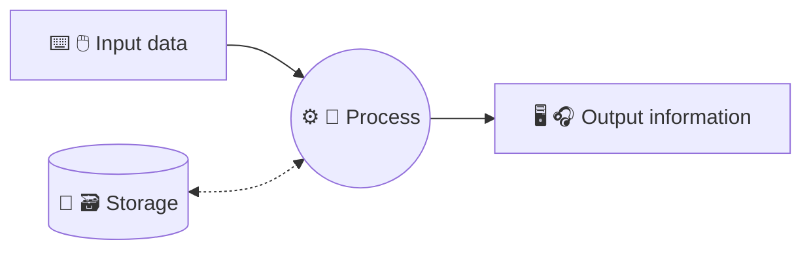

Data Processing Scheme:

- Data input.
- Process.
- Storage (save and/or load).
- Information output.

The **input** data is **processed** and **information** is obtained as **output**. Also, the data could be loaded and saved in the storage.

!!! note
    **Computer science** is the set of knowledge and techniques that make **automatic information processing** possible through computers.

    The Spanish word ***informática*** is an acronym of the words **INFOR**mation auto**MATIC**.

## Computer Equipment

A computer, also known as PC, is a programmable digital electronic machine that executes a series of commands to process input data, obtaining information that is sent to output devices. They can perform various tasks with great speed.

They are composed of a physical part or hardware (electronic circuits, cables, peripherals, etc.), and a logical part or software (programs, applications, data, information, files, etc.).

### Computer System

A **computer system** allows for **storing and processing** information. It consists of ***hardware***, ***software***, and **Users**.

!!! note
    Currently, computer systems play a crucial role in organizing production and leisure processes around the world. They enable users to exchange information over virtually any distance.

    A **computer system** is the **set of elements** that makes it possible to **store and process** information automatically.

All computer systems consist of three fundamental parts:

- ***Hardware***. *Hardware* refers to the collection of electronic devices that provide the function of storing and processing information. *For example, this category includes computer equipment, peripherals, and wiring*.
- ***Software***. *Software* is the set of programs and applications that computer systems use to perform tasks required by users. *For example, this includes the operating system, web browser, office applications, etc.*
- ***Users***. This includes the people associated with the computer system, including both the users who operate it and the technical staff who create and maintain the computer system.

---

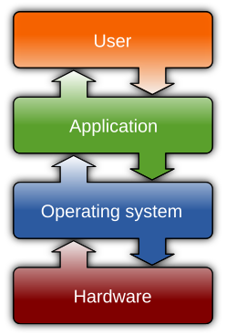{ width=40% }

!!! note
    Therefore, an example of a computer system could be a personal computer with its peripherals, the person using it, and the programs it contains.

    The purpose of a computer system is to optimally manage information. The computer system allows for storing and processing information and can also perform functions ranging from facilitating work for businesses to providing entertainment for users.

### Von Neumann Architecture

The **_Von Neumann_ architecture** is a model for computer systems that was proposed by the mathematician and physicist **_John von Neumann_** in 1945. This model is based on the idea that the computer system should have a **central processing unit (CPU)** that can execute instructions, a **memory** that can store data and programs, and **input/output devices** that can communicate with the user and other devices.

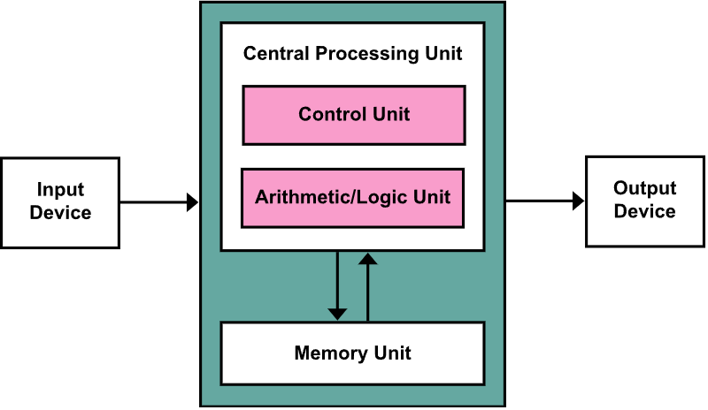

The _Von Neumann_ architecture consists of the following components:

- **Central Processing Unit (CPU)**. This is the part of the computer system that executes instructions. It consists of an **arithmetic logic unit (ALU)** that performs arithmetic and logical operations, a **control unit** that manages the execution of instructions, and a **register** that stores data temporarily.
- **Memory**. This is the part of the computer system that stores data and programs. It consists of **main memory**, which is used to store data and programs that are currently being executed, and **secondary storage**, which is used to store data and programs that are not currently being executed.
- **Input/Output Devices**. These are the parts of the computer system that allow the user to interact with the computer system. Examples include storage drives, keyboards, mice, screens, printers, and speakers.

### Physical Components. *Hardware*

***Hardware*** refers to the set of components that make up the **physical part** of a computer system and enable its operation.

We can categorize *hardware* components based on their location in the computer system. This results in a division between ***internal hardware***, which is usually included within the main unit and typically constitutes the *primary hardware*, and ***external hardware*** or **peripherals** of the system.

---

**Internal Components**:

- **Motherboard**. This is the main board of the computer system where different printed circuits are located to connect other *hardware* elements.

    It's called the *main board* or *motherboard*.

- **Microprocessor**. This component is responsible for executing computer programs.

    It performs instructions through simple arithmetic and logical operations.
    
    It is also known as the **Processor** or **CPU** (*Central Processing Unit*).

- **Main Memory**. This is the memory where data and programs currently being executed by the processor are temporarily stored.

    It is a **volatile memory**, meaning that it loses its contents when the computer is turned off.
  
    Another term for main memory is **RAM** (*Random Access Memory*).

- **Power Supply**. This component is used to transform the energy required by the other system components.

- **Internal Storage Devices**. These allow for the permanent storage of data and programs. Examples include an internal hard drive or a DVD/Blu-ray drive.

- **Expansion Cards**. These elements allow for the expansion of a computer system’s functions. Common types include graphics cards, network cards, and sound cards.

- **Cooling System**. These components are responsible for dissipating the heat generated by various parts of the computer system.

---

**External elements** or **peripherals**:

- **Screen**. Main **information output** device that displays the data processed by the system to the user.
- **Keyboard** and **Mouse**. Main devices that allow **input of information**.
- **Microphone** and **speakers**. They convert electrical signals into sound waves and vice versa.
- **Printer** and **scanner**. Items used for printing and scanning text or graphic data.
- External **storage** devices**. These store data permanently and can be easily moved from one system to another.
Typical examples are USB external hard drives, *pendrives* or SD cards.
- **Other** devices: game controllers, digitizing tablets, virtual reality glasses, barcode scanners, projectors, etc.

---

<figure markdown="span">
  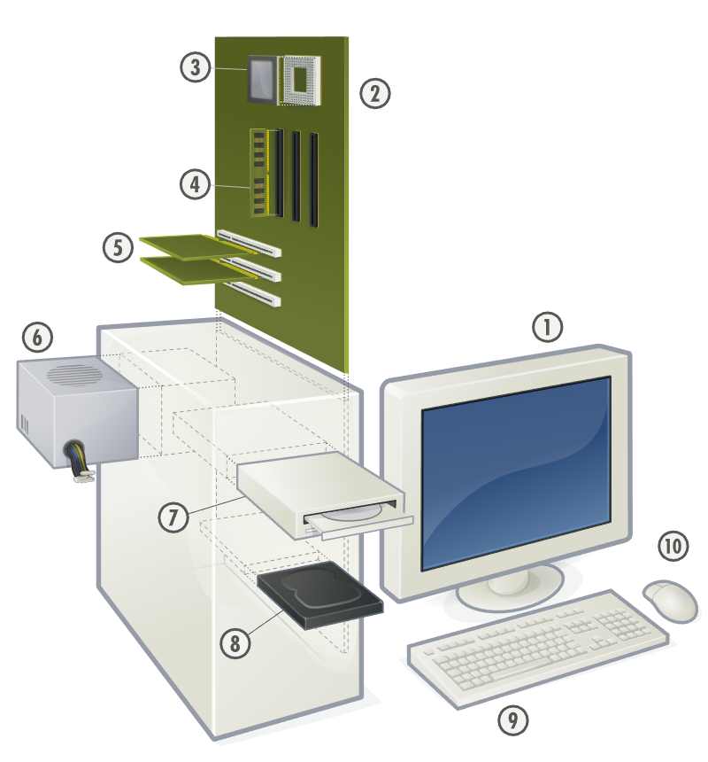{width=60%, height=60%}
  <figcaption>Main hardware of a computer: 1. Screen.   2. motherboard   3. CPU.   4. Main memory.   5. Expansion cards.   6. Power supply.   7. Optical disk drive.   8. Internal disk drive.   9. Keyboard. 10. Mouse.</figcaption>
</figure>

### Logic components. *Software*

The ***software*** of a computer system is the set of necessary logical components that make it possible to carry out specific tasks.

It is an indispensable part of a computer system, as it is necessary for the user to be able to perform the desired tasks comfortably.

---

Generally, *software* can be classified into two broad groups:

- **Base or system software**. This is basic to the system. It allows users and most of the *software* to communicate with the *hardware*. Without this type of *software* the computer system could not function. Examples of this type of *software* are the operating system or drivers for peripheral devices.
- **Application software**. These are programs or applications that perform specific tasks. Examples are office packages, video games or antivirus software.
In addition, application software can be classified into horizontal and vertical:
    - **Horizontal software** is that which is available to the user with predetermined characteristics and is of a generic type, such as, for example, office packages or web browsers.
    - **Vertical software** is more specific and is created to solve a specific need of a user or company.

### The *base* software

The **base** or **system software** allows users and applications to communicate with the *hardware*.

There are different types of base *software* depending on the function they perform within the computer system: **operating systems**, **peripheral drivers**, and **firmware**.

---

- The **operating system** allows the user and applications to interact with the computer system hardware. **It is the most important *software*** of a computer system, since it allows **communication between the user and the *hardware***, and **management of all system resources**, such as processes or files and directories.

- The **device driver**, or ***driver***, is the *software* that enables communication between the computer system's input/output devices and the other *software*.

- The ***firmware***, such as BIOS or UEFI, runs before the rest of the computer system's *software*. One of its most important functions is to initialize the hardware during the boot process and to manage power and temperature control.

### Classification of computer systems

Because of the great variety of computer systems we can classify them according to various criteria, such as their architecture or their function. One of the most popular classifications is the one that organizes computer systems according to their size and the resources they offer.

- Supercomputer
- Mainframe
- Server
- Microcomputer
- Mobile device
- Embedded systems

- **Supercomputer**. These computer systems have a **high computing power**, can process a large amount of data per second, and are mainly used in the world of research and development. Supercomputers can handle billions of operations per second simultaneously, as they consist of a large number of very powerful processors working as one. These computer systems are located in special facilities, usually occupy more than one room and require special cooling.

- **Mainframe**. These computer systems are typically used for companies that need to process and store a large amount of data, such as a bank's transactions or an airline's reservation management. They are computer systems with very powerful processors and a large number of storage devices. These systems can take up an entire room, but they no longer need special facilities as supercomputers do. Although their primary function is to store corporate transactions and data, in some cases they are also used, especially by large-scale e-commerce companies, as high-capacity web servers.

- **Server**. These computer systems are larger than personal computer systems but smaller than mainframe computers. They are mainly used by businesses and their main function is to process information while allowing a large number of users to be connected simultaneously. These computer systems serve users through a network and allow the sharing of resources between them.

- **Microcomputer**, **Personal Computer** or **Laptop**. They provide service to the user and are typically used for office tasks, Internet access, small business tasks and personal entertainment. These computer systems are small in size. Portable computing systems are easy to transport as they are small in size and weight and can be operated using batteries without the need to be plugged into the mains.

- **Mobile devices**. Tablets, smartphones, smartwatches, etc. Small computers with touch screens, batteries and wireless connectivity. They can do the same tasks as a personal computer but with some limitations.

- **Embedded systems** in some industrial equipment, household appliances, vehicles, home automation, etc. They are part of the systems known as ‘Internet of Things’ IoT (*Internet of Things*). This type of system is intended for personal use and allows access to the internet, receiving calls or e-mails and other more specific functions of the system in question. These computer systems allow applications to be installed and run in a similar way to other computer systems.

## Information representation systems

Computer systems are machines that automatically process information, but all the information managed by this equipment is represented by only two symbols, namely `0` and `1`, which correspond to two electrical states or two voltage levels. In electronic circuits, from a logical point of view, it is customary to represent the presence of voltage at a point in the circuit by means of the number 1, while 0 represents the absence of voltage. This terminology is known as positive logic. Negative logic can also be applied, where the meaning of these two digits is interchanged.

Each of these symbols is referred to as a **binary number** or **bit**. A *bit* is the smallest unit of information representation in a computer system.


!!!abstract "Bit"
    The **bit** is the base unit of measurement of information, indicating the minimum amount that makes up the information. It can be represented by two symbols, `0` or `1`.

Information** is the way of representing facts, objects, values or ideas that enables communication between people and the acquisition of knowledge about things. All **information consists of data**. Data are all facts or objects that have not been manipulated and once processed form information.

---

We can classify data according to the following types:

- **Numeric**. This data consists solely of numbers (0, 1, ..., 9). All kinds of mathematical operations can be performed with this data.
- **Alphanumeric**. These data are made up of a combination of letters and numbers. With this type of data, even if they are only made up of numbers, mathematical operations cannot be performed.

---

In order for this information to be understood by the computer system, a correspondence must be established between the data and these two electrical states. This correspondence is known as **information coding**. All data used by computer systems are encoded. Different computer systems may use different codes; indeed, the same computer system may use different encodings for the different electronic devices that make it up.

---

An **encoding** is a way of interpreting information. For example, the symbol `X`, using the alphabetic code, is a letter, but, if we apply the encoding of the Roman numeral system, it is the number 10.

The encoding also depends on the use to which the data will be put. For this reason, standardized codes, such as the *Unicode*, are usually used for alphanumeric data input and output, while encodings based on the binary, octal or hexadecimal numbering system are used for numeric data because of the ease with which they can be transformed into decimal or binary to perform mathematical operations.

### Measurement of information

**`bit`** (`b`) - **minimum unit of information**. May represent `0` or `1`.

**`byte`** (`B`) - base information unit. It is a **set of 8 bits**. It can represent 256 values, from 0 to 255.

| $2^8$ | $2^7$ | $2^6$ | $2^5$ | $2^4$ | $2^3$ | $2^2$ | $2^1$ |         |
|:-----:|:-----:|:-----:|:-----:|:-----:|:-----:|:-----:|:-----:|--------:|
|**128**| **64**| **32**| **16**| **8** | **4** | **2** | **1** |   Valor |
|  `0`  |  `0`  |  `0`  |  `0`  |  `0`  |  `0`  |  `0`  |  `0`  |   **0** |
|  `0`  |  `0`  |  `0`  |  `0`  |  `0`  |  `0`  |  `0`  |  `1`  |   **1** |
|  `0`  |  `0`  |  `0`  |  `0`  |  `0`  |  `0`  |  `1`  |  `0`  |   **2** |
|  `0`  |  `0`  |  `0`  |  `0`  |  `0`  |  `0`  |  `1`  |  `1`  |   **3** |
|  `0`  |  `0`  |  `0`  |  `0`  |  `0`  |  `1`  |  `0`  |  `0`  |   **4** |
|  `0`  |  `0`  |  `0`  |  `0`  |  `0`  |  `1`  |  `0`  |  `1`  |   **5** |
|       |       |       |       |  ...  |       |       |       |         |
|  `0`  |  `1`  |  `0`  |  `1`  |  `0`  |  `1`  |  `0`  |  `1`  |  **85** |
|       |       |       |       |  ...  |       |       |       |         |
|  `1`  |  `1`  |  `1`  |  `1`  |  `1`  |  `1`  |  `1`  |  `1`  | **255** |

---

If we join 8 bits we get a byte (B), which is also a very small unit of storage. With one byte we can represent 256 different combinations, from `00000000` to `11111111`.

For large volumes of information we use **multiples of the byte**.

| Name | Symbol | Base 10 |
|:--|:--:|--:|
| byte | B | $10^{0}$ = 1 |
| [kilobyte](https://es.wikipedia.org/wiki/Kilobyte "Kilobyte") | kB | $10^{3}$ = 1 000 |
| [megabyte](https://es.wikipedia.org/wiki/Megabyte "Megabyte") | MB | $10^{6}$ = 1 000 000 |
| [gigabyte](https://es.wikipedia.org/wiki/Gigabyte "Gigabyte") | GB | $10^{9}$ = 1 000 000 000 |
| [terabyte](https://es.wikipedia.org/wiki/Terabyte "Terabyte") | TB | $10^{12}$ = 1 000 000 000 000 |
| [petabyte](https://es.wikipedia.org/wiki/Petabyte "Petabyte") | PB | $10^{15}$ = 1 000 000 000 000 000 |
| [exabyte](https://es.wikipedia.org/wiki/Exabyte "Exabyte") | EB | $10^{18}$ = 1 000 000 000 000 000 000 |
| [zettabyte](https://es.wikipedia.org/wiki/Zettabyte "Zettabyte") | ZB | $10^{21}$ = 1 000 000 000 000 000 000 000 |
| [yottabyte](https://es.wikipedia.org/wiki/Yottabyte "Yottabyte") | YB  | $10^{24}$ = 1 000 000 000 000 000 000 000 000 |

_Table: Multiples using the International System prefixes_

---

Traditionally, in the computer world, 1 kB (kilobyte) corresponded to 1024 bytes, but according to the international system of units, 1 kB (kylobyte) corresponded to 1000 bytes, as with all other units of measurement. This generated some controversy and it was easy to make mistakes. To solve this confusion, in 1998 the International Electrotechnical Commission published an appendix in the **ISO/IEC 80000** standard defining the binary prefixes, thus giving birth to the unit kibibyte (KiB) to designate the correspondence between 1 KiB and 1024 bytes; from this moment on, the kilobyte unit is considered valid only for the correspondence between 1 kB and 1000 bytes.

| Nombre | Símbolo | Factor y valor en el [ISO/IEC 80000](https://es.wikipedia.org/wiki/ISO/IEC_80000 "ISO/IEC 80000")\-13 |
|:--|:--:|--:|
| byte | B | $2^{0}$ = 1 |
| [kibibyte](https://es.wikipedia.org/wiki/Kibibyte "Kibibyte") | KiB | $2^{10}$ = 1024 |
| [mebibyte](https://es.wikipedia.org/wiki/Mebibyte "Mebibyte") | MiB | $2^{20}$ = 1 048 576 |
| [gibibyte](https://es.wikipedia.org/wiki/Gibibyte "Gibibyte") | GiB | $2^{30}$ = 1 073 741 824 |
| [tebibyte](https://es.wikipedia.org/wiki/Tebibyte "Tebibyte") | TiB | $2^{40}$ = 1 099 511 627 776 |
| [pebibyte](https://es.wikipedia.org/wiki/Pebibyte "Pebibyte") | PiB | $2^{50}$ = 1 125 899 906 842 624 |
| [exbibyte](https://es.wikipedia.org/wiki/Exbibyte "Exbibyte") | EiB | $2^{60}$ = 1 152 921 504 606 846 976 |
| [zebibyte](https://es.wikipedia.org/wiki/Zebibyte "Zebibyte") | ZiB | $2^{70}$ = 1 180 591 620 717 411 303 424 |
| [yobibyte](https://es.wikipedia.org/wiki/Yobibyte "Yobibyte") | YiB | $2^{80}$ = 1 208 925 819 614 629 174 706 176 |

_Table: Multiples using ISO/IEC 80000-13_

---

!!! note "Curiosity"

    As a curiosity, most manufacturers of storage devices express the capacity in the International System. For example, a USB *pendrive* of ***64 GB***, when connected to our computer will show ***59.6 GiB***.

    A similar case occurs with Internet connection providers, who express transfer speeds in Mbps (Megabits per second). For example, a connection of ***100 Mbps*** in a speed test will show ***11.9 MiBps*** (Mebibytes per second).

## The operating system

The **operating system** is the most important ***software* of a computer system**. This *software* gives the user the possibility to **interact with the computer system in an easy way**, giving the user the possibility to **manage the information and resources** available on the computer system.

Operating systems has **two basic functions**.

- **Abstraction**. Hide details of hardware configuration and provide a simple interface for users.
- **Arbitration**. To manage access to shared resources.

### Elements of the operating system

- **Kernel**. The core of the operating system. It is responsible for managing the computer system's resources, such as the processor, memory, and input/output devices. It also provides the interface between the *hardware* and the rest of the *software*.
- **Services**. These are the functions that the operating system provides to the user and other *software*. Examples include file management, printing, and network access.
- **File system**. It is responsible for managing the computer system's files and directories. It allows the user to store, organize, and access information.
- **User interface**. It is the part of the operating system that allows the user to interact with the computer system. It can be graphical, text-based, or voice-based.


---


---

### Types of operating systems

- By the number of simultaneous users

    - **Single-user**. These operating systems are designed to be used by a single user at a time. Examples include Windows, macOS, and Linux.
    - **Multi-user**. These operating systems are designed to be used by multiple users at the same time. Examples include Unix and Linux.

- By the number of tasks

    - **Single-task**. These operating systems can only run one task at a time. Examples include MS-DOS.
    - **Multi-task**. These operating systems can run multiple tasks at the same time. Examples include Windows, macOS, and Linux.

- By the purpose

    - **General-purpose**. These operating systems are designed to be used for a wide range of tasks. Examples include Windows, macOS, and Linux.
    - **Special-purpose**. These operating systems are designed for a specific task. Examples include real-time operating systems and embedded operating systems.

- By licensing

    - **Proprietary**. These operating systems are owned by a company and cannot be modified by the user. Examples include Windows and macOS.
    - **Open-source**. These operating systems are developed by a community of users and can be modified by the user. Examples include Linux.

## Functions of the operating system

The **operating system** manages the computer system's resources to ensure that the user and other *software* can use them efficiently. The main functions of the operating system are:

- **Process management**. The operating system manages the computer system's processes, which are the programs that are running. It allocates resources to processes, schedules them to run on the processor, and provides mechanisms for processes to communicate with each other.
- **Memory management**. The operating system manages the computer system's memory, which is used to store data and programs. It allocates memory to processes, swaps data between memory and storage, and provides mechanisms for processes to share memory.
- **File system management**. The operating system manages the computer system's files and directories, which are used to store data. It provides mechanisms for creating, reading, writing, and deleting files, and for organizing files into directories.
- **Input/output management**. The operating system manages the computer system's input/output devices, which are used to communicate with the user and other devices. It provides mechanisms for reading data from and writing data to devices, and for controlling the flow of data between devices.
- **Security management**. The operating system manages the computer system's security, which is used to protect the system from unauthorized access and to ensure the privacy and integrity of data. It provides mechanisms for controlling access to the system, for encrypting data, and for detecting and preventing security threats.
- **Network management**. The operating system manages the computer system's network connections, which are used to communicate with other systems. It provides mechanisms for connecting to networks, for sending and receiving data over networks, and for controlling the flow of data between systems.

## Process management

A **process** is a program that is running on the computer system. The operating system manages processes to ensure that they can run efficiently and that they do not interfere with each other.

Formally a **process** is ‘A unit of activity characterized by the execution of a **sequence of instructions**, with a **current state**, and a set of associated **system resources**’.

---

In order to better understand what a process is and the difference between a program and a process, *A. S. Tanenbaum* proposes the following analogy.

> A cook bakes a birthday cake for his daughter; he has the recipe for a birthday cake and a well-equipped kitchen with all the necessary ingredients, flour, eggs, sugar, milk, etc.’.

Situating each part of the analogy it can be said that the *recipe* represents the **program** (instructions), the *cook* is the **processor** and the *ingredients* are the **data** of the program. The **process** is the *activity* of the cook reading the recipe, obtaining the ingredients and baking the cake.

---

To represent a process, the operating system uses the following information:

- **Process ID (identifier)**. This is an integer number used to identify each process.
- **Process status**. This is used to indicate the status in terms of its life cycle.
- **Resource usage**. It allows to check the use of resources used by the process, the execution time, maximum time assigned, priority, etc. This information is useful for planning the next process to be executed by the processor.
- **Process context**. For each process, the operating system stores the processor status, memory information and input/output requests.

### Process states

A process can be in one of the following states:

- **Created**. The process has been created but has not yet started running.

- **Waiting**. The process is ready to run but is waiting for the processor to become available. Reach this state when created or when it has been interrupted or the blocking condition is fulfilled.

- **Running**. The process is currently running on the processor.

- **Blocked**. The process is waiting for a resource to become available, such as a file or a network connection.

- **Terminated**. The process has finished running and has been removed from the system.

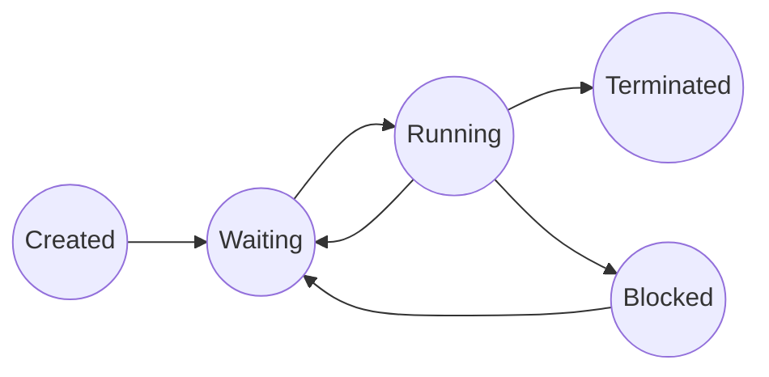

<!-- ```mermaid
flowchart LR
    C((Created)) --|Ready| W((Waiting))
    W --|Selected by scheduler| R((Running))
    R --|Paused| W
    W --|By other process| T((Terminated))
    R --|End| T
    R --|I/O or event| B((Blocked))
    B --|I/O or event finished| W
    B --|By other process| T
``` -->

### Process scheduling

The **process scheduler** is responsible for **deciding which process to run on the processor** at any given time. The process scheduler uses **algorithms** to determine the order in which processes are run, based on factors such as the **priority** of the process, the amount of **time** the process has been **waiting**, and the amount of time the process has been **running**.

Main goals of the process scheduler:

- **Maximize performance**. Ensure that the processor is always running a process.

- **Minimize latency or response time**. Ensure that processes are run **as soon as possible** after they are created and the waiting time is **as short as possible**. This is important for interactive applications, such as web browsers and video games.

- **Maximize fairness**. Ensure that all processes are given an equal opportunity to run.

---

!!! note "Analogy"
    Process management could be similar to **office work**. 
    
    You can have:
    
    - a list of **tasks** to be done
    - a set **priorities** for them: high, medium, low
    
    For example:
    
    You should start by doing the high priority tasks first, and when they are finished, move on to the medium priority tasks and then to the low priority tasks. Once the task is done, it is crossed out.

    This can lead to the **problem** that low priority tasks may never get done and remain on the list forever. To solve this, older tasks can be assigned high priority.

    Although process scheduling is rather more complex, to get an idea, we could compare process scheduling with the **service in a restaurant**. Service is considered **optimal when waiting times** for customers are as short as possible and no one **starves** to death.

!!! note "Algorithm"
    An **algorithm** is a **set of instructions** that are used to **solve a problem**.
    
    It can be compared to a cooking recipe, which is a set of instructions that are used to prepare a meal.

The scheduling algorithms can be classified into two **types**:

- **Non-preemptive**. The process scheduler **cannot interrupt a process that is running** to run another process. This is useful for ensuring that low-priority processes are run to completion.

- **Preemptive**. The process scheduler **can interrupt a process** that is running to run another process. This is useful for ensuring that high-priority processes are run as soon as possible.

Let's study the following scheduling algorithms:

- **Non-preemptive**:
    - **First-Come, First-Served (FCFS)**. The process that arrives first is the first to be run.
    - **Shortest Job First (SJF)**. The process with the shortest execution time is run first.
- **Preemptive**:
    - **Shortest Remaining Time First (SRTF)**. The process with the shortest remaining execution time is run first.
    - **Round-Robin (RR)**. Each process is run for a fixed amount of time, called a time slice or quantum, and then the next process is run.

---

#### First-come, first-served (FCFS)

This is the simplest scheduling algorithm. The process that arrives first is the first to be run. This algorithm is non-preemptive, meaning that once a process starts running, it cannot be interrupted until it finishes.

- Non-preemptive.
- Simple and easy to implement.
- Large waiting times.
- Slow performance.

#### Shortest job first (SJF)

This algorithm runs the process with the shortest execution time first. This algorithm is non-preemptive, meaning that once a process starts running, it cannot be interrupted until it finishes.

- Non-preemptive.
- Waiting times are smaller than FCFS.
- **Starvation**. Long processes can block the execution of short processes.
- Minimum performance.

#### Shortest remaining time first (SRTF)

This algorithm runs the process with the shortest remaining execution time first. This algorithm is preemptive, meaning that a process can be interrupted while it is running to run another process.

- Preemptive.
- Waiting times depend on arrival and duration.
- **Starvation**. Short processes can block the execution of long ones.
- Preference for short processes.

#### Round-robin (RR)

This algorithm runs each process for a **fixed amount of time**, called a time slice or **quantum**, and then runs the next process. This algorithm is **preemptive**, meaning that a process can be interrupted while it is running to run another process.

- Preemptive.
- Larger waiting times than SJF.
- Fair performance.

---

!!! note "Other scheduling algorithms"
    There are other scheduling algorithms that can be used to manage processes, such as:

    - **Priority scheduling**. The process with the highest priority is run first.
    - **FSS** (*Fair Share Scheduling*). The process is run based on the amount of resources it has used and users are given a fair share of resources.
    - **MQS** (*Multi-Queue Scheduling*). The process is run in different queues based on its priority.

    In general, operating systems use a combination of scheduling algorithms to ensure that processes are run efficiently and fairly.

### Process communication

Processes can communicate with each other in various ways. The operating system provides mechanisms for processes to communicate with each other, such as:

- **IPC** (*Inter-process communication*). Processes can communicate with each other using system calls provided by the operating system.
- **RPC** (*Remote Procedure Call*). Processes can communicate with each other over a network using remote procedure calls.

### Services

A service is a program that runs in the background and provides a specific function to the user or other programs. The operating system provides services to the user and other programs.

By example, printing service manages the printing of documents from each application.

In UNIX systems, services are called **daemons**.

## Memory

**Memory** is one of the most important resources in a computer. Memory must be **fast**, **high capacity** and **expensive**. Currently, no technology meets all three objectives simultaneously. A solution has been adopted where **the memory system is built hierarchically in layers**, where the higher layers have higher speed and cost per bit, but lower capacity than the lower layers.

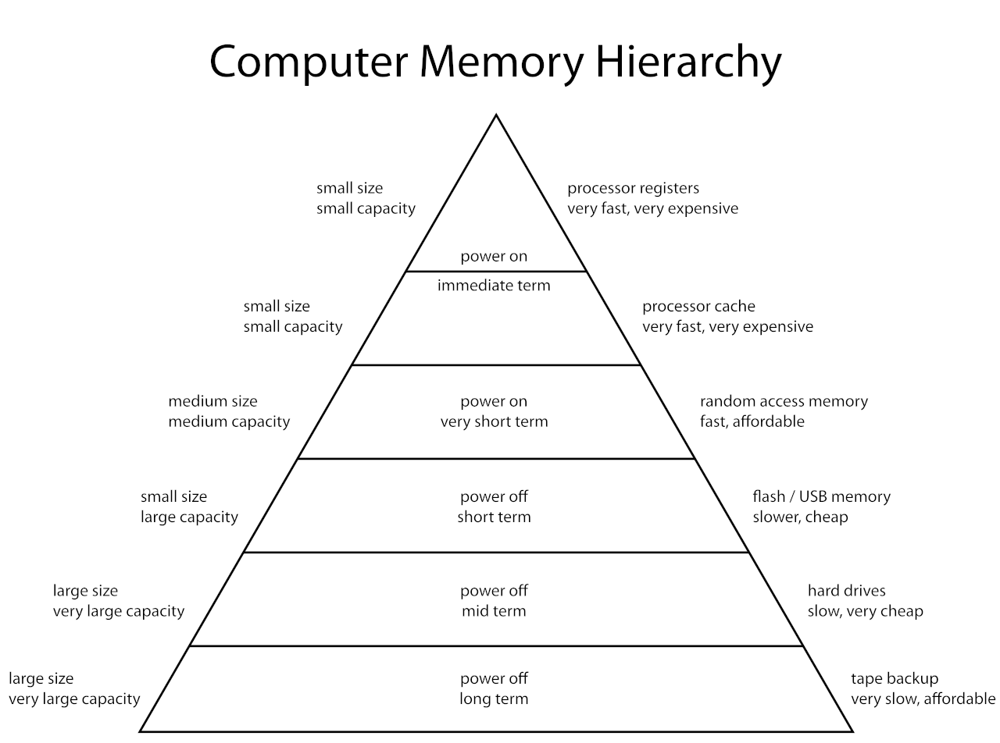

There are four major storage levels:

- **Internal** – Processor registers and cache.
- **Main** – the system main memory (RAM).
- **Secondary**. Internal storage (or On-line storage). Hard drives, SSDs, etc.
- **Tertiary**. External storage (or Off-line storage). Pen drives, DVDs, cloud storage, magnetic tapes, etc.

In order for a program to run, its **instructions** and **data** must be present in the system's **main memory** (*RAM*). The **processor** can only access data that is in the main memory. The main memory is a **volatile memory**, meaning that it loses its contents when the computer is turned off.

**Memory management** refers to **operations that are responsible for optimizing memory usage** by organizing the processes running in such a way as to make the best possible use of the available space.

Main functions:

- **Allocate space to processes** that request it.
- **Virtual address space**. Separates the memory addresses used by a process from the actual physical addresses, allowing the separation of processes and increasing **security** and the effective amount of main memory.
- **Virtual memory**. When a process is too large to be loaded into memory, a part of the secondary memory (*hard disk*) is used as back-up memory. This often makes the system run much **slower**.
- **Garbage collector**. It is responsible for the automatic **release of memory** resources for a process that has terminated its execution or enters an inconsistent state.

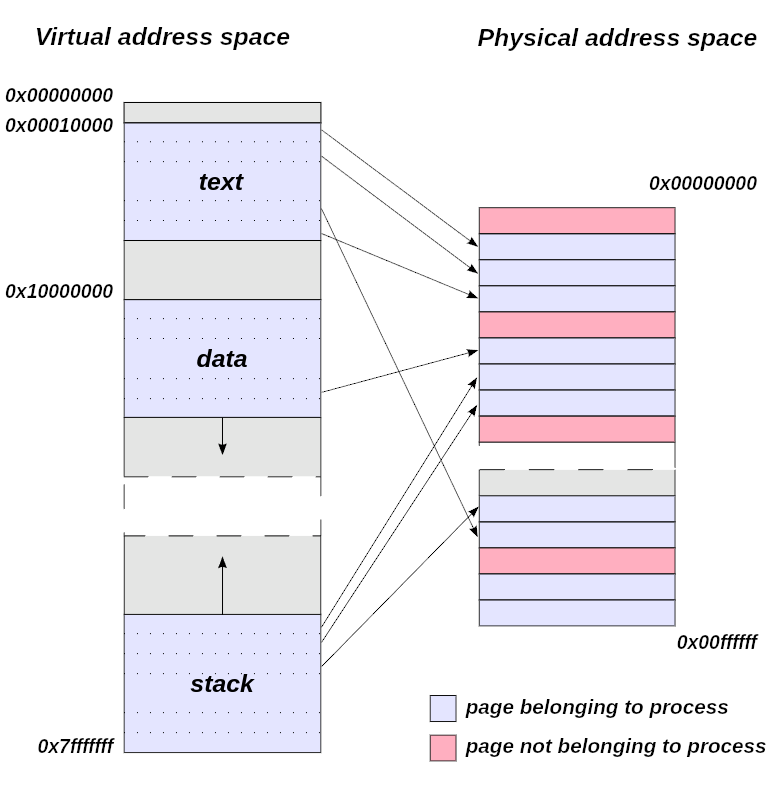

Multitasking OS requirements:

- **Protection**. A process may not access the memory location of another process without permission.
- **Relocation**. On systems with virtual memory, programs during execution may leave memory for a time and then return, so they cannot be placed in the location they previously occupied. It must therefore be possible for them to reside in different parts of memory at different times.
- **Sharing**. It is possible for multiple processes to share information across a shared memory area.

If the system were to reserve physical memory by contiguously hosting processes, there would come a point where **external fragmentation** would occur, i.e. gaps where new processes could not be contiguously hosted.

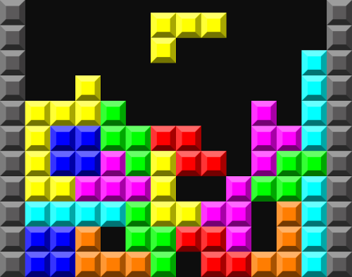

We can compare this situation with the game of *Tetris*, where the objective is to fit the pieces together to form complete lines. In the case of memory, the pieces are the processes and the complete lines are the contiguous memory blocks. If the pieces are not placed correctly, gaps will appear that will prevent new pieces from being placed.

To solve this problem, the operating system uses **paging** and **segmentation** techniques.

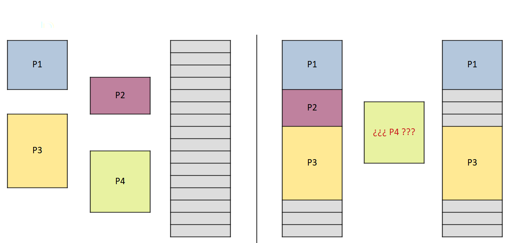

### Memory paging

Physical memory is divided into parts of the same size called **frames**, in turn, processes are also divided into parts called **pages** of the same size as the *frames*.

A **page table** is needed to translate the logical addresses to physical addresses.

This way, processes do not need to be loaded contiguously in memory, as frames can be in different memory locations.

- Eliminates external fragmentation.
- Creates **internal fragmentation**.

**Internal fragmentation** occurs when a process page does not fill a frame of memory completely, so some memory is wasted.

!!! note "Hotel Analogy"
    Imagine a hotel where all the rooms have 4 beds. If a group of 3 people arrives, they will have to pay for the 4 beds, so one bed will be wasted.

    This is the same as internal fragmentation, where a process page does not fill a frame of memory completely, so some memory is wasted.

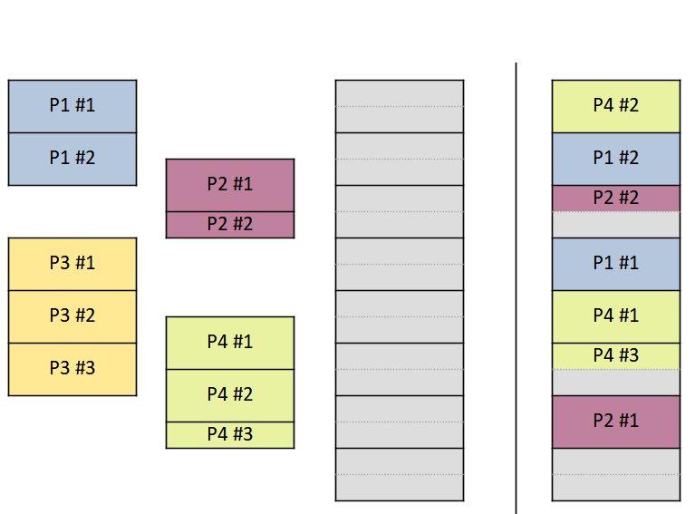

### Memory segmentation

Memory is divided into segments of different sizes, each segment corresponds to a part of the process or a type of data.

- Eliminates internal fragmentation.
- Creates **external fragmentation**.

!!! note "Zoo Analogy"
    Imagine a zoo where are areas for different animals, such as lions, elephants, monkeys, etc. Each area is a segment of memory, and each animal is a process, so the animals are not in the same area. This is the same as memory segmentation.

### Virtual memory

Also known as **swap memory**, **swap space**, **paging file** or ***swap***, is a file or partition on disk (secondary storage or *hard disk*) that is used to temporarily store copies of processes that are removed from the main memory (RAM).

This technique allows the creation of a larger capacity virtual memory, `RAM + swap`.

Its main **disadvantage** is that it is a **slow** process (compared to using only main memory).

## File System Management

**File system management** is a crucial function of an operating system that handles the storage and retrieval of data on a computer's storage devices. It organizes data into logical units called files and directories, providing a structured way for users and applications to access and manipulate information.

### Objectives

* **Data Integrity:** Ensuring the **accuracy** and **consistency** of data stored in the file system.
* **Performance:** Optimizing file system operations for **efficient** data access and retrieval.
* **Security:** **Protecting** data from unauthorized access, modification, or deletion.
* **Reliability:** Ensuring the **availability** of data and **preventing data loss** due to system failures.

By effectively managing files and directories, the operating system provides a reliable and efficient way for users and applications to interact with data on a computer.

### Key Components and Functions

1. **File:** The **basic unit of data storage**. It contains a **collection of related information**, such as documents, images, or programs.
2. **Directory:** A **container for files and other directories**, creating a **hierarchical structure**. Directories are also known as **folders**.
    - **Subdirectories:** Directories contained within other directories. 
3. **Metadata:** Information **about files and directories**, including their **names**, **locations**, **size**, creation **date**, and access **permissions**.
4. **Storage Allocation:** **Assigning physical storage space** to files and directories on the underlying storage device (e.g., hard drive, SSD).
5. **File Access:** Handling requests from applications to **read, write or modify** files.
6. **File Deletion:** **Removing files** from the file system, often marking the storage space as available for reuse.
7. **File Recovery:** Attempting to **restore deleted** or corrupted files, **if possible**.
8. **File Sharing:** Allowing **multiple users or processes to access the same file** simultaneously, potentially with different permissions.

### File

A **file** is a **collection of data** stored on a computer system. Files can contain a wide variety of information, such as text, images, audio, video, or program code. Each file has a **unique name** that identifies it within the file system.

### Directory

A **directory** is a **container for files and other directories**. It provides a way to **organize and manage files** in a hierarchical structure. Directories can be nested within each other, creating a tree-like organization of files and directories.

### Metadata

**Metadata** is **data about data**, providing information about files and directories in the file system. Common metadata includes:

- **File Name:** The **unique identifier** for a file or directory.
- **File Size:** The **amount of storage space** occupied by the file.
- **Owner:** The **user** who created the file or directory.
- **Group:** The **group** to which the file or directory belongs.
- **Permissions:** The **access rights** granted to users or groups (e.g., read, write, execute).
- **Attributes:** Such whether the file is **read-only**, **executable**, **hidden**, etc.
- **Timestamps:** Indicating the **creation**, **modification**, and **access times** of the file.
- **Device type:** For special files like **devices** or **pipes**.
  
### File System Types

Some of most popular file systems are:

* **FAT (File Allocation Table):** A simple and widely used file system, often found in older devices. It uses a table to track the location of file on the disk.
* **NTFS (New Technology File System):** A more advanced file system developed by _Microsoft_, offering features like journaling, compression, and security.
* **ext2/3/4:** Common file systems used in _Linux_ and other _Unix_-like operating systems, known for their performance and reliability.
* **HFS+ (Hierarchical File System Plus):** The default file system for _macOS_, designed for efficient storage and retrieval of files.
* **ZFS (Zettabyte File System):** A modern file system with features like data integrity, RAID, and snapshots.

### File System Compatibility

Different operating systems support different file systems, and not all file systems are compatible with each other. For example, a USB drive formatted with _NTFS_ may not be readable on a _macOS_ system, which typically uses _HFS+_. To ensure compatibility, it is essential to choose a file system that is supported by the operating systems you plan to use.

Each operating system supports one or more file systems, depending on its design and requirements. For example:

| Operating System | File System                          |
|---------|-----------------------------------------------|
| MS-DOS  | **FAT12**, FAT16, FAT32...                    |
| Windows | **NTFS**, FAT, exFAT, ReFS...                 |
| macOS   | **HFS+**, HFS, AFP...                         |
| Linux   | **ext4**, ext2, ext3, btrfs, ReiserFS, NFS... |
| Android | **ext4**, F2FS, YAFFS, ReiserFS...            |
| Servers | **ZFS**, XFS, Btrfs, JFS, UFS...              |

### Comparison of File Systems

Each file system has its own characteristics and limitations, making it suitable for different use cases. Common factors to consider include **file size limits**, **partition size**, **permissions**, **journaling**, and **encryption**.

Here's a comparison of some popular file systems:

|File system|Filenames|File size|Partition|Permissions| Journaling | Encrypt |
|:-:|:-:|:-:|:-:|:-:|:-:|:-:|
| FAT32 | 8.3 | 4 GiB   | 2 TiB |  ❌ | ❌ | ❌ |
| exFAT | 255 | 127 PiB | 512 TiB |  ❌ | ❌ | ❌ |
| NTFS  | 255 | 18 EiB  | 75 ZiB |  ✅ | Partial | ✅ |
| ReFS  | 255 | 16 EiB  | 256 ZiB |  ✅ | Partial | ✅ |
| ext3  | 255 | 2 TiB   | 32 TiB |  ✅ | ✅ | ✅ |
| ext4  | 255 | 16 TiB  | 1 EiB |  ✅ | ✅ | ✅ |
| ReiserFS | 226 | 8 TiB | 16 TiB |  ✅ | ✅ | ❌ |
| HFS+  | 255 | 8 EiB   | 8 EiB |  ✅ | Partial | ✅ |

### File System Operations

File systems support a variety of operations to manage files and directories. Some common operations include:

* **Create:** Creates a new file or directory.
* **Delete:** Removes a file or directory.
* **Read:** Retrieves data from a file.
* **Write:** Stores data in a file.
* **Rename:** Changes the name of a file or directory.
* **Move:** Relocates a file or directory to a different location.
* **Copy:** Duplicates a file or directory.
* **Modify:** Changes the content or attributes of a file, such as its name or permissions.
* **Check Integrity:** Verifies the correctness and consistency of data.
* **Compress / Decompress:** Reduces or expands the size of a file.
* **Encrypt / Decrypt:** Secures data by encoding or decoding it.

### File System Permissions

File systems use **permissions** to control access to files and directories. Permissions specify which users or groups can **read**, **write**, or **execute** files, and can be set for the **users** and/or **groups**.

Common basic permission levels include:

- **Read:** Allows users to view the contents of a file.
- **Write:** Allows users to modify the contents of a file.
- **Execute:** Allows users to run a file as a program.

Example of file permissions in _Microsoft Windows_:

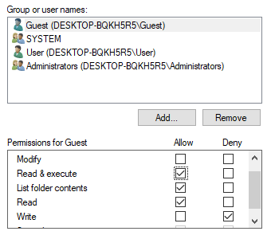

In most systems, the graphical representation for **users** and **groups** is as follows:

- **User**: 👤 a person silhouette.
- **Group**: 👥 two (or more) people silhouettes.

### Data integrity

File systems use various techniques to ensure data integrity, such as:

- **Journaling:** Recording changes to files and directories in a **journal** to recover from system crashes or power failures.
- **Checksums:** Calculating a **checksum** for files to verify their integrity and detect data corruption.
- **Redundancy:** Storing multiple copies of data to protect against data loss.

### Hierarchical Structure

We need to consider a storage device must contain millions of files, so it is necessary to organize them in a hierarchical structure. This structure is similar to a tree, where the **root** is the main directory and the **branches** are the subdirectories.

- **Root directory:** The main directory of the file system.
- **Subdirectory:** A directory contained within another directory.

In a graphical representation, the hierarchical structure looks like this:


An example of a hierarchical structure is shown below:
    
```
RootDirectory/
├── Directory1/
│   ├── File1
│   ├── File2
│   └── Directory2/
│       ├── File3
│       └── File4
└── Directory3/
    ├── File5
    └── File6
```

### Path

A **path** is a string that specifies the location of a file or directory in the file system. Paths can be **absolute** or **relative**.

- **Absolute path:** Specifies the location of a file or directory from the **root directory**.
- **Relative path:** Specifies the location of a file or directory **relative to the current directory**.

For example, in the hierarchical structure above, the absolute path to `File3` would be `/RootDirectory/Directory1/Directory2/File3`, while the relative path would be `Directory2/File3`.

In Microsoft Windows, the **backslash** **`\`** is used as the directory separator, while in Unix-like systems, the **forward slash** **`/`** is used.

An example of absolute path in _Microsoft Windows_ is `C:\Users\John\Documents\file.txt`. Where `C:` is the drive letter and root directory, `Users` is the user directory, `John` is the user name, `Documents` is a directory, and `file.txt` is a file name.

#### Absolute path

An **absolute path** is a complete path that specifies the location of a file or directory from the **root directory**. It includes all the directories and subdirectories leading to the file or directory.

Examples:

- In Microsoft Windows: `C:\Users\John\Documents\file.txt`
- In Unix-like systems: `/home/john/documents/file.txt`

Note that the root directory is represented by a **forward slash** `/` in Unix-like systems and a **backslash** `\` in _Microsoft Windows_.

#### Relative path

A **relative path** specifies the location of a file or directory **relative to the current directory**. It does not include the root directory and starts from the current working directory.

- **`.`** represents the current directory.
- **`..`** represents the parent directory.

Examples:

- `.\Documents\file.txt`
- `..\images\picture.jpg`
- `..\..\data\data.csv`

Relative paths are often used when referring to files or directories within the same directory or in a nearby directory.


## Vocabulary

- _Computer equipment_ = Equipo informático
- _Computer Science_ = Informática
- _Computer system_ = Sistema informático
- _Cooling system_ = Sistema de refrigeración
- _Device_ = Dispositivo
- _Embedded system_ = Sistema embebido
- _Expansion card_ = Tarjeta de expansión
- _Fairness_ = Equidad
- _Fairness_ = Equidad
- _File system_ = Sistema de archivos
- _General-purpose_ = Propósito general
- _Input_ = Entrada
- _Interface_ = Interfaz
- _Kernel_, _Core_ = Núcleo
- _Main memory_ = Memoria principal
- _Motherboard_ = Placa base
- _Multi-task_ = Multitarea
- _Multi-user_ = Multiusuario
- _Open-source_ = Código abierto
- _Operating system_ = Sistema operativo
- _Output_ = Salida
- _Performance_ = Rendimiento
- _Peripheral_ = Periférico
- _Power supply_ = Fuente de alimentación
- _Preemptive_ = Apropiativo
- _Process management_ = Gestión de procesos
- _Process scheduling_ = Planificación de procesos
- _Proprietary_ = Propietario
- _Scheduling algorithm_ = Algoritmo de planificación
- _Screen_ = Pantalla
- _Shared resources_ = Recursos compartidos
- _Single-task_ = Monotarea
- _Single-user_ = Monousuario
- _Special-purpose_ = Propósito específico
- _Storage_ = Almacenamiento
- _User interface_ = Interfaz de usuario
- _Swap_ = Intercambio
