# Unit 1: Characterization of Operating Systems

## Objectives

- Understand the characteristics, types, and applications of operating systems.
- Identify processes and their states.
- Describe the structure and organization of the file system.
- Distinguish the attributes of a file and a directory.
- Recognize file and directory permissions.
- Verify the usefulness of transactional systems.

## Introduction to Computer Systems

### Computer Science

It is the field of study related to the **automatic processing of information**, with the aim of **storing**, **processing**, and **transmitting** data and information through **electronic devices**.

```mermaid
flowchart LR
    A[⌨️ 🖱️ Input data] --> B((⚙️ 🧮 Process))
    B --> C[🖥️ 🎧 Output information]
    S[( 💾 🗃️ Storage)] <.-> B
```

Data Processing Scheme:

- Data input.
- Process.
- Storage (save and/or load).
- Information output.

The **input** data is **processed** and **information** is obtained as **output**. Also, the data could be loaded and saved in the storage.

!!! note
    **Computer science** is the set of knowledge and techniques that make **automatic information processing** possible through computers.

    The Spanish word ***informática*** is an acronym of the words **INFOR**mation auto**MATIC**.

## Computer Equipment

A computer, also known as PC, is a programmable digital electronic machine that executes a series of commands to process input data, obtaining information that is sent to output devices. They can perform various tasks with great speed.

They are composed of a physical part or hardware (electronic circuits, cables, peripherals, etc.), and a logical part or software (programs, applications, data, information, files, etc.).

### Computer System

A **computer system** allows for **storing and processing** information. It consists of ***hardware***, ***software***, and **Users**.

!!! note
    Currently, computer systems play a crucial role in organizing production and leisure processes around the world. They enable users to exchange information over virtually any distance.

    A **computer system** is the **set of elements** that makes it possible to **store and process** information automatically.

All computer systems consist of three fundamental parts:

- ***Hardware***. *Hardware* refers to the collection of electronic devices that provide the function of storing and processing information. *For example, this category includes computer equipment, peripherals, and wiring*.
- ***Software***. *Software* is the set of programs and applications that computer systems use to perform tasks required by users. *For example, this includes the operating system, web browser, office applications, etc.*
- ***Users***. This includes the people associated with the computer system, including both the users who operate it and the technical staff who create and maintain the computer system.

---

{ width=40% }

!!! note
    Therefore, an example of a computer system could be a personal computer with its peripherals, the person using it, and the programs it contains.

    The purpose of a computer system is to optimally manage information. The computer system allows for storing and processing information and can also perform functions ranging from facilitating work for businesses to providing entertainment for users.

### Von Neumann Architecture

The **_Von Neumann_ architecture** is a model for computer systems that was proposed by the mathematician and physicist **_John von Neumann_** in 1945. This model is based on the idea that the computer system should have a **central processing unit (CPU)** that can execute instructions, a **memory** that can store data and programs, and **input/output devices** that can communicate with the user and other devices.

The _Von Neumann_ architecture consists of the following components:

- **Central Processing Unit (CPU)**. This is the part of the computer system that executes instructions. It consists of an **arithmetic logic unit (ALU)** that performs arithmetic and logical operations, a **control unit** that manages the execution of instructions, and a **register** that stores data temporarily.
- **Memory**. This is the part of the computer system that stores data and programs. It consists of **main memory**, which is used to store data and programs that are currently being executed, and **secondary storage**, which is used to store data and programs that are not currently being executed.
- **Input/Output Devices**. These are the parts of the computer system that allow the user to interact with the computer system. Examples include storage drives, keyboards, mice, screens, printers, and speakers.

### Physical Components. *Hardware*

***Hardware*** refers to the set of components that make up the **physical part** of a computer system and enable its operation.

We can categorize *hardware* components based on their location in the computer system. This results in a division between ***internal hardware***, which is usually included within the main unit and typically constitutes the *primary hardware*, and ***external hardware*** or **peripherals** of the system.

---

**Internal Components**:

- **Motherboard**. This is the main board of the computer system where different printed circuits are located to connect other *hardware* elements.

    It's called the *main board* or *motherboard*.

- **Microprocessor**. This component is responsible for executing computer programs.

    It performs instructions through simple arithmetic and logical operations.
    
    It is also known as the **Processor** or **CPU** (*Central Processing Unit*).

- **Main Memory**. This is the memory where data and programs currently being executed by the processor are temporarily stored.

    It is a **volatile memory**, meaning that it loses its contents when the computer is turned off.
  
    Another term for main memory is **RAM** (*Random Access Memory*).

- **Power Supply**. This component is used to transform the energy required by the other system components.

- **Internal Storage Devices**. These allow for the permanent storage of data and programs. Examples include an internal hard drive or a DVD/Blu-ray drive.

- **Expansion Cards**. These elements allow for the expansion of a computer system’s functions. Common types include graphics cards, network cards, and sound cards.

- **Cooling System**. These components are responsible for dissipating the heat generated by various parts of the computer system.

---

**External elements** or **peripherals**:

- **Screen**. Main **information output** device that displays the data processed by the system to the user.
- **Keyboard** and **Mouse**. Main devices that allow **input of information**.
- **Microphone** and **speakers**. They convert electrical signals into sound waves and vice versa.
- **Printer** and **scanner**. Items used for printing and scanning text or graphic data.
- External **storage** devices**. These store data permanently and can be easily moved from one system to another.
Typical examples are USB external hard drives, *pendrives* or SD cards.
- **Other** devices: game controllers, digitizing tablets, virtual reality glasses, barcode scanners, projectors, etc.

---

<figure markdown="span">
  {width=60%, height=60%}
  <figcaption>Main hardware of a computer: 1. Screen.   2. motherboard   3. CPU.   4. Main memory.   5. Expansion cards.   6. Power supply.   7. Optical disk drive.   8. Internal disk drive.   9. Keyboard. 10. Mouse.</figcaption>
</figure>

### Logic components. *Software*

The ***software*** of a computer system is the set of necessary logical components that make it possible to carry out specific tasks.

It is an indispensable part of a computer system, as it is necessary for the user to be able to perform the desired tasks comfortably.

---

Generally, *software* can be classified into two broad groups:

- **Base or system software**. This is basic to the system. It allows users and most of the *software* to communicate with the *hardware*. Without this type of *software* the computer system could not function. Examples of this type of *software* are the operating system or drivers for peripheral devices.
- **Application software**. These are programs or applications that perform specific tasks. Examples are office packages, video games or antivirus software.
In addition, application software can be classified into horizontal and vertical:
    - **Horizontal software** is that which is available to the user with predetermined characteristics and is of a generic type, such as, for example, office packages or web browsers.
    - **Vertical software** is more specific and is created to solve a specific need of a user or company.

### The *base* software

The **base** or **system software** allows users and applications to communicate with the *hardware*.

There are different types of base *software* depending on the function they perform within the computer system: **operating systems**, **peripheral drivers**, and **firmware**.

---

- The **operating system** allows the user and applications to interact with the computer system hardware. **It is the most important *software*** of a computer system, since it allows **communication between the user and the *hardware***, and **management of all system resources**, such as processes or files and directories.

- The **device driver**, or ***driver***, is the *software* that enables communication between the computer system's input/output devices and the other *software*.

- The ***firmware***, such as BIOS or UEFI, runs before the rest of the computer system's *software*. One of its most important functions is to initialize the hardware during the boot process and to manage power and temperature control.

### Classification of computer systems

Because of the great variety of computer systems we can classify them according to various criteria, such as their architecture or their function. One of the most popular classifications is the one that organizes computer systems according to their size and the resources they offer.

- Supercomputer
- Mainframe
- Server
- Microcomputer
- Mobile device
- Embedded systems

- **Supercomputer**. These computer systems have a **high computing power**, can process a large amount of data per second, and are mainly used in the world of research and development. Supercomputers can handle billions of operations per second simultaneously, as they consist of a large number of very powerful processors working as one. These computer systems are located in special facilities, usually occupy more than one room and require special cooling.

- **Mainframe**. These computer systems are typically used for companies that need to process and store a large amount of data, such as a bank's transactions or an airline's reservation management. They are computer systems with very powerful processors and a large number of storage devices. These systems can take up an entire room, but they no longer need special facilities as supercomputers do. Although their primary function is to store corporate transactions and data, in some cases they are also used, especially by large-scale e-commerce companies, as high-capacity web servers.

- **Server**. These computer systems are larger than personal computer systems but smaller than mainframe computers. They are mainly used by businesses and their main function is to process information while allowing a large number of users to be connected simultaneously. These computer systems serve users through a network and allow the sharing of resources between them.

- **Microcomputer**, **Personal Computer** or **Laptop**. They provide service to the user and are typically used for office tasks, Internet access, small business tasks and personal entertainment. These computer systems are small in size. Portable computing systems are easy to transport as they are small in size and weight and can be operated using batteries without the need to be plugged into the mains.

- **Mobile devices**. Tablets, smartphones, smartwatches, etc. Small computers with touch screens, batteries and wireless connectivity. They can do the same tasks as a personal computer but with some limitations.

- **Embedded systems** in some industrial equipment, household appliances, vehicles, home automation, etc. They are part of the systems known as ‘Internet of Things’ IoT (*Internet of Things*). This type of system is intended for personal use and allows access to the internet, receiving calls or e-mails and other more specific functions of the system in question. These computer systems allow applications to be installed and run in a similar way to other computer systems.

## Information representation systems

Computer systems are machines that automatically process information, but all the information managed by this equipment is represented by only two symbols, namely `0` and `1`, which correspond to two electrical states or two voltage levels. In electronic circuits, from a logical point of view, it is customary to represent the presence of voltage at a point in the circuit by means of the number 1, while 0 represents the absence of voltage. This terminology is known as positive logic. Negative logic can also be applied, where the meaning of these two digits is interchanged.

Each of these symbols is referred to as a **binary number** or **bit**. A *bit* is the smallest unit of information representation in a computer system.

!!!abstract "Bit"
    The **bit** is the base unit of measurement of information, indicating the minimum amount that makes up the information. It can be represented by two symbols, `0` or `1`.

Information** is the way of representing facts, objects, values or ideas that enables communication between people and the acquisition of knowledge about things. All **information consists of data**. Data are all facts or objects that have not been manipulated and once processed form information.

---

We can classify data according to the following types:

- **Numeric**. This data consists solely of numbers (0, 1, ..., 9). All kinds of mathematical operations can be performed with this data.
- **Alphanumeric**. These data are made up of a combination of letters and numbers. With this type of data, even if they are only made up of numbers, mathematical operations cannot be performed.

---

In order for this information to be understood by the computer system, a correspondence must be established between the data and these two electrical states. This correspondence is known as **information coding**. All data used by computer systems are encoded. Different computer systems may use different codes; indeed, the same computer system may use different encodings for the different electronic devices that make it up.

---

An **encoding** is a way of interpreting information. For example, the symbol `X`, using the alphabetic code, is a letter, but, if we apply the encoding of the Roman numeral system, it is the number 10.

The encoding also depends on the use to which the data will be put. For this reason, standardized codes, such as the *Unicode*, are usually used for alphanumeric data input and output, while encodings based on the binary, octal or hexadecimal numbering system are used for numeric data because of the ease with which they can be transformed into decimal or binary to perform mathematical operations.

### Measurement of information

**`bit`** (`b`) - **minimum unit of information**. May represent `0` or `1`.

**`byte`** (`B`) - base information unit. It is a **set of 8 bits**. It can represent 256 values, from 0 to 255.

| $2^8$ | $2^7$ | $2^6$ | $2^5$ | $2^4$ | $2^3$ | $2^2$ | $2^1$ |         |
|:-----:|:-----:|:-----:|:-----:|:-----:|:-----:|:-----:|:-----:|--------:|
|**128**| **64**| **32**| **16**| **8** | **4** | **2** | **1** |   Valor |
|  `0`  |  `0`  |  `0`  |  `0`  |  `0`  |  `0`  |  `0`  |  `0`  |   **0** |
|  `0`  |  `0`  |  `0`  |  `0`  |  `0`  |  `0`  |  `0`  |  `1`  |   **1** |
|  `0`  |  `0`  |  `0`  |  `0`  |  `0`  |  `0`  |  `1`  |  `0`  |   **2** |
|  `0`  |  `0`  |  `0`  |  `0`  |  `0`  |  `0`  |  `1`  |  `1`  |   **3** |
|  `0`  |  `0`  |  `0`  |  `0`  |  `0`  |  `1`  |  `0`  |  `0`  |   **4** |
|  `0`  |  `0`  |  `0`  |  `0`  |  `0`  |  `1`  |  `0`  |  `1`  |   **5** |
|       |       |       |       |  ...  |       |       |       |         |
|  `0`  |  `1`  |  `0`  |  `1`  |  `0`  |  `1`  |  `0`  |  `1`  |  **85** |
|       |       |       |       |  ...  |       |       |       |         |
|  `1`  |  `1`  |  `1`  |  `1`  |  `1`  |  `1`  |  `1`  |  `1`  | **255** |

---

If we join 8 bits we get a byte (B), which is also a very small unit of storage. With one byte we can represent 256 different combinations, from `00000000` to `11111111`.

For large volumes of information we use **multiples of the byte**.

| Name | Symbol | Base 10 |
|:--|:--:|--:|
| byte | B | $10^{0}$ = 1 |
| [kilobyte](https://es.wikipedia.org/wiki/Kilobyte "Kilobyte") | kB | $10^{3}$ = 1 000 |
| [megabyte](https://es.wikipedia.org/wiki/Megabyte "Megabyte") | MB | $10^{6}$ = 1 000 000 |
| [gigabyte](https://es.wikipedia.org/wiki/Gigabyte "Gigabyte") | GB | $10^{9}$ = 1 000 000 000 |
| [terabyte](https://es.wikipedia.org/wiki/Terabyte "Terabyte") | TB | $10^{12}$ = 1 000 000 000 000 |
| [petabyte](https://es.wikipedia.org/wiki/Petabyte "Petabyte") | PB | $10^{15}$ = 1 000 000 000 000 000 |
| [exabyte](https://es.wikipedia.org/wiki/Exabyte "Exabyte") | EB | $10^{18}$ = 1 000 000 000 000 000 000 |
| [zettabyte](https://es.wikipedia.org/wiki/Zettabyte "Zettabyte") | ZB | $10^{21}$ = 1 000 000 000 000 000 000 000 |
| [yottabyte](https://es.wikipedia.org/wiki/Yottabyte "Yottabyte") | YB  | $10^{24}$ = 1 000 000 000 000 000 000 000 000 |

Table: Multiples using the International System prefixes

---

Traditionally, in the computer world, 1 kB (kilobyte) corresponded to 1024 bytes, but according to the international system of units, 1 kB (kylobyte) corresponded to 1000 bytes, as with all other units of measurement. This generated some controversy and it was easy to make mistakes. To solve this confusion, in 1998 the International Electrotechnical Commission published an appendix in the **ISO/IEC 80000** standard defining the binary prefixes, thus giving birth to the unit kibibyte (KiB) to designate the correspondence between 1 KiB and 1024 bytes; from this moment on, the kilobyte unit is considered valid only for the correspondence between 1 kB and 1000 bytes.

| Nombre | Símbolo | Factor y valor en el [ISO/IEC 80000](https://es.wikipedia.org/wiki/ISO/IEC_80000 "ISO/IEC 80000")\-13 |
|:--|:--:|--:|
| byte | B | $2^{0}$ = 1 |
[kibibyte](https://es.wikipedia.org/wiki/Kibibyte "Kibibyte") | KiB | $2^{10}$ = 1024 |
| [mebibyte](https://es.wikipedia.org/wiki/Mebibyte "Mebibyte") | MiB | $2^{20}$ = 1 048 576 |
| [gibibyte](https://es.wikipedia.org/wiki/Gibibyte "Gibibyte") | GiB | $2^{30}$ = 1 073 741 824 |
| [tebibyte](https://es.wikipedia.org/wiki/Tebibyte "Tebibyte") | TiB | $2^{40}$ = 1 099 511 627 776 |
| [pebibyte](https://es.wikipedia.org/wiki/Pebibyte "Pebibyte") | PiB | $2^{50}$ = 1 125 899 906 842 624 |
| [exbibyte](https://es.wikipedia.org/wiki/Exbibyte "Exbibyte") | EiB | $2^{60}$ = 1 152 921 504 606 846 976 |
| [zebibyte](https://es.wikipedia.org/wiki/Zebibyte "Zebibyte") | ZiB | $2^{70}$ = 1 180 591 620 717 411 303 424 |
| [yobibyte](https://es.wikipedia.org/wiki/Yobibyte "Yobibyte") | YiB | $2^{80}$ = 1 208 925 819 614 629 174 706 176 |

Table: Multiples using ISO/IEC 80000-13

---

As a curiosity, most manufacturers of storage devices express the capacity in the International System. For example, a USB *pendrive* of ***64 GB***, when connected to our computer will show ***59.6 GiB***.

A similar case occurs with Internet connection providers, who express transfer speeds in Mbps (Megabits per second). For example, a connection of ***100 Mbps*** in a speed test will show ***11.9 MiBps*** (Mebibytes per second).

## The operating system

The **operating system** is the most important ***software* of a computer system**. This *software* gives the user the possibility to **interact with the computer system in an easy way**, giving the user the possibility to **manage the information and resources** available on the computer system.

Operating systems has **two basic functions**.

- **Abstraction**. Hide details of hardware configuration and provide a simple interface for users.
- **Arbitration**. To manage access to shared resources.

### Elements of the operating system

- **Kernel**. The core of the operating system. It is responsible for managing the computer system's resources, such as the processor, memory, and input/output devices. It also provides the interface between the *hardware* and the rest of the *software*.
- **Services**. These are the functions that the operating system provides to the user and other *software*. Examples include file management, printing, and network access.
- **File system**. It is responsible for managing the computer system's files and directories. It allows the user to store, organize, and access information.
- **User interface**. It is the part of the operating system that allows the user to interact with the computer system. It can be graphical, text-based, or voice-based.

---

---

### Types of operating systems

- By the number of simultaneous users

    - **Single-user**. These operating systems are designed to be used by a single user at a time. Examples include Windows, macOS, and Linux.
    - **Multi-user**. These operating systems are designed to be used by multiple users at the same time. Examples include Unix and Linux.

- By the number of tasks

    - **Single-task**. These operating systems can only run one task at a time. Examples include MS-DOS.
    - **Multi-task**. These operating systems can run multiple tasks at the same time. Examples include Windows, macOS, and Linux.

- By the purpose

    - **General-purpose**. These operating systems are designed to be used for a wide range of tasks. Examples include Windows, macOS, and Linux.
    - **Special-purpose**. These operating systems are designed for a specific task. Examples include real-time operating systems and embedded operating systems.

- By licensing

    - **Proprietary**. These operating systems are owned by a company and cannot be modified by the user. Examples include Windows and macOS.
    - **Open-source**. These operating systems are developed by a community of users and can be modified by the user. Examples include Linux.

## Functions of the operating system

The **operating system** manages the computer system's resources to ensure that the user and other *software* can use them efficiently. The main functions of the operating system are:

- **Process management**. The operating system manages the computer system's processes, which are the programs that are running. It allocates resources to processes, schedules them to run on the processor, and provides mechanisms for processes to communicate with each other.
- **Memory management**. The operating system manages the computer system's memory, which is used to store data and programs. It allocates memory to processes, swaps data between memory and storage, and provides mechanisms for processes to share memory.
- **File system management**. The operating system manages the computer system's files and directories, which are used to store data. It provides mechanisms for creating, reading, writing, and deleting files, and for organizing files into directories.
- **Input/output management**. The operating system manages the computer system's input/output devices, which are used to communicate with the user and other devices. It provides mechanisms for reading data from and writing data to devices, and for controlling the flow of data between devices.
- **Security management**. The operating system manages the computer system's security, which is used to protect the system from unauthorized access and to ensure the privacy and integrity of data. It provides mechanisms for controlling access to the system, for encrypting data, and for detecting and preventing security threats.
- **Network management**. The operating system manages the computer system's network connections, which are used to communicate with other systems. It provides mechanisms for connecting to networks, for sending and receiving data over networks, and for controlling the flow of data between systems.

## Processes and their states

A **process** is a program that is running on the computer system. The operating system manages processes to ensure that they can run efficiently and that they do not interfere with each other.

Formally a **process** is ‘A unit of activity characterized by the execution of a **sequence of instructions**, with a **current state**, and a set of associated **system resources**’.

---

In order to better understand what a process is and the difference between a program and a process, *A. S. Tanenbaum* proposes the following analogy.

> A cook bakes a birthday cake for his daughter; he has the recipe for a birthday cake and a well-equipped kitchen with all the necessary ingredients, flour, eggs, sugar, milk, etc.’.

Situating each part of the analogy it can be said that the *recipe* represents the **program** (instructions), the *cook* is the **processor** and the *ingredients* are the **data** of the program. The **process** is the *activity* of the cook reading the recipe, obtaining the ingredients and baking the cake.

---

To represent a process, the operating system uses the following information:

- **Process ID (identifier)**. This is an integer number used to identify each process.
- **Process status**. This is used to indicate the status in terms of its life cycle.
- **Resource usage**. It allows to check the use of resources used by the process, the execution time, maximum time assigned, priority, etc. This information is useful for planning the next process to be executed by the processor.
- **Process context**. For each process, the operating system stores the processor status, memory information and input/output requests.

### Process states

A process can be in one of the following states:

- **Created**. The process has been created but has not yet started running.

- **Waiting**. The process is ready to run but is waiting for the processor to become available. Reach this state when created or when it has been interrupted or the blocking condition is fulfilled.

- **Running**. The process is currently running on the processor.

- **Blocked**. The process is waiting for a resource to become available, such as a file or a network connection.

- **Terminated**. The process has finished running and has been removed from the system.

### Process scheduling

The **process scheduler** is responsible for deciding which process to run on the processor at any given time. The process scheduler uses algorithms to determine the order in which processes are run, based on factors such as the priority of the process, the amount of time the process has been waiting, and the amount of time the process has been running.

Main goals of the process scheduler:

- **Maximize performance**. Ensure that the processor is always running a process.

- **Minimize response time**. Ensure that processes are run as soon as possible after they are created.

- **Minimize latency or response time**. Ensure that processes are run as soon as possible after they are created.

- **Maximize fairness**. Ensure that all processes are given an equal opportunity to run.

---

Process management could be similar to office work. You can have a list of tasks to be done and set priorities for them: high, medium, low, for example. You should start by doing the high priority tasks first, and when they are finished, move on to the medium priority tasks and then to the low priority tasks. Once the task is done, it is crossed out.

This can lead to the problem that low priority tasks may never get done and remain on the list forever. To solve this, older tasks can be assigned high priority.

> Although process scheduling is rather more complex, to get an idea, we could compare process scheduling with the service in a restaurant. Service is considered optimal when waiting times for customers are as short as possible and no one starves to death.

The scheduling algorithm can be classified into two types:

- **Preemptive**. The process scheduler can interrupt a process that is running to run another process. This is useful for ensuring that high-priority processes are run as soon as possible.

- **Non-preemptive**. The process scheduler cannot interrupt a process that is running to run another process. This is useful for ensuring that low-priority processes are run to completion.

Let's study the following scheduling algorithms:

- Non-preemptive:
    - **First-come, first-served (FCFS)**. The process that arrives first is the first to be run.
    - **Shortest job first (SJF)**. The process with the shortest execution time is run first.
- Preemptive:
    - **Shortest remaining time first (SRTF)**. The process with the shortest remaining execution time is run first.
    - **Round-robin (RR)**. Each process is run for a fixed amount of time, called a time slice or quantum, and then the next process is run.

---

#### First-come, first-served (FCFS)

This is the simplest scheduling algorithm. The process that arrives first is the first to be run. This algorithm is non-preemptive, meaning that once a process starts running, it cannot be interrupted until it finishes.

- Non-preemptive.
- Simple and easy to implement.
- Large waiting times.
- Slow performance.

#### Shortest job first (SJF)

This algorithm runs the process with the shortest execution time first. This algorithm is non-preemptive, meaning that once a process starts running, it cannot be interrupted until it finishes.

- Non-preemptive.
- Waiting times are smaller than FCFS.
- Starvation. Long processes can block the execution of short processes.
- Minimum performance.

#### Shortest remaining time first (SRTF)

This algorithm runs the process with the shortest remaining execution time first. This algorithm is preemptive, meaning that a process can be interrupted while it is running to run another process.

- Preemptive.
- Waiting times depend on arrival and duration.
- Starvation. Short processes can block the execution of long ones.
- Preference for short processes.

#### Round-robin (RR)

This algorithm runs each process for a fixed amount of time, called a time slice or quantum, and then runs the next process. This algorithm is preemptive, meaning that a process can be interrupted while it is running to run another process.

- Preemptive.
- Larger waiting times than SJF.
- Fair performance.

---

## Vocabulary

- _Computer Science_ = Informática
- _Computer system_ = Sistema informático
- _Computer equipment_ = Equipo informático
- _Operating system_ = Sistema operativo
- _Input_ = Entrada
- _Output_ = Salida
- _Storage_ = Almacenamiento
- _Peripheral_ = Periférico
- _Main memory_ = Memoria principal
- _Motherboard_ = Placa base
- _Power supply_ = Fuente de alimentación
- _Expansion card_ = Tarjeta de expansión
- _Cooling system_ = Sistema de refrigeración
- _Screen_ = Pantalla
- _Device_ = Dispositivo
- _Embedded system_ = Sistema embebido
- _Shared resources_ = Recursos compartidos
- _Kernel_ = Núcleo
- _Interface_ = Interfaz
- _File system_ = Sistema de archivos
- _User interface_ = Interfaz de usuario
- _Single-user_ = Monousuario
- _Multi-user_ = Multiusuario
- _Single-task_ = Monotarea
- _Multi-task_ = Multitarea
- _General-purpose_ = Propósito general
- _Special-purpose_ = Propósito específico
- _Proprietary_ = Propietario
- _Open-source_ = Código abierto
- _Process management_ = Gestión de procesos
- _Process scheduling_ = Planificación de procesos
- _Scheduling algorithm_ = Algoritmo de planificación
- _Performance_ = Rendimiento
- _Fairness_ = Equidad
- _Preemptive_ = Apropiativo

