# Unit 2: Virtualization systems

**Virtualization** is a technology that allows software to **simulate resources**. In a fully virtualized environment, each operating system has the illusion of residing on an individual machine with all hardware resources entirely available to it.

To achieve **hardware virtualization**, a program called **hypervisor** or **virtual machine monitor** is needed to manage the use of the hardware, each **virtual machine** is called a **guest**. The hypervisor is responsible for **creating** and **managing** the virtual machines, ensuring that each one has the necessary resources to operate.

Each of the **virtual machines** can be assigned hardware resources through different configurations. Among the resources that can be shared are: RAM, CPU, storage drives, network cards, etc. On each of these machines we can install an independent operating system and its applications. Thus, for example, when a virtualized operating system believes that it is writing to a real hard disk, it is actually writing to a file, managed by the virtual machine, that simulates said hard disk.

!!! note
    Virtualization allows multiple guest operating systems to run simultaneously on a single computer by sharing available physical resources such as the processor, memory, storage drives, and other input/output devices.

The main **advantages** of virtualization are:

- **Cost reduction** and **Energy savings**: by reducing the number of physical machines.
- **Optimization of resources**: by sharing hardware resources.
- **Isolation**: each virtual machine is isolated from the rest, so that if one fails, the rest continue to operate.
- **Flexibility**: it is possible to create, delete, move, or resize virtual machines.
- **Security**: it is possible to create a virtual machine for each service, so that if one is compromised, the rest are not affected.
- **Education**, **testing** and **development**: it is possible to create a virtual machine to test new software or configurations without affecting the rest of the system.
- **Backup and recovery**: it is possible to create snapshots of the virtual machines to recover them in case of failure.

!!! note "VPS in the cloud"
    A real use case of virtualization is the use of **virtual private servers** (_VPS_) in the cloud.
    
    In this case, a physical server is divided into several virtual servers, each with its own operating system and applications. This allows the users to have a server with the necessary resources without having to buy and maintain a physical server.

!!! note "Cloud gaming"
    Another use case of virtualization is **cloud gaming**. In this case, the game is executed on a server in the cloud, and the user interacts with it through a client that sends the user's commands to the server and receives the images generated by the game. This allows the user to play games with high hardware requirements on a device with low hardware requirements.

    Some examples of cloud gaming services are:
    
    - [NVIDIA GeForce Now](https://www.nvidia.com/en-us/geforce-now/)
    - [Xbox Game Pass Ultimate](https://www.xbox.com/en-us/xbox-game-pass/ultimate)
    - [PlayStation Plus Premium](https://www.playstation.com/en-us/ps-plus/)
    - [Amazon Luna](https://luna.amazon.com/)

## Virtualization concepts

The most important concepts to understand what virtualization is are:

- **Host** system.
- **Guest** system.
- **Hypervisor** or _**Virtual Machine Monitor**_ (_VMM_).
- **Virtual Machine** (_VM_).
- **Container**.

---

- **Host** system, is the operating system of the computer in which we install our *virtualization software* and which will assign or lend certain hardware resources to the *virtual machine* that we create.

- **Guest** system, is the operating system that we install in the *virtual machine* that we have created, using our *virtualization software* and to which we have assigned certain hardware resources to operate.

- **Hypervisor** or _**Virtual Machine Monitor**_ (_VMM_), is the software responsible for creating an **abstraction layer** to communicate the real machine with the *virtual machines*. Its mission is to assign computing resources to the virtual machines as they are needed.

- **Virtual Machine** (_VM_), is an **instance** of virtualized hardware.

- **Container**, is a **lightweight** and **portable** software package that includes everything needed to run an application: code, runtime, system tools, system libraries, and settings. Containers are isolated from each other and from the host system, but they share the kernel of the host system.

<figure markdown="span">
    { width=100% }
    <figcaption>Logical diagram of full virtualization. @wikipedia</figcaption>
</figure>

### Types of virtualization

We will study **three types** of virtualization:

- Virtualization with **native** hypervisor, _**type 1**_ or _**bare metal**_.

    The hypervisor runs directly on the computer equipment. The hypervisor itself acts as a kind of operating system oriented to manage virtual machines, gaining greater control and obtaining better performance. Mainly used in professional environments and servers.

- Virtualization with **hosted** hypervisor, _**type 2**_.

    The hypervisor software is installed on a host operating system. It offers lower performance than native hypervisors because it is affected by the host system. They are aimed at test, teaching or home environments.

- Virtualization based on **containers**.

    Also known as **operating system-level virtualization** or **application containerization** or **containerization**.

    The containers **share** the **host operating system's kernel** and are therefore **more lightweight** than virtual machines. They are used to **run applications** in an **isolated virtual environment**.
    
    The most popular containerization software is **Docker**.

<figure markdown="span">
    { width=90% }
    <figcaption>Types of virtualization. @wikipedia</figcaption>
</figure>

!!! note
    In this course we will focus on hosted hypervisors type 2.

The hypervisor hosts the guest. A host can have multiple guests and the guests must not interfere with each other or the host. Guest operating systems run within a Virtual Machine.

To build the virtual machine we need to allocate certain hardware resources, such as hard disk space, RAM, number of processors, etc. that the host will give up or share with the guest.

The **hardware requirements** for a computer running virtual machines will vary depending on a number of factors, including:

- The virtualization software installed on the host computer.
- The number and type of guest operating systems.
- The applications you plan to run on the guest operating systems.
- The applications you plan to run, simultaneously with the guest systems, on the host computer.

## Advantages and disadvantages of virtualization

### Advantages

- **Utilization of existing resources**, allowing for their shared use. Before virtualization, it is common for the resource usage rate to not exceed 50%, in fact, it is very common for it not to exceed 15%.

- **Reducing the costs** of data centers by reducing their physical infrastructure. This results in a lower need for space and a reduction in energy consumption and cooling needs, which, in addition to saving money, contributes to improving the environment.

- **Streamlining administration**, since more advanced tools are available. In addition, we can have all the processing capacity grouped into several physical servers, between which a **dynamic balancing** of the virtual machines takes place, **centrally managing** all the computing capacity, memory, storage, network, etc., and guaranteeing that each virtual machine runs on the most suitable *host* at all times.

- **Fragment services**, instead of having a large server that centralizes all the company's services, we can define small virtual servers, each of them specialized in a specific service (*a web server, a print server, a telephone switchboard server, etc.*). In this way, the administration of each of them is simplified and possible unwanted interrelations are avoided.

- **Isolation** between the different virtual machines, which will mean that a failure in one of them will not affect the rest.

- **Increase availability**, since backup and cloning mechanisms for complete virtual machines can be used to migrate them to different hardware, eliminating downtime and immediately recovering from any problem. Sometimes, the migration from one system to another can even be done hot (without stopping the host and without stopping offering service).

- Increase the **flexibility of the implementation**, to respond more quickly to possible changes that need to be made. For example, we can add resources to virtualized servers quickly and easily.

- **Create test environments** that allow new solutions to be tested before they can affect the rest of the infrastructure.

- Administer and manage secure desktop systems that are accessible to users locally or remotely from almost any client-side computer.

### Disadvantages

**Disadvantages** include:

- Many virtual systems may **depend on a single physical computer**, requiring additional measures to ensure data integrity.
- The **performance** of systems is limited by sharing physical resources.
- **Compatibility** problems may arise with virtualized hardware.

## Virtualization software

When we talk about virtualization software, we have a wide range of possibilities among which we can find very different options, both in terms of the type of virtualization and the manufacturer.

For this reason, below we will review the most common tools:

- **Native hypervisors**, type 1 or *bare metal*:
    - **VMware ESXi**. Produced by *WMware Inc*, it is one of the company's different virtualization solutions.
    - **KVM** (***Kernel-based Virtual Machine***). It is a virtualization module for the *Linux* kernel that allows the kernel to act as a hypervisor. It can be run on any architecture supported by *Linux* (*Intel*, *ARM*, *PowerPC*, )
    - **Citrix Hypervisor** (***XenServer***). Virtualization software from *Citrix Systems, Inc*. Optimized for desktop workloads and virtual applications based on the *Xen Project* hypervisor, an open source hypervisor developed by the University of Cambridge.
    - **Microsoft Hyper-V**. Developed by *Microsoft* for systems based on *Intel* type processors.
- **Hosted hypervisors**, type 2:
    - **VMware Workstation**. It is a hypervisor for *Windows* and *Linux* systems that allows users to configure virtual machines. There is a paid version (*Pro*) and a free version (*Player*) aimed at personal use.
    - **Parallels Desktop**. For *Apple Mac OS X* operating systems.
    - **Oracle VM VirtualBox**. Easy-to-use and free software under a *PUEL* license for personal use and evaluation. It runs on *Intel* processors running Windows, Linux, macOS or Solaris operating systems.

## VirtualBox

**Oracle VM VirtualBox** is a free and open-source hosted hypervisor for x86 virtualization, developed by *Oracle Corporation*. It is installed on an existing host operating system as an application; this host application allows additional guest operating systems, each known as a Guest OS, to be loaded and run, each with its own virtual environment.

VirtualBox can be installed on a variety of host operating systems, including *Linux*, *macOS*, *Windows*, *Solaris*, and *OpenSolaris*. It supports the creation and management of guest virtual machines running versions and derivations of *Windows*, *Linux*, *BSD*, *OS/2*, *Solaris*, *Haiku*, and *OSx86*, as well as limited virtualization of macOS guests on Apple hardware.

### Installation

On the official *Oracle VM VirtualBox* page [**www.virtualbox.org**](https://www.virtualbox.org/) we can consult the manual, technical requirements, installation guide and download the version appropriate to our operating system.

### Enable virtualization in the BIOS

Intel and AMD processors provide technologies that optimize the virtualization process. To use them, you need to activate them in the system's BIOS or UEFI.

The first thing to do is to check that the processor supports virtualization. You can find out by checking the processor's technical specifications in the manufacturer's manual.

To activate it, you need to enter the computer's BIOS or UEFI configuration. To do this, you need to check the motherboard manufacturer's manual. When you start the computer, you need to press the key, usually the `DEL`, `F2`, `F12` or `ESC` key.

Go to the section indicated in the manual, which could be "*System configuration*", "*Advanced*" or similar, and look for an option that says "_Intel VT_", "_VT-x_", "_Virtualization Technology_", "_AMD-v_", etc. (the name may vary depending on the manufacturer) and activate it.

### Disabling *Hyper-V* on *Microsoft Windows* systems

If our host system is *Windows 8* or higher, we must check that the *Hyper-V* features are disabled.

Open the "**Enable or disable Windows features**" panel, look for the ***Hyper-V*** option and uncheck it. Restart the computer.

<figure markdown="span">
    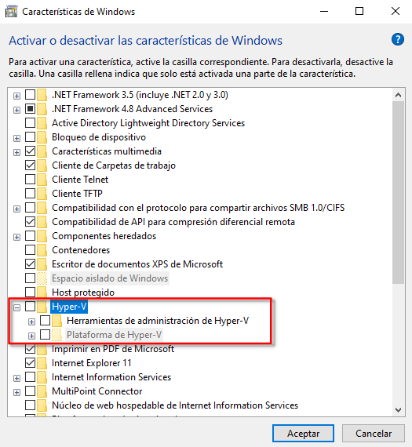
    <figcaption>Deshabilitar Hyper-V en Windows</figcaption>
</figure>

### Installation

If we have a ***GNU/Linux*** operating system, it is very likely that *VirtualBox* is in the distribution's repositories. We must proceed to install it using the relevant package manager.

Alternatively, we can download the package directly from the official website.

[Oracle VirtualBox Official Website](https://www.virtualbox.org/)

On ***Microsoft Windows*** systems, we will have to access the official website and download the installer, then run it and proceed with the typical step-by-step installer.

## Creating virtual machines

Once installed, we can access the hypervisor where we can manage the virtual machines.

<figure markdown="span">
    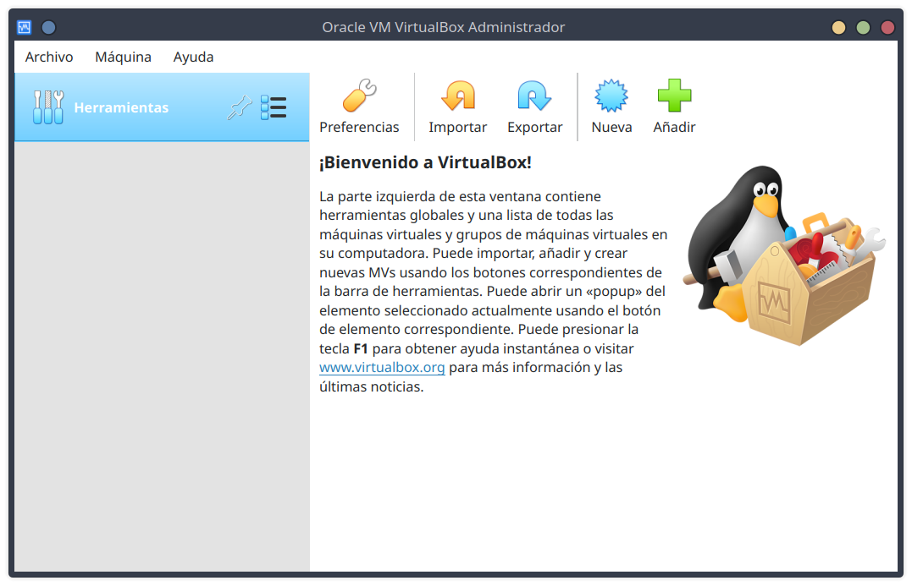{ width=75% }
    <figcaption>VirtualBox main window</figcaption>
</figure>

To create a new virtual machine we must click on "`New`" or in the top menu "`Machine` > `New...`"

<figure markdown="span">
    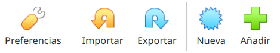{ width=90% }
    <figcaption>VirtualBox toolbar</figcaption>
</figure>

A new window will open with a wizard to create the machine.

- ***Step 1***. The first step will be to **give it an appropriate name**, the location where the files will be stored, the type and the version.

<figure markdown="span">
    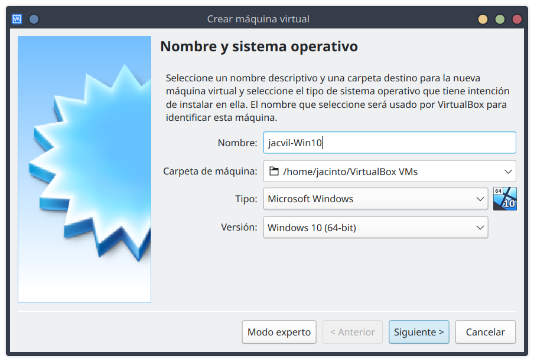{ width=65% }
    <figcaption>Step 1: Name and operating system</figcaption>
</figure>

- ***Step 2***. Next, we need to choose the amount of RAM that the virtual machine we are creating will use. The default value is usually sufficient, but we must adjust it to the requirements of the system we want to install. Keeping in mind that the memory we assign to the virtual machine will not be available to the host system.

<figure markdown="span">
    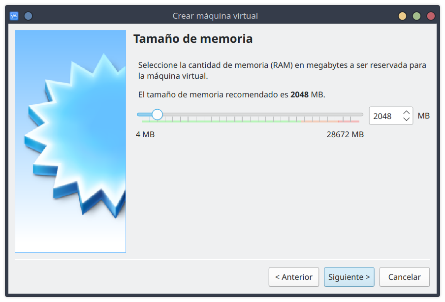{ width=65% }
    <figcaption>Step 2: Memory size</figcaption>
</figure>

- ***Step 3***. The next step will be to configure the virtual storage (HDD). Usually we will create a **new** virtual disk.

    <figure markdown="span">
        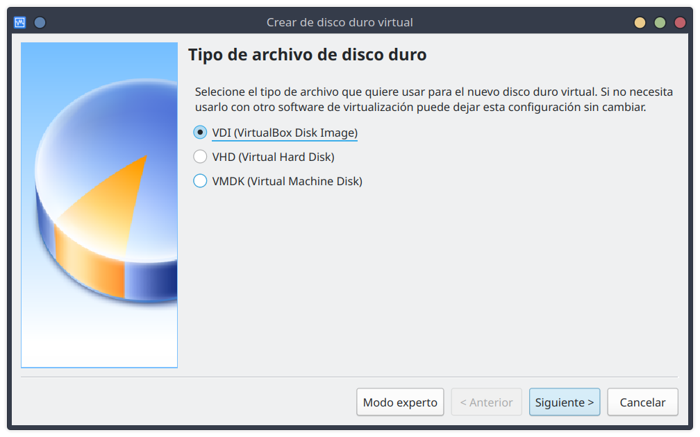{ width=65% }
        <figcaption>Step 3: Virtual Storage</figcaption>
    </figure>

    - ***Step 3.1***. When creating a new virtual disk we must choose the type to use.

        - **VDI** is the native format of *VirtualBox*
        - **VDH** format used by *Microsoft*
        - **VMDK** is used by *VMWare*

        We will select the **VDI** format, by default.

        <figure markdown="span">
            { width=65% }
            <figcaption>Step 3.1: Hard disk file type</figcaption>
        </figure>

        ***Step 3.2***. In this section we must select how the file that stores the virtual hard disk will behave in physical storage.

        - **Dynamically reserved**. The file will grow as data is entered into the virtual hard disk. It is created faster but has lower performance.
        - **Fixed size**. A file of the same size as the virtual hard disk will be created. It takes longer to create but offers better performance.

    Para ahorrar recursos seleccionaremos ***Reservado dinámicamente***, por defecto.

    <figure markdown="span">
        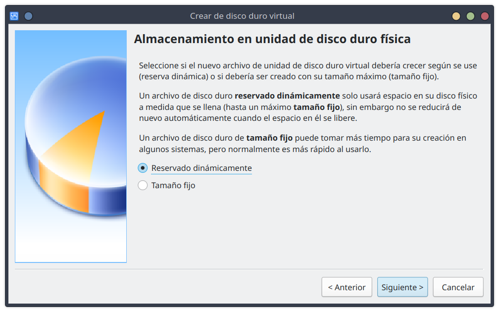{ width=65% }
        <figcaption>Step 3.2: Storage on physical hard disk drive</figcaption>
    </figure>

    - ***Step 3.3***. Finally, we will name the virtual hard disk and choose the size. By default it suggests a recommended disk size but we must adjust it to the requirements of the system we want to install.

    <figure markdown="span">
        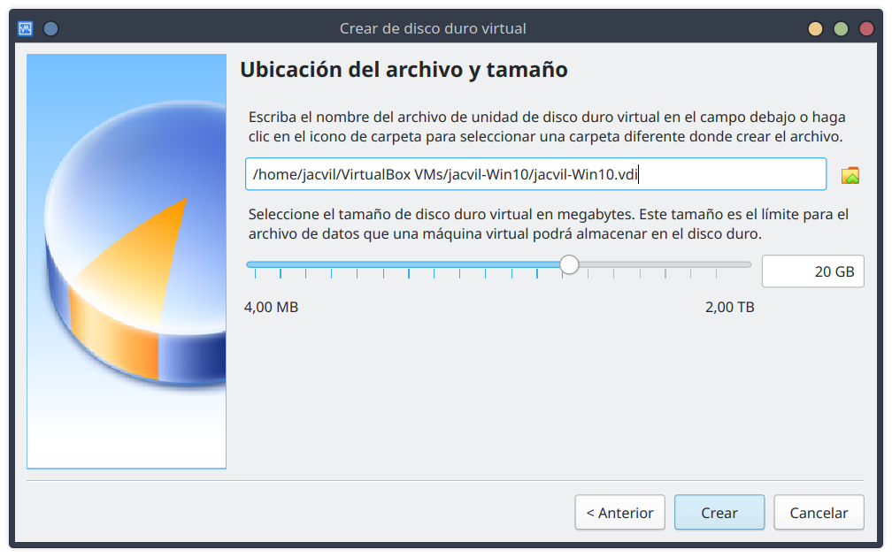{ width=65% }
        <figcaption>Step 3.3: File location and size</figcaption>
    </figure>

    After completing the steps, we will return to the main VirtualBox window with the newly installed virtual machine selected, where a summary of its configuration options will appear.

    <figure markdown="span">
        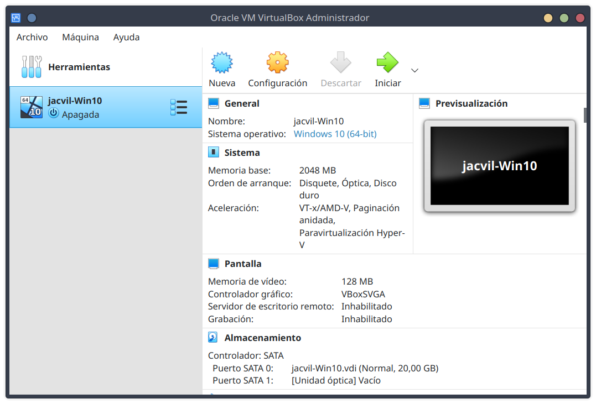{ width=65% }
        <figcaption>New virtual machine created</figcaption>
    </figure>

## Configuration and use of virtual machines.

Once we have created the virtual machine, we must **check and configure its options**.

To do this, we must select the virtual machine and click on "**Configuration**"

<figure markdown="span">
    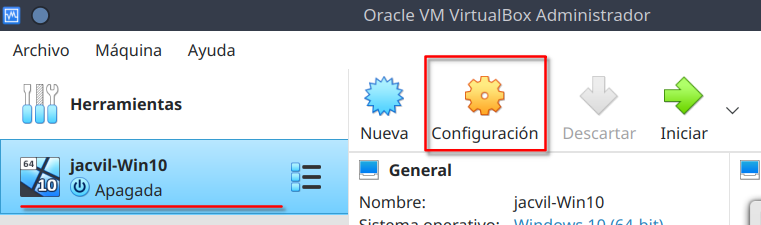{ width=60% }
    <figcaption>Access to the configuration of a virtual machine</figcaption>
</figure>

The configuration window for the selected virtual machine will open.

<figure markdown="span">
    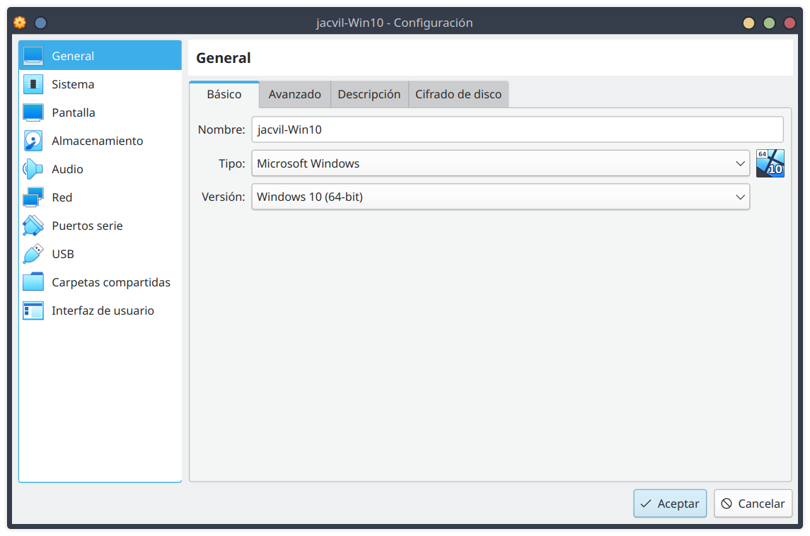{ width=65% }
    <figcaption>Virtual machine configuration window</figcaption>
</figure>

Let's review some of these options:

- **General**. We can mainly change the name, type and version of the guest operating system.

- **System**. We can adjust the size of the RAM and the number of processors (cores) that the virtual machine will use.

- **Storage**. In this section we can manage the virtual storage devices associated with the machine.

A very commonly used feature is to **insert ISO images** into the **virtual CD/DVD drive** to boot the system for the first time.

<figure markdown="span">
    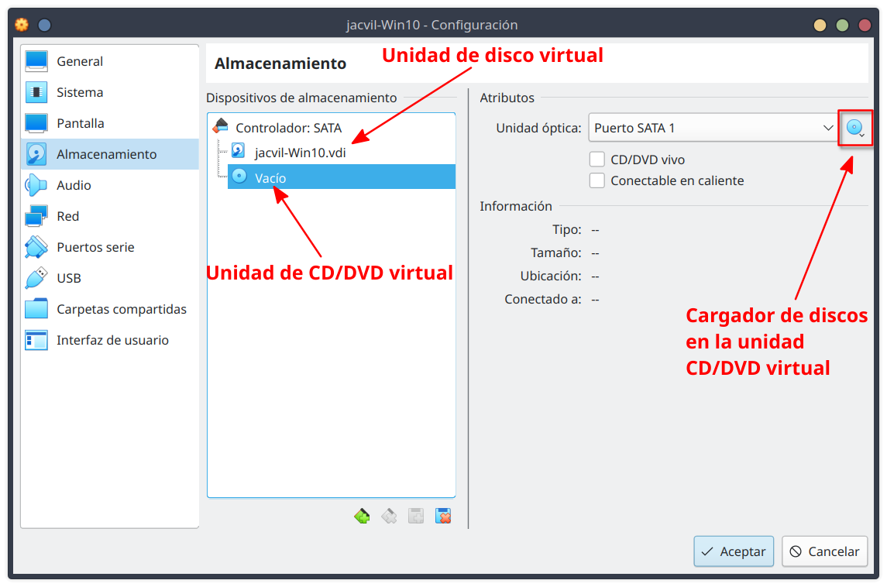{ width=60% }
    <figcaption>Virtual Storage Setup</figcaption>
</figure>

- **Network**. We can enable up to four network adapters of the following types:
    - **Not connected**. Represents the absence of a network adapter.
    - **NAT** (*Network Address Translation*). Allows basic functionality from the guest system that shares the internet connection. It is basic but has quite a few limitations.
    - **Bridge adapter**. Simulates a physical connection to the real network, assigning an IP address from the network to the virtual device.
    - **Internal network**. Creates an internal network between the different virtual machines, without internet connection.
    - **Host-only adapter**. Simulates a logical network adapter, only allowing internal communication.
    - **Generic driver**. Allows you to configure a network adapter with its own drivers.
    - **NAT network**. Makes use of a network configured from the VirtualBox preferences. Simulates a router that can serve network configuration via DHCP to virtual machines.

    <figure markdown="span">
        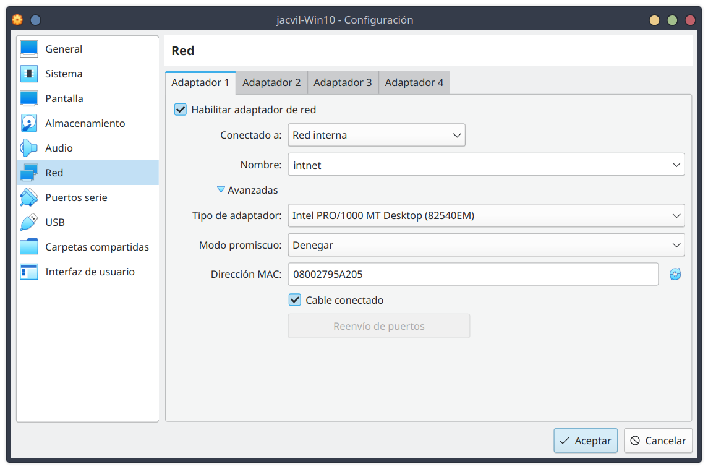{ width=60% }
        <figcaption>Network Device Configuration</figcaption>
    </figure>

    !!! note "Internal Network"
        In the course we will mainly use "***Internal Network***" to avoid downloading automatic updates that saturate the network. When we need to connect the virtual machine to the Internet we will add a second *NAT* type adapter.

## Starting and stopping a virtual machine

To start a virtual machine we must select it and click on **Start**

<figure markdown="span">
    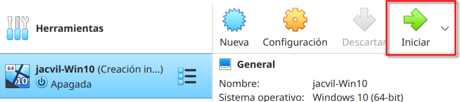{ width=70% }
    <figcaption>Start virtual machine</figcaption>
</figure>

If it is the first time we start it, we must insert a bootable media, typically an ISO image in the virtual CD/DVD drive.

<figure markdown="span">
    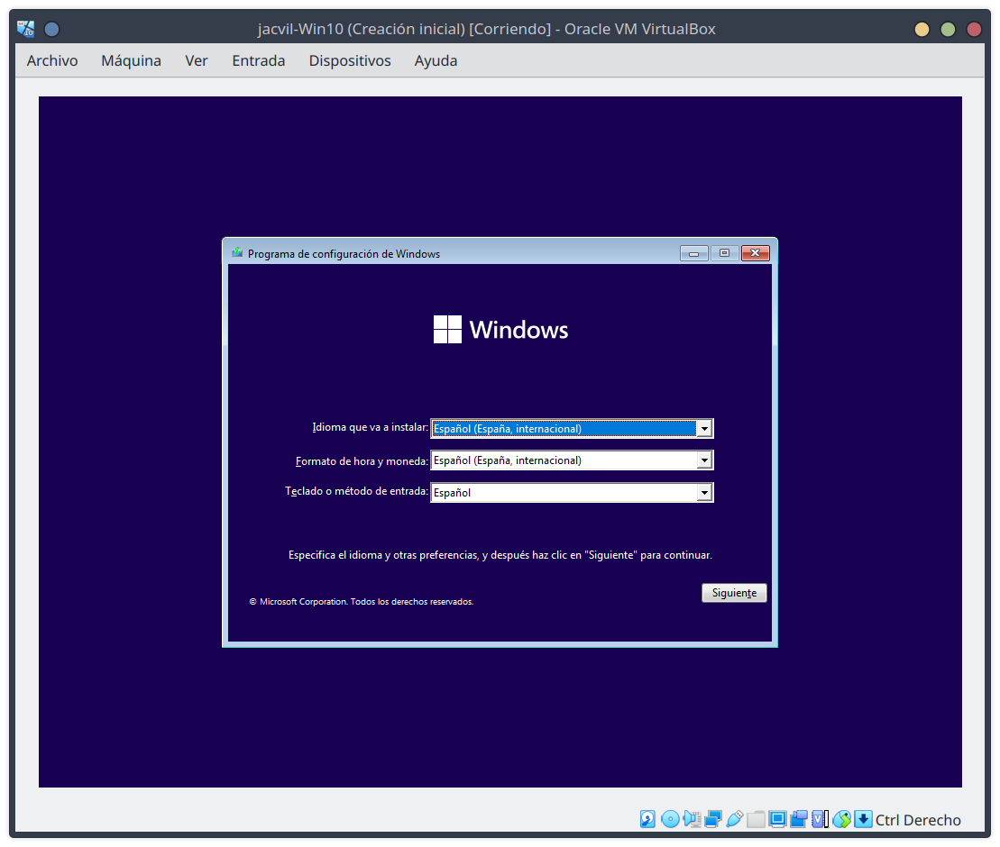{ width=90% }
    <figcaption>Virtual machine starting Windows installation ISO image</figcaption>
</figure>

The virtual machine runs within a window that, by default, shows an options menu at the top and a status bar at the bottom.

From this window we can configure different options.

To stop the virtual machine we can **use the option to shut down the guest operating system** or directly close the window, where a dialog with several options will be displayed.

<figure markdown="span">
    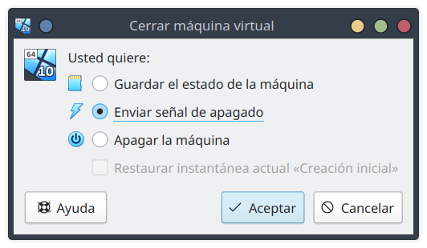{ width=100% }
    <figcaption>Virtual machine stop</figcaption>
</figure>

- **Save the state of the machine**. It would be similar to hibernating an operating system, it closes the virtual machine, saving the current state, and then continues working where we left off. If we close this way we will not be able to modify the virtual machine configuration.
- **Send shutdown signal**. It sends a shutdown signal (*ACPI shutdown*) so that the guest operating system starts the shutdown sequence. This is the recommended way to shut down the virtual machine.

- **Shut down the machine**. It is the equivalent of disconnecting the power of a computer, popularly known as "*push button*". We should avoid this option unless the virtual machine has crashed and there is no other option, because, as with a real computer, we run the risk of data loss or corruption.

## The Host Key

VirtualBox defines a **Host key**, which is associated with the **`Right Ctrl`** key by default.

The Host key has several functions. Its main function is to release the mouse and keyboard input from the guest and return it to the host. Therefore, if we see that we cannot exit the guest system window, pressing this key will give us control again.

Another function is to simulate the `Ctrl` + `Alt` combination, which will allow us to send the sequence `Ctrl` + `Alt` + `Del` to the guest system by pressing `Host` + `Del`.

We can change the Host key in the preferences of VirtualBox.

## State management. Snapshots

*VirtualBox* offers a method to save the state of a virtual machine called **snapshots**. It can be used as a backup system for disaster recovery. This can be useful when we are doing tests and at the end we want to recover the initial state.

To access snapshot management, always with the virtual machine turned off, we will click on the "*hamburger*" type menu of the virtual machine we want to manage and select "**Snapshots**"

!!! warning
    We must be careful and limit the number of snapshots since they take up a lot of disk space. When we no longer need a snapshot, it is advisable to delete it.

<figure markdown="span">
    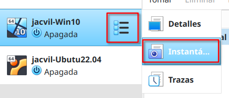{ width=100% }
    <figcaption>Access to snapshot configuration</figcaption>
</figure>

The view will change to the snapshot manager.

<figure markdown="span">
    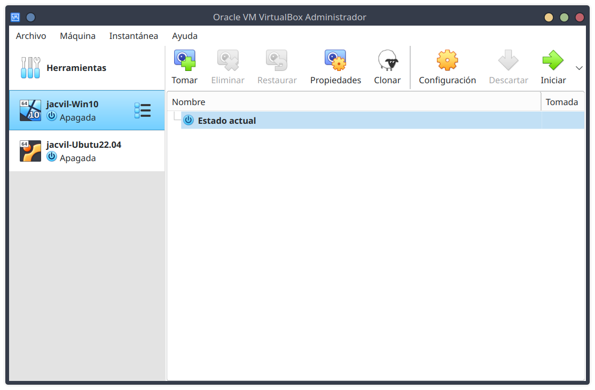{ width=65% }
    <figcaption>Snapshot Manager</figcaption>
</figure>

Snapshots will always be created from the current state of the virtual machine, by pressing the "Take" button.

We will put a name and an appropriate description.

<figure markdown="span">
    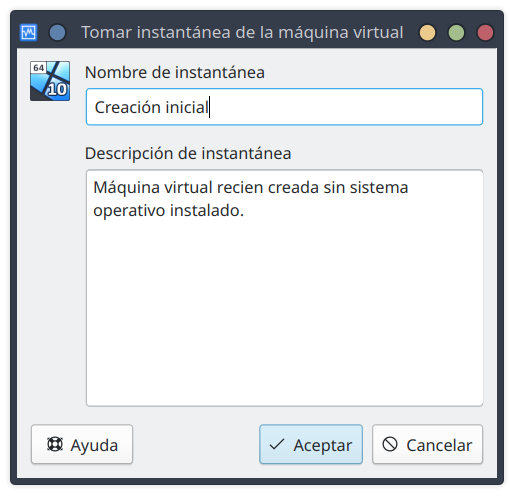{ width=75% }
    <figcaption>Take new snapshot</figcaption>
</figure>

Once we have created snapshots we can delete or restore them.

The snapshot restoration, by default, offers the possibility of making another snapshot of the current state, if we do not take this into account, we may end up with quite a few snapshots that we do not know which state they belong to.

<figure markdown="span">
    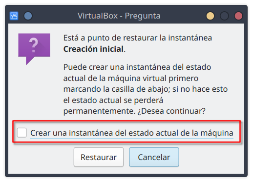{ width=100% }
    <figcaption>Restore a snapshot</figcaption>
</figure>

## Exporting a virtual machine

VirtualBox can export and import virtual machines using the **OVA** (*Open Virtual Appliance*) format. The OVA format is supported by different virtual machine software.

To export a virtual machine, we must select it and, in the top menu, go to "**`File` > `Export virtualized service...`**"

<figure markdown="span">
    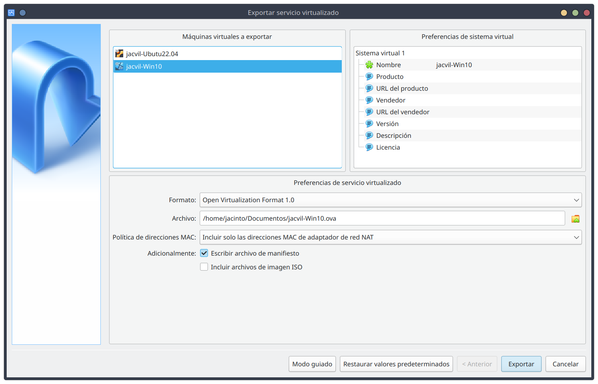{ width=95% }
    <figcaption>Exporting a virtual machine</figcaption>
</figure>

## Importing a virtual machine

To export a virtual machine, we must select it and, in the top menu, go to "**`File` > `Import virtualized service...`**"

<figure markdown="span">
    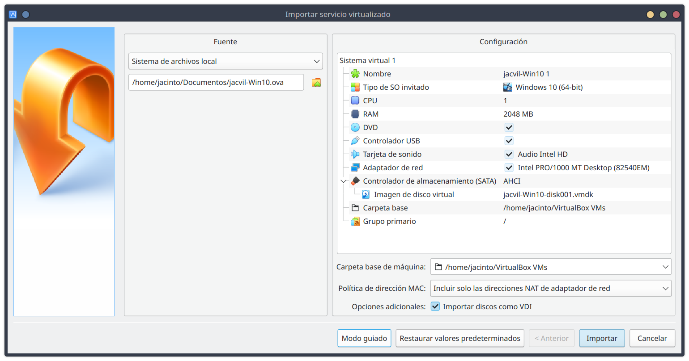{ width=95% }
    <figcaption>Importing a virtual machine</figcaption>
</figure>

## Cloning virtual machines

We can create a complete copy or a link to an existing virtual machine.

To make a clone, right-click on the virtual machine and choose the option **Clone...**.

An options dialog will appear where you must indicate the name of the copy, the location and the type of clone, among others.

- **Full clone**. Makes a copy of the virtual machine files to a new directory.
- **Linked clone**. Creates a copy of the virtual machine but uses the same virtual storage files.

<figure markdown="span">
    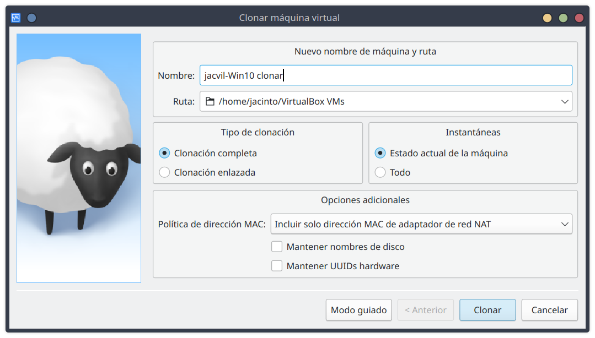{ width=75% }
    <figcaption>Clone a virtual machine</figcaption>
</figure>

## Grouping virtual machines

When we have been using VirtualBox for a while, it is normal to find ourselves with different virtual machines created.

For better organization we can create groups, like folders in the file system, where we can organize the machines.

- **Create new group**. By right-clicking on a machine we can group it.
- **Rename group**. By right-clicking on a group we can rename it.
- **Change group**. We can drag and drop the machines to change their group.
- We can collapse and expand the groups.

!!! note ""
    In this course and in general in all the courses, quite a few virtual machines are usually used. For better organization, it is advisable to group them by module (_SOM, MME, AOF, RLO, etc._).

<figure markdown="span">
    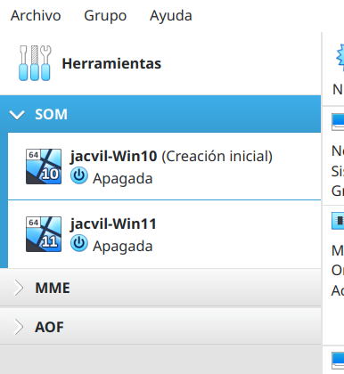{ width=100% }
    <figcaption>Example of grouped virtual machines</figcaption>
</figure>

## Delete virtual machine

To delete a virtual machine, right-click on it and choose "**Delete...**". A dialog box will appear with the following options:

<figure markdown="span">
    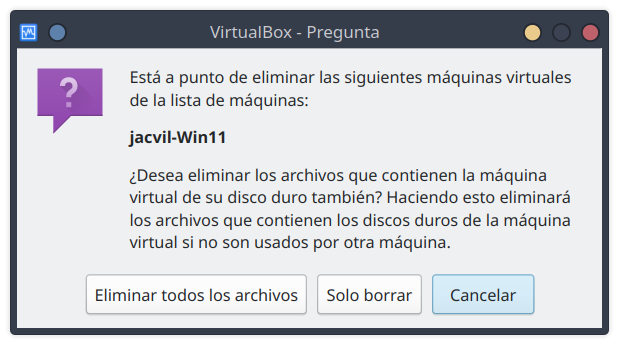{ width=90% }
    <figcaption>Delete virtual machine</figcaption>
</figure>

- **Delete all files**. Deletes the virtual machine and all associated files, including virtual disks.
- **Delete only**. Does not delete the files, only the entry in the hypervisor.

## Virtual storage media management.

If we do not manage virtual machines correctly, they may start to take up a lot of disk space.

!!! warning ""
    Sometimes, orphaned virtual hard disks remain without an associated virtual machine.

To manage virtual storage media, go to "**`File` > `Virtual Media Manager`**"

<figure markdown="span">
    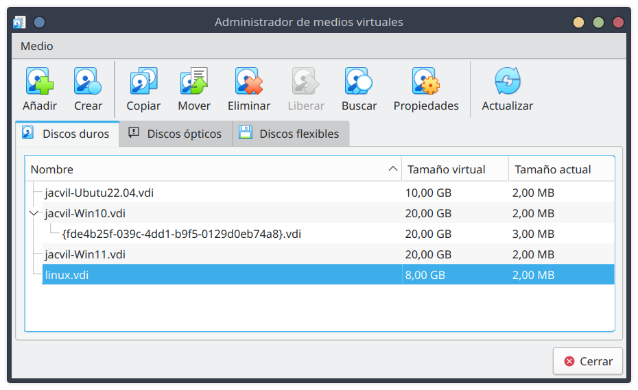{ width=75% }
    <figcaption>Virtual Media Manager</figcaption>
</figure>

## Virtual machine portability

Another way to work with virtual machines is to store the files on an external storage medium.

!!! note
    This will be very useful in the course, to be able to work in the classroom and at home with the same virtual machine. In addition, we will avoid consuming local storage space or have a backup copy in case of data loss on the classroom PC.

To do this, we must have the virtual machine files on an external storage medium (*preferably a USB3 SSD external storage*). We achieve this by directly creating the virtual machine on the external medium or by making a copy of the original files.

To add a virtual machine to VirtualBox, in the top menu, we must go to "*`Machine` > `Add...`*", it will link the files to the hypervisor and we will be able to work with the machine.
