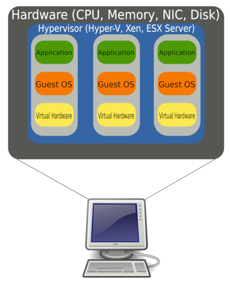
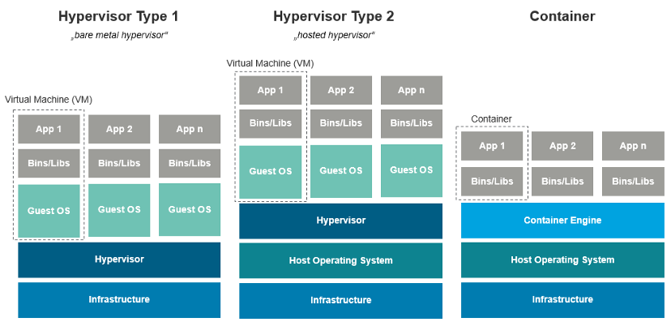

# Unit 2: Virtualization systems

**Virtualization** is a technology that allows software to **simulate resources**. In a fully virtualized environment, each operating system has the illusion of residing on an individual machine with all hardware resources entirely available to it.

To achieve **hardware virtualization**, a program called **hypervisor** or **virtual machine monitor** is needed to manage the use of the hardware, each **virtual machine** is called a **guest**. The hypervisor is responsible for **creating** and **managing** the virtual machines, ensuring that each one has the necessary resources to operate.

Each of the **virtual machines** can be assigned hardware resources through different configurations. Among the resources that can be shared are: RAM, CPU, storage drives, network cards, etc. On each of these machines we can install an independent operating system and its applications. Thus, for example, when a virtualized operating system believes that it is writing to a real hard disk, it is actually writing to a file, managed by the virtual machine, that simulates said hard disk.

!!! note
    Virtualization allows multiple guest operating systems to run simultaneously on a single computer by sharing available physical resources such as the processor, memory, storage drives, and other input/output devices.

The main **advantages** of virtualization are:

- **Cost reduction** and **Energy savings**: by reducing the number of physical machines.
- **Optimization of resources**: by sharing hardware resources.
- **Isolation**: each virtual machine is isolated from the rest, so that if one fails, the rest continue to operate.
- **Flexibility**: it is possible to create, delete, move, or resize virtual machines.
- **Security**: it is possible to create a virtual machine for each service, so that if one is compromised, the rest are not affected.
- **Education**, **testing** and **development**: it is possible to create a virtual machine to test new software or configurations without affecting the rest of the system.
- **Backup and recovery**: it is possible to create snapshots of the virtual machines to recover them in case of failure.

!!! note "VPS in the cloud"
    A real use case of virtualization is the use of **virtual private servers** (_VPS_) in the cloud.
    
    In this case, a physical server is divided into several virtual servers, each with its own operating system and applications. This allows the users to have a server with the necessary resources without having to buy and maintain a physical server.

!!! note "Cloud gaming"
    Another use case of virtualization is **cloud gaming**. In this case, the game is executed on a server in the cloud, and the user interacts with it through a client that sends the user's commands to the server and receives the images generated by the game. This allows the user to play games with high hardware requirements on a device with low hardware requirements.

    Some examples of cloud gaming services are:
    
    - [NVIDIA GeForce Now](https://www.nvidia.com/en-us/geforce-now/)
    - [Xbox Game Pass Ultimate](https://www.xbox.com/en-us/xbox-game-pass/ultimate)
    - [PlayStation Plus Premium](https://www.playstation.com/en-us/ps-plus/)
    - [Amazon Luna](https://luna.amazon.com/)

## 2.1. Virtualization concepts

The most important concepts to understand what virtualization is are:

- **Host** system.
- **Guest** system.
- **Hypervisor** or _**Virtual Machine Monitor**_ (_VMM_).
- **Virtual Machine** (_VM_).
- **Container**.

- **Host** system, is the operating system of the computer in which we install our *virtualization software* and which will assign or lend certain hardware resources to the *virtual machine* that we create.

- **Guest** system, is the operating system that we install in the *virtual machine* that we have created, using our *virtualization software* and to which we have assigned certain hardware resources to operate.

- **Hypervisor** or _**Virtual Machine Monitor**_ (_VMM_), is the software responsible for creating an **abstraction layer** to communicate the real machine with the *virtual machines*. Its mission is to assign computing resources to the virtual machines as they are needed.

- **Virtual Machine** (_VM_), is an **instance** of virtualized hardware.

- **Container**, is a **lightweight** and **portable** software package that includes everything needed to run an application: code, runtime, system tools, system libraries, and settings. Containers are isolated from each other and from the host system, but they share the kernel of the host system.

<figure markdown="span">
    { width=90% }
    <figcaption>Logical diagram of full virtualization. @wikipedia</figcaption>
</figure>

### 2.1.1. Types of virtualization

We will study **three types** of virtualization:

- Virtualization with **native** hypervisor, _**type 1**_ or _**bare metal**_.

    The hypervisor runs directly on the computer equipment. The hypervisor itself acts as a kind of operating system oriented to manage virtual machines, gaining greater control and obtaining better performance. Mainly used in professional environments and servers.

- Virtualization with **hosted** hypervisor, _**type 2**_.

    The hypervisor software is installed on a host operating system. It offers lower performance than native hypervisors because it is affected by the host system. They are aimed at test, teaching or home environments.

- Virtualization based on **containers**.

    Also known as **operating system-level virtualization** or **application containerization** or **containerization**.

    The containers **share** the **host operating system's kernel** and are therefore **more lightweight** than virtual machines. They are used to **run applications** in an **isolated virtual environment**.
    
    The most popular containerization software is **Docker**.

<figure markdown="span">
    { width=90% }
    <figcaption>Types of virtualization. @wikipedia</figcaption>
</figure>

!!! note
    In this course we will focus on hosted hypervisors type 2.

The hypervisor hosts the guest. A host can have multiple guests and the guests must not interfere with each other or the host. Guest operating systems run within a Virtual Machine.

To build the virtual machine we need to allocate certain hardware resources, such as hard disk space, RAM, number of processors, etc. that the host will give up or share with the guest.

The **hardware requirements** for a computer running virtual machines will vary depending on a number of factors, including:

- The virtualization software installed on the host computer.
- The number and type of guest operating systems.
- The applications you plan to run on the guest operating systems.
- The applications you plan to run, simultaneously with the guest systems, on the host computer.

## 2.2 Advantages and disadvantages of virtualization

### 2.2.1. Advantages

- **Utilization of existing resources**, allowing for their shared use. Before virtualization, it is common for the resource usage rate to not exceed 50%, in fact, it is very common for it not to exceed 15%.

- **Reducing the costs** of data centers by reducing their physical infrastructure. This results in a lower need for space and a reduction in energy consumption and cooling needs, which, in addition to saving money, contributes to improving the environment.

- **Streamlining administration**, since more advanced tools are available. In addition, we can have all the processing capacity grouped into several physical servers, between which a **dynamic balancing** of the virtual machines takes place, **centrally managing** all the computing capacity, memory, storage, network, etc., and guaranteeing that each virtual machine runs on the most suitable *host* at all times.

- **Fragment services**, instead of having a large server that centralizes all the company's services, we can define small virtual servers, each of them specialized in a specific service (*a web server, a print server, a telephone switchboard server, etc.*). In this way, the administration of each of them is simplified and possible unwanted interrelations are avoided.

- **Isolation** between the different virtual machines, which will mean that a failure in one of them will not affect the rest.

- **Increase availability**, since backup and cloning mechanisms for complete virtual machines can be used to migrate them to different hardware, eliminating downtime and immediately recovering from any problem. Sometimes, the migration from one system to another can even be done hot (without stopping the host and without stopping offering service).

- Increase the **flexibility of the implementation**, to respond more quickly to possible changes that need to be made. For example, we can add resources to virtualized servers quickly and easily.

- **Create test environments** that allow new solutions to be tested before they can affect the rest of the infrastructure.

- Administer and manage secure desktop systems that are accessible to users locally or remotely from almost any client-side computer.

### 2.2.2. Disadvantages

**Disadvantages** include:

- Many virtual systems may **depend on a single physical computer**, requiring additional measures to ensure data integrity.
- The **performance** of systems is limited by sharing physical resources.
- **Compatibility** problems may arise with virtualized hardware.

## 2.3. Virtualization software

When we talk about virtualization software, we have a wide range of possibilities among which we can find very different options, both in terms of the type of virtualization and the manufacturer.

For this reason, below we will review the most common tools:

- **Native hypervisors**, type 1 or *bare metal*:
    - **VMware ESXi**. Produced by *WMware Inc*, it is one of the company's different virtualization solutions.
    - **KVM** (***Kernel-based Virtual Machine***). It is a virtualization module for the *Linux* kernel that allows the kernel to act as a hypervisor. It can be run on any architecture supported by *Linux* (*Intel*, *ARM*, *PowerPC*, )
    - **Citrix Hypervisor** (***XenServer***). Virtualization software from *Citrix Systems, Inc*. Optimized for desktop workloads and virtual applications based on the *Xen Project* hypervisor, an open source hypervisor developed by the University of Cambridge.
    - **Microsoft Hyper-V**. Developed by *Microsoft* for systems based on *Intel* type processors.
- **Hosted hypervisors**, type 2:
    - **VMware Workstation**. It is a hypervisor for *Windows* and *Linux* systems that allows users to configure virtual machines. There is a paid version (*Pro*) and a free version (*Player*) aimed at personal use.
    - **Parallels Desktop**. For *Apple Mac OS X* operating systems.
    - **Oracle VM VirtualBox**. Easy-to-use and free software under a *PUEL* license for personal use and evaluation. It runs on *Intel* processors running Windows, Linux, macOS or Solaris operating systems.

## 2.4. VirtualBox

**Oracle VM VirtualBox** is a free and open-source hosted hypervisor for x86 virtualization, developed by *Oracle Corporation*. It is installed on an existing host operating system as an application; this host application allows additional guest operating systems, each known as a Guest OS, to be loaded and run, each with its own virtual environment.

VirtualBox can be installed on a variety of host operating systems, including *Linux*, *macOS*, *Windows*, *Solaris*, and *OpenSolaris*. It supports the creation and management of guest virtual machines running versions and derivations of *Windows*, *Linux*, *BSD*, *OS/2*, *Solaris*, *Haiku*, and *OSx86*, as well as limited virtualization of macOS guests on Apple hardware.

### 2.4.1. Installation

On the official *Oracle VM VirtualBox* page [**www.virtualbox.org**](https://www.virtualbox.org/) we can consult the manual, technical requirements, installation guide and download the version appropriate to our operating system.

### 2.4.2. Enable virtualization in the BIOS

Intel and AMD processors provide technologies that optimize the virtualization process. To use them, you need to activate them in the system's BIOS or UEFI.

The first thing to do is to check that the processor supports virtualization. You can find out by checking the processor's technical specifications in the manufacturer's manual.

To activate it, you need to enter the computer's BIOS or UEFI configuration. To do this, you need to check the motherboard manufacturer's manual. When you start the computer, you need to press the key, usually the `DEL`, `F2`, `F12` or `ESC` key.

Go to the section indicated in the manual, which could be "*System configuration*", "*Advanced*" or similar, and look for an option that says "_Intel VT_", "_VT-x_", "_Virtualization Technology_", "_AMD-v_", etc. (the name may vary depending on the manufacturer) and activate it.
