# Unit 3: Installation of Operating Systems

The **installation** of an operating system is a **process by which the operating system is transferred to the computer in order to be configured and prepared for use**.

The **process** of installing an operating system is divided into the following phases:

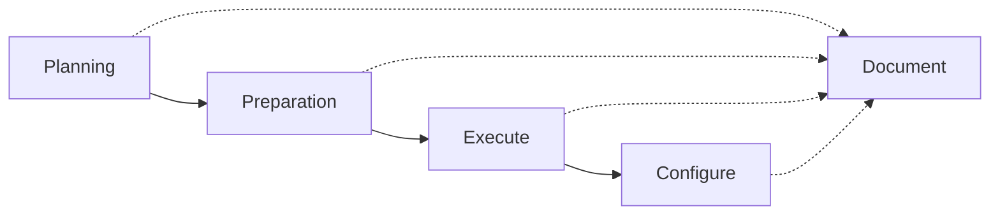
```mermaid
graph LR
    A[Planning] --> B[Preparation]
    B --> C[Execute]
    C --> D[Configure]
    A -.-> E[Document]
    B -.-> E
    C -.-> E
    D -.-> E
```

- **Planning the installation**.

    In this first phase we must consider some decisive factors for the installation, such as the **selection of the operating system**. It will also be necessary to check that the computer where the operating system will be installed meets the **technical requirements**.

- **Preparation for installation**.
    
    After planning and checking the technical requirements of the operating system, it is necessary to determine a series of parameters that will affect the selected operating system, such as the **partitions** that we will make, the **file system** that we will use and the **disk formatting** process.

- **Executing the installation**.
  
    In this phase we will follow all the steps of the installation wizard to install the operating system on the hard drive.

- **Installation configuration**.
  
    Once the operating system is installed, we will configure some parameters, such as the location, time zone, users, etc. We will also take the opportunity to install and configure the basic applications that we want to have.

- **Installation documentation**.
  
    Document the entire process. There is no need to wait until the last minute to write the documentation, it is better to do it on each phase.

## Installation planning and preparation

Before installing an operating system, it is necessary to plan the installation. This planning will help us to know the requirements of the operating system and the hardware where it will be installed.

There are a series of factors that need to be taken into account and analyzed carefully. Among others:

- **OS Selection**
    - System Purpose
    - Technical Requirements
    - Application Compatibility
    - Technical Support
    - Security
    - Price
    - License
- **Technical Requirements**
    - Processor
    - RAM
    - Hard Drive
    - Graphical Card
- **Backups** of Old Data
- **Installation Medium**
    - ISO Image, CD/DVD
    - USB External Storage
    - Network. PXE
- **Storage and Partitions**
    - Partition Table:
        - MBR. BIOS 32-bit
        - GPT. UEFI 64-bit
    - Disk Partitioning and Formatting. NTFS, FAT, etc.
- **Boot Loader**
    - Default
    - Custom
- **Installation Type**
    - Typical, with step-by-step wizard
    - Unattended, without user intervention
    - Advanced, for multiple systems on the same computer
    - Image from a previous clone
    - Via network, from a server to multiple computers

### OS Selection

- **System purpose**. This is the function that the system will perform, and it will depend on whether we want to use the computer as a server, a desktop computer, a laptop with a touch screen, etc.
- **Technical requirements**. The operating system must be compatible with the hardware of the computer where it will be installed.
- **Application compatibility**. The functionality of the computer can be very varied, from running applications that require few requirements to high-powered computers that run graphical applications.
- **Technical support**. With the installation of a current operating system we receive support directly from the company and updates that keep the computer updated until the end of its useful life.
- **Security**. Depending on the chosen operating system we will find different security measures. The most common are two-step authentication to protect user accounts or biometrics, secure storage of user credentials, inability to install applications that are not digitally signed, etc.
- **License**. Operating systems have different types of licenses, such as proprietary, open source, etc. The license will determine the use that can be made of the operating system.
- **Price**. The price of the operating system is a factor to consider when choosing an operating system. There are free operating systems and others that have a cost.

!!!note "Proprietary Operating Systems"
    *Proprietary* operating systems are those in which users have limited possibilities of modification, adaptation and distribution and where their license of use normally has an associated cost. In many cases, these proprietary operating systems come pre-installed from the factory with the equipment we buy, and although it may seem that we do not pay for them, we do, since the price is included in the total price of the system.

### Technical requirements

All operating systems have **technical requirements** that must be met in order to install them on the computer. To find out what they are, we must consult the **official website**.

These requirements usually refer to the **processor**, the **RAM**, the **secondary storage** capacity and the **graphics card** of the computer.

Most operating systems establish **minimum requirements** that must be met in order to install them on the computer and **recommended requirements** that will allow the operating system to work optimally.

Other operating system requirements in terms of functionality and features may include an Internet connection to take advantage of some of the features, microphones to activate voice recognition, touch screen equipment to activate touch mode or biometric equipment for authentication, among others.

### Backup

If the computer we are installing on contains data from a previous installation, it is important to back up any information we need to preserve. Problems may arise during the installation process that could delete or make them inaccessible.

In order to backup important information, we can manually copy it to an external device or use a backup or cloning tool.

### Installation medium

To install an operating system, we need an installation medium.

There are different formats or mediums such as USB, CD/DVD or ISO image. Also, if we need to install on several computers at the same time, we can do a network installation of a cloned image from a server.

- **ISO Image**. It is a file that contains the installation of the operating system. It can be burned to a CD/DVD or copied to a USB stick.
- **CD/DVD**. It is a physical medium that contains the installation of the operating system. It is less common today.
- **USB External Storage**. It's the most common way to install an operating system.
- **PXE** (Preboot eXecution Environment). It is a standard that allows computers to boot from the network. It commonly used to install operating systems on several computers at the same time.
    - *Clonezilla is a good tool for cloning, backup and network installation*.

On virtual machines, the installation medium is usually an ISO image that is mounted on the virtual machine as a CD/DVD.

### Storage and partitions

Before starting the installation process of an operating system, it is necessary to decide how the hard drive will be organized. Depending on the operating system we decide to install, different partitions will be created and a specific file system will be used. The following factors must be taken into account:

- Partition schemes.
- File systems of proprietary operating systems.
- Formatting a disk.
- Cloning.

#### Partition schemes

In order to use an storage drive, we first need to create the necessary partitions and format them to prepare it for the operating system you want to install. This process will give the storage drive a structure that will allow to store the files and applications that are part of the selected operating system.

An storage drive must have at least one partition.

**Definitions:**

- **Partition Table**: A partition table is a **data structure** that **stores information about the partitions** on an storage drive. It is used by the operating system to **identify and access the partitions** on the storage drive.

- **Partition**: A partition is a **logical division** of an storage drive that allows you to **organize the information** stored on it. **Each partition can have its own file system**.

- **Volume**: A volume is a **logical unit of storage** that can be formatted with a file system. A volume **can be a partition**, but it can also be a **combination of partitions**.

- **File System**: A file system is a **method of organizing and storing files** on a storage drive. It is a **data structure** that allows the operating system to **access and manage files** on the storage drive.

- **Formatting**: Formatting is the process of **preparing a storage drive** to store information. It involves **creating a file system** on the storage drive so that the operating system can **read and write data** to it.

Before dividing it into different partitions and formatting an storage drive, we need to use a scheme known as a **partition table**.

**Types of partition tables:**

- **MBR** (*Master Boot Record*). This standard emerged in 1983 and is the most well-known style of tables, and it is still functional today. In this system you can only have *four primary partitions or three primary partitions and one extended partition*. We cannot create partitions larger than 2TB.
- **GPT** (*GUID Partition Table*). This is the current standard that replaces *MBR* in 64-bit systems and that arrived in 2000 with the new systems with unified extensible firmware interface (*UEFI*), which replaces the old *BIOS* systems. In this system, each partition has a **globally unique identifier** (*GUID*) and there is **no limit on the number of partitions** that can be created beyond the limit established by the operating systems themselves.

!!!note "Hard disk management tools"
    We can find different applications that will allow us to manage the partitions on our hard disk, such as:

    - *GParted*
    - *Partition Magic*
    - *Paragon Hard Disk Manager*
    - *Disk Director*
    - *Acronis Disk Director*
    - *AOMEI Partition Assistant*
  
    With these applications we can **create** partitions, **resize**, **format** and even create **images** of the partitions.

In **MBR**, three types of partitions can be created:

- **Primary partition**. These are the primary divisions of the disk.
  
    There can only be four primary partitions or three primary and one extended. It is in this type of partition where operating systems are usually installed.

- **Extended or secondary partition**.
  
    This is a type of partition that is used to contain different logical partitions within it.
    
    There can **only be one extended partition per disk**, and it is only **used to contain logical partitions**. It is not used to store data.

- **Logical partition**.
  
    These types of partitions **are found within the extended partitions** and function as different units with their own file systems.
    
    We can occupy all the space of the extended partition or only part of it. Theoretically we can have an unlimited number of logical partitions, although in practice this number is limited by the operating system.

!!!note "Partitions access in MS Windows"
    In *MS Windows* operating systems there is not just one directory hierarchy, but one for each accessible partition, so it is common to identify each of these hierarchies with a **drive letter**, although a system folder can also be assigned to access this partition. Thus, **partitions are represented by a letter** of the alphabet followed by the character "**`:`**", so the identifier of the root directory of a drive is `<drive letter>:\`. Some letters are reserved for special storage devices such as `A:` and `B:` for floppy disk drives and **`C:`** for the first partition on the first hard disk, known as the **system partition**.

#### File systems

An operating system's file systems are standards designed to indicate how files are stored, distributed, and organized on storage devices (ssd, hard drives, optical discs, USB drives, etc.).

Each operating system uses its own file system, although there are file systems that are compatible between different systems. The file system that an operating system uses by default is called **native file system**.

The _MS Windows_ operating system supports different file systems, the most common of which are **FAT32** and **NTFS**.

**FAT** is the acronym for file allocation table. It was designed in 1977 by the Microsoft company. As disk sizes grew, this standard resulted in many variants: FAT12, FAT16, FAT32, and exFAT.

The FAT32 file system allows partitions of up to 16 TiB in theory, although currently the limitation depends on the operating system. The exFAT file system is theoretically 64 ZiB.

A disk with a FAT file system is divided into clusters, the size of which is determined by the size of the partition. When a file is created, an entry is generated in the allocation table and the first cluster number that contains data is set.

A cluster is the minimum storage size of a hard disk.

On the other hand, **NTFS** stands for _New Technology File System_. It was patented by Microsoft in 1993 and **has now become the native file system for _MS Windows_**, while the FAT file system is used on smaller devices such as memory cards and USB drives. This file system allows maximum partitions of up to 16 EiB theoretically, although the limitation currently depends on the operating system.

**NTFS** improves on the FAT file system by including improved support for metadata, providing more robust security, and improving performance by not relying on underlying hardware, since there is no special location on the partition to store the allocation table, which in this system is called the master file table and contains information about the files and directories stored on the partition. There is at least one entry in the master file table for each file.

**Metadata** is information that describes the characteristics of the data, such as the file name, the date it was created, the date it was last modified, the size of the file, the permissions, etc.

In the case of **GNU/Linux**, the most common file systems are **ext4**, **XFS**, **JFS**, **ReiserFS**, **Btrfs**, **ZFS**, etc.

**ext4** is the most used file system in GNU/Linux distributions. Allows partitions of up to 1 EiB and files of up to 16 TiB. It is a file system that has been optimized for performance and reliability.

#### Formatting a partition

Formatting a partition is the process of preparing it for use on our computer. When we format a partition we are creating a file system that can be read and written depending on the operating system we installed.

Formatting a partition will result in the **loss of all the information** contained on it.

### Boot loader

The boot loader is responsible for locating and loading operating system into main memory. If there are several operating systems installed, the user will select which one to start.

We can choose choose to use the default boot loader or install and configure custom one.

In _MS Windows_ operating systems, the BCD (Boot Configuration Data) database is used for systems not managed with BIOS. It is encrypted and requires administrator permissions to manage it, using the `bcedit` command or other graphical tools.

The `msconfig` tool allows you to manage the boot of different systems using a graphical interface.

In _GNU/Linux_ operating systems, the boot loader is usually **GRUB** (GRand Unified Bootloader). It is a boot loader that allows you to boot different operating systems installed on the computer. It is the most widely used boot loader in GNU/Linux distributions.

### Installation type

The installation type will depend on the needs of the user and the computer where the operating system will be installed. The most common types of installation are:

- **Typical installation**. This is the most common type of installation. It is a step-by-step installation wizard that guides the user through the installation process.
- **Unattended installation**. This type of installation is used when you want to install an operating system without user intervention. It is useful when you need to install the same operating system on multiple computers.
- **Advanced installation**. This type of installation is used when you want to install multiple operating systems on the same computer. It allows you to configure the partitions and file systems manually.
- **Image installation**. This type of installation is used when you want to install an operating system from a previously cloned image. This is useful when you need to install the same operating system on multiple computers or when you need to restore the operating system to a previous state.
- **Network installation**. This type of installation is used when you want to install an operating system from a server to multiple computers. It is useful when you need to install the same operating system on multiple computers at the same time.

### Cloning

If many computer systems need to be installed, the cloning technique will make our work easier. Cloning replicates an operating system installed on a source computer on one or more destination computers.

One of the most commonly used options by computer technicians who are dedicated to computer maintenance is cloning the information contained on hard drives. One way to automate the process of installing an operating system on a new machine, or moving the installation from one hard drive to another with a larger capacity on the same machine or on a different machine, is to clone an existing system.

Computer cloning is the process of making an **exact copy of the information** from one disk to another or from one partition to another. The objective of this process is to safeguard the information or to use the cloned information to be able to access it quickly and easily on other computer equipment.

**Applications:**

- **Deployment**. Install the same operating system on multiple computers without having to install it manually on each one.
- **Backup**. Create a backup copy of the operating system and all applications and documents on the hard drive in order to restore them in case of a failure.
- **Drive upgrade**. Move the operating system and all applications and documents from a smaller hard drive to a larger one.
- **Forensic analysis**. Create a copy of the hard drive to analyze it without altering the original data.

The computer tools used to clone computer systems are classified, based on their ability to access the operating system, into:

- **Clone storage device**. Exact copy of the hard drive. It's a bit-by-bit copy of the storage drive, including the partition table, the boot sector and all the partitions. It's agnostic to the file system.
- **Clone partition**. If we only want to clone a partition, we can use this tool. It's a bit-by-bit copy of the partition, including the file system.

It is also possible to clone virtual machines that contain operating systems inside. This type of cloning consists of making a copy of a virtual machine. The source machine of the copy is called the parent virtual machine, and the copy of the virtual machine is called the child virtual machine. Within virtual machine cloning we can talk about:

- **Complete virtual machine cloning**. This is a type of cloning in which the copy of a virtual machine is completely independent of the virtual machine from which it has been copied.
- **Linked virtual machine cloning**. This is a type of cloning in which the parent virtual machine and the child virtual machine share the same virtual disk.

## Installation

The installation of an operating system is a process that consists of transferring the operating system to the computer and configuring it so that it is ready for use.

The installation process is usually done through an installation wizard that guides the user through the installation process. The installation wizard will ask the user for information such as the language to be used, the time zone, the keyboard layout, the partitions to be created, the file system to be used, etc.

The installation process is divided into steps, some of which are optional and others are mandatory. The steps of the installation process may vary depending on the operating system being installed:

1. **Language selection**. The user must select the language in which the installation process will be carried out.
2. **Time zone selection**. The user must select the time zone in which the computer is located.
3. **Keyboard layout selection**. The user must select the keyboard layout to be used.
4. **License agreement**. The user must accept the license agreement of the operating system.
5. **Partitioning**. The user must create the partitions on the hard drive where the operating system will be installed.
6. **File system selection**. The user must select the file system to be used on the partitions.
7. **Installation**. The operating system is installed on the hard drive.
8. **Post-installation configuration**. Configure parameters after the installation process is completed, such as the location, time zone, keyboard layout, users, etc.
9. **Admin user creation**. The user must create an administrator user who will have full control over the computer.
10. **Installation completion**. The installation process is completed and the computer is ready after the installation medium is removed and the computer is restarted.

### Typical installation of _MS Windows 11_

In this section we are going to present a typical installation guide for _MS Windows 11_, valid for computers without a TPM module or virtual machines.

---

#### Language, regional and keyboard settings

Once we have started the system with the corresponding installation media, the first step is the language configuration. Three parameters are established: Language, reginal formats, and keyboard layout.

<figure markdown="span">
    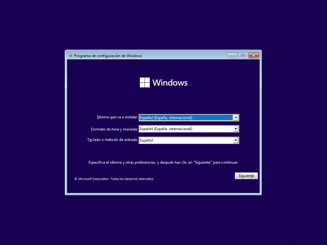{width=100%}
    <figcaption>Language, regional and keyboard settings</figcaption>
</figure>

---

#### Installation or repair

On the next screen, an "**Install now**" button appears, and at the bottom left the "***Repair your computer***" option appears, which we can use when the operating system presents an error.

<figure markdown="span">
    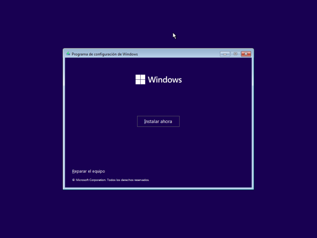{width=100%}
    <figcaption>Install or repair</figcaption>
</figure>

---

#### Product key

The wizard asks for the **product key**. If we do not have it at the moment, the "**I do not have a product key**" option allows us to continue with the installation. Later, it can be purchased and added to the operating system.

<figure markdown="span">
    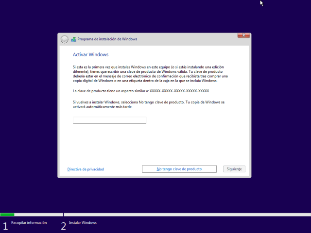{width=100%}
    <figcaption>Product key</figcaption>
</figure>

---

#### Windows version

Next, we must choose the version of Windows 11 that we want to install. The options may be different depending on the ISO image used. The chosen version must match the product key.

<figure markdown="span">
    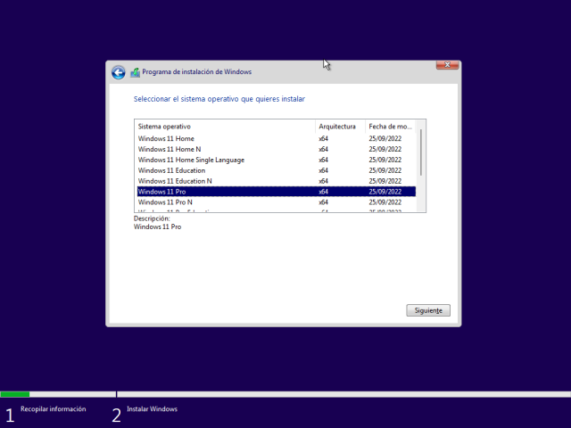{width=100%}
    <figcaption>Windows version</figcaption>
</figure>

---

#### Hardware compatibility

If your hardware does not meet the technical requirements, the following message will appear:

<figure markdown="span">
    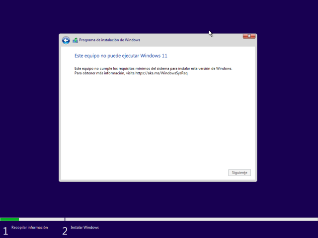{width=100%}
    <figcaption>Hardware not supported</figcaption>
</figure>

---

#### Bypass TPM, Secure Boot and RAM checks

In a virtual machine, the installation wizard may not allow us to continue because it detects that the computer does not have a TPM module.

> The **TPM module** is a hardware component that is used to store cryptographic keys and protect sensitive information. It is used to encrypt the hard drive and protect the operating system from unauthorized access.

> **Secure Boot** is a security feature that ensures that the operating system is not manipulated with during the boot process. It is a feature that is enabled by default on most computers that have a TPM module.

> **Ram Check** is a feature that checks the amount of RAM installed on the computer and ensures that it meets the minimum requirements of the operating system.

To bypass these checks, we must open the **command line** using the key combination **`Shift`**+**`F10`**, and execute the command *`regedit`*:

<figure markdown="span">
    {width=100%}
    <figcaption>Command line `Shift`+`F10`</figcaption>
</figure>

---

A new window will open with the **Registry Editor**.

<figure markdown="span">
    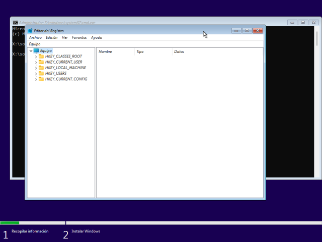{width=100%}
    <figcaption>Registry Editor</figcaption>
</figure>

In the registry editor we will display different categories of the tree that we find in the left panel. First, we will expand the key **`HKEY_LOCAL_MACHINE`**, inside it the key **`SYSTEM`** and, finally, **`Setup`**.

---

Next, we will **create a new `key`**, inside `Setup`, called **`LabConfig`**. To do this, we must right-click and select **`new >`** **`key`**

<figure markdown="span">
    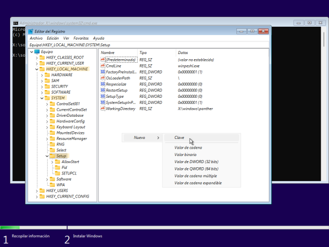{width=100%}
    <figcaption>Create new key</figcaption>
</figure>

---

A new item will appear with the title **`New key #1`**. Since the name is selected, just type **`LabConfig`** to change it. Be careful with the name, it is **case sensitive**.

<figure markdown="span">
    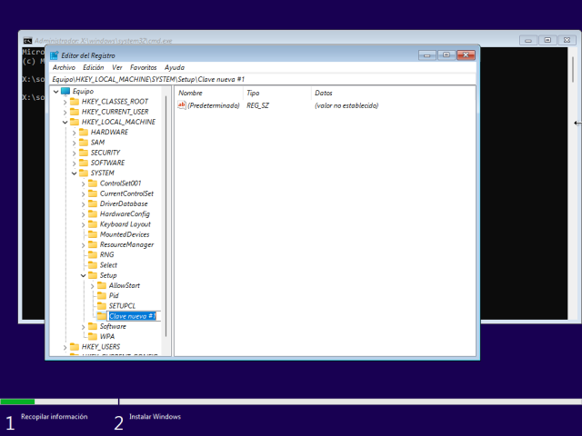{width=100%}
    <figcaption>Name the key, *LabConfig*</figcaption>
</figure>

---

Next, we will create three new entries for that key. To do this, we start by right-clicking on any free space in the right panel of the window. In the context menu that appears, choose **`New >`** and then ***`DWORD (32-bit) Value`***.

<figure markdown="span">
    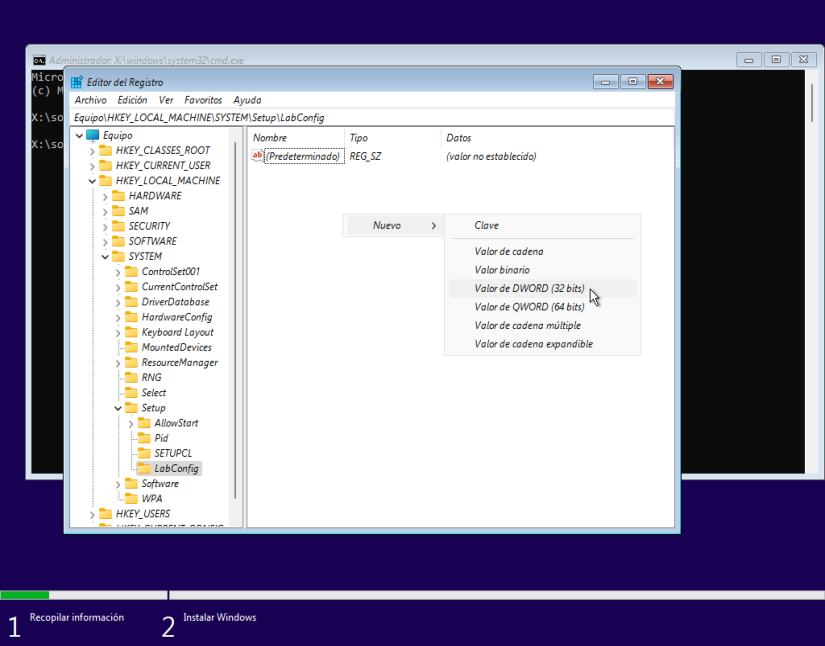{width=100%}
    <figcaption>New > DWORD (32-bit) Value</figcaption>
</figure>

---

A new entry will appear with the name **`New Value #1`**. Since the name is already selected, just start typing to change it.

<figure markdown="span">
    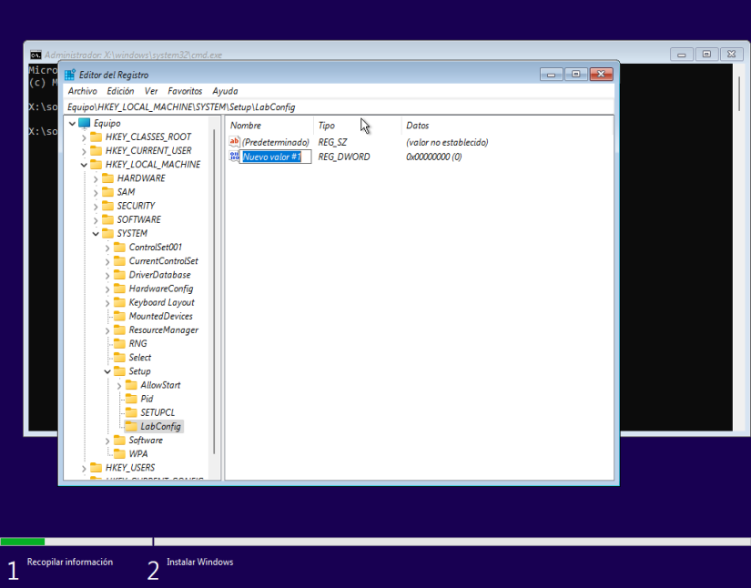{width=100%}
    <figcaption>Name New Value</figcaption>
</figure>

---

Specifically, we will type **`BypassTPMCheck`**.

<figure markdown="span">
    {width=100%}
    <figcaption>`BypassTPMCheck` Value</figcaption>
</figure>

---

By default, the value stored by the entry will be **`0`**. To change it, double-click on the name or, if it is still selected, press the `Enter` key again.

When you do this, a new window titled **Edit DWORD (32-bit) Value** will appear. In it, type the value **`1`** in the Value data field.

<figure markdown="span">
    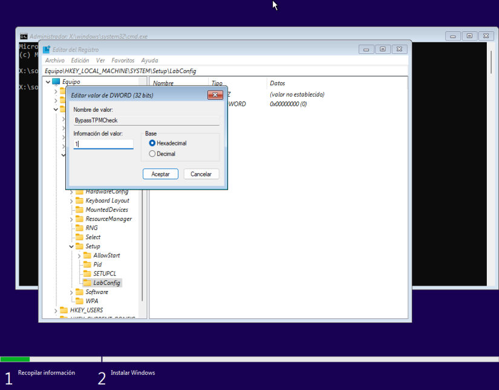{width=100%}
    <figcaption>Change value to 1</figcaption>
</figure>

---

Next, repeat the same steps to create two new values: **`BypassSecureBootCheck`** and **`BypassRAMCheck`**. Both should also have the value 1.

<figure markdown="span">
    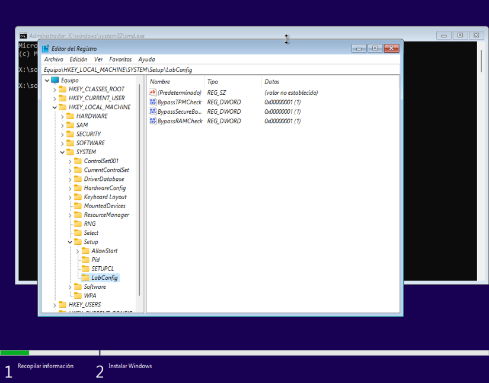{width=100%}
    <figcaption>BypassSecureBootCheck and BypassRAMCheck</figcaption>
</figure>

---

After this, we can now close the Registry Editor window and the Command Prompt window.

This leaves us in the same window we had at the beginning of this section.

Click on the back button in the upper left corner.

<figure markdown="span">
    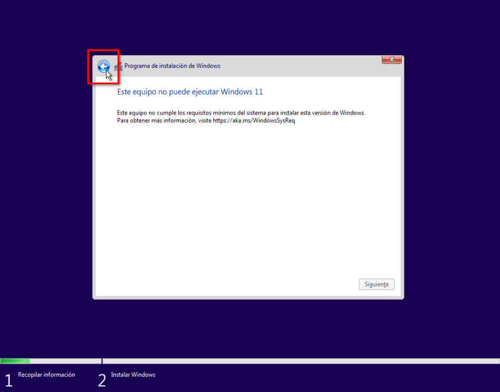{width=100%}
    <figcaption>Go back to the previous step</figcaption>
</figure>

This will take us one step back in the installation process. Once again, we make sure to choose the correct version of the operating system.

---

#### License Terms and Applicable Notices

If all goes well, this time we will pass the compatibility check of the installation wizard.

This will take us to the ***License Terms and Applicable Notices*** window. It is advisable to read the conditions carefully. If we agree with the license terms, we choose **`I accept`** the Microsoft software license terms.

<figure markdown="span">
    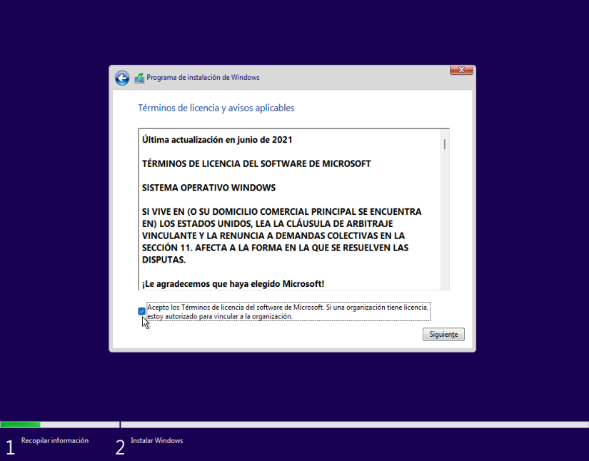{width=100%}
    <figcaption>Acceptance of License Terms</figcaption>
</figure>

---

#### Installation type

In the next step, we must indicate the type of installation we will perform, although, if we have started the installation from the installation DVD or USB stick (as is the case), we can only choose the option ***Custom: install Windows only (advanced)***, since, if what we intend is to update an existing installation, we should start the installation by inserting the installation media with the old system running. In this way, all the files, programs and settings that we already had will be preserved, saving us a good amount of work.

If we are going to update, we should make a backup of all important data before starting the process, since, if there is a problem during the update, we could lose all previous data.

<figure markdown="span">
    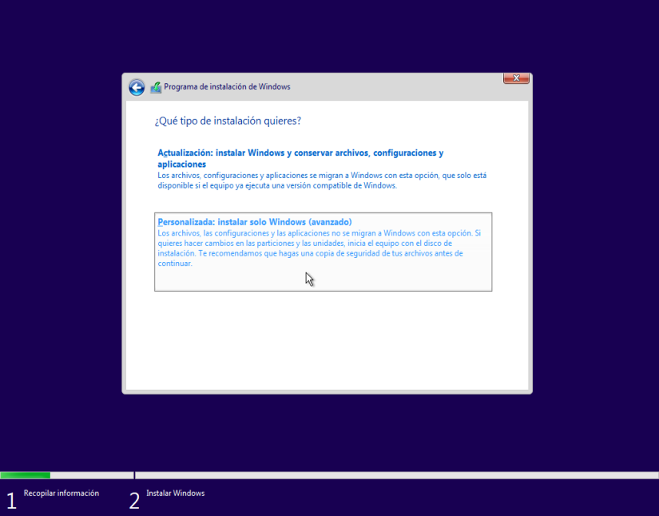{width=100%}
    <figcaption>Installation type</figcaption>
</figure>

---

#### Disk selection and partition configuration

Next, we can choose to allocate all the hard drive space for the installation of Windows 11. To do this, we would only have to click on the `Next` button. However, we also have different options to configure, to our liking, the disk (or disks) that we have installed.

<figure markdown="span">
    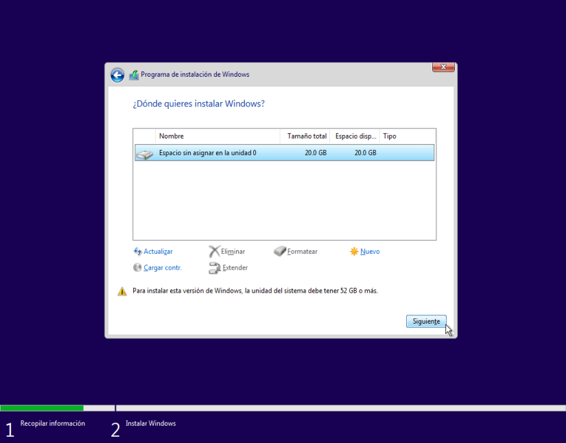{width=100%}
    <figcaption>Partition configuration and selection</figcaption>
</figure>

---

In the next step, the process of copying a series of files from the installation media to the computer's hard drive will begin, unzipping them and installing different components automatically. In addition, during the process, the system will restart several times.

<figure markdown="span">
    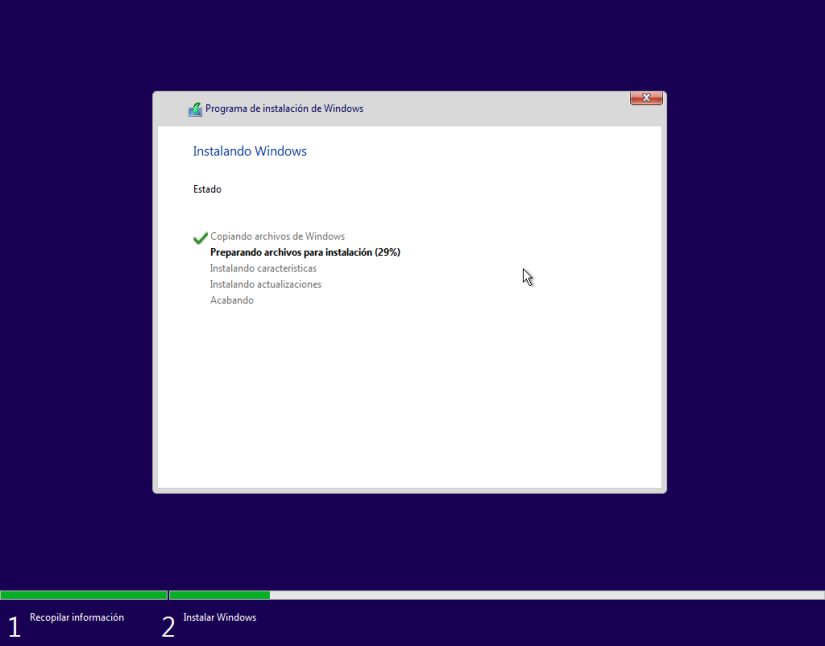{width=100%}
    <figcaption>Installation</figcaption>
</figure>

---

#### Installation progress

When the steps in the previous window are completed, the first reboot will occur.

<figure markdown="span">
    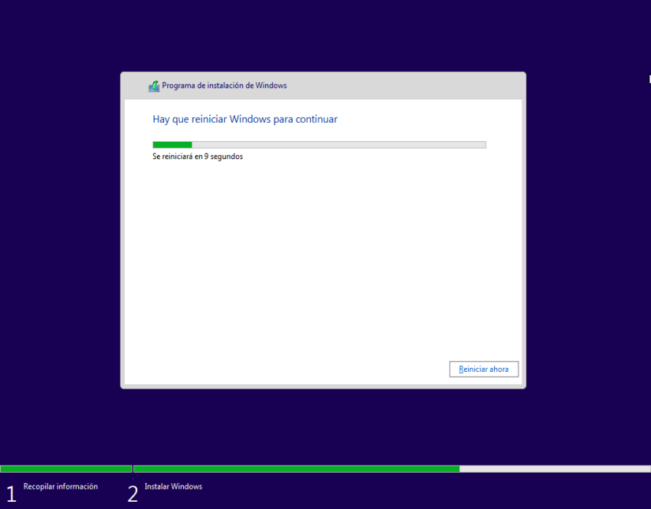{width=100%}
    <figcaption>Reboot</figcaption>
</figure>

---

A black screen will appear again with the circle of moving dots indicating that there is activity.

<figure markdown="span">
    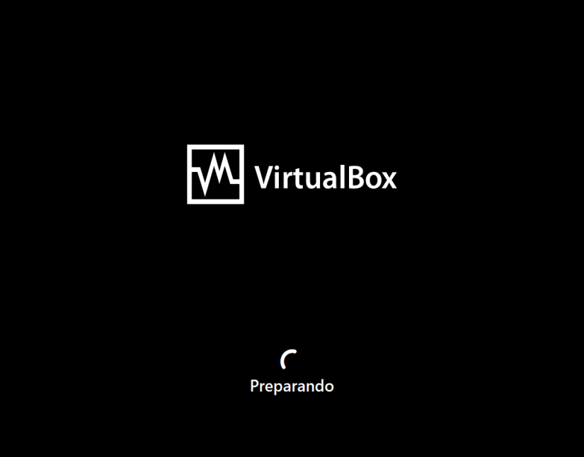{width=80%}
    <figcaption>Preparing...</figcaption>
</figure>

---

And finally, the system is prepared for its first boot.

<figure markdown="span">
    {width=80%}
    <figcaption>First boot</figcaption>
</figure>

---

#### System configuration

Shortly after, the installation wizard shows us, for the first time, its new appearance. It starts by checking our location. If it is not correct we choose the appropriate value.

<figure markdown="span">
    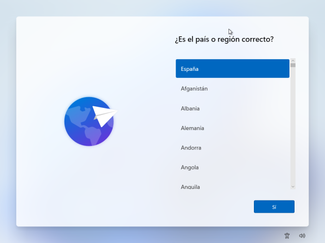{width=100%}
    <figcaption>Region</figcaption>
</figure>

---

The wizard then makes sure that the keyboard configuration is correct. If not, we choose the appropriate value.

<figure markdown="span">
    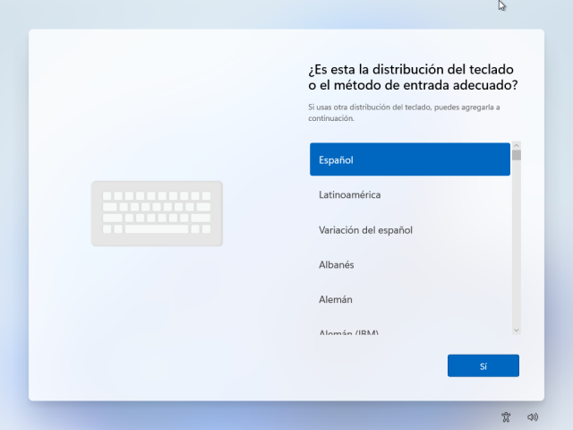{width=100%}
    <figcaption>Keyboard Layout</figcaption>
</figure>

---

Next, the wizard asks us if we want to add a new keyboard layout. This allows us to have multiple devices, with different layouts.

<figure markdown="span">
    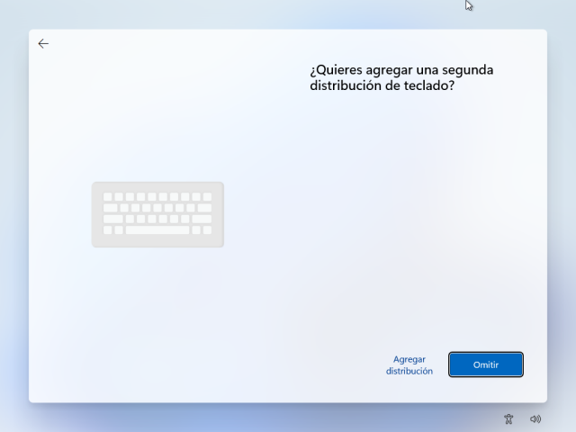{width=100%}
    <figcaption>Add second keyboard layout</figcaption>
</figure>

---

#### Internet connection

At this point, the installation wizard checks if it can get an Internet connection for possible system updates.

<figure markdown="span">
    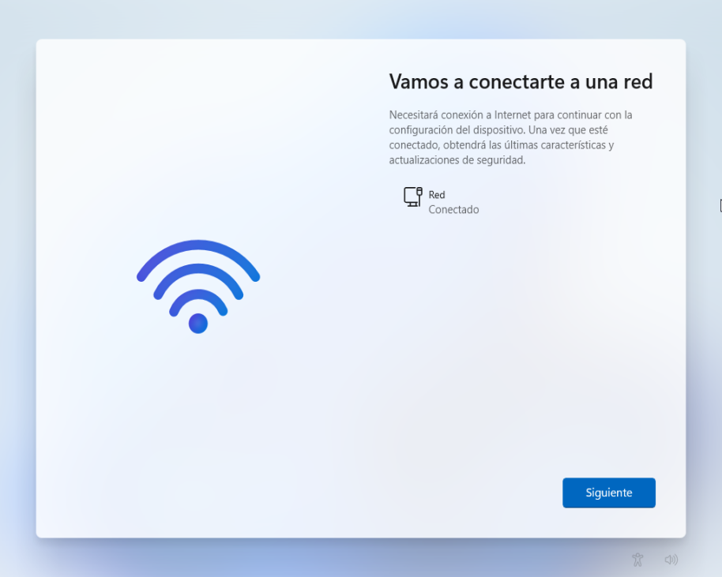{width=80%}
    <figcaption>Internet connection</figcaption>
</figure>

> **Optional: Bypass the Internet connection requirement**
> 
> Typical installation of _MS Windows 11_ requires an Internet connection to continue. If we do not have it (or we don't want to send your personal information to _Microsoft_), to bypass this step we need to open the command line with the key combination **`Shift`**+**`F10`** and execute the command **`oobe\bypassnro`**. A new option will appear `I don't have Internet` that will allow us to continue the installation by selecting **`Continue with limited setup`**.

---

#### Computer name

After this, the wizard asks us for a **name for the computer**. We must choose something descriptive, because this will be the **name by which the computer will be known on the network**.

We can write up to 15 characters, cannot be only numbers, or contain spaces, or any of the characters that are indicated on the screen.

<figure markdown="span">
    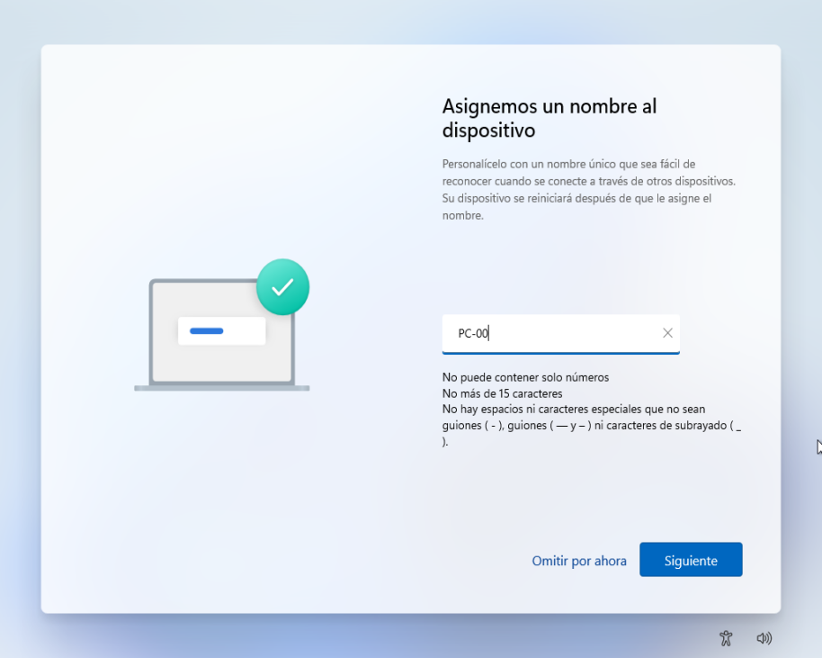{width=80%}
    <figcaption>Computer name</figcaption>
</figure>

A new reboot will then occur, to set the values ​​entered so far.

---

#### Account type

Once we are back in the installation wizard, we will have the opportunity to choose the type of account with which we will start the computer:

- **Configure for personal use**: A _Microsoft_ account is used to authenticate us in their cloud. This account must already exist and may need our phone number or other data. We can use it on different devices and synchronize both its settings and its files.

- **Configure for professional or educational use**: we can create a local account or join the computer to a company domain or other network resources.

In our case, we will choose this second option.

<figure markdown="span">
    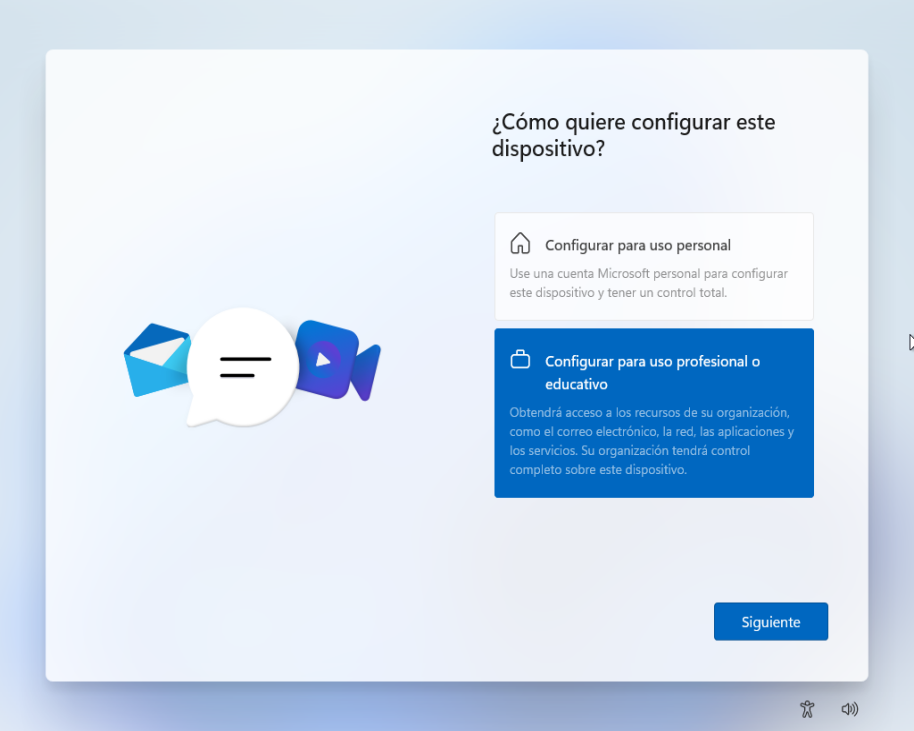{width=85%}
    <figcaption>Account Type</figcaption>
</figure>

---

The following steps will be aimed at completing the configuration we have chosen in the previous step. If "Personal Settings" has been chosen, these may vary slightly.

However, in the next step, _Microsoft_ tries again, offering us the possibility of logging in with a Microsoft account. We also have the opportunity to log in with a security key.

<figure markdown="span">
    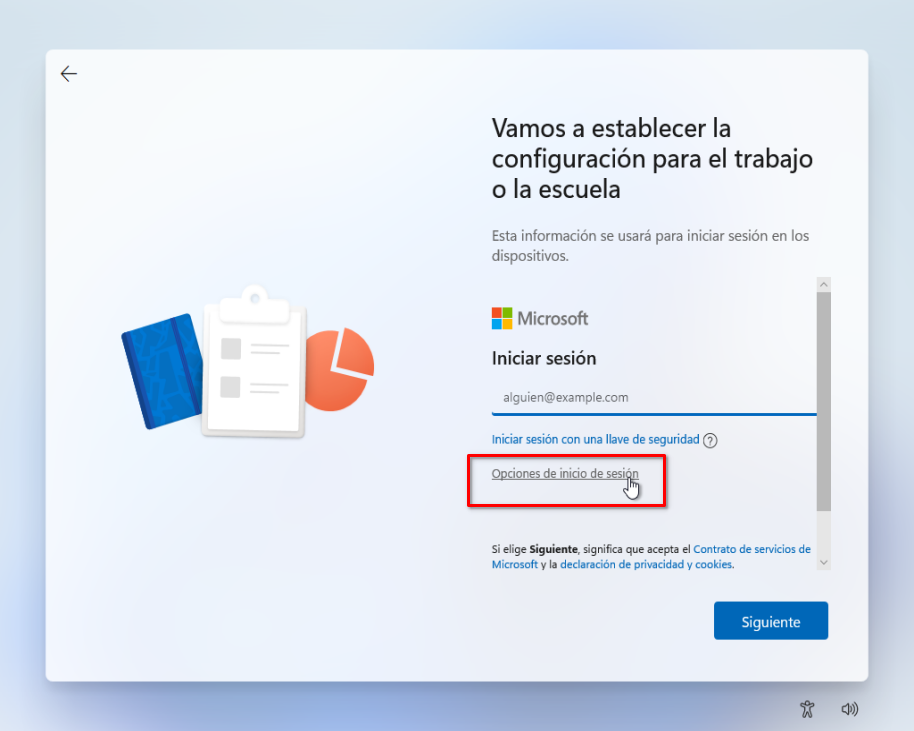{width=85%}
    <figcaption>Login Options</figcaption>
</figure>

---

Next, the wizard gives us the opportunity to log in with a _security key_ or _join a domain_.

<figure markdown="span">
    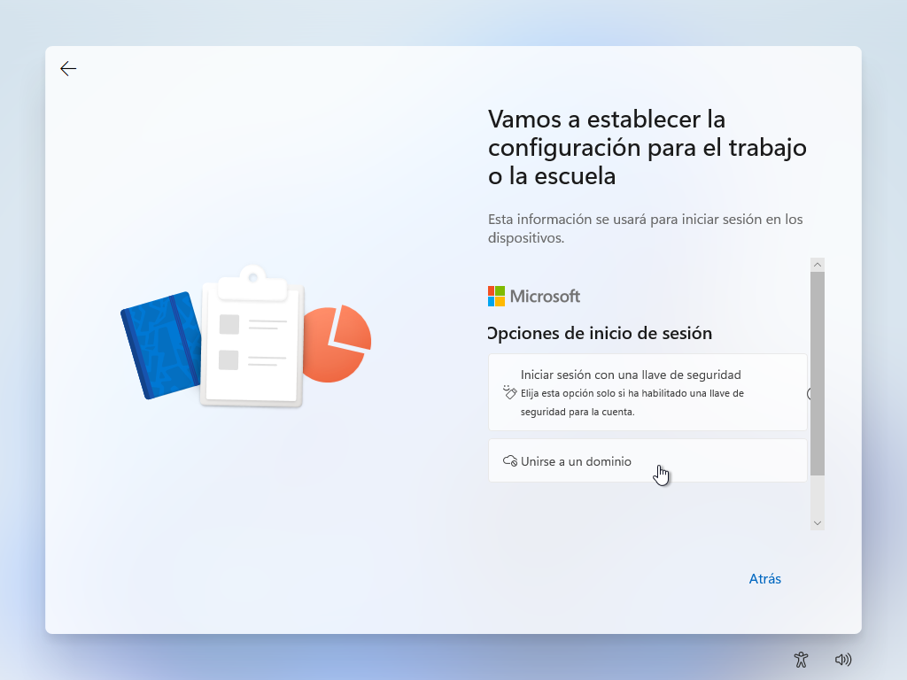{width=85%}
    <figcaption>Login Options</figcaption>
</figure>

When we click on the option, we see that it actually refers to creating a local account, but the wizard insists again that we use an online account.

---

If we create a local account, it will act on the system with administrative privileges.

The first thing to do is to choose a user name.

<figure markdown="span">
    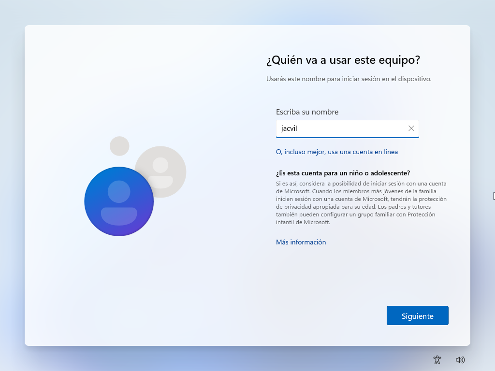{width=85%}
    <figcaption>User name</figcaption>
</figure>

---

Next, we must enter a password. It is requested twice to make sure that we do not make any typos. Bear in mind that if we are not able to enter it again later, we will not be able to log on to the computer and we will find ourselves in a bind.

We enter it the first time.

<figure markdown="span">
    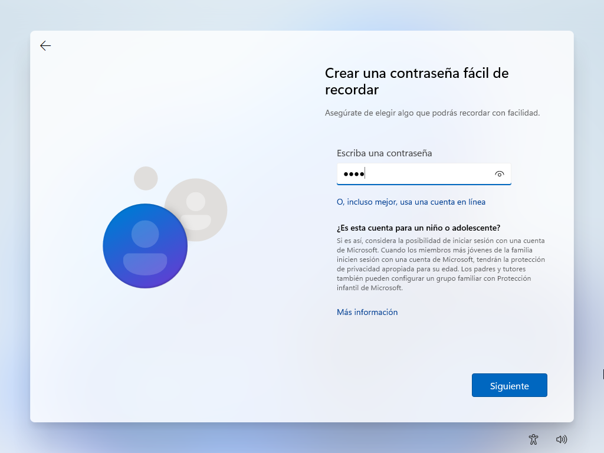{width=85%}
    <figcaption>Password</figcaption>
</figure>

After entering the password, we must enter it again to confirm it. We enter it a second time.

---

Next, we'll fill in three security questions. These are used when you've forgotten your password. You should choose questions (and especially answers) that only make sense to you. Otherwise, you'll be making it really easy for anyone trying to use your computer without permission.

<figure markdown="span">
    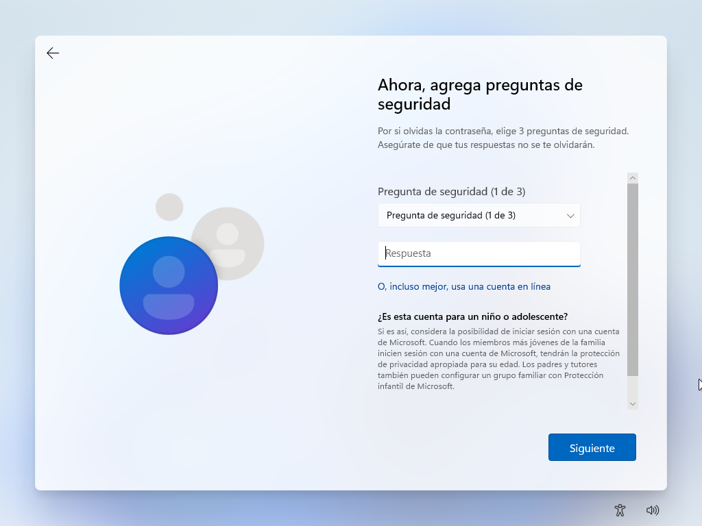{width=85%}
    <figcaption>Security Questions</figcaption>
</figure>

---

#### Privacy settings

The next step will ask us for permission for _Microsoft_ and other installed applications to use our location. If we give our permission, we'll be able to get services based on our location (like weather forecasts).

<figure markdown="span">
    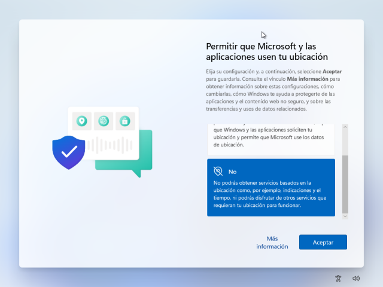{width=100%}
    <figcaption>Location access permission</figcaption>
</figure>

---

Next, the wizard offers us the opportunity to locate our device in case we lose it. To do this, we will again authorize access to our location data. In addition, we will be required to log in with a Microsoft account.

<figure markdown="span">
    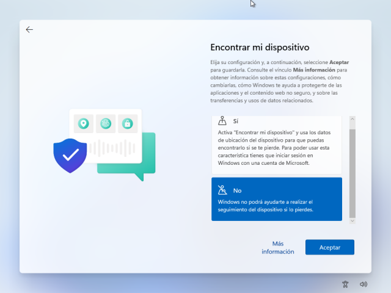{width=100%}
    <figcaption>Find the device</figcaption>
</figure>

---

In the next step, the wizard asks us if we want to "_**Send diagnostic data to Microsoft**_". We can choose two options:

- **Include optional**: which will send information to Microsoft about the websites we visit, applications and features we use, the status and use we make of the device, etc.

- **Required only**: Which only sends information about the device itself, its configuration and functionality.

<figure markdown="span">
    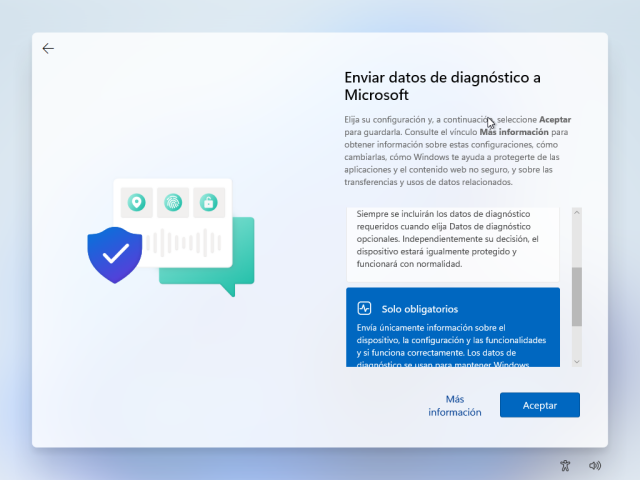{width=100%}
    <figcaption>Diagnostic data</figcaption>
</figure>

---

Next, you can decide whether to send data about your handwriting. If you do, you'll make it easier for Microsoft to improve our speech recognition capabilities.

<figure markdown="span">
    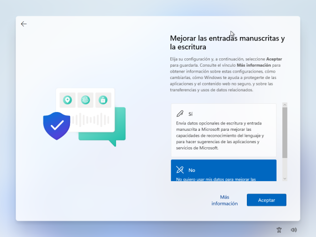{width=100%}
    <figcaption>Improving handwriting</figcaption>
</figure>

---

Next, the wizard asks you if you want Microsoft to use your diagnostic data to provide you with personalized suggestions, ads, or recommendations.

<figure markdown="span">
    {width=100%}
    <figcaption>Id. advertising</figcaption>
</figure>

And since all hope dies, in the last step of the wizard, you're asked again if you want third-party apps to use your information to provide you with personalized ads.

<figure markdown="span">
    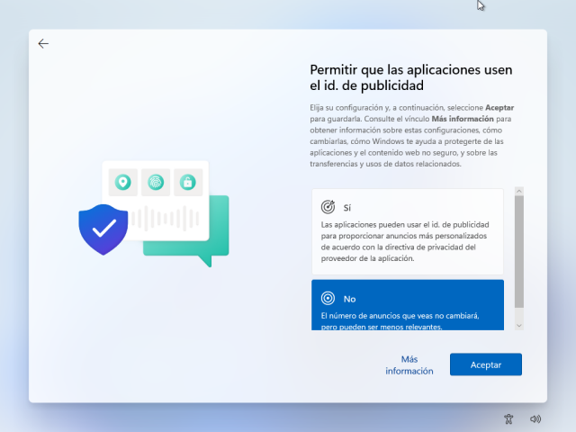{width=100%}
    <figcaption>Id. advertising</figcaption>
</figure>

Finally, the wizard will have finished asking us for information about the configuration. Now check if there are any pending updates to install.

---

We will soon see a series of messages on the screen, which will take us to the end of the installation.

<figure markdown="span">
    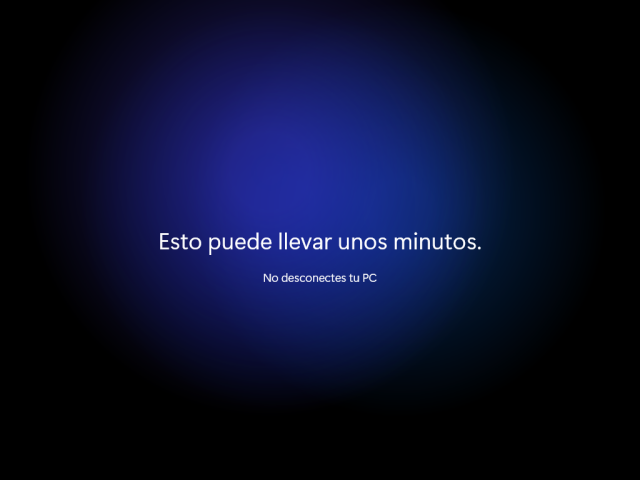{width=100%}
    <figcaption>Applying the selected configuration</figcaption>
</figure>

---

Shortly after, we will be, for the first time, in front of the _MS Windows 11_ desktop.

<figure markdown="span">
    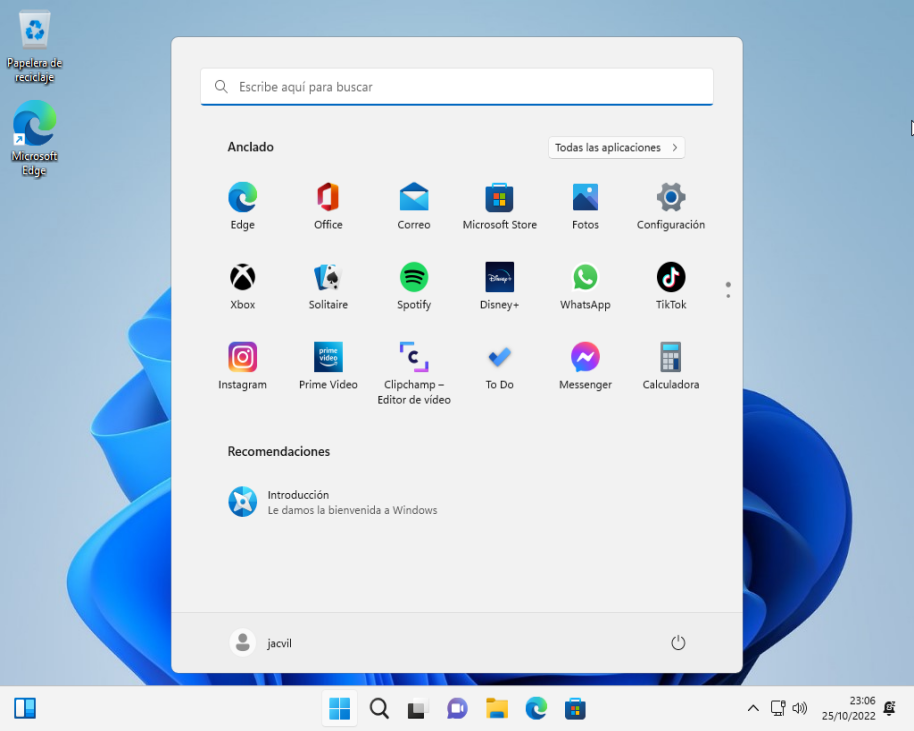{width=85%}
    <figcaption>Windows 11 Desktop</figcaption>
</figure>

### Installation of GNU/Linux distributions

_GNU/Linux_ operating systems are usually distributed in packages known as **distributions** or _**distros**_. Each distribution has its own selection of applications installed on the operating system to meet the needs of specific users.

A **distribution** of an operating system is software that includes the **operating system and certain applications to meet the needs of a specific group of users**. Given a source distribution, there may be different editions, such as for home, business, or server use.

Currently, one of the most popular distributions is *Ubuntu*, a *GNU/Linux* distribution maintained by the company *Canonical* and aimed at both desktop users and server and cloud computing environments, but we can find many more. Among the most popular are:

- **Free operating systems based on GNU/Linux**. Family of operating systems made up of the _**Linux kernel**_ together with the _**GNU utilities**_. The Linux operating system kernel was created in 1991 in Helsinki by *Linus Torvalds*. The *GNU* utilities, necessary for a complete operating system, have their origin in *Richard Stallman*'s project to create a free operating system, which began in 1985 at the *Free Software Foundation* (FSF). Linux grew thanks to the collaborative work of programmers from all over the world. Today, there are many software distributions based on this operating system, the main distributions:

    - **Debian**. It is a *GNU/Linux* distribution created by a community of developers and users in 1993. This association of people united by the cause of creating a 100% free operating system, and called it the *Debian Project*. It is also considered a mother distribution, since countless distributions such as *Ubuntu*, *Linux Mint*, *SteamOS*, *Kali Linux*, *PureOs*, *Deepin*, among many others, were born from *Debian*.

        !!!info "Debian codenames"
            Debian distribution codenames are based on the names of characters from the _Toy Story_ films. Debian's unstable trunk is named after _Sid_, a character who regularly destroyed his toys. [Wikipedia - Debian version history](https://en.wikipedia.org/wiki/Debian_version_history)

    - **Ubuntu**. Distribution based on *Debian*, developed and maintained by the company *Canonical*, being one of the most used. It is oriented to general uses and is characterized by its software compatibility and ease of use comparable to *Mac OS X* or *Windows*. It has several versions, among which the following stand out: *Ubuntu Desktop*, *Kubuntu*, *Xubuntu*, *Lubuntu* and *Ubuntu Server*.
    
        A new version of _Ubuntu_ is published every six months. It receives support from *Canonical* for nine months through security updates, patches for critical bugs and minor program updates. The **LTS** (Long Term Support) versions, which are released every two years, receive support for five years on desktop and server systems.

    - **Fedora**. General purpose distribution, which makes use of the *RPM* package. It is characterized by being stable and secure, which is developed and maintained by the company *Red Hat* and an international community of engineers, graphic designers and users who report errors and test new technologies. Its uses are more oriented towards software and server development. The project does not only seek to include free and open source software, but to be the leader in this technological field.

    - **Slackware**. It is a *GNU/Linux* distribution created in 1993 and aimed at advanced users. This distribution derived from *SLS Linux* and is the oldest distribution still in maintenance.

    - **Open SUSE**. *SUSE* is an operating system with paid versions for both servers and desktops called *SUSE Linux Enterprise Server* and *SUSE Linux Enterprise Desktop*. It was originally based on *Slackware*. *SUSE* also offers a completely free version called *Open SUSE*.

    - **Arch Linux**. It is a distribution aimed at advanced users. It is mostly made up of free and open source software and supports community participation. It has few automatic configuration tools, sharing the same philosophy of distributions like *Slackware​*. It's development model is of the type _**Rolling Release**_ and the design approach follows the *KISS* principle to keep the system simple and light.

    - **Manjaro**. *Manjaro Linux* is based on *Arch Linux*, but has its own set of repositories. The distribution aims to be user-friendly while maintaining the features of *Arch*, such as the *Pacman* package manager and compatibility with *AUR* (*Arch User's Repository*).

    - **Other distributions**. There are many more distributions derived from the above, such as *MX Linux*, *Pop\!\_OS*, *Mint*, *Kali*, *Garuda*, *Zorin*, *antiX*, *Alpine*, etc.

- **Free operating systems based on *BSD***: These are operating systems derived from the *BSD* (*Berkeley Software Distribution*) operating system, which originally derived from the *UNIX* operating system from *AT&T Research*. The best known are:

    - **FreeBSD**. The most popular *BSD* distribution that aims to provide high performance and ease of use. It is a distribution very oriented towards desktop use that includes basic applications for the user such as browser, word processor, games, email, etc.

    - **OpenBSD**. This distribution is oriented towards security and code integrity. It integrates a large number of cryptographic tools to maximize security.

    - **NetBSD**. This distribution aims to make the operating system as portable as possible.

- **Other free operating systems**:

    - **Chromium OS**. *Chromiun OS* is the free operating system of the *Chrome OS* version. *Chrome OS* is an operating system developed by *Google* that is based on the *Linux* kernel and uses the *Google Chrome* browser as a user interface. This operating system is designed to work with web applications. *Chrome OS* is the proprietary commercial version that comes installed on specific hardware created by some of *Google*'s partners, such as the *Chromebook*.

    - **Android**. It is a mobile operating system based on the *Linux* kernel. It was designed for mobile devices with touch screens, such as *smartphones*, tablets, televisions, etc.

#### Linux distributions technical support

With the installation of an operating system we receive technical support and updates that keep the equipment up to date until the end of its useful life. This support can be commercial if the user has paid for it or free support offered by the community of users of the installed distribution.

Linux distributions offer several possibilities to **keep the system up to date**. 

- **Standard development**. One option is to use a **standard development model** of updating that uses different **versions** that have to be reinstalled over the previous version.

    An example of this is *Debian*, which has different versions such as *Debian 10 "buster"* or *Debian 11 "bullseye"*.

- **Rolling release**. The other option is a model of constant updating of the different software packages that is called **continuous update**, or **rolling release**.
  
    An example of this is *Arch Linux*, which is a distribution that is constantly updated and does not have versions. The user installs the system once and then updates it continuously.

In the case of systems that use the **standard development model**, the terms *STS* and *LTS* are widely used for free software and specify how long its technical support lasts:

- **STS**. Short-term support, *STS* for its acronym for _**Short Term Support**_. These operating systems have newer software with more recent features but that can be more unstable, since these programs are not sufficiently tested by the user community. In favor of these versions we find that they provide newer or more experimental applications and allow us to enjoy the latest news.

- **LTS**. *LTS* versions, which stand for _**Long Term Support**_, are more stable because the software has been in use for a while. This is the term used to refer to software versions that are designed to be supported for a longer period than usual. For example, the *Ubuntu LTS* operating system provides support for five years while the *Ubuntu STS* version only provides support for nine months.

#### Storage devices and file systems in GNU/Linux

In *GNU/Linux* systems, partitions have different names than those used by other operating systems such as *MS Windows*. For example, in *MS Windows*, hard drives and partitions are identified with the letters `C:`, `D:` and so on; while in *GNU/Linux* we find a nomenclature such as `/dev/sda1` or `/dev/sdb5`.

In *GNU/Linux* the first hard drive is called `/dev/sda` and its partitions are numbered in an order where the primary and extended partitions are numbered first, and then the logical ones. For example, `/dev/sda1`, `/dev/sda2`, `/dev/sda3`, and `/dev/sda4` could be primary or extended partitions, and `/dev/sda5`, `/dev/sda6`, etc. could be logical partitions. If we had a second hard drive, it would be named the same but with the letter `b`, i.e. `/dev/sdb`. This last letter will always be assigned by the operating system based on the disk controller channel or USB port where the device is connected.

!!!note "Nomenclature of hard drives in GNU/Linux"
    Traditionally, *IDE* hard drives were named `/dev/hda`, `/dev/hdb`, etc., and *SCSI* hard drives were named `/dev/sda`, `/dev/sdb`. Since 2007, the nomenclature has been standardized and, regardless of the technology used, the old nomenclature for *SCSI* disks is currently used.

In addition to this nomenclature, the different partitions that can be used by the operating system have an identifier called **UUID** (*Universally Unique Identifier*) that allows the partition to be referenced independently of the disk controller channel or USB port where the device has been connected.

#### Partition schemes

The standard partition scheme for most home *Linux* installations is as follows:

- A partition of about **20 GB** for the operating system, which is mounted at `/`

- A **smaller** partition used for swap memory, called ***swap***. The size of this space will depend on the use of the system and the amount of RAM available to the system. For example, if you do a lot of multimedia editing and/or have a small amount of RAM, you should use a larger amount of swap. The general rule is that you create a swap partition that is 100% to 200% of the size of the physical RAM on the system.

- A **larger** partition for personal use by the system user(s), mounted at `/home`. This is where personal data is stored. It is the equivalent of the `C:\Users` directory in *MS Windows*, which stores application settings, music, downloads, documents, etc. Strictly speaking, it is not necessary to create a separate partition for `/home`. If you do not, it will reside on the root partition like everything else on the system. But it is useful to have `/home` on a separate partition because when you upgrade or reinstall the operating system, you do not need to back up this folder. In addition, most of the settings related to programs and the user interface are also saved.

On a computer intended to be a server for many users, system performance can be optimized by using more than one hard drive and by creating a partition layout specific to the server's activity. In addition to the partition for the operating system, the swap partition, and the `/home` partition, other partitions can be created, such as for the temporary directory (`/tmp`), for web server content (`/var/www`), for programs (`/usr`), or for log files (`/var/log`).

### Typical installation of _*Debian 11.6 "bullseye"_

The first step of the installation will be to download the Debian 11.6 ISO image and save it to a boot device. In the case of a virtual machine, it will be enough to select the ISO file in the virtual optical drive.

<figure markdown="span">
    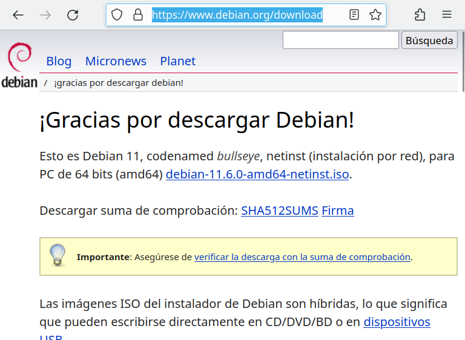{width=75%}
    <figcaption>https://www.debian.org/download</figcaption>
</figure>

Once we start the installation, the operating system installation wizard will start.

<figure markdown="span">
    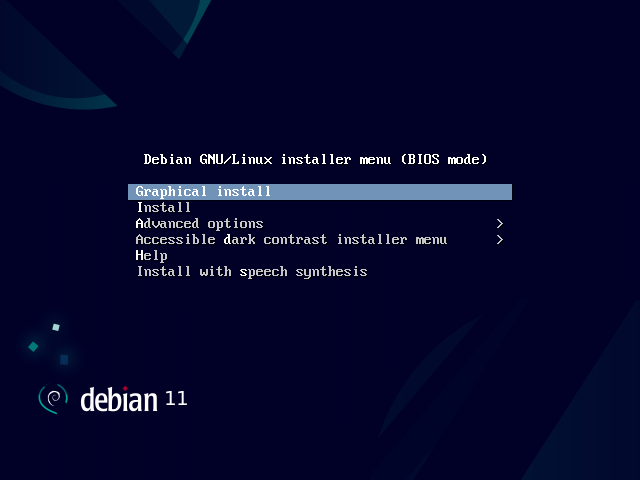{width=80%}
    <figcaption>Installation Image Boot Menu</figcaption>
</figure>

The first step is to select the language for the installation process.

<figure markdown="span">
    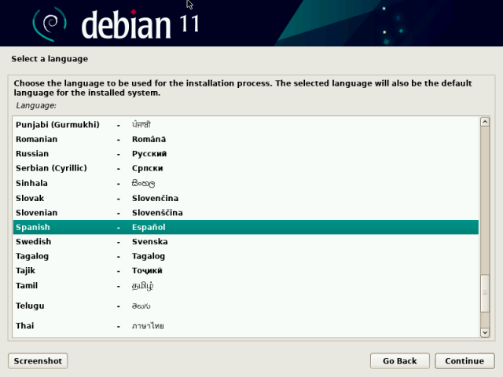{width=80%}
    <figcaption>Language Selection for Installation Process</figcaption>
</figure>

---

Next, we must select the location for the time zone and the locale settings.

<figure markdown="span">
    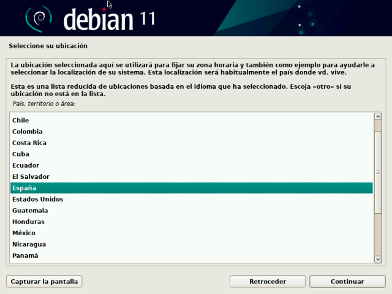{width=80%}
    <figcaption>Location Selection for Timezone and Locale Settings</figcaption>
</figure>

---

The next step is to select the keyboard layout.

<figure markdown="span">
    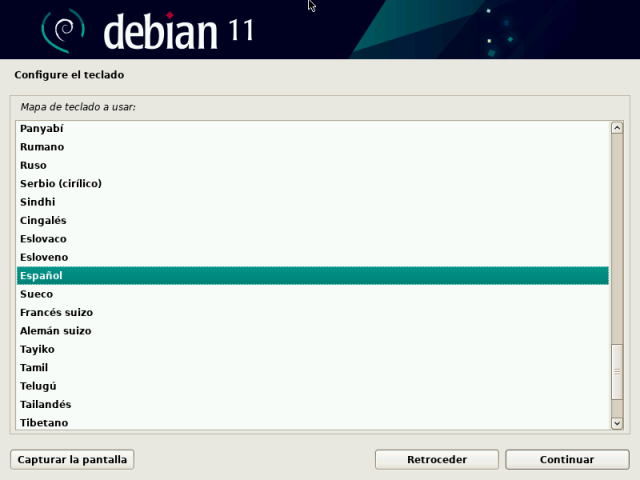{width=80%}
    <figcaption>Keyboard Layout Selection</figcaption>
</figure>

---

The wizard will now load the basic installation tools.

<figure markdown="span">
    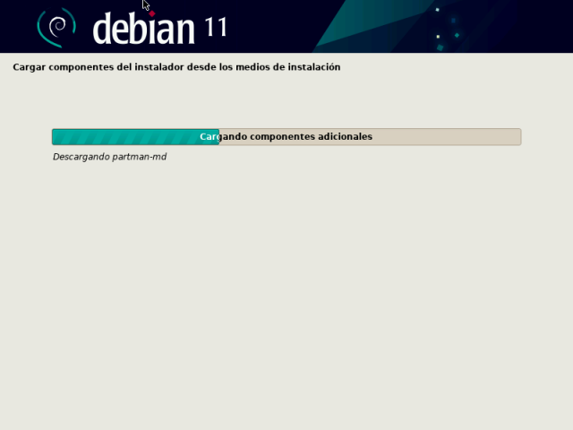{width=80%}
    <figcaption>Loading Basic Installation Tools</figcaption>
</figure>

---

Next, we must enter the hostname for the computer.

<figure markdown="span">
    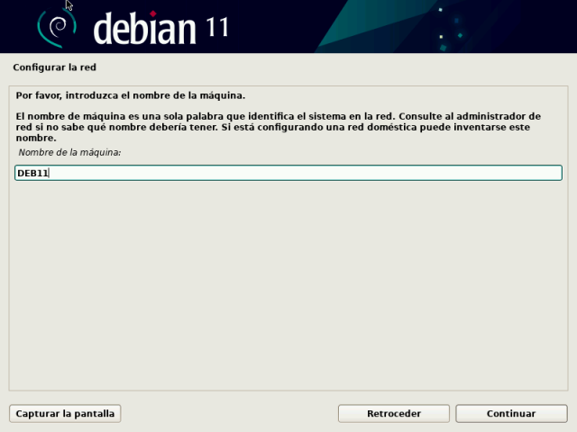{width=80%}
    <figcaption>Hostname</figcaption>
</figure>

---

The wizard will ask us to enter the domain name, which is optional if we do not have one, we can leave it blank.

<figure markdown="span">
    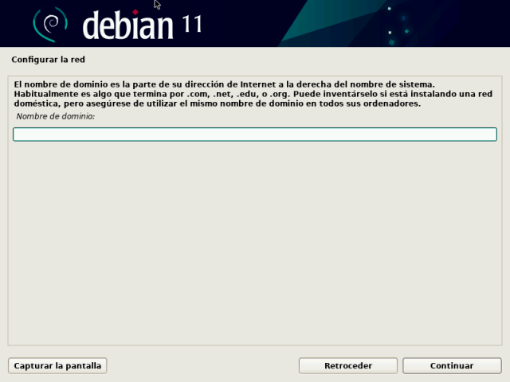{width=80%}
    <figcaption>Domain Name</figcaption>
</figure>

---

Next, we must enter the password for the _**root user**_. In _GNU/Linux_ systems, the _**root**_ user is the system administrator.

If we leave the password blank, the _**root**_ user will be disabled and the user created in the next step will have administrative privileges, with the ability to use the `sudo` command to execute commands as the _**root**_ user.

<figure markdown="span">
    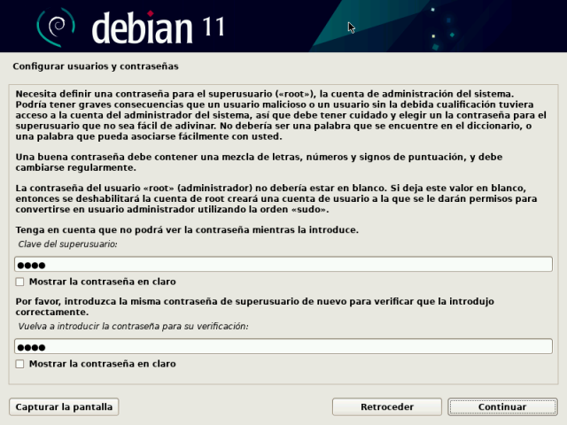{width=80%}
    <figcaption>Password for Root User (administrator)</figcaption>
</figure>

---

The wizard will ask us to enter the **real name** of the _**standard user**_.

<figure markdown="span">
    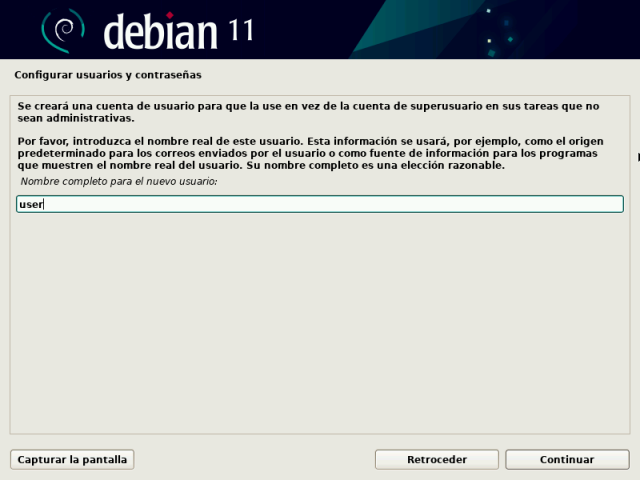{width=80%}
    <figcaption>Real name of standard user</figcaption>
</figure>

---

Next, we must enter the **username** for the _**standard user account**_. This is the user account that will be used to log in to the system.

<figure markdown="span">
    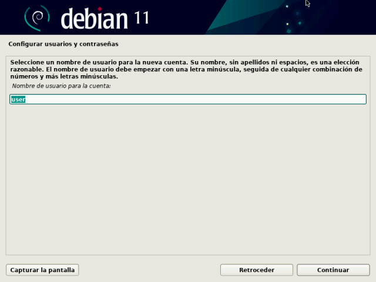{width=80%}
    <figcaption>Username for standard user account</figcaption>
</figure>

---

The wizard will ask us to enter the **password** for the _**standard user account**_.

<figure markdown="span">
    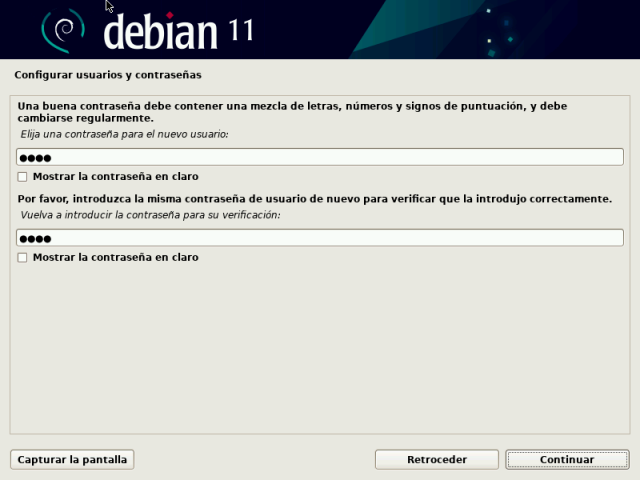{width=80%}
    <figcaption>Password for standard user</figcaption>
</figure>

---

Next, will ask for time zone configuration, with will affect the system clock.

<figure markdown="span">
    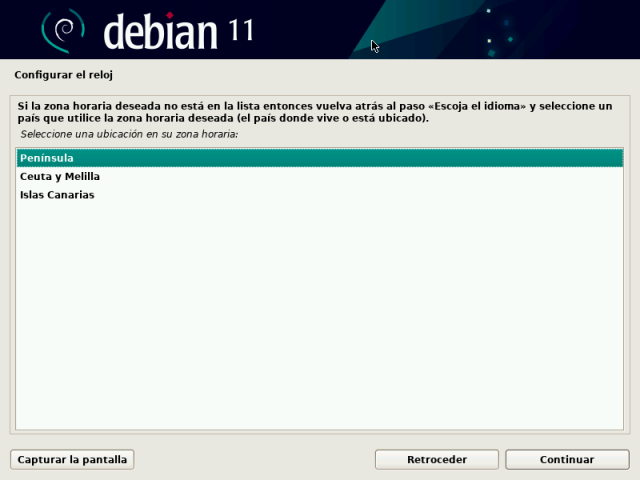{width=80%}
    <figcaption>Time zone</figcaption>
</figure>

---

The wizard will ask us to select the disk partitioning method. We can choose guided or manual partitioning. For a standard installation, we will choose "Guided - use entire disk".

<figure markdown="span">
    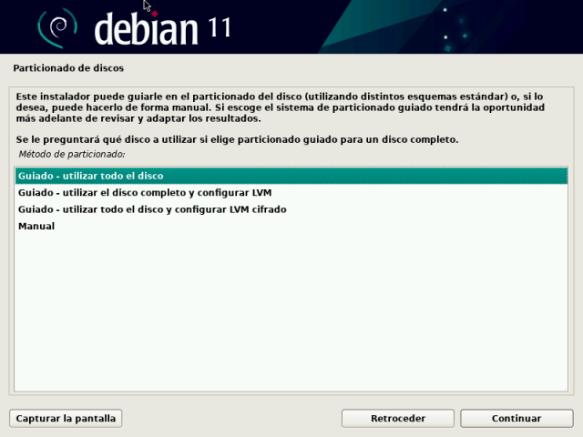{width=80%}
    <figcaption>Disk partitioning guide</figcaption>
</figure>

---

Next, we must select the disk on which to install the operating system.

<figure markdown="span">
    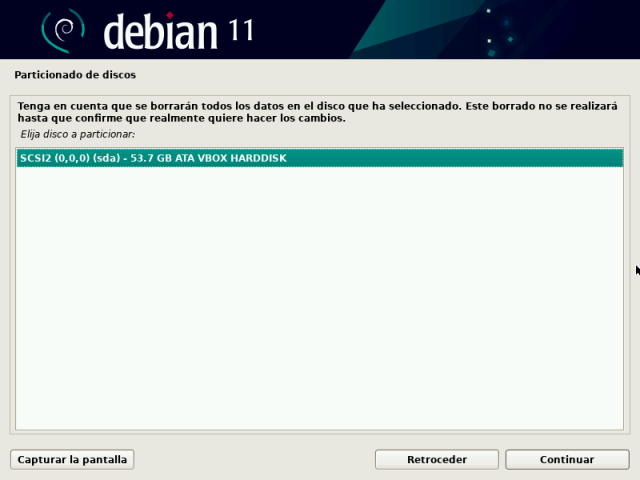{width=80%}
    <figcaption>Disk selection</figcaption>
</figure>

---

Then, we need to select a default partitioning scheme, the installer will create the partitions automatically.

<figure markdown="span">
    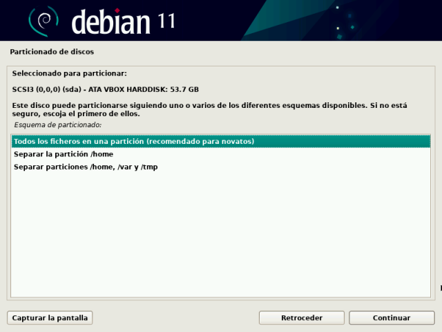{width=80%}
    <figcaption>Guided partitioning</figcaption>
</figure>

---

The wizard will ask us to confirm the partitions that will be created.

<figure markdown="span">
    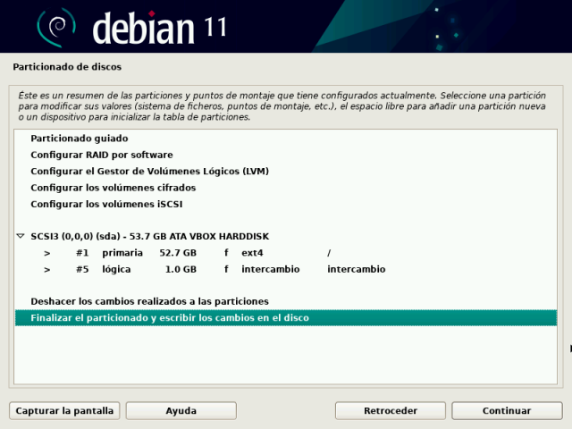{width=80%}
    <figcaption>Confirming created partitions</figcaption>
</figure>

---

The wizard will ask us to confirm the changes to the disk. This is the last step before the changes are written to disk.

<figure markdown="span">
    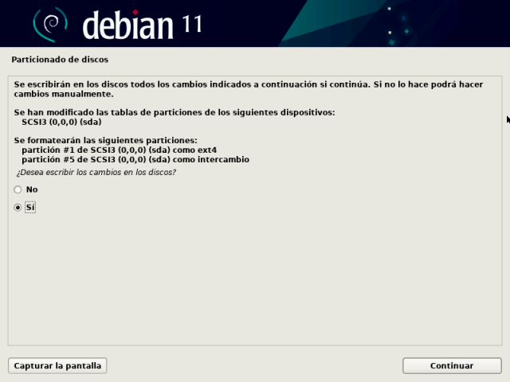{width=80%}
    <figcaption>Writing changes to disk</figcaption>
</figure>

---

The wizard will start copying the files to the disk.

<figure markdown="span">
    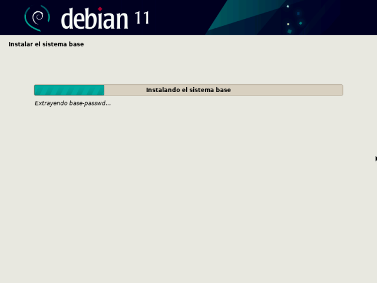{width=80%}
    <figcaption>Copying files to disk</figcaption>
</figure>

---

Additional installation medium can be added to the system. This is optional. We can add a CD-ROM, DVD, or network repository.

<figure markdown="span">
    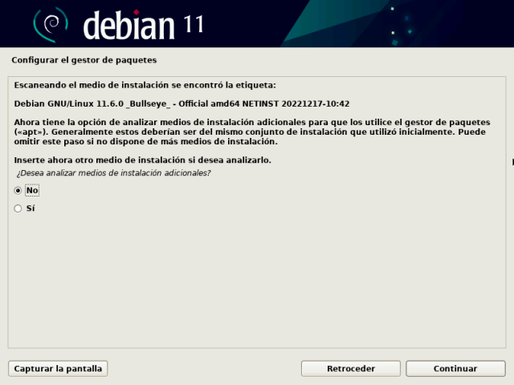{width=80%}
    <figcaption>Additional installation mediums</figcaption>
</figure>

---

Locating the repository server for the package manager. It is recommended to use a location close to the systems location.

<figure markdown="span">
    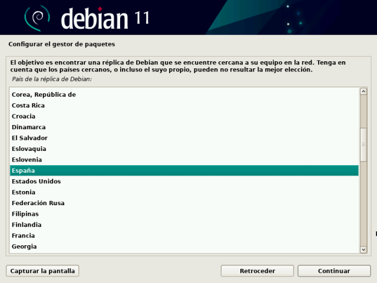{width=80%}
    <figcaption>Location of package repository server</figcaption>
</figure>

---

The wizard will ask us to select the repository for the package manager.

<figure markdown="span">
    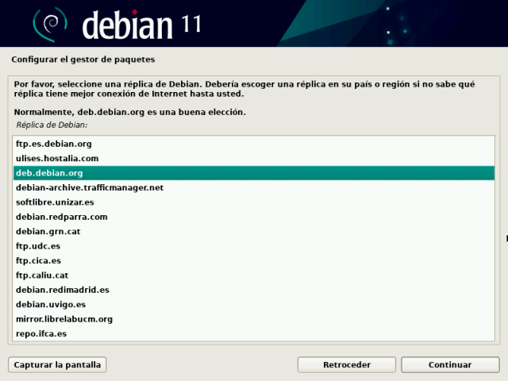{width=80%}
    <figcaption>Selecting the repository</figcaption>
</figure>

---

The wizard will ask us to configure the HTTP proxy settings. If we do not use a proxy, we can leave this field blank.

<figure markdown="span">
    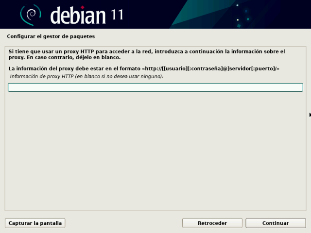{width=80%}
    <figcaption>HTTP proxy settings</figcaption>
</figure>

---

Wait for the update of the package manager from the selected repository.

<figure markdown="span">
    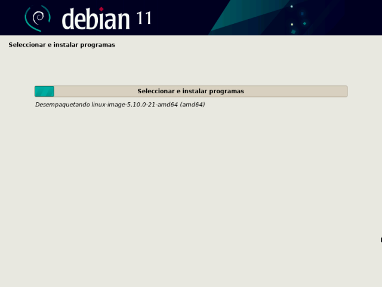{width=80%}
    <figcaption>Software selection</figcaption>
</figure>

---

The wizard will ask us if we want to send package usage statistics to the Debian project. This is optional.

<figure markdown="span">
    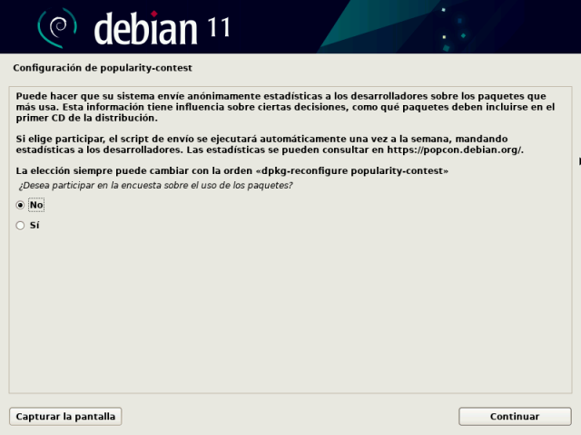{width=80%}
    <figcaption>Sending package usage statistics</figcaption>
</figure>

---

Select the desktop environment and other predefined programs to install.

<figure markdown="span">
    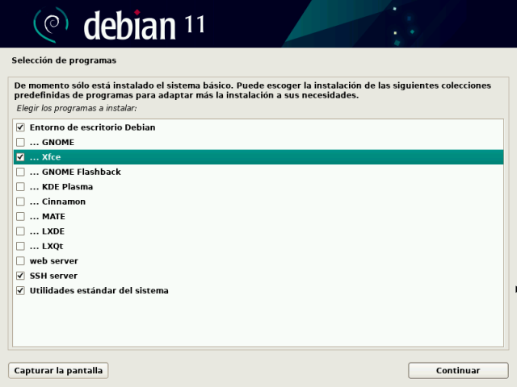{width=80%}
    <figcaption>Desktop environment and other predefined programs selection</figcaption>
</figure>

---

Installation of the selected software will begin, downloading the necessary packages from the repository.

<figure markdown="span">
    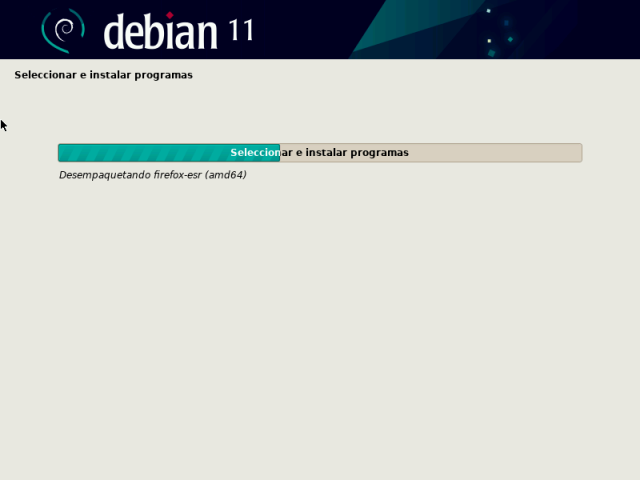{width=80%}
    <figcaption>Software installation</figcaption>
</figure>

---

If we have a BIOS firmware, wizard will ask us to install the GRUB bootloader.

<figure markdown="span">
    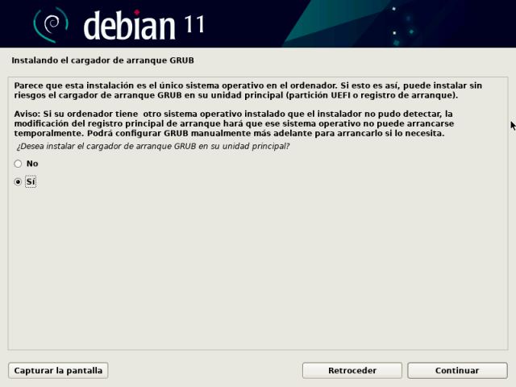{width=80%}
    <figcaption>GRUB bootloader installation</figcaption>
</figure>

---

Select the disk where the bootloader will be installed. This is usually the same disk where the operating system is installed, but it can be different.

<figure markdown="span">
    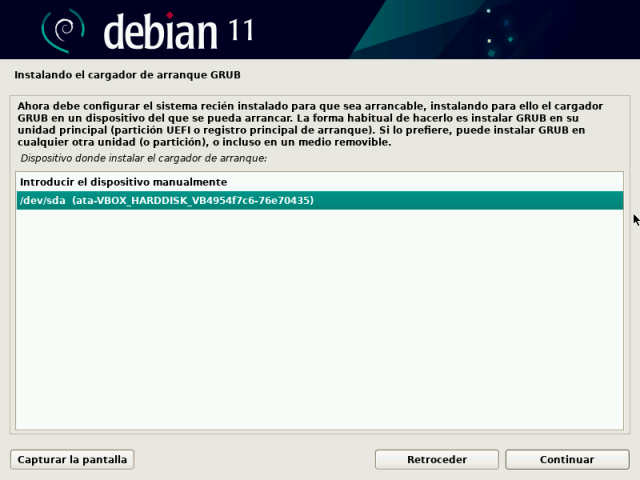{width=80%}
    <figcaption>Disk selection for bootloader</figcaption>
</figure>

---

When the installation is complete, will ask us to remove the installation medium and restart the system.

<figure markdown="span">
    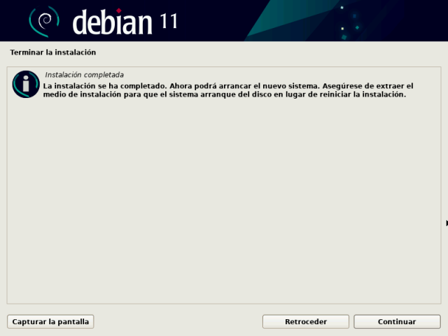{width=80%}
    <figcaption>Installation finished</figcaption>
</figure>

---

After the system restarts, the GRUB bootloader will appear, allowing us to choose the operating system to boot.

<figure markdown="span">
    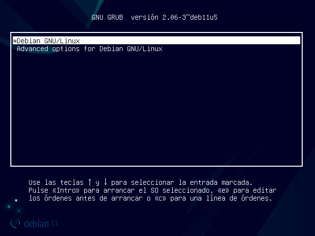{width=80%}
    <figcaption>GRUB2 bootloader</figcaption>
</figure>

---

After selecting the operating system, the system will boot into the login screen.

<figure markdown="span">
    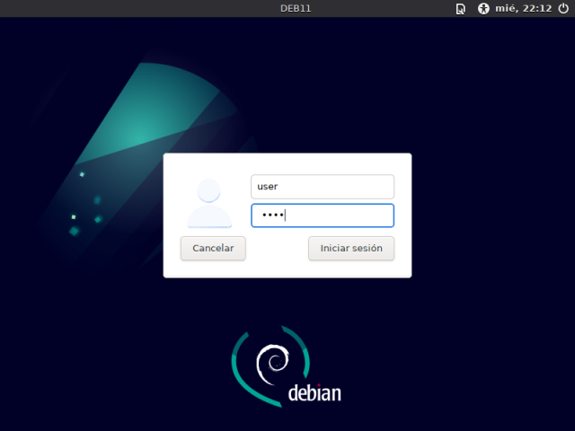{width=80%}
    <figcaption>Login screen</figcaption>
</figure>

---

After logging in, the desktop environment will appear.

<figure markdown="span">
    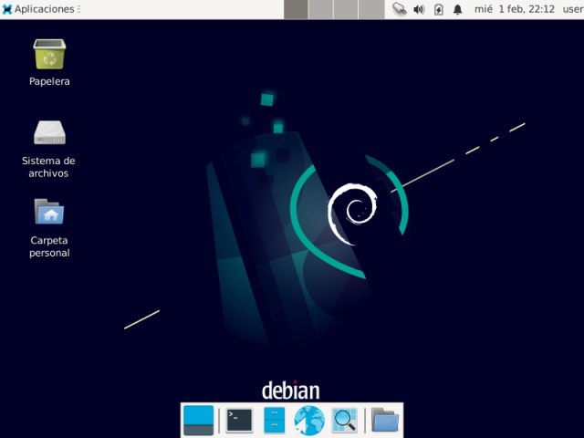{width=80%}
    <figcaption>Desktop environment</figcaption>
</figure>

## Verification and documentation of the installation process and incidents

Once we have installed and configured the operating systems, we must check that they are working correctly. Then we must prepare the documentation corresponding to the installation process and the incidents that have appeared. This documentation refers to the set of documents that are issued accompanying the installation process. The most important document in this set is the installation manual.

The purpose of the installation manual is to serve as a guide during the installation of the system. Therefore, first of all we must specify the technical requirements and the software necessary for the correct operation of the system, and then describe each of the steps necessary for its installation and configuration.

The documentation is usually in computer support, and we can find it in different types, such as text, graphics or multimedia (if it includes images, videos, etc.). We can find it in physical format if the documentation is printed or in online format if it is consulted on the Internet.

The documentation is mainly classified into help documentation, which usually explains the installation; support documentation, which tries to resolve the most common incidents; Technical documentation, which includes the operating system's technical specifications; general documentation, which presents the operating system and its functions; and legal documentation, which usually contains the legal conditions for using the operating system. We can also find other more specific documents, such as documents on frequently asked questions (FAQs), glossaries, etc.

## *VirtualBox Guest Additions*

*VirtualBox Guest Additions* is a software that can be installed on guest operating systems that provides some enhanced accessibility features and improves guest system performance. After installing an operating system on _VirtualBox_, it is highly recommended to install _VirtualBox Guest Additions_.

Specifically, the benefits we get are the following:

- **Mouse pointer integration**: Allows you to move the mouse freely between the host and guest operating systems.
- **Shared folders**: Provides the ability to access one or more folders on the host operating system from the guest operating system, simplifying the exchange of information between the two.
- **Improved video support**: Allows the guest system to benefit from the advanced video modes and graphics acceleration of the host (both 2D and 3D). In addition, if the guest system is MS Windows, GNU/Linux or Solaris, we can choose any video resolution, whether standard or not.
- **Integrated Windows**: Allows you to display the virtual machine's desktop windows integrated into the host desktop, as if they were your own windows.
- **Generic Guest-Host Communication Channel**: Allows you to control and monitor the guest system. This allows, for example, launching applications on the guest from the host.
- System Clock Synchronization: Improved system clock synchronization between the host and the guest.
- **Shared Clipboard**: Allows you to share the contents of the guest system's clipboard with the host's and vice versa.
- **Drag and Drop**: Allows you to drag files from the host computer to the guest computer or vice versa.
- **Automatic Authentication**: Provides the ability to log in with a guest system user account from the host system.
