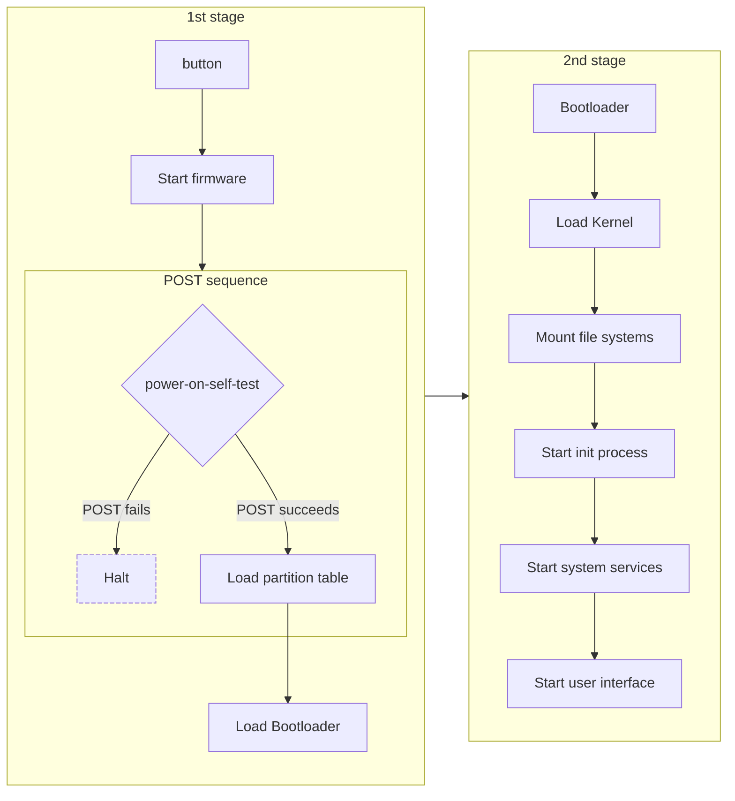

# Unit 4: Management of Operating Systems

In this unit, we will learn how to use, configure and manage operating systems. We will start with the configuration of _MS Windows_ operating systems and then move on to _GNU/Linux_ operating systems.

## Booting the Operating System

The process of booting an operating system involves loading the necessary files and programs to start the system. The boot process is divided into two main stages:

<figure markdown="span">

    <figcaption>Boot sequence</figcaption>
</figure>

<!-- <figure markdown="span">
```mermaid
flowchart LR
subgraph stage1["1st stage"]
    direction TB
    A[fa:fa-power-off\nPower\nbutton] -- > B
    B[Start firmware] -- > POST
    subgraph POST["POST sequence"]
        direction LR
        C{fa:fa-list-check\npower-on-self-test}
        C -- > |POST fails| D
        C -- >|POST succeeds| E
        D[fa:fa-ban\nHalt]
    end
    E[Load partition table] -- > F
    F[Load Bootloader]
end
subgraph stage2["2nd stage"]
    direction TB
    H[Bootloader]
    H -- > I[fab:fa-linux / fab:fa-windows / fab:fa-apple\nLoad Kernel]
    I -- > J[fa:fa-folder-tree\nMount file systems]
    J -- > K[far:fa-circle-play\nStart init process]
    K -- > L[fa:fa-volume-low fa:fa-print fa:fa-wifi fa:fa-ellipsis\nStart system services]
    L -- > M[fa:fa-user fa:fa-display\nStart user interface]
end
stage1 -- > stage2
style D stroke-dasharray: 5 2
```
    <figcaption>Boot sequence</figcaption>
</figure> -->


- **1st stage**: When the power button is pressed, the system starts the firmware and performs a Power-On Self-Test (POST) sequence. If the POST sequence fails, the system halts. If the POST sequence succeeds, the system loads the partition table and then the bootloader.
- **2nd stage**: The bootloader loads the kernel, mounts the file systems, starts the init process, system services, and the user interface.

## User sessions

A **user session** is a period of activity by a user on a computer system. A user session begins when a user logs in and ends when the user logs out. The user session is managed by the operating system and is associated with a **user account**. The operating system keeps track of the user sessions and manages the resources used by each session.

To init a user session, the user must provide a valid **login credentials** (username and password) to the operating system. The operating system then verifies the credentials and starts the user session. The user session ends when the user logs out or when the system is shut down.

When a users **logs out the session**,  all the programs running in the user session are closed, and the user is returned to the login screen.

We can also **switch user** to start a new user session without ending the current user session. This allows multiple users to use the system without interfering with each other's work.

When **Shutdown** or **Restart** the system, all user sessions are closed, and the system is shut down or restarted.

