# Unit 4: Configuration and management of Operating Systems

<!--
- RA 3. Realiza tareas básicas de configuración de sistemas operativos, interpretando requerimientos y describiendo los procedimientos seguidos.													
    - 3a. Se han diferenciado los interfaces de usuario según sus propiedades.
    - 3b. Se han aplicado preferencias en la configuración del entorno personal.
    - 3c. Se han gestionado los sistemas de archivos específicos.
	- 3d. Se han aplicado métodos para la recuperación del sistema operativo.
	- 3e. Se ha realizado la configuración para la actualización del sistema operativo.
	- 3f. Se han realizado operaciones de instalación/desinstalación de utilidades.
	- 3g. Se han utilizado los asistentes de configuración del sistema (acceso a redes, dispositivos, entre otros).
	- 3h. Se han ejecutado operaciones para la automatización de tareas del sistema.
 -->

In this unit, we will learn how to use, configure and manage operating systems. We will start with the configuration of _MS Windows_ operating systems and then move on to _GNU/Linux_ operating systems.

## Booting the Operating System

The process of booting an operating system involves loading the necessary files and programs to start the system. The boot process is divided into two main stages:

<figure markdown="span">
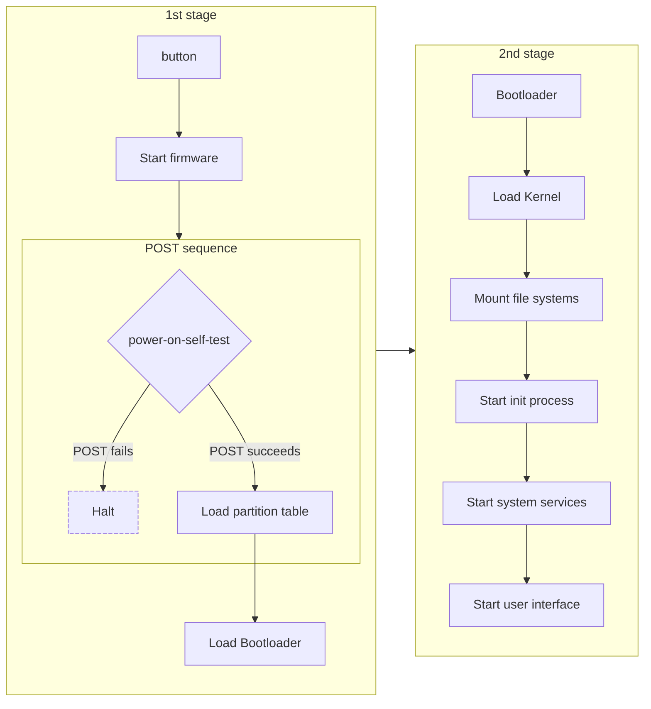
    <figcaption>Boot sequence</figcaption>
</figure>

- **1st stage**: When the power button is pressed, the system starts the firmware and performs a Power-On Self-Test (POST) sequence. If the POST sequence fails, the system halts. If the POST sequence succeeds, the system loads the partition table and then the bootloader.
- **2nd stage**: The bootloader loads the kernel, mounts the file systems, starts the init process, system services, and the user interface.

### Windows 11 operating system boot and shutdown process

To access the Windows 11 system boot options, go to `Start`/`Settings`/`Recovery`/`Advanced startup` and select `Restart now`.

Once the system restarts, we find a series of **boot options** if we select `Troubleshoot` / `Advanced options`.

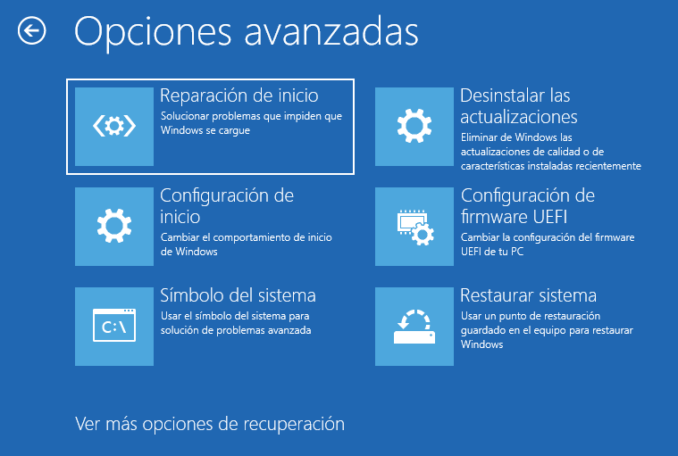{width=75%}

The Windows 10 boot options are as follows:

- **System Restore**. With this option we can use a restore point saved on the computer to restore Windows.
- **Command Prompt**. It allows us to use the command prompt to solve advanced problems.
- **System Image Recovery**. We can recover Windows with a specific system image.
- **Startup Settings**. This option allows us to change the startup behavior of Windows.
- **Startup Recovery**. We can fix problems that prevent Windows from starting.

When we access the **`Startup Settings`** we find different options that can be used to repair startup problems or run diagnostics.

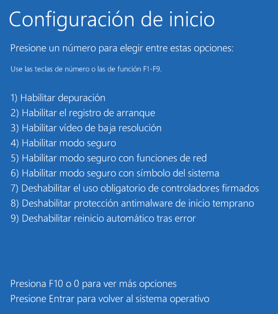{width=50%}

These options are the following:

- **Enable debugging**. Starts Windows in debug mode for troubleshooting purposes.
- **Enable boot logging**. Creates a file that includes all drivers installed during startup that can be useful for troubleshooting.
- **Enable low resolution video**. Starts Windows using the video driver defined with a low resolution and refresh rate. This mode is useful if the screen has been configured with a value that the monitor cannot display.
- **Enable safe mode**. It uses a minimal set of device drivers and services to start Windows.
- **Enable Safe Mode with Networking**. Adds the network services and drivers we need to access the Internet and other computers on the network.
- **Enable Safe Mode with Command Prompt**. Performs the same function as Safe Mode, except it starts in text mode instead of graphical mode.
- **Disable Enforce Signed Drivers**. Allows drivers that contain incorrect signatures to be installed.
- **Disable Early-Launch Antimalware Protection**. Prevents the driver from starting against malicious software, allowing drivers that may contain malware to be installed.
- **Disable Automatic Restart After Error**. Prevents Windows from automatically restarting if a failure causes the system to fail. This option should be selected when Windows is stuck in a loop where an error is generated, the system restarts, and the error is generated again.

The usual way to stop Windows is by selecting the option to shut down the operating system, there are also other options. In the taskbar, specifically on the Windows start button, we find the following:

- **Shutdown**. This option causes an orderly shutdown of the system.
- **Restart**. It is used when you want to turn off and turn on the computer. The operating system closes all open programs and restarts itself. This operation is usually performed when we install new hardware or software and the system has to activate the changes made.
- **Suspend**. It is an option similar to turning off the computer, with the difference that the power keeps the information in the memory active and allows the computer to restart at the same point where we were when pressing any key. When we suspend the system we have to make sure that the computer has a power supply, since otherwise all the information from the session would be lost.
- **Hibernate**. Similar to the suspend option, but it dumps the information from the memory to the hard disk so that if the computer runs out of power we do not lose the information. This option is not available by default, and is enabled and disabled in Control Panel / Power Options.


## User sessions

A **session** is the set of processes and system objects that represent a single user who is using a system at a given time.

In order to **log in** to the operating system, the user has to go through this process, which consists of identifying the user, usually by means of a user name and subsequently certifying that the user who wants to use the computer is who he really says he is. To do this certification, it is usual to use a password, although it can also be certified by means of biometric elements or other types.


Operating systems can allow the execution of one or more sessions, either in graphical mode or in text mode, simultaneously.

Once the user has finished working with the system, the most convenient option is to close the session or stop the system, although in operating systems we also find other options, such as:

- **Close session**. This option is used when we want to end the active work session. With this option **all open programs are closed** and the computer is left ready to be used by another user **without turning it off**.
- **Change user**. It closes the session of the active user **without closing the programs** but allowing another user to start a new work session. The **first user can always resume his work** with the programs in the same state as when he changed users.
- **Lock**. If we click on this option we lock the computer leaving the programs that are running in memory running and preserving the information. This option allows the user to move away from the computer without putting the security of the system at risk. It is also possible to configure the system to automatically lock after a period of user inactivity.

### Session management in Windows 11

In the Windows 11 operating system we can manage the way we log in to the computer. Normally, the system identification method consists of entering a password, but currently Windows also offers identification through *Hello. To do this, go to Start and right-click on the active user and select Change account settings / Sign-in options

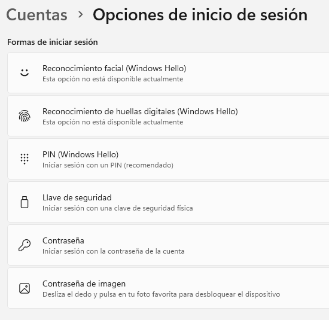{width=50%}

The available sign-in options are:

- **Facial recognition (Windows Hello)**. This identification is done using a special camera that scans the user's face using infrared rays.
- **Fingerprint recognition (Windows Hello)**. It allows access to the system using a fingerprint reader connected to the computer. We can find laptops that have this sensor built-in from the factory.
- **PIN (Windows Hello)**. Allows you to create a PIN to log into Windows.
- **Security key**. Allows you to use a physical device, similar to a USB flash drive, which is used instead of using the user name and password. These security keys usually have a fingerprint or a PIN associated with them in case the user loses the device.
- **Password**. This is the most well-known login system. In addition to the password, there is also the possibility of creating a hint to remember it in case of forgetting it.
- **Image password**. Allows you to choose an image and the gestures that the user will make on it to create their own password.

## Graphical user interface

In an operating system that starts in graphical mode, if the installation has been correct, the first thing that appears on the screen when we log in is the desktop. This desktop is made up of a background image where we normally find icons, windows and a task bar.

In a graphical operating system, the desktop is the main work screen. This screen is the starting point for doing any activity within the operating system.

The main objects on the desktop are:

- **Icons**. Icons are symbols that are used to represent objects, which can be files, disk drives, a printer, etc. When we double-click on an icon, a window opens that shows the related information or runs the linked application. Icons can be selected by clicking. Once selected, we can move them from one place to another, copy them, delete them, etc. We can also change the name of the icon, customize it, and create new ones.
- **Task bar** or ***dock***. It shows the quick-start applications and those that are currently open. It can be found anywhere on the screen, although it is usually at the bottom.
- **Notification area**. The notification area shows data such as the time, sound icons, active applications, etc. This area also allows us to check messages from the applications that we have installed in the operating system. To reduce the accumulation of elements, operating systems usually hide the icons in the notification area when they have not been used for a certain time. In Windows systems, we can find it at the far right of the taskbar.
- **Dialog box**. Dialog boxes are a type of window that allow communication between the user and the computer system. The most common type of dialog box is the one that only informs the user and only offers the option of accepting the message, although there are also question or confirmation dialog boxes, which in addition to showing information offer alternatives to the user.
- **Contextual menu**. To access the contextual menu we use the *right mouse button*. Depending on the type of object selected, the contextual menu options vary.
- **Windows**. The elements of the windows are:
- **Title bar**. This element *identifies the window* with a name.
- **Minimize, maximize and close buttons**. With these buttons we can minimize the window, that is, send it to the taskbar or *dock* to empty the desktop; Maximize it so that the window occupies the entire screen or the maximum size defined by this window, and close it, thus removing it from the desktop permanently. The size of the windows can be changed manually, just drag the edge (top, bottom or side) to expand that side. In Windows we find these three buttons in the upper right part of the window. Not all windows have them or allow changing the size; dialog boxes can only be closed and it is not possible to change the size.
- **Menu bar**. In Windows systems it is located under the title bar of the window and shows the options of the application opened in the same window.
- **Scroll bars** or ***scroll***. They can be found horizontally or vertically and appear when the content of the window is larger than this.

!!!tip "**Windows Keyboard Shortcuts**"

    Windows operating systems have a series of **keyboard shortcuts** that **allow you to perform tasks more quickly**. Some of the most common are the following page: [Keyboard shortcuts in Windows](https://support.microsoft.com/en-us/windows/windows-keyboard-shortcuts-dcc61a57-8ff0-cffe-9796-cb9706c75eec)

!!!note "**The *Windows key***"

    The vast majority of keyboards sold have a key with the *Windows* logo on it. Its main function is to open the operating system's start menu.

    It is not unique to *Windows* systems. In 1984, the *X Window System*, the graphical standard for *Unix* systems, implemented support for the modifier keys `Meta`, `Super`, `Hyper`, `Shift`, `Control`, `Alt` and `AltGr`. On personal computers, the number of keys was reduced.

    The *Windows* key, as we know it, appeared in 1994 on the *Microsoft Natural Keyboard* and quickly became a de facto standard adopted by most manufacturers.

    On operating systems other than *Windows*, this key is referred to as `Super` or `Meta`.

### Virtual desktops

Virtual desktops allow users to organize themselves better when they have many windows open at once. It's like having different monitors than the operating system, but they are not real and, in fact, they are all on the same monitor. We can have a desktop with the programs we are using, for example a virtual machine and other tools such as a text editor, and another desktop with leisure applications, so that we do not have so many applications visible at the same time so as not to lose concentration.

To create virtual desktops in Windows 11, press the key combination `Win` + `Tab`. To add a new desktop, click on the `New desktop` option, and you can repeat the process to add all the necessary desktops.

To delete a virtual desktop, click the button to close the desktop; in this case, the applications will not close, but will move to another desktop that is active.

Keyboard shortcuts for virtual desktops in Windows 11:

| Keyboard shortcut | Function |
|:-:|:-|
| `Win` + `Tab` | Open virtual desktop view |
| `Win` + `Ctrl` + `D` | Add new virtual desktop |
| `Win` + `Ctrl` + `F4` | Close active virtual desktop |
| `Win` + `Ctrl` + `->` | Switch to right desktop |
| `Win` + `Ctrl` + `<-` | Switch to left desktop |

### Accessibility

Some people may have physical limitations in using computer systems, both with hardware and software.

The accessibility tools of an operating system are those that make it easier to help people with visual, auditory, motor, or cognitive disabilities to use the computer.

The most important accessibility options in the Windows 11 operating system are the following:

- **Make the mouse and keyboard easier to use**. It allows you to change the color and size of the pointers and control the mouse with the keyboard. You can also configure the primary and secondary mouse buttons, adjust the speed, etc. In the case of the keyboard, we find options to use shortcuts such as `Ctrl` + `Alt` + `Del` with a single key and to increase or decrease the speed of key repetition. It is also possible to control the keyboard with the mouse using the on-screen keyboard.
- **Speech and sound recognition**. In cases where it is not possible to access the computer using the keyboard and mouse, the voice recognition options can be used. This allows us to use the microphone to control programs and use the voice assistant, called *Cortana*, which will help us to do tasks with the computer. Audible alerts can be replaced by visual alerts. Windows 11 also allows computer sounds to be sent through a single channel, instead of both the right and left channels, which is useful for people with partial hearing loss or deafness in one ear.
- **Cognitive improvements**. In these cases, _Windows 11_ allows you to eliminate animations to minimize distractions. You can also change the fonts to use less congested ones, improving the space between lines and words.

Other options that we can use to facilitate the use of the operating system are:

- Change the **contrast**, since there are themes available to suit all needs.
- Use the **reading** app, which lets you choose speed, pitch, or volume, and is known as Narrator in Windows 11.
- Use **Braille** displays and keyboards.
- **Magnify** objects on the screen and adjust color, window transparency, and effects using screen magnification apps like Magnifier.

## Directory tree structure

Automatic information processing is one of the fundamental elements in the computer world, so it is very important to have the data we want to work with organized in a logical and coherent way so that you can easily access it at the desired time. Structures such as **files and directories** are used to carry out this organization.

A **file** is a **set of structured data** that is **stored on a device** and can be **used by applications**. They are named this way in reference to traditional office files, written on paper, since they are similar to their paper equivalent.

These files can be created, deleted, moved, compressed, executed, etc. There are different **types of files**, depending on the content of the **information they store**, from **program** files to common **data** files.

When we organize the information on a storage device into **directories**, also called **folders**, we can separate the files from different programs and **group files with similar content**. If there are many files within a directory, they can be grouped by creating **subdirectories**. Directory and subdirectory are two ways of referring to the same concept, the difference is that subdirectory is used to refer to a directory that has been created within another.

- :material-file: **File**: Set of data that is stored on a device.
- :material-folder: **Directory** (or **Folder**): Set of files or other directories that are grouped according to their content following certain criteria.
- :material-routes: **Path**: The path that must be followed to a certain directory or file.

To perform operations on a file or directory we need to refer to them. To refer to a file or directory we have to tell the operating system the **path** it has to follow to get there. This path is called the access path or path or, in English, *Path*.

<figure markdown="span">
    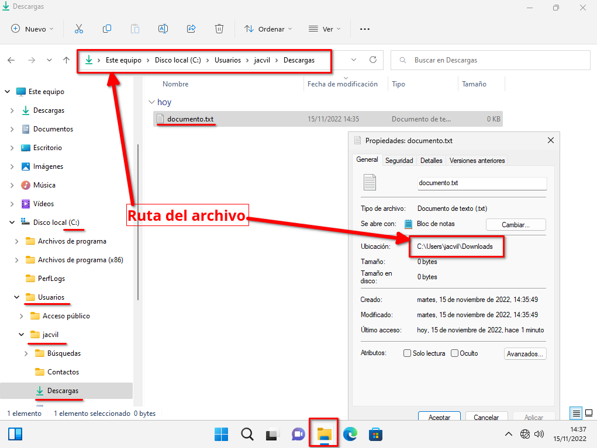{width=75%}
    <figcaption>Windows file path</figcaption>
</figure>

- **Root directory**. The root directory is the first directory in a hierarchy. It is the directory from which all other directories and files are derived. In Windows systems, the root directory is represented by the letter **`C:`**, **`D:`**, **`E:`**, etc.
- **Current directory**. The current directory is the directory in which we are working at a given time. In Windows systems, the current directory is represented by a period **`.`**
- **Parent directory**. The parent directory is the **directory that contains the current directory**. In Windows systems, the parent directory is represented by two periods **`..`**
- **Absolute path**: The absolute path is the path that starts **from the root directory** to the directory or file we want to access. _Example: `C:\Users\user\Documents`_
- **Relative path**: The relative path is the path that starts **from the current directory** to the directory or file we want to access. _Example: if our current directory is `C:\Users\user\Desktop` and we want to access the `Documents` directory, the relative path would be `..\Documents`_
- **Path separator**: The path separator is the character that separates the directories in the path. In Windows systems, the path separator is the backslash **`\`**.

### Directory properties

- **Name**. Each directory is identified by a name that is mandatory and is used to identify its content. There cannot be two subdirectories with the same name within the same directory, but they can exist within different directories.
- **Size**. Directories have a size that is measured in bytes or multiples thereof, depending on the amount of information they contain.
- **Location**. Every directory must necessarily be stored within a directory or subdirectory. In all operating systems there is the root directory, which is the first directory in the hierarchy. The location of the directory is referenced by the path where it is located.
- **Information**. Each directory will have a creation date, a last access date, and a last modification date.
- **Special directories**. In all file systems there are three directories considered special.
    - **Root directory**. It is the initial directory of the entire directory structure and where the rest of the stored information hangs. In Windows there is a root directory for each disk partition and it is represented by letters, from `C:` to `Z:`, which limits the drive letters to 24, although partitions can also be mounted on directories.
    - **Active directory** *`.`* (one periods). This is the directory that refers to the directory we are in.
    - **Parent directory** *`..`* (two periods). This is the directory that refers to the directory that contains the directory we are in. The root directory is the only one that does not have a parent directory.

### File properties

- **Name and extension**. Each file is identified with a name and an extension. The name is mandatory and serves to identify the content of the file, but the extension is optional and usually identifies the type of file. Files can be divided into two large groups, executables and data files. The difference between the two types is that the former can work independently, while the latter store information that has to be viewed with the help of the appropriate program.

    The most common file types by extension:

    - **Plain text**: txt
    - **Rich text**: doc, docx, odt, ...
    - **Image**: png, jpg, gif, ...
    - **Video**: avi, mp4, mpeg, mwv, mkv, ...
    - **Runtime or system**: exe, msc, msi, ps1, bat, dll, sys, ...
    - **Audio**: mp3, wav, wma, ...
    - **Compressed file**: zip, rar, 7z, tar, gz, bz2, ...
    - **Read or print**: pdf, epub, mobi, azw, ibook, ...
    - **Disk image**: iso, img, ...

- **File information**. Files save the date of creation, modification, and last access. In addition to this information, we also find metadata, which is used to store data about the data contained in the files. The type of information we can obtain through metadata depends on the type of file. For example, in a video we can check its resolution, audio quality, duration, geolocation, etc. In the case of photographs, we can see the model and brand of the camera, the geolocation, the resolution of the image, etc. For text files, we can check data such as the application with which it was created, the number of revisions, the number of paragraphs, etc. To see the metadata of a file, you have to view its properties. In Windows 11, you have to click on the *Properties* option and then the *Details* tab to view this information. We also have the option to delete the metadata by clicking on the *`Remove properties and personal information`* option.
- **Size**. Files have a measurement that is represented in bytes or its multiples. The maximum size of a file on a storage device depends on the file system of the partition where it is located.
- **Location**. A file is always necessarily stored within a directory or subdirectory. The location of the file is referenced by the path where it is located.

### File and directory attributes

Files and directories have attributes that determine the permissions that apply to them. The main attributes of files and directories are the following:

- **Read only**. A directory or file that has this attribute cannot be modified. Only its contents can be viewed.
- **Hidden**. Causes the file or directory to be hidden and cannot be seen in a regular listing.
- **System**. Indicates that it is part of the operating system and is used exclusively by it.
- **Directory**. This attribute indicates that it is a directory.
- **File ready to be archived**. This attribute does not indicate that it is a file, we can find it for both files and directories. It indicates whether the file or directory has to be saved when a **backup copy** is made. By default it is deactivated, and when a modification is made to the permissions or contents it is automatically activated by the operating system.
- **Indexed**. Indicates that the file or directory will be indexed to do a **quick text search** of its contents, properties or attributes.
- **Encryption**. Indicates that the file or directory is encrypted. In the case of a file, all the data in the file is encrypted. In a directory, it means that encryption is the default for all files and directories created within it.
- **Compression**. This attribute is used by the operating system to mark files that it has compressed.

In the graphical environment, we have to right-click on the file or directory and select `Properties` / `Advanced options...`.

<figure markdown="span">
    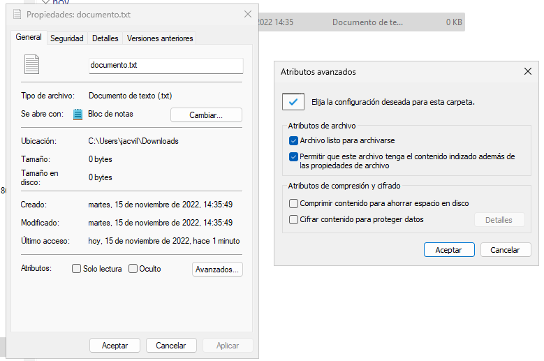{width=75%}
    <figcaption>Attributes of a text file</figcaption>
</figure>

### Windows directory tree

The organization of the file system in *Windows* is based on a hierarchical directory structure in the form of a tree, which starts at the root and branches out into directories and files.

To operate with files and directories, it is necessary to know where they are located within the hierarchical directory structure. In Windows, the root directory of the file system structure is `C:\`, and the rest of the files and directories start from this point. Although Windows has a large number of directories, the best known are:

- `C:\`. Root directory where all the directories and files of the system are located.
- `C:\Windows`. Here we find the most important files and directories of the system, such as fonts, drivers and some system applications.
- `C:\PerfLogs`. This directory stores the files that refer to the registry and monitoring of the operating system.
- `C:\Program Files`. In this directory we find the applications installed in the operating system.
- `C:\Program Files (x86)`. 32-bit applications installed, they are not mixed with 64-bit ones because they run in a subsystem to maintain compatibility.
- `C:\Users`. Here we can find the personal files and directories of the system users.
Within the profile of each user we can find:
    - `Desktop`. In this directory we find the content of the current user's desktop.
    - `Documents`. Here we find the files of the current user.
    - `Videos`, `Pictures` and `Music`. These directories are created so that the current user can store their video, image and music files.
    - `Downloads`. This is the directory where, by default, the files downloaded from the Internet by the current user are saved.

## Compression/Decompression

Compressed files take up less storage space and can be transferred to other computers more quickly. They are mainly used for backup purposes.

!!!note
    A **compressed file** is a file that has been created to take up less space than all of its parts together.

The improvement in file transfer over the network is due to the reduction in the volume of information to be transmitted and because, generally, file systems work faster with a large file than with many small ones.

Data compression is fundamentally based on looking for repetitions in data series, redundant information, and then storing only the data along with the number of times it is repeated.

!!!tip
    _For example, if a file contains a sequence such as "AAAAAA", occupying 6 bytes, it could simply store "6A" which occupies only 2 bytes, in the RLE algorithm._

The compressed file extension gives us information about which program created it and therefore we can know if our operating system or compression and decompression application is compatible. This extension can be made up of letters and numbers, and usually has a maximum of four characters.

Although the operating system has its own tools for compressing and decompressing, we can obtain other third-party applications that allow us to use other compression algorithms that are not native to the operating system.

Compression and decompression tools

There are many third-party tools for compressing and decompressing files, such as: WinRaR, WinZip, KGB Archiver, Complete Compressor, etc. There are also free ones, such as Power Archiver, IzArc or 7Zip.

The most well-known compression formats are:

- **ZIP**. This is probably the most famous compression format, because it is the native system of *Microsoft* and *Apple*.
- **GZ** or **GZIP**. This file format belongs to the GNU project; its name is the abbreviation of *GNU Zip* and it is completely free.
- **7Z**. It is an open source compression format and offers a high level of compression.
- **RAR**. This format is one of the most famous, along with the ZIP format. It is a proprietary format and has great compression power, but a slower compression time.

To compress a file or group of files in Windows, you must select the file or group of files and in the context menu that appears when you right-click, select the option `Compress to ZIP file`. This will create a new compressed file with the same name, the same location and the `.zip` extension.

To unzip a file, select it and right-click on it and choose the option `Extract all...` and follow the instructions.

Another interesting option offered by some operating systems is the possibility of compressing drives to save hard disk space. This compression is completely transparent to the user, since all the files on the disk can be accessed normally after activating this option.

It should be noted that when operating with a compressed drive, the processor has to work harder to decompress it. The computer has to decompress the compressed file, operate on it, and compress it again before writing it to the drive. Although this process does not entail a great loss of performance, it is not recommended when the computer has a slow processor.

To compress a hard disk drive in Windows, go to the `Properties` section of the disk in question and check the box
"*Compress this drive to save disk space*".

## Add/Remove/Update OS Software

Operating systems come with a variety of applications installed, from OS-provided applications to provisioned applications that are installed the first time you run the operating system. Operating systems also provide additional applications and features, such as language packs or handwriting recognition, that can be installed at any time.

To manage these OS-provided applications, go to `Control Panel` > `Programs` > `Programs and Features` > `Turn Windows features on or off`. You can also go to `Start` > `Settings` > `Applications` > `Optional Features`.

### Software Installation

Programs can be obtained from different sources, the most common are:

- **From a storage device**. We can install the software from a storage device, such as a CD, DVD, USB memory or hard drive. If the installation does not start automatically, we must explore the storage device until we find the program installation file, normally with an extension of `.exe` or `.msi` in Windows systems. We must open the file to start the installation.
- **From the Internet**. We can download the program from the Internet, and once we find the program we select "Save" in the Internet browser to download the program and then run the file.
- **From the operating system's own stores**. To obtain programs from the store we have to open the *Microsoft Store* in *Windows* and select the program we want to install to the operating system.

### Software Uninstallation

When we use a computer, it is common to have a large number of programs installed. Reviewing this list of programs is a useful way to find out if any applications have been installed without our knowledge or if we have applications that we no longer use.

!!!note
    The *software inventory* is the collection of all the software used on a computer system or network. A basic inventory consists of a record of the number of program installations, corresponding installation dates, type of programs installed, license renewal dates, and sometimes the total monetary cost of the installed programs.

To uninstall programs from an operating system we can use:

- The **operating system application management tool**.
- The **application uninstallation file**. In this case we have to find the application we want to uninstall and select the uninstallation file that the program usually includes.

In Windows we can find a list with all the programs installed on the system, their installation or update date and the size each one occupies. To access this information we can go to `Start` > `Settings` / `Applications` / `Installed applications`.

<figure markdown="span">
    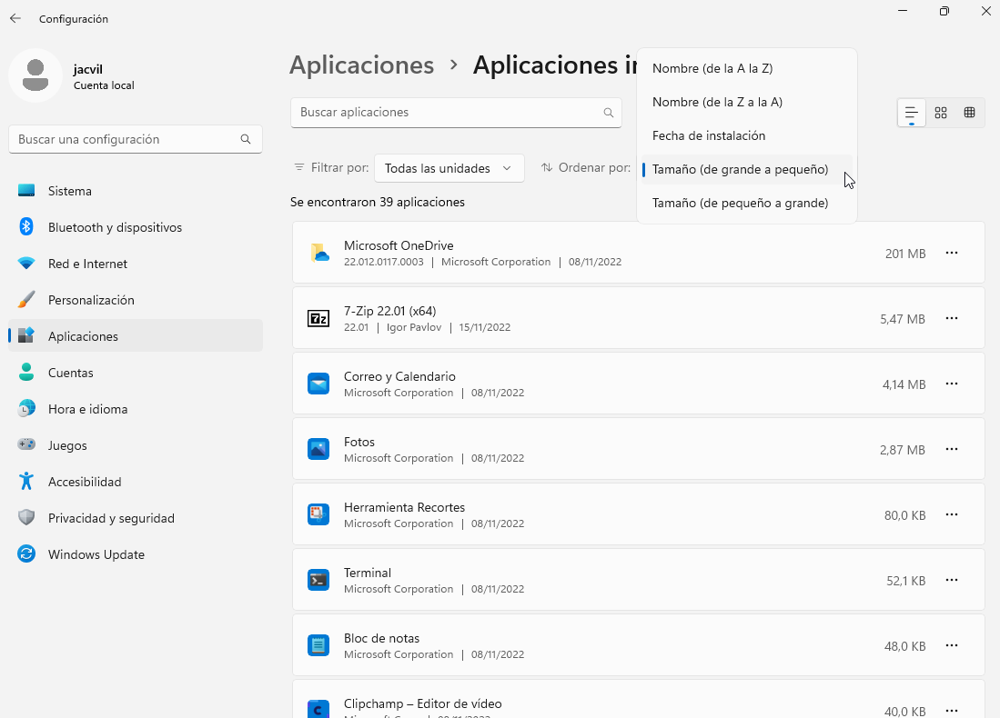{width=80%}
    <figcaption>Installed applications in Windows 11</figcaption>
</figure>

We can also manage applications from `Control Panel` > `Programs` > `Uninstall a program`.

### Software repair

Windows offers the possibility of repairing programs if they are not running correctly. To use this option we have to go to `Start` > `Settings` > `Applications` / `Installed applications` and select the application we want to repair. Then we will choose `Advanced options` (some applications do not allow this and do not have this option) and the `Repair` or `Reset` option.

### Portable applications

There are software versions that do not need to be installed on the operating system in order to be able to use them. They usually come in an executable or a folder where the configuration files and libraries are included. This allows us to use the applications from an external storage medium so that we can use them on any compatible system in a simple way.

Its disadvantages are that not all applications offer portable versions and they may not have all the features of the installed version

## Graphical user interface in GNU/Linux

In Linux distributions the graphical user interface does not run at the operating system kernel level (with a few exceptions), which allows the desktop environment to be separated and configured freely.

<figure markdown="span">
    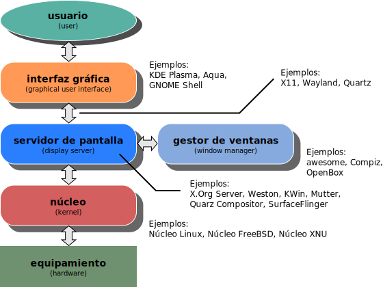{width=75%}
    <figcaption>Graphical user interface layer diagram</figcaption>
</figure>

There are many graphical environments that offer a wide range of possibilities for users. The reason is that in operating systems of the *Unix* family, the graphical interface runs as a layer above the text interface.

- The **graphical server** or *display server* is the application in charge of drawing on the screen. Any application that wants to display something on the screen will ask the graphical server to do it. It also manages the interaction with the keyboard and mouse. The main graphical servers are ***Xorg*** and ***Wayland***

- A **display manager**, or **login** manager, is typically a graphical user interface that is displayed at the end of the boot process instead of the default *shell*. There are several implementations of display managers, just as there are several types of window managers and desktop environments. There is usually a certain amount of customization available for each.

- **Window Manager**. Controls the **appearance** and **behavior** of the windows. It is responsible for the **placement** of windows on the screen, the **decoration** of the windows, the behavior of the windows when they are **moved**, **resized**, **minimized**, **maximized**, etc. The window manager is also responsible for the appearance of the windows, such as the **title bar**, the **borders**, the **buttons**, etc.

    There are several **types** of window managers:

    - **Stacking**, or floating. This is the **traditional desktop** used in systems such as _MS Windows_ or _macOS_. Windows act like sheets of paper on a desktop and can be stacked on top of each other. Some examples are *Kwin*, *Xfwm*, or *Mutter*.

    - **Tiling**. Windows do not overlap in tile-like mosaics. They typically make very extensive use of key combinations and rely less (or not at all) on the mouse. Tiling window managers can be manual, offer predefined layouts, or both. Some examples are *bspwm*, *i3*, or *sway*

    - **Dynamic**. They can dynamically switch between a tiling or floating window layout.

- A **desktop environment** is an implementation of the desktop metaphor made up of a **set of programs**, which share a **common graphical user interface**, such as icons, toolbars, wallpapers, and desktop widgets. In addition, most desktop environments include a set of built-in applications and utilities.

Some examples of popular desktop environments are: *KDE Plasma*, *Gnome*, *Xfce*, *Lxde*, *Cinnamon*, etc.

### Installing the desktop environment in *Debian*

A fundamental task for a user, especially if it is an administrator, is the installation and uninstallation of software. In the *Debian* command line, when the source of the software is the **repositories**, this task is mainly done with the **`apt`** tool.

However, there is a lesser-known tool, called _**Tasksel**_ that adds some advantages:

- It is programmed for the distributions of the _**Ubuntu/Debian**_ family.
- Works in text mode, it offers a simple-to-use interface.
- It allows the installation or uninstallation of a group of packages in a single step. These groups are made up of packages that are usually installed in a coordinated manner.
- Several groups of packages can be installed simultaneously.
- It even allows you to create your own groups of packages, to perform custom installations.

Since _Tasksel_ is part of the official repositories, installing it is as simple as running the following command:

```sh
$ sudo apt install tasksel
```

Once the tool is installed, to use it we just have to write the command:

```sh
$ sudo tasksel
```
<figure markdown="span">
    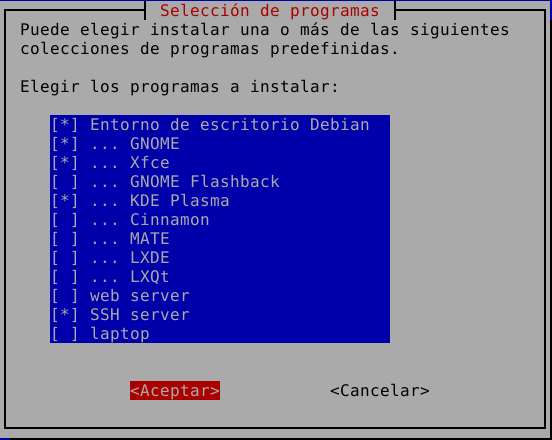{width=75%}
    <figcaption>Tasksel tool menu</figcaption>
</figure>

Its operation is very simple:

- If an entry appears marked **`[*]`**, it means that the corresponding group **is installed**.
- And if it is unchecked **`[ ]`**, the group **is uninstalled**.

Using the **arrow keys** we move to the option we want to activate or deactivate and with the **space bar** we change its status. Following this technique, we can choose as many collections as necessary.

Next, we will see how the download and installation of packages occurs.

At the end of the installation, it will close automatically and return to the terminal.

In the future, when using _Tasksel_ again, we will see that the collections that are already installed are preselected.

## Popular Linux desktop environments

### Xfce

<figure markdown="span">
    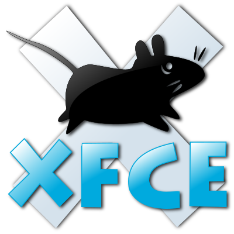{width=50%}
    <figcaption>Xfce4 desktop environment</figcaption>
</figure>

**Xfce** is a **lightweight** desktop environment for *UNIX*-like systems. It aims to be **fast** and **low system resources**, while remaining visually **appealing** and **easy** to use.

*Xfce* embodies the **traditional *UNIX* philosophy of modularity and reusability**. It is made up of a number of components that provide all the functionality you would expect from a modern desktop environment. They are packaged separately and you can choose from the available packages to create the optimal personal work environment.

Another priority of *Xfce* is compliance with **standards**, specifically those defined in ***[freedesktop.org](https:\\freedesktop.org)***.

*Xfce* contains a number of **core components** for the minimal tasks expected of a desktop environment:

- **Window manager**. Manages the placement of windows on the screen, provides window decorations, and handles workspaces or virtual desktops.

- **Desktop manager**. Sets the background image and provides a main menu, desktop icons or minimized application icons, and a window list.

- **Panel**. Switches between open windows, launches applications, switches between workspaces, and menu plugins for navigating applications or folders.

- **Session manager**. Controls login and desktop power management, and allows saving multiple different sessions.

- **Application finder**. Displays applications installed on the system by category, so you can find and launch them quickly.

- **File manager**. Provides basic file management functions and unique utilities such as bulk file rename.

- **Configuration Manager**. Tools to control various desktop settings; such as keyboard shortcuts, appearance, display settings, etc.

In addition to the basic set of modules, *Xfce* also provides numerous **additional applications and plugins**, for example, a terminal emulator, a text editor, a sound mixer, an application finder, an image viewer, an *iCal*-based calendar, and a CD and DVD burning application. You can read more about *Xfce* modules on the ***[projects](https://www.xfce.org/projects)*** page.

### KDE Plasma

<figure markdown="span">
    {width=50%}
    <figcaption>KDE Plasma desktop environment</figcaption>
</figure>

*KDE* is an international community that develops free software. It produces a desktop environment, a multitude of applications, and development infrastructure for various operating systems. The main software projects maintained by *KDE* are grouped into *KDE Plasma*, *KDE Applications*, and *KDE Frameworks*.

- **KDE Plasma** is the desktop environment that offers a modern and highly configurable look. There are *Desktop*, *Mobile*, *Bigscreen*, and *Nano* variants.

- **KDE Applications** is a set of applications and libraries designed by the *KDE* community. They were initially developed for the *Linux* world, but today a large number of them are characterized by being multiplatform.

- **KDE Frameworks** is a collection of libraries and various software *Frameworks* by *KDE*, which serve as the technological basis for *KDE Plasma 5* and the *KDE Applications* distributed under the LGPL license.

!!!note
    Some people criticize the similarity of *KDE* to the *MS Windows* desktop environment. This observation, however, falls on the selection of predefined parameters of the environment; often oriented to ease its use for new users, mostly accustomed to working with *Microsoft* operating systems.

Links of interest:

- [What is KDE](https://userbase.kde.org/What_is_KDE/)
- [KDE Applications](https://userbase.kde.org/Applications/)
- [Table of equivalent applications](https://userbase.kde.org/Table_of_equivalent_applications/)

### GNOME

<figure markdown="span">
    {width=50%}
    <figcaption>GNOME desktop environment</figcaption>
</figure>

*GNOME* provides an "intuitive and attractive" window manager. The project emphasizes **simplicity**, **ease of use**, and **efficiency**. It aims to provide the freedom to create a desktop environment that will always have the source code available for reuse under a free software license.

It aims to keep the desktop environment **accessible** to people with disabilities. It does so by using the Accessibility Toolkit (ATK) application programming interface, which allows for improved user experience through the use of special input methods and speech synthesis and speech recognition software.

Since *GNOME 2*, the focus has been on productivity. All *GNOME* programs share a consistent graphical user interface style, the design guided by concepts based on cognitive ergonomics.

*GNOME Shell* is the basic user interface of the desktop environment, controlling window management and breaking with the desktop model used in previous versions. It uses *Mutter*, a window composition manager based on the older *Metacity*, and the *Clutter* library to provide visual effects and graphics acceleration.

!!!note
    In August 2011, *Linus Torvalds* declared that he considered *GNOME Shell* to be a "devilish mess",​ due to its design flaws and poor user experience.​ Although in early 2013 he acknowledged that he is using *GNOME 3* again thanks to some of the available extensions that bring back some of the old features.​

Interesting links:

- [GNOME help](https://help.gnome.org/)

## Linux file system structure

Operating systems provide mechanisms to organize and manage files and directories on storage devices.

The Filesystem Hierarchy Standard (FHS) is a standard that defines the main directories and their contents in the *GNU/Linux* operating system and other *Unix* systems.

If we open a file manager and go to the root directory `/` we can see that it has little to do with *Microsoft* systems

<figure markdown="span">
    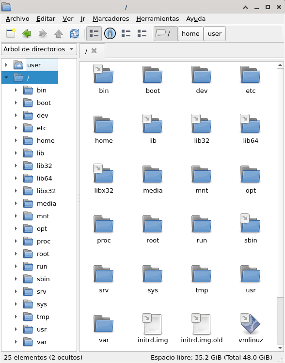{width=75%}
    <figcaption>File manager</figcaption>
</figure>

Description of main directories:

- **`/`** Root directory of the system from which the rest of the directories start. (*We could make a comparison with `C:\` in Windows but it would not be entirely correct, since in Linux there is only one root directory*)
- **`/bin`** Essential commands available to all users. Includes, for example, `cat`, `ls`, `cp`, `rm`, `mkdir`, etc.
- **`/boot`** Boot loader files (includes important boot and system kernel files, for example, the `vmlinuz` kernel, the temporary boot image `initrd.img`). Often on a separate partition or disk.
- **`/dev`** Block and character special files associated with hardware devices. All physical devices in the system, all our hardware, are found here.
- **`/etc`** System-specific system configuration files.
- **`/home`** Working directories for all users, except the superuser (administrator, *root*). Contains saved files, personal settings, etc. Often installed on a separate disk or partition. Each user has their own directory within this folder.
- **`/lib`** Shared essential libraries for programs, i.e. for binaries in `/bin` and `/sbin`. Also contains libraries for the kernel.
- **`/media`** Contains mount points for removable storage media, such as optical drives, pendrives, and can even be used to mount other partitions on the same hard drive, such as a partition used by another operating system.
- **`/mnt`** Temporarily mounted file system. This is a directory similar to `/media`, but is mostly used by users. It is used to mount hard drives and partitions temporarily on the system; it does not require a password, unlike the `/media` directory.
- **`/opt`** Contains optional software packages for static applications, which can be shared between users. These applications do not save their configurations in this directory; In this way, each user can have a different configuration of the same application, so that the application is shared, but not the user configurations, which are stored in their respective directory in `/home`.
- **`/proc`** Contains mainly text files, virtual file system that documents the kernel and the state of the processes in text files (for example, *uptime*, *network*).
- **`/root`** Root directory of the *root* user. It works like the folders in `/home`, but in this case, it is only for the superuser (system administrator).
- **`/sbin`** Essential binary system, commands and programs exclusive to the superuser (*root*), for example, *init*, *route*, *ifup*). A user can run any of these command applications, if they have sufficient permissions, or if they have the superuser password.
- **`/srv`** Specific data location that is served by the system.
- **`/sys`** Evolution of `proc`. Virtual file system that documents the kernel, but located in a hierarchical manner. In `proc` they are arranged in an anarchic manner.
- **`/tmp`** Temporary files. This is where temporary files are usually stored, such as the internet browser.
- **`/usr`** Contains most multi-user utilities and applications, that is, accessible to all users. In other words, it contains shared files, but which are nonetheless read-only.
- **`/usr/bin`** Non-administrative binary commands for all users. They are read-only, but can have their own configuration for each user in `/home`.
- **`/var`** Variable files, such as logs, spool files, databases, temporary email files, and some temporary files in general. Generally acts as a system log. Helps to find the origins of a problem.
- **`/var/log`** Log files, *log*.
- **`/var/tmp`** Temporary files that, unlike `/tmp`, are not deleted between sessions or system reboots, but are still dispensable.

More information: *[Filesystem Hierarchy Standard](https://www.pathname.com/fhs/)*

### File and directory names

File and directory names follow the following rules:

- Be between 1 and **255** characters long.
- Are **case sensitive**. *For example `som.txt`, `Som.txt` and `SOM.TXT` would be three different files.*
- Any character can be used except the slash `/`.
- Also, it is **not recommended** to use characters with special meanings in *Linux*: `\` `^` `~` `!` `#` `?` `&` `(` `)` `'` `"` `;` `·` `$` `=` `¿` `¡` `<` `>` `@` `{` `}` `*` `+`

## Software management

When managing applications for a *Linux* operating system, we must take into account several concepts.

A **software package** is a series of programs that are distributed together.

*Linux* distributions have **package management systems** that help install, remove, and keep software updated. In addition, if the package being installed has other related packages that are not included, such as libraries shared by several programs, the package management system is responsible for installing these **dependencies**.

Package management systems need to connect to **software repositories** that offer a centralized catalog of applications managed by the community of developers and users. Repositories (or *repos*) are usually configured during installation, but we can add new repositories, taking into account that they are compatible with our distribution.

Package management systems of the different _Linux_ distributions:

- **dpkg**, used by *Debian*-based systems, with `.deb` format and managed by the `apt` tool
- **RPM**, used in *Red Hat*-based systems, with `.rpm` format and managed by various tools: `yum`, `yast` or `urpmi`
- **Pacman**, used in *Arch Linux*-based systems, with compressed `.pkg.tar` format and managed by the `pacman` tool.

### Independent package systems

Apart from the package managers specific to each distribution, there are other ways to install applications using **independent systems that are valid for any distribution**.

Many application developers are implementing this type of software distribution, since they save the trouble of adapting their latest versions to each distribution, which will be done in the future by the developers and users of each independent distribution.

The advantages of these systems are:

- Not depending solely on the repository dedicated to the distribution.
- Using more up-to-date applications without fragmenting the system libraries.
- Allowing users to install applications in their workspace.

The disadvantages are:

- They do not use shared system libraries, so they consume more memory and take up more storage space.
- They are less stable than the official versions of the distribution.
- They can pose a security risk.

Among the main systems we find the following:

- **AppImage**. It allows you to distribute applications on Linux without the need for installation or administrator permissions, which is known as *portable* applications. There is no official repository, although we can find places like [AppImageHub](https://www.appimagehub.com/) where the community shares applications in this format.

To use a program packaged in *AppImage*, it is as simple as downloading the file with the extension `.AppImage` and giving it execution permissions.

- **FlatPack**. It is a utility that allows you to install applications independent of the distribution or version of *Gnu/Linux*. It is designed to run within a desktop session. Users can run applications isolated from the rest of the system.​ They need user permission to control hardware devices or access user files. There is no official repository, but one of the best known is [Flathub](https://flathub.org/)

- **Snap**. It is a universal package management system originally created by *Canonical* for the *Ubuntu* operating system. Unlike Flatpack, the system is designed to work for both desktop and command-line applications. It has one official repository, although alternative repositories can be set up.

_Snap_ and _Flatpak_ are similar packaging systems for Linux, but they have some key differences:

- **Virtualization technology**: _Snap_ uses _LXD container_ technology to virtualize applications, while _Flatpak_ uses _OCI container_ technology.

- **Application stores**: _Snap_ has its own application store called "**Snap Store**", while _Flatpak_ does not have a centralized application store, although there are some third-party stores that offer _Flatpak_ applications.

- **Update policy**: _Snap_ provides **automatic updates**, which are downloaded and installed in the background, while _Flatpak_ provides on-demand updates, meaning the user must run a command to update *Flatpak* applications.

- **Package size**: In general, *Flatpak* packages tend to be **larger** than _Snap_ packages because *Flatpak* includes all the libraries required by the application, while *Snap* uses common libraries shared by multiple applications.

## Linux file system permissions

The file and directory permission system in *Linux* is an access control mechanism used to determine who can access, modify, or execute files and directories on the system.

Each file and directory has an **owner** and an associated **group**, and permissions are set for the owner, the group, and other users. Permissions are divided into three categories:

- **Read** (r): Allows reading the contents of a file or directory.
- **Write** (w): Allows modifying the contents of a file or directory.
- **Execute** (x): Allows executing a file or accessing a directory.

These permissions are set for the owner, the group, and other users:

- **Owner** (u): Owner of the file or directory.
- **Group** (g): Group to which the file or directory belongs.
- **Other** (o): Other users who do not belong to any of the above.

<figure markdown="span">
    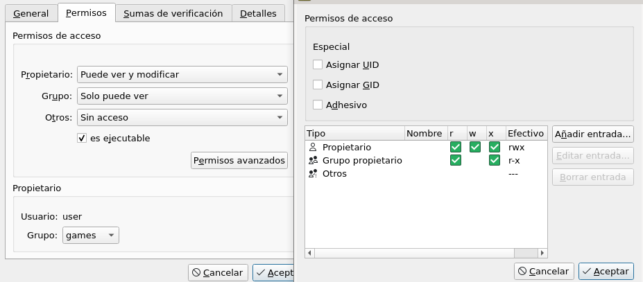{width=75%}
    <figcaption>Linux file permissions</figcaption>
</figure>

In the example you can see that the owner is "user" and has all permissions, the group is "games" and has read and execute permissions, and finally other users will not have any permissions.

In addition to the basic permissions, there are some additional permissions in Linux:

- **setuid**: allows a program to run with the owner's permissions instead of the user who runs it.
- **setgid**: allows a program to run with the group's permissions instead of the user who runs it.
- **sticky bit**: prevents users from deleting files that are not owned by them in a shared directory.

## Linux file and directory compression

Several compression formats are used in _Linux_, each with its own characteristics and advantages. Some of the most common formats are:

- **gzip** (`.gz`): This is one of the oldest and most widely used compression formats in *Linux*. It is fast and efficient at compressing single files, but is not very effective at compressing large files or multiple files at once.

- **bzip2** (`.bz2`): This is a more modern compression format than *gzip* and offers a better compression ratio, meaning that compressed files are smaller than similarly sized *gzip* files. However, the compression process is slower.

- **xz** (`.xz`): This is a very efficient compression format that uses a complex compression algorithm and offers the best compression ratio among the formats mentioned. However, compression and decompression are slower than the other formats.

- **zip** (`.zip`): is a compression format used in *MS Windows* operating systems and is also supported by *Linux*. It allows the compression of multiple files into a single file and offers the option of password protecting the compressed file.

- **tar** (`.tar`): is an archiving utility used in combination with other compression tools such as *gzip* or *bzip2*. It allows the joining of multiple files into one file without compressing them and preserving the original permissions, and then compression can be applied using external compression tools. It is common to find files with the extension `.tar.gz` which indicates that the files have been joined into a *tar* and compressed in *gzip*.

There are other compression formats available for *Linux*, but these are some of the most widely used and well-known.


<!--
## System updates

-->

<!--
## Security

-->

<!--
## Backups
What
- Personal data
- Hard disk image
- System restore points
- System recovery

## Types
- Full backup
- Incremental backup
- Differential backup
-->

<!--
## System registry

-->