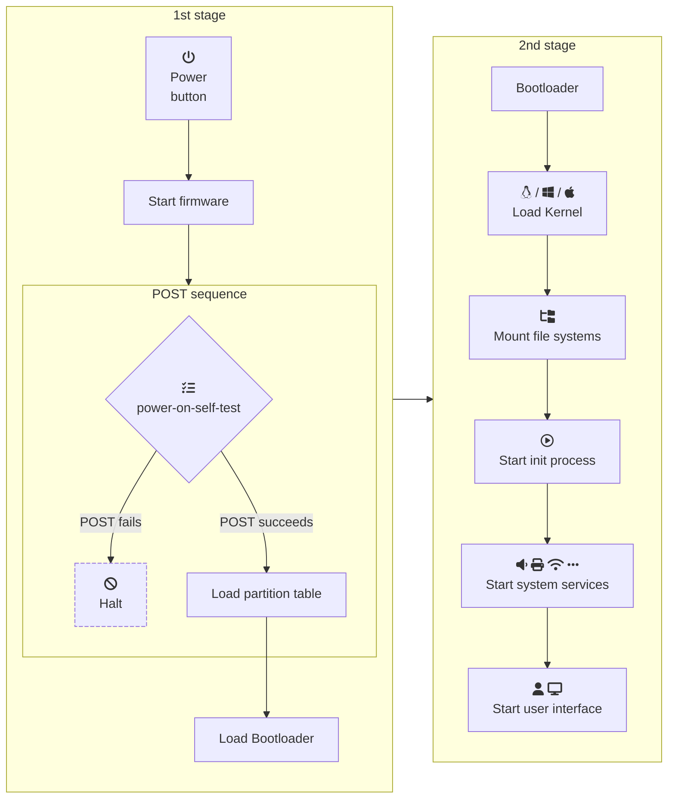

# Unit 4: Management of Operating Systems

In this unit, we will learn how to use, configure and manage operating systems. We will start with the configuration of _MS Windows_ operating systems and then move on to _GNU/Linux_ operating systems.

## Booting the Operating System

The process of booting an operating system involves loading the necessary files and programs to start the system. The boot process is divided into two main stages:

<figure markdown="span">

    <figcaption>Boot sequence</figcaption>
</figure>

1. **1st stage**: When the power button is pressed, the system starts the firmware and performs a Power-On Self-Test (POST) sequence. If the POST sequence fails, the system halts. If the POST sequence succeeds, the system loads the partition table and then the bootloader.
2. **2nd stage**: The bootloader loads the kernel, mounts the file systems, starts the init process, system services, and the user interface.

