# 5.1 _MS Windows_ Administration

In this section, we will focus on basic common administration tasks in the *Microsoft Windows* operating system.

- [1. User Profiles and Local Groups Management](#1-user-profiles-and-local-groups-management)
- [2. File System Management](#2-file-system-management)
- [3. Processes and Priorities](#3-processes-and-priorities)
- [4. System Performance](#4-system-performance)
- [5. Service Management](#5-service-management)
- [6. Storage Device Management](#6-storage-device-management)
- [7. Network Device Configuration](#7-network-device-configuration)
- [8. Task Automation](#8-task-automation)

---

## 1. User Profiles and Local Groups Management

### User Accounts

For an operating system, a **user account** is identified as the **combination** of a **name** and certain **authentication information** by which the user demonstrates they are authorized to use it. This authentication information is usually a **password**, but it could be replaced by other methods, such as an electronic ID card or another type of smart card, or even more futuristic methods, such as fingerprint or iris recognition, etc.

!!!note "Two-Step Authentication"

    Recently, two-step authentication has become essential for many of the services we use on the Internet. The idea is very simple: create a mechanism that increases security by verifying the user's identity through two different means:

    1. _Something we **KNOW**_

        For example, a username and a password.

    2. _Something we **HAVE**_: For example, a mobile phone, where we will receive a text message with an access code.

    This way, even if an unauthorized person discovers our username and password, they will still need our phone to access the account, and it must be unlocked.

    As expected, the received access code will be for one-time use and will expire after a certain period, depending on the service provider.

Normally, a user account is associated with a person who authenticates to use the computer. However, in certain situations, it may be a program on a computer that needs to authenticate to a server to obtain a specific resource or service.

When authentication uses a *password*, it must have sufficient complexity because it serves a dual purpose:

- Prevents access by unauthorized individuals.
- Associates that access with an individual who will be responsible for it.

For this reason, the use of user accounts by multiple people indiscriminately should be avoided at all costs.

!!!warning "Password complexity"

    When necessary, a protocol will be established to ensure sufficient complexity in user passwords. For example, by using various types of characters (uppercase, lowercase, symbols, and/or digits) and setting a minimum length.

In general, operating systems usually have three different types of accounts, with which their respective users will have different levels of control over the system. These are:

- **Standard accounts**: Generally, they can **perform user tasks** that are **not** administrative in nature.

- **Administrator accounts**: They offer control over all aspects of the operating system, so they **should be used with caution** and only for the activities they are intended for.

- **Guest accounts**: They are usually used to allow **occasional users** to use the system. Their capabilities are very limited.

    !!!note "Guest User Accounts"

        Guest user accounts can be very useful when using the computer for demonstrations or when offering its use to different people over time (hotels, restaurants, etc).

        In other contexts, when they are not needed, it may be convenient to disable them for security reasons.


On the other hand, the concept of a **user account** is associated with the concept of a **session**. We understand **session** as **the consecutive time during which a user account is active** in the operating system. Therefore, it extends from the moment the user authenticates, which is known as **logging in**, until they leave the system, which is known as **logging out**.

Additionally, a **user account** is associated with a set of **permissions** and **privileges**.

- **Privileges** define _**what the user can do**_ in the system once the session is started, _for example, shutting down the system, making backups, change the system time, load a device driver, etc._.
- **Permissions** define _**where access is granted**_ and under what conditions. A permission is linked to an object, such as a file, folder, or printer. _For example, reading, writing, or executing a specific file or folder_

When a privilege conflicts with a permission, the **privilege always takes precedence**. _For example, a user with backup privileges can copy all files, even if they do not have read permissions for them._

Another aspect related to user accounts is **user profiles**. These define the **appearance** and **configuration** of each specific user, from the desktop background or the set of icons used to the documents they work with or the files they have downloaded.

Therefore, when a user logs into an account for the first time, they will encounter a work environment with all **default values**, even if the system has been used by other accounts for an extended period and those accounts have been previously customized.

In general, according to their **scope**, there are several **types of accounts**:

- **Local accounts**: Authentication is handled by the operating system of the computer where we authenticate, and it only provides access to its resources. To authenticate with the same credentials on different computers, identical accounts must be created on each of them. Even so, each account will only provide access to the resources of the computer where it is located.

- **Network user accounts**: Typically, authentication is handled by **a computer acting as a server** on the network, and when successful, it allows access to resources offered by different computers on that network. Therefore, we can use the same account to access from different computers belonging to the same network.

- **Microsoft user accounts**: This is a particular case for _MS Windows_ operating systems, which associate a user account with an email address and a password, so that all account information is stored on _Microsoft_'s servers, allowing all configurations and preferences to be shared automatically across all devices using the same authentication credentials. In reality, we could consider this a particular case of a network user account.

Logically, user administration becomes more important as the number of users with diverse characteristics increases. In any case, in this document, we will refer exclusively to local user accounts.

### Local User Accounts

We have indicated that most operating systems have three types of accounts: Administrator, User, and Guest. However, in the latest versions of the *Microsoft* operating system, there has been a reinterpretation of this concept, providing three types of accounts:

- Administrator accounts
- Standard accounts
- Child accounts

If you are the one who installed the operating system, *MS Windows* assumes that you will be one of its administrators. We will be able to make any changes to its configuration, add new user accounts, install or remove programs, view or modify the content of any file on the computer, install or configure any hardware device, etc.

As expected, any computer with *MS Windows* must have at least one administrative account, even if we do not plan to perform administrative tasks frequently.

Standard accounts are designed for users who do not need to make any of the aforementioned changes to the system. From these accounts, any daily work can be carried out, but administrative tasks cannot be performed.

These types of accounts are perfect for the daily use of any user, including the one who performs administrative tasks. Keep in mind that if you are an administrator user and run a program, it can use your privileges to alter the system. For example, a virus that has infected the program we are using will have a much harder time spreading to the rest of the system when we use a standard account than if we do so with an administrator account. Therefore, it is recommended that the user who performs administrative tasks has two user accounts: one to administer the computer and another for daily use.

On the other hand, in *MS Windows*, to perform administrative tasks from a standard user account, you only need to know the password of an administrator account.

Child accounts are simply standard user accounts with **parental controls** enabled. For this reason, these types of accounts do not appear individually in the *MS Windows* *Control Panel*.

---

### Creating a Standard User Account in Windows 11

We can easily add standard accounts from the "_**Settings panel**_".

<figure markdown="span">
    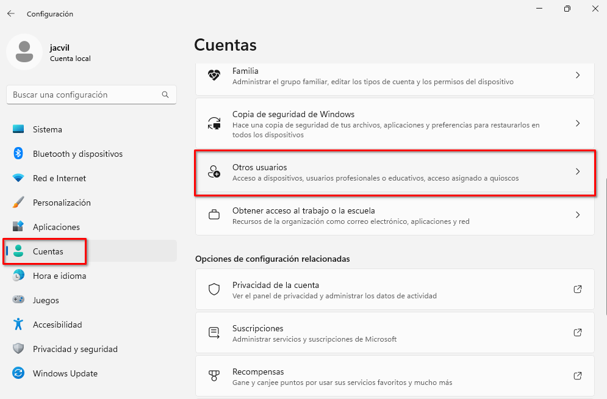{width=70%}
    <figcaption>Open the Settings panel, select "Accounts" and go to "Other users"</figcaption>
</figure>

<figure markdown="span">
    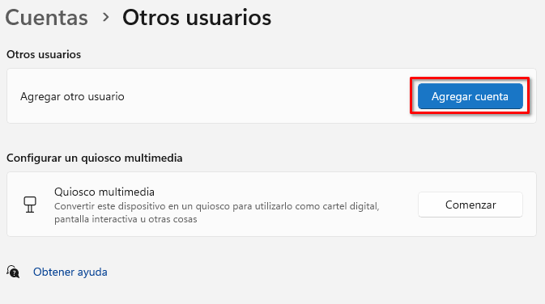{width=70%}
    <figcaption>Click on "Add account"</figcaption>
</figure>

<figure markdown="span">
    {width=70%}
    <figcaption>Write the access credentials for the new user</figcaption>
</figure>

<figure markdown="span">
    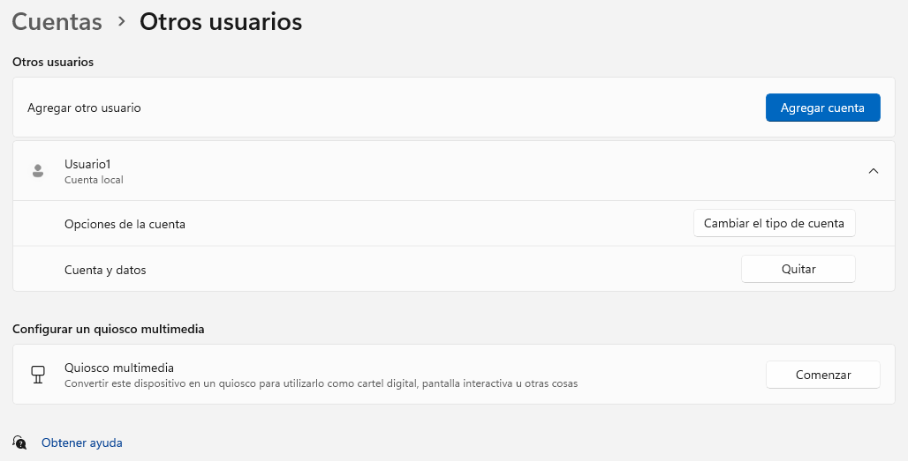{width=70%}
    <figcaption>Once the process is finished, it will appear in the list</figcaption>
</figure>

---

To manage users more comprehensively, we must use the "_**Local Users and Groups Manager**_". We can access the tool by running the command **`lusrmgr.msc`** or by right-clicking on the Start menu icon, opening "_**Computer Management**_" and selecting "_**Local Users and Groups**_"

<figure markdown="span">
    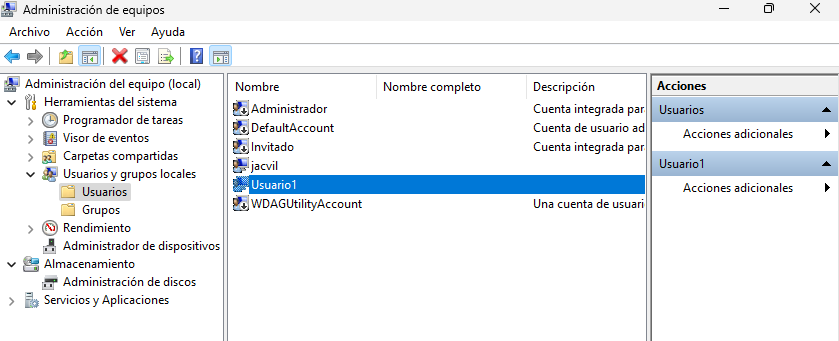{width=80%}
    <figcaption>Computer Management > Local Users and Groups</figcaption>
</figure>

Right-clicking on a user brings up a context menu from which we can perform various actions. Generally, we will open the "_**Properties**_".

By default, we will be on the "_**General**_" tab, which contains the same data we entered when we created it, although now there is an additional option that allows us to lock the account.

We also have two new tabs that will allow us to adjust the profile characteristics of the user account and check the groups to which it belongs.

<figure markdown="span">
    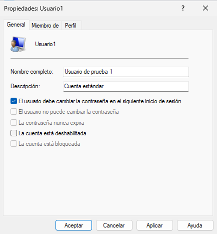{width=85%}
    <figcaption>User properties</figcaption>
</figure>

---

### Groups

In a business environment, even a medium or small one, we might find ourselves needing to create different user accounts with the same permissions and privileges. In such cases, we could end up configuring the same characteristics repeatedly for different accounts.

The solution in these situations is **user groups**. The idea is to create a group that holds the common permissions and privileges. Once the group is created, we only need to **make the user accounts _members_ of the group** to **inherit** all the **characteristics** we established for it.

When a new user needs to share the characteristics of the previous ones, it will be enough to make them a member of the group. Similarly, if a user should no longer have certain permissions, it will be enough to remove their account from the group members.

Additionally, **a user account can be a member of more than one group**, making it very easy to group resources with common characteristics into groups and control which users access them.

There are two types of group accounts according to their scope of influence:

- **Local group accounts**: Their scope will be the computer on which they were created, and their members will be local user accounts.

- **Network group accounts**: Their use is oriented towards network installations, where resources are offered to all client computers on that network. Therefore, they will have permissions and privileges related to the shared resources on the network, and their members will be network user accounts.

In our case, we will focus exclusively on local group accounts.

---

### Local Groups in Windows

When we install the system, a series of groups are automatically created with a default configuration that facilitates the assignment of privileges.

<figure markdown="span">
    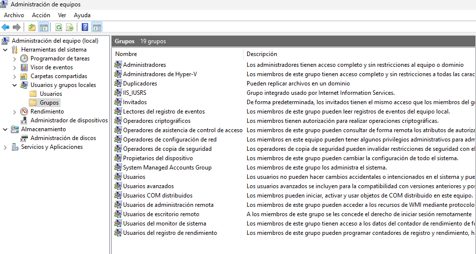{width=80%}
    <figcaption>Built-in groups into the MS Windows 11 operating system</figcaption>
</figure>

Some of the groups that exist by default in Windows are:

- **Administrators**. Users in this group have full and unrestricted access to the computer.
- **Guests**. Users in this group have more restricted access to the system than a standard user.
- **Network Configuration Operators**. This group grants its members privileges to manage network settings.
- **Backup Operators**. This group includes users with permissions to back up or restore files.
- **Users**. All standard users belong to this group, which prevents users from making accidental changes that could affect the system.
- **Remote Desktop Users**. Users in this group can log in remotely.

---

To create a group account, we will use the **`lusrmgr.msc`** tool, or alternatively, the "_**Computer Management**_" panel.

Within the "_**Groups**_" section, right-clicking opens a dialog where we select "_**New Group...**_"

We can add users using the "_**Add...**_" button.

<figure markdown="span">
    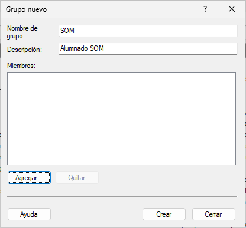{width=80%}
    <figcaption>Create a new group</figcaption>
</figure>

To search for users, click the "_**Advanced options...**_" button.

<figure markdown="span">
    {width=80%}
    <figcaption>Dialog for selecting users</figcaption>
</figure>

---

If we click the "_**Find Now**_" button, it will display the complete list of users and groups on the system.

<figure markdown="span">
    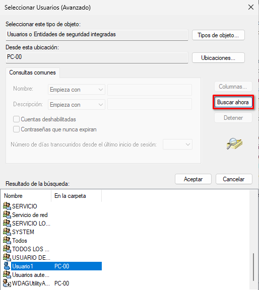{width=70%}
    <figcaption>Advanced dialog for selecting users</figcaption>
</figure>

Once added, it will appear in the list of members of the new group.

<figure markdown="span">
    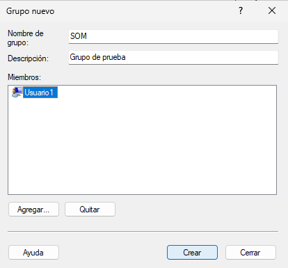{width=80%}
    <figcaption>Dialog for creating a new group with a member added</figcaption>
</figure>

<!-- {width=50%} -->

We can go to the **user's properties** and in the "_**Member of**_" section, it will show which groups the user belongs to.

<figure markdown="span">
    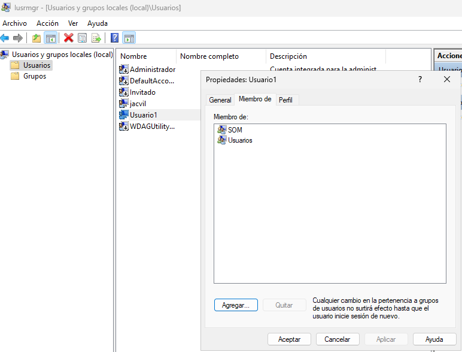{width=80%}
    <figcaption>Groups to which a user belongs</figcaption>
</figure>

---

### Managing Local Password Policies and Account Lockout

We can manage the system's security level by modifying the password and account lockout policies.

Password policies allow us to adjust the parameters for complexity and validity.

<figure markdown="span">
    {width=80%}
    <figcaption>Local Computer Policy / Computer Configuration / Windows Settings / Security Settings / Account Policies / Password Policy</figcaption>
</figure>

In the account lockout policies, we can define the number of incorrect attempts before the user account is locked, and for how long it will remain locked.

<figure markdown="span">
    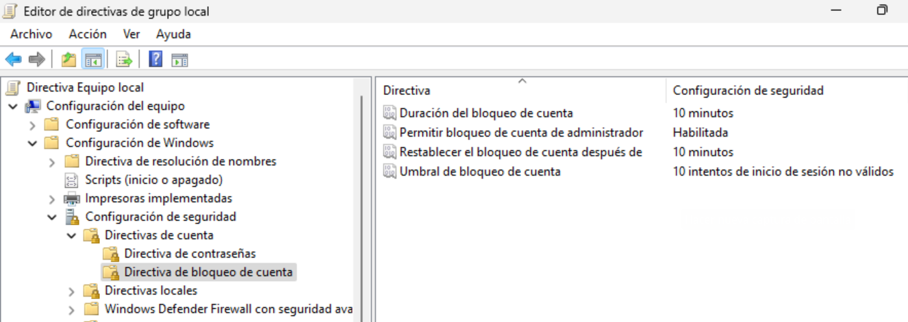{width=80%}
    <figcaption>Local Computer Policy / Computer Configuration / Windows Settings / Security Settings / Account Policies / Account Lockout Policy</figcaption>
</figure>

---

## 2. File System Management

The operating system must control which users can access each of the resources it manages, such as files, directories, printers, network connections, etc.

Typically, systems use **Access Control Lists** or *ACLs* to achieve this. These lists are associated with resources and specify the different users and groups who can access them and under what conditions (read, write, execute, etc.).

Additionally, each file can have different attributes associated with it, which provide information about certain characteristics of the file or how the operating system should handle it. For example, a file can have attributes such as directory, hidden, system, encrypted, etc.

Now that we know different aspects of users and groups, we are ready to learn how to modify restrictions on the use of files and directories.

### Directory Permissions in MS Windows

One of the first things we need to know about the directory structure in *MS Windows* is that **each user account** that logs into the system will **have a folder** where all the configuration related to that user's work environment will be stored, including aspects such as screen settings, network connections, printer configurations, etc.

This information, known as the **user profile**, is organized into different files that are created when the user logs in for the first time.

In this way, the operating system ensures that multiple users can use the same computer and that each one finds, upon logging in, the same environment they left when they logged out previously. Additionally, changes made by one user in personalizing their workspace will not affect any other user on the computer.

These folders are located within the volume where the operating system is installed, usually at **`C:\Users`**.

When a user from the _Administrators_ group tries to access another user's profile folder, they receive a **warning** informing them that they do not have permission to do so. However, since they have sufficient privileges, they can click the "_Continue_" button to access its contents.

<figure markdown="span">
    {width=80%}
    <figcaption>Request for permission to access another user's profile</figcaption>
</figure>

---

However, the change in permissions will only be completed if approved by a user with administrative privileges, as the system will display a window requesting their password.

<figure markdown="span">
    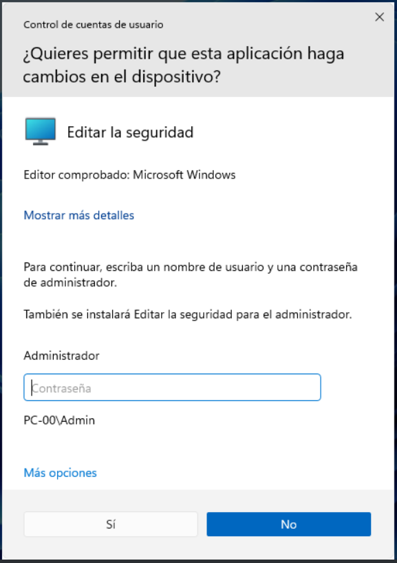{width=45%}
    <figcaption>Request for permission to access another user's profile</figcaption>
</figure>

### Sharing the Profile with another user

As mentioned above, a user who does not belong to the administrators group can only access another user's data with the approval of an administrator user.

It is always possible for a user to voluntarily share their profile with a different user. This can be done individually with a specific user or with all members of a group.

_Right-click_ on the folder that matches your account name. In the context menu that appears, choose the "_**Grant access to**_" entry.

A new menu will appear with several options, including the names of different users on the system. If you want to share the folder with a single user and only grant them read permission to your files, simply click on their name.

Additionally, we have an option titled "_**Specific users...**_", which will allow us to add multiple users at once and change their permissions (the actions they can perform) on our files.

<figure markdown="span">
    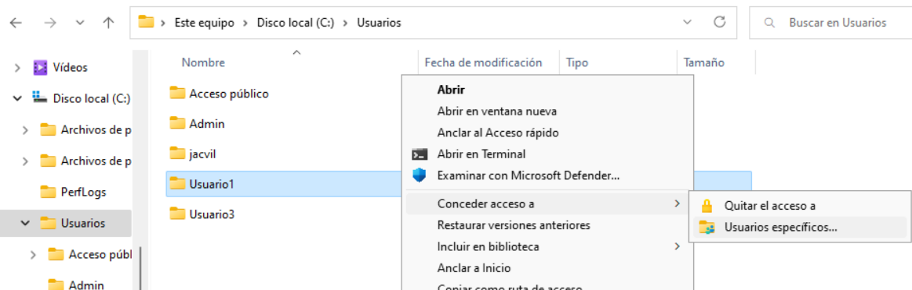{width=80%}
    <figcaption>Context menu to grant access to specific users</figcaption>
</figure>

In the dropdown, we can select _users_. Once added, we can modify the permissions.

<figure markdown="span">
    {width=70%}
    <figcaption>Dialog to add users and permissions to a folder</figcaption>
</figure>

Lastly, if there are subdirectories, it will ask for confirmation to change the settings.

<figure markdown="span">
    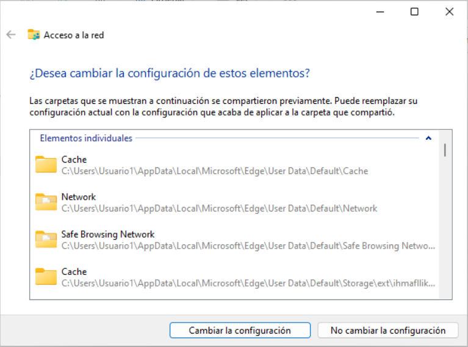{width=70%}
    <figcaption>Confirmation of changing permissions in subdirectories</figcaption>
</figure>

On the other hand, we can specify specific permissions from the "_**Security**_" section of the directory properties by clicking the "_**Edit...**_" button.

<figure markdown="span">
    {width=100%}
    <figcaption>Directory properties > Security > Edit...</figcaption>
</figure>

### NTFS Permissions and Inheritance

The standard _**NTFS**_ permissions that can be assigned to a folder are:

- **Full control**: to read, change, create, and execute programs or folders.
- **Read & execute**: to view the content and run programs in a folder.
- **Modify**: to change files and folders, but not create or delete new files or folders.
- **Read**: to view and open the content.
- **Write**: to create and change existing files and folders.
- **List folder contents**.

These permissions can be assigned to users or groups, and could be **granted** or **denied**. When a permission is **denied**, it **takes precedence over** any permission that is **granted**.

The **inheritance** describes **how the permissions propagate** through the resources a folder contains.

**By default**, when a folder is created, it **inherits** the permissions of its parent folder. This means that the permissions of the parent folder are copied to the new folder.

**Explicit** permissions, unlike inherited permissions, are those **configured directly** on a resource. That is, those established specifically for that particular resource.

Sometimes, it may be necessary for permissions not to be inherited downwards, but to be maintained at the same level. In these cases, it is necessary to **break inheritance**. This can be done by selecting the "_**Disable inheritance**_" option. Once inheritance is disabled, the permissions of the parent folder will no longer be copied to the child folder.

In these cases, one of the following paths should be taken:

- Redefine the permissions explicitly.
- Remove inheritance on the child object.
- Remove inheritance at the parent level, which will stop the downward extension (to the children).

To control inheritance, we must access "_**Advanced options**_" within the "_**Security**_" section.

<figure markdown="span">
    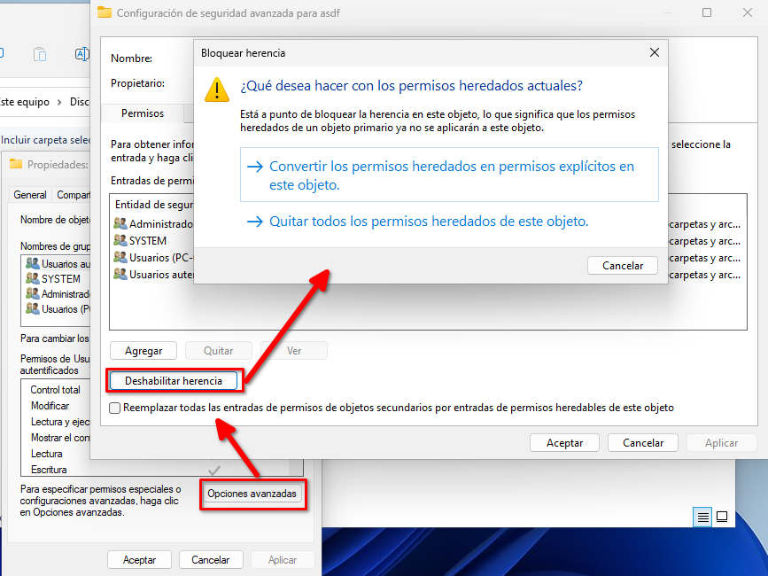{width=100%}
    <figcaption>Directory properties > Security > Advanced</figcaption>
</figure>

### Access to the Common Folder

Within the `C:\Users` folder, there is a folder that can be used by all users of the computer to share information. This is the "_**Public**_" folder located at **`C:\Users\Public`**.

By default, all users have read permissions for this folder. However, if we want to share files with other users, we can create a subfolder and grant them the necessary permissions.

## 3. Processes and Priorities

The main memory of the computer can host hundreds of tasks that take turns using the processor. One way the operating system improves performance is by assigning different **priorities** to these tasks.

A good general approach is to give **higher priority** to processes that perform **interactive tasks**, meaning those that **communicate directly with the user**. These processes require a quick response from the system to provide a good **user experience**. On the other hand, processes that do not interact with the user can run at a **lower priority**.

Interactive processes are said to run in the **foreground**, while those that are not are said to run in the **background**.

As expected, a process running at a **higher priority** will have **more processor time** than one running at a **lower priority**. This is because the operating system will allocate processor time to the process with the **highest priority first**.

An example of this can be the task responsible for printing a document. Printers are probably the slowest devices we use. Thus, the task responsible for printing only needs to obtain the processor's use occasionally to provide a sufficient data flow for the printing process. Therefore, this would be an ideal task to run at a low priority (in the background), and while it performs its job, interactive processes will continue to function almost as quickly as if we were not printing.

### Execution Priority in MS Windows

In general, *MS Windows* only allows us to choose whether interactive programs or background programs should run with higher priority.

<figure markdown="span">
    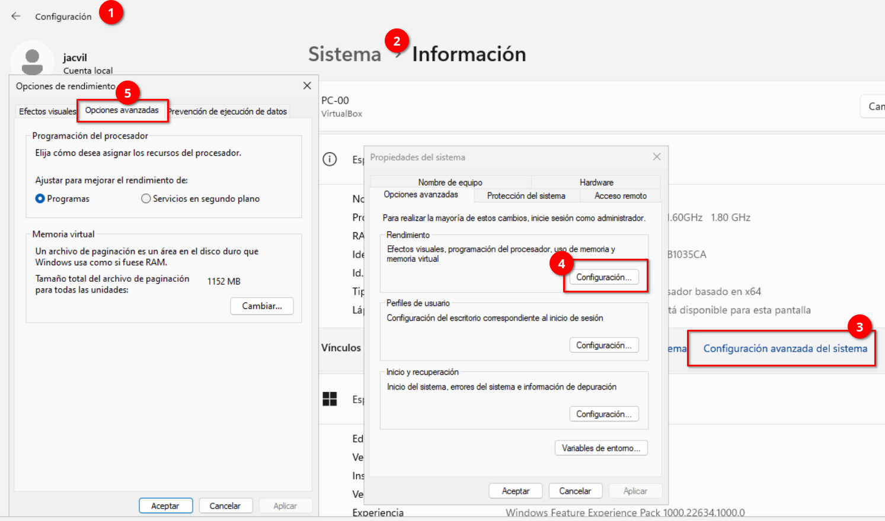{width=80%}
    <figcaption>Adjust processor performance</figcaption>
</figure>

However, if you want to modify the priority of a particular task, you can always use the _Task Manager_.

<figure markdown="span">
    {width=70%}
    <figcaption>Modify process priority</figcaption>
</figure>

---

## 4. System Performance

In general, we can define the concept of **performance** as the **speed with which a computer performs the tasks** assigned to it (system-related, application and services). Initially, system performance will be limited by various aspects:

- **Processor** speed.
- The amount and speed of **main memory**.
- The speed of **storage devices** (usually hard drives).
- The speed of **network** interfaces.

!!!tip

    Sometimes, one of the programs we are running in *MS Windows* stops working and we have no way to close it. There is a simple solution: restart the system.

    However, this forces us to save the files we are working on in other applications, wait for the system to shut down and restart, and finally, reopen the applications and files.

In _MS Windows_ operating systems, we have the **Task Manager**, a tool that allows us to examine system performance data and identify potential bottlenecks.

To start the **Task Manager**, simply _right-click_ on the "_Start_" icon _or_ press the `Ctrl`+`Alt`+`Del` key combination.

<figure markdown="span">
    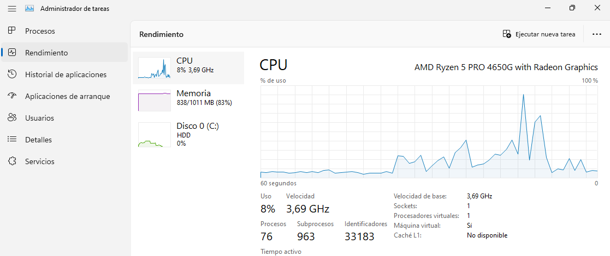{width=80%}
    <figcaption>Task Manager in the "Performance" section</figcaption>
</figure>

To get detailed information about the resources each process is consuming, there is a tool called **Resource Monitor**.

<figure markdown="span">
    {width=80%}
    <figcaption>Resource Monitor</figcaption>
</figure>

---

### System Activity Monitoring

In a modern operating system, all important actions are recorded in an **event log**. These records include **warning** messages and **errors**, and it is important to monitor them periodically to ensure there are no significant issues. If there are, we have the opportunity to resolve them before they have serious repercussions.

The _MS Windows_ tool that allows us to view and manage events logged by both system services and various applications is called the **Event Viewer**. It provides a powerful and centralized way to understand what is happening in our operating system.

The **Event Viewer** is essential for monitoring **performance** and resolving any **issues**. From it, we can perform the following tasks:

- **View the events** that have occurred.
- **Create filters** for the events that interest us most and save them as custom views that we can reuse at any time.
- **Schedule a task** to run in response to a specific situation.
- **Set up subscriptions** to certain events.

Events are classified into different **categories**:

1. *Custom Views*: Allow us to restrict the events shown based on our preferences.
2. *Windows Logs*: Store events related to the entire **system** and legacy applications.
3. *Applications and Services Logs*: Contain events related to specific **applications** or components.
4. *Subscriptions*: Used to collect **events** from other networked computers and store them locally.

The _MS Windows Logs_ category acts as a container for several subcategories that will be familiar to advanced users of other _Microsoft_ desktop systems. Specifically, we find the following:

- *Application*: Here, applications and services that are not part of the system log their events.
- *Security*: Includes information on events related to system security.
- *Setup*: Where information on events related to the configuration of roles and features is logged.
- *System*: Contains information on system events and its components.
- *Forwarded Events*: Contains information forwarded by other systems on the network.

<figure markdown="span">
    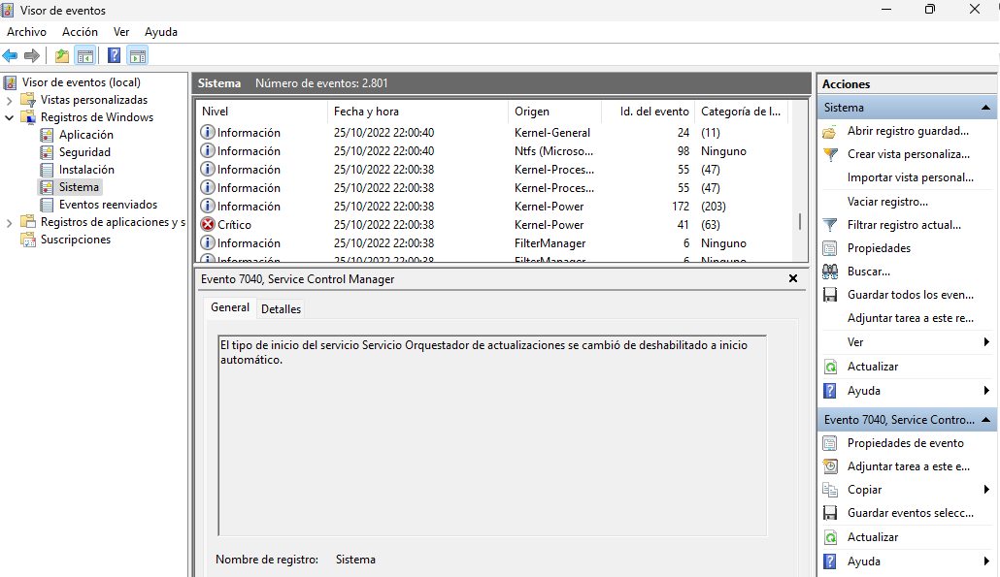{width=90%}
    <figcaption>Event Viewer</figcaption>
</figure>

---

## 5. Service Management

Services are a **particular type of process** that usually **runs in the background**, meaning the user is not directly aware of their presence and typically waits for a specific event to provide a certain service to the user.

During the operating system's startup, numerous services are initiated, occupying memory and processor time. **Some of them may never be needed**.

If we want to maximize our computer's processing capacity, **we might consider disabling services that are not necessary** for our use of the computer. However, we must keep in mind that, in most cases, their operation is highly optimized (especially those of the operating system itself) and, if not used, they soon get paged to disk. Additionally, we should consider two main **drawbacks**:

- If we disable a service necessary for the operating system, **it may stop functioning** correctly.
- A service that is not needed at the moment and is disabled will need to be **re-enabled in the future** if it becomes necessary.

In any case, as the number of installed programs increases, there may be less optimized services. Even in systems like _MS Windows_, services associated with a particular program **may remain** running **even** after **the program has been uninstalled**. There may even be services acting as **spyware**. For all these reasons, it is useful to know how to manage system services.

If you are considering disabling some services on your system, the following table provides some suggestions:

<figure markdown="span">
    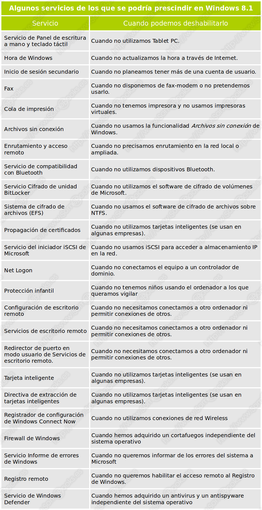{width=80%}
    <figcaption>Windows Services</figcaption>
</figure>

A typical example would be **restarting** the "_Print Spooler_" service when there are pending jobs:

<figure markdown="span">
    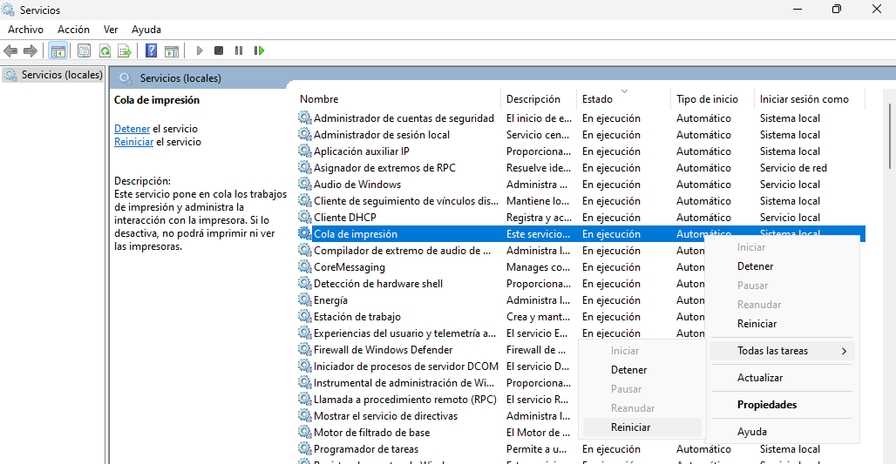{width=90%}
    <figcaption>Restarting the "Print Spooler" service</figcaption>
</figure>

---

## 6. Storage Device Management

When we need more disk storage space, we can compress files, move them to an external storage device, or even delete those we no longer need. However, a good alternative is to add a new hard drive to our system. Hard drives have a great price-to-storage capacity ratio and are very easy to install.

Moreover, in most cases, the computer will automatically detect them, and we will only need to configure the operating system to use them.

In this section, we will assume that the hardware part is already resolved. That is, you have already opened the computer and correctly connected a new hard drive inside it. Here, we will focus on the adjustments we need to make in the operating system to get the most out of it.

In most operating systems configuring a disk that has been added inside the computer or connected via a USB port is practically identical. The only difference is that the former will be permanently connected to the computer, while the latter can be removed at any time.

In the context of storage devices, the terms **volume** and **partition** are often used interchangeably. However, they are not the same.

- **Disk**: A disk is a **physical storage device** that can be divided into one or more partitions.
- **Partition**: A partition is a **section of a hard drive** or other storage device that has been created using a partitioning tool. It is a **physical division** of the storage device.
- **Volume**: A volume is a storage area that **has been formatted** with a **file system**. It can be a partition on a hard drive, a USB flash drive, or any other storage device.

Other terms related to storage devices are:

- **Mirror**: A mirror is a **copy of a volume** that is stored on a different disk. If the original volume fails, the mirror can be used to restore the data.
- **Stripe**: A stripe is a **volume that is spread across multiple disks**. This can improve performance because the data can be read from or written to multiple disks simultaneously.
- **Fault tolerance**: Fault tolerance is the ability of a system to continue operating even if one or more components fail. For example, a system with a mirrored volume can continue to operate if one of the disks fails.
- **Redundancy**: Redundancy is the duplication of critical components or functions of a system with the intention of increasing reliability of the system. For example, a system with a mirrored volume has redundancy because the data is stored on two disks.
- **Parity**: Parity is a method of error checking that uses a special bit called a parity bit. The parity bit is used to detect errors in data transmission. For example, a RAID 5 volume uses parity to provide fault tolerance.

### Disk Management in MS Windows

In _MS Windows_, we can use two different ways to configure disks:

- **Basic**: This is used by most personal computers because it is the easiest to manage. In the basic configuration, each partition (or volume) is an independent entity, so it cannot share data with other partitions.

- **Dynamic**: This configuration is used in servers and other systems where fault tolerance is important. In this case, the partitions are combined into a single entity, so data can be shared between them. In _MS Windows_ we can create up to 1000 dynamic volumes per disk group, although boot time increases as the number of volumes increases. The recommended number of dynamic volumes is 32 or fewer per disk group.

    **Types of dynamic volumes:**

    - **Simple**: The disks will behave in the usual way. This type of volume can be mirrored but is not fault-tolerant.

    - **Mirrored**: Two identical copies of a volume are created, appearing as a single entity. Each write is replicated on the mirror disks, and simultaneous reads of different data can be performed, increasing performance. The different disks can operate independently (with different controllers), so if one disk fails, the system can continue to function from the one that remains active. This increases fault tolerance.
    
        Logically, disks with the same characteristics should be used. Otherwise, the capacity of the smallest disk is taken as a reference.
    
        This configuration is equivalent to **RAID-1**.

    - **Striped**: Uses several disks to create a single logical unit, allowing the available space to be used very efficiently. It achieves a performance improvement in both reading and writing because operations are carried out on different disks simultaneously.
    
        In this configuration, volumes cannot be mirrored and are not fault-tolerant.

    - **Spanned**: A variant of striped. Although it improves performance, it is more vulnerable to write errors.

        Disks with the same characteristics should be used. Otherwise, the capacity of the smallest disk is taken as a reference.

        This configuration is equivalent to **RAID-0**.
    
    - **RAID-5**: Distributes data across three or more disks, using one of them (which alternates) to store parity information that allows data recovery when a disk fails. Therefore, it is fault-tolerant. It improves efficiency compared to the previous ones, although the parity calculation slightly penalizes write performance.


### Basic RAID Levels

Among all the storage devices present in the computer, hard drives offer the lowest performance.

To mitigate this problem, the RAID standard (_Redundant Array of Independent Disks_) was developed. RAID is a system that stores data using different storage devices to create a single logical volume.

With RAID, performance is improved in two ways:

- If the data is **duplicated** on multiple disks, we can use the one that offers the best performance.

- If the data is **distributed** across multiple disks, we can perform **parallel reading**.

Additionally, redundancy can be included to **improve the reliability** of the storage medium and compensate for the increased probability of failure as the number of involved devices increases.

The disk array can be managed by a hardware controller or specific software, but in any case, the system will see it as a single volume. Moreover, the volume capacity can grow gradually by increasing the number of involved devices.

The basic definition of RAID consists of seven levels, numbered from 0 to 6, to which some complementary levels were later added.

#### RAID 0 (or disk striping)

**Distributes data** across the disks in the array, allowing for **parallel reading or writing** of blocks, significantly **increasing performance**.

Data is organized into strips, which can correspond to physical blocks or sectors. This way, the operating system handles them as if they were a single disk.

The strips are assigned in a rotating manner among the disks in the array. Thus, when a read operation involves several consecutive strips, they can be read in parallel, greatly enhancing performance.

<figure markdown="span">
    {width=25%}
    <figcaption>RAID-0 configuration diagram</figcaption>
</figure>

Unlike other RAID levels, this one **does not offer redundancy**. This means that **if a disk fails, all data would be lost**, and we would only **have to rely on backups**. In return, it offers high performance, which increases with the number of disks, and the utilization of storage capacity is maximized.

#### RAID 1 (or mirroring)

Unlike the previous case, which did not consider redundancy, here it is complete, as it is achieved by **duplicating all stored content**. It would be like RAID 0, but assigning each strip to two different disks. In this way, we will have pairs of twin disks.

Obviously, its **main drawback is the cost**.

<figure markdown="span">
    {width=25%}
    <figcaption>RAID-1 configuration diagram</figcaption>
</figure>

However, in RAID 1, parallel reads of two different strips can be performed, or a strip can be obtained from the disk that offers the highest speed at any given moment (shorter seek time and latency). However, **writes will be duplicated** and will be performed at the **speed of the slowest device** in the pair.

Additionally, when a disk fails, the data remains available, and it is enough to replace the damaged disk for the data to be duplicated again and restore the functionality of the array. When accessing data with a failed disk, it is said to be operating in **degraded mode**.

#### RAID 5

A RAID 5 (also called distributed with parity) is a block-level data striping with distributed parity information among all the disks in the array. RAID 5 has gained popularity due to its low redundancy cost. Generally, RAID 5 is implemented with hardware support for parity calculation.

RAID 5 **requires a minimum of 3 disks** to be implemented, and the theoretical maximum is unlimited.

Its main advantage is that data can be recovered in the event of a single disk failure, but **the failure of a second disk results in complete data loss**.

<figure markdown="span">
    {width=45%}
    <figcaption>RAID-5 configuration diagram</figcaption>
</figure>

**Parity Calculation**

In **Boolean algebra**, there is an operation called "**exclusive or**" (**XOR**), which means "**either one or the other but not both**", that is:

```
0 XOR 0 = 0
0 XOR 1 = 1
1 XOR 0 = 1
1 XOR 1 = 0
```

The XOR operator is the central piece that defines how parity is created and used in RAID. It is used both for data protection and for recovering lost data.

#### RAID 6

Its structure is like RAID 5, but adding a **complementary parity control**, which is stored in the corresponding stripe of an independent disk. This means we will **need one more disk**.

<figure markdown="span">
    {width=45%}
    <figcaption>RAID-6 configuration diagram</figcaption>
</figure>

Its great advantage is that **data can be recovered even if two disks fail** simultaneously (i.e., during the time it takes to regenerate the array after a failure).

Its main drawback is that each write have a higher penalty, as two parity blocks must be calculated.

#### RAID 5E and RAID 6E

These are RAID 5 and RAID 6 levels that include spare disks. When the disks are connected and ready to use, they are called **hot spare**. If they are in standby mode, they are called *standby spare*.

The only contribution these configurations offer is the **quick response in case of a failure**.

#### RAID 0+1

This is a nesting of RAID 0 and RAID 1, where a set of disks is created to divide the information, and then a mirror of the obtained volume is created.

It is also often called RAID 01, but it should not be confused with RAID 1.

<figure markdown="span">
    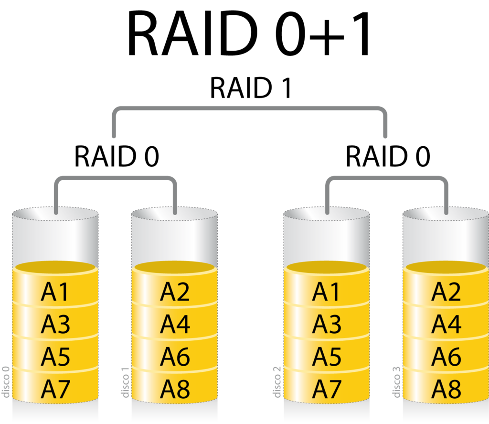{width=45%}
    <figcaption>RAID 0+1 configuration diagram</figcaption>
</figure>

The main advantage is that it offers the performance of RAID 0 and the redundancy of RAID 1. However, it is more expensive than RAID 5. Additionally, it is not fault-tolerant if two disks fail in the same RAID 0 set, in this case, all data would be lost. It is more expensive than RAID 5. However, it is the most reliable and fastest RAID level. It is also the most expensive. It is the best choice for critical applications.

#### RAID 1+0

In this case, the nesting is reversed, creating two RAID 1 structures that are then combined to create a RAID 0 volume.

It is often referred to as RAID 10.

<figure markdown="span">
    {width=45%}
    <figcaption>RAID 1+0 configuration diagram</figcaption>
</figure>

This configuration, like RAID 0+1, offers the performance of RAID 0 and the redundancy of RAID 1. Additionally, it is not fault-tolerant if two disks fail in the same RAID 1 set, in this case, all data would be lost. It is more expensive than RAID 5. However, it is the most reliable and fastest RAID level. It is also the most expensive. It is the best choice for critical applications.

---

## 7. Network Device Configuration

Computers usually obtain their *IP address* from a *DHCP server*.

In large local networks, this server can be one of the computers connected to the network, but in smaller networks (including home networks), it is likely that the task is performed by the router that provides Internet access.

!!!note
    **DHCP** stands for _Dynamic Host Configuration Protocol_.

    It is a client-server network protocol through which a DHCP server dynamically assigns an IP address and other network configuration parameters to each device on a network so they can communicate with other IP networks.

In any case, either because we do not have a *DHCP server* on our network or because the computer we are using needs to be easily locatable (for example, when sharing storage space or a printer), it may be useful to assign a *static IP address* to the computer. This way, the *IP address* value will not change with each startup.

We will set fixed values for the IP address, subnet mask, gateway, and even the primary DNS server that the computer should use to resolve Internet addresses.

---

The easiest way to solve this task is to _**`right-click`**_ on the _**network connection icon**_ in the _**Taskbar**_ and select "_**Network & Internet settings**_"


<figure markdown="span">
    {width=80%}
    <figcaption>Network and Internet settings</figcaption>
</figure>

When you do this, the *Settings* window will open, showing the settings for the *Network & Internet* category.

To configure network devices, we must choose the first option "_**Ethernet**_"

<figure markdown="span">
    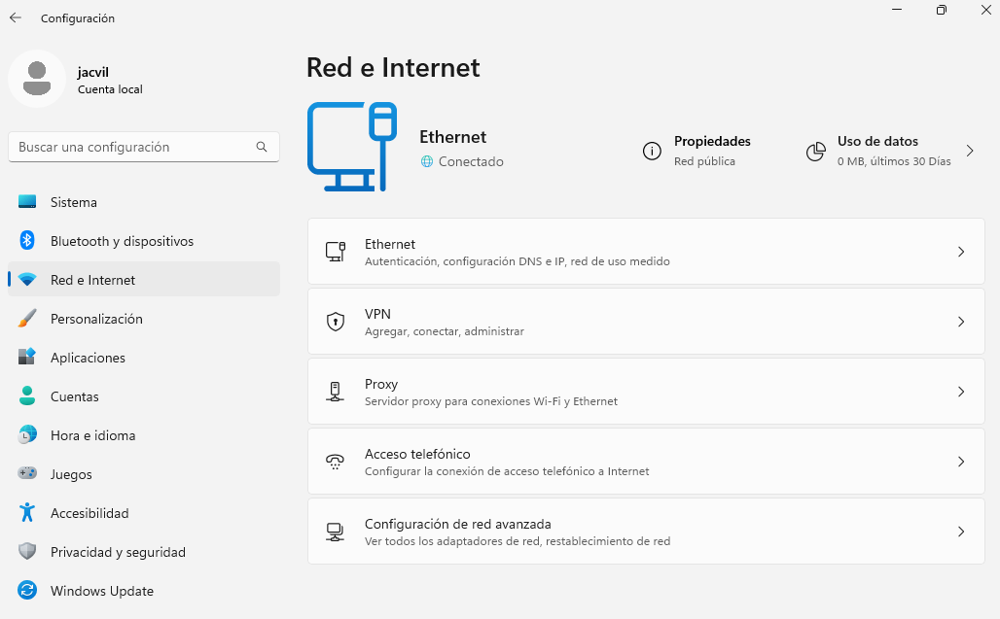{width=80%}
    <figcaption>Settings > Network & Internet</figcaption>
</figure>

To configure the device, we must click the "_**Edit**_" button in the "_**IP Assignment**_" section.

<figure markdown="span">
    {width=85%}
    <figcaption>Settings > Network & Internet > Ethernet</figcaption>
</figure>

By changing to "_**Manual**_", we will be able to enter the parameters of the **static IP**.

<figure markdown="span">
    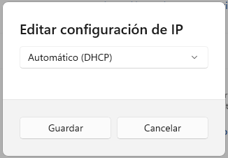{width=70%}
    <figcaption>IP Assignment</figcaption>
</figure>


<figure markdown="span">
    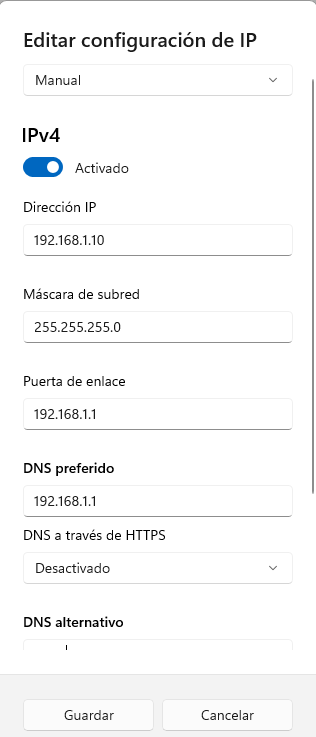{width=70%}
    <figcaption>Manual IP Assignment</figcaption>
</figure>

---

Alternatively, we can use the "_**Network Connections**_" tool in the "_**Control Panel**_" to access the properties of a network adapter.

<figure markdown="span">
    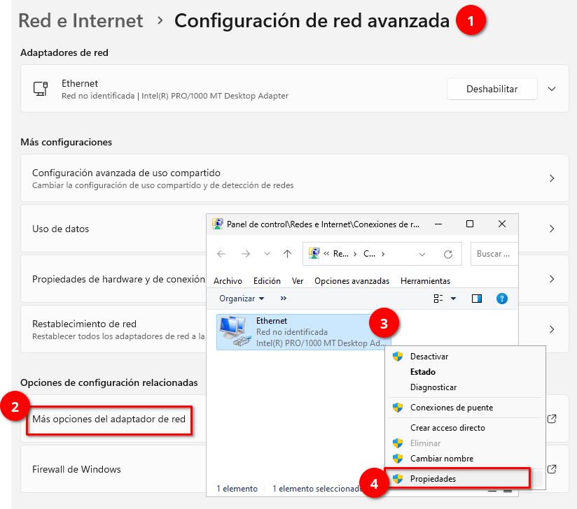{width=80%}
    <figcaption>Network Connections</figcaption>
</figure>

---

When we open the properties of a network adapter, a dialog will appear where we can configure all the elements of the adapter. To configure the IP address, we will select "_**Internet Protocol Version 4 (TCP/IPv4)**_" and click on "_**Properties**_", which will allow us to manually set the network configuration.

<figure markdown="span">
    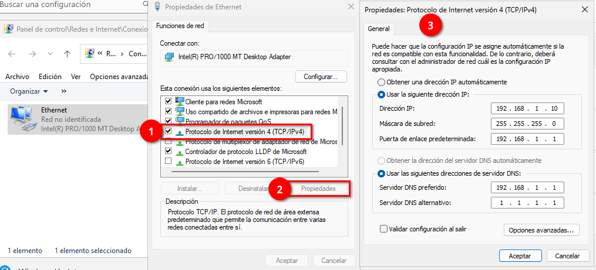{width=80%}
    <figcaption>Properties of the network adapter</figcaption>
</figure>

---

To check the status of the network adapter through the command line, we can use the **`ipconfig`** command.

<figure markdown="span">
    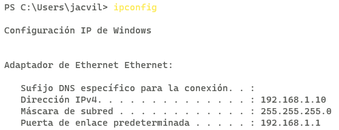{width=80%}
    <figcaption>ipconfig</figcaption>
</figure>

To obtain detailed information, we can use **`ipconfig /all`**

<figure markdown="span">
    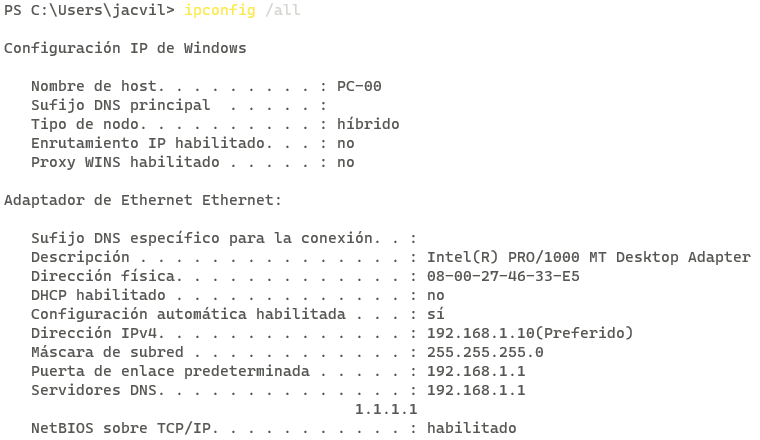{width=80%}
    <figcaption>ipconfig /all</figcaption>
</figure>

---

Another commonly used command is **`ping`**, which checks communication with a remote network device.

<figure markdown="span">
    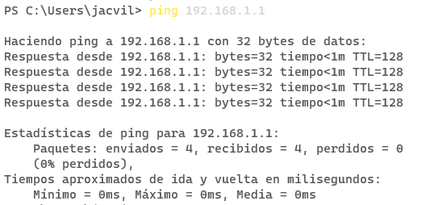{width=80%}
    <figcaption>ping</figcaption>
</figure>

---

## 8. Task Automation

Operating systems usually include tools that allow us to **automate repetitive administrative tasks** (_such as backups_) or tasks that are performed at specific times to avoid compromising the computer's performance during peak usage (such as downloading and installing updates).

The automation of system tasks allows us to **schedule the execution of programs** or sequences of commands to occur at a specific time and, if necessary, with a particular frequency.

In the case of _MS Windows_, this situation is covered by the _**Task Scheduler**_, which allows us to automate tasks based on different circumstances:

- When a **particular moment** in the future arrives.
- When a **specific event** occurs. _(For example, whe the computer starts up or a user logs in)_
- With a **frequency** determined by the user. _(For example, every day at 3:00 a.m.)_

Therefore, we can use scheduled tasks to automate certain actions that repeat over time, thus avoiding inconveniences and occasional forgetfulness.

> Some examples:

> - Set the computer to shut down automatically every weekday without having to physically go to its location.
> - Run a backup program every day at a specific time.
> - Schedule our antivirus software to perform a full system scan _every Sunday at 3 a.m._, taking advantage of the server's low workload period.
> - Automatically download and install updates for the operating system and other software.

In _MS Windows_, the **frequency** with which the action is repeated can be:

- Daily
- Weekly
- Monthly
- One time
- At system startup (before any user logs in)
- At logon (only after the current user logs in)
- When a specific event is logged

We can access the "_Task Scheduler_" tool through the "_Computer Management panel_".

To create a new task, we can use the **wizard** with the "_Create Basic Task..._" option or the **advanced mode** with the "_Create Task..._" option.

<figure markdown="span">
    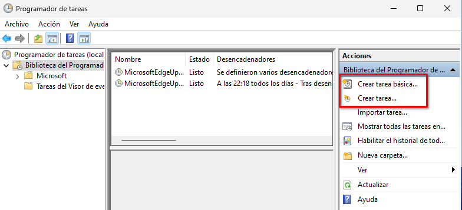{width=80%}
    <figcaption>Task Scheduler</figcaption>
</figure>

---

When we open the "_Task Scheduler_", we can see the tasks that have already been created. To create a new task, we must click on "_Create Basic Task..._". This will open a dialog with an assistant. The first step is to indicate the name and a description.

<figure markdown="span">
    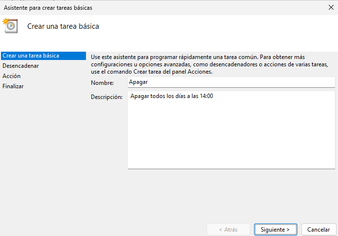{width=70%}
    <figcaption>Basic Task Creation Wizard</figcaption>
</figure>

---

Next, the wizard asks what event will trigger the task execution.

<figure markdown="span">
    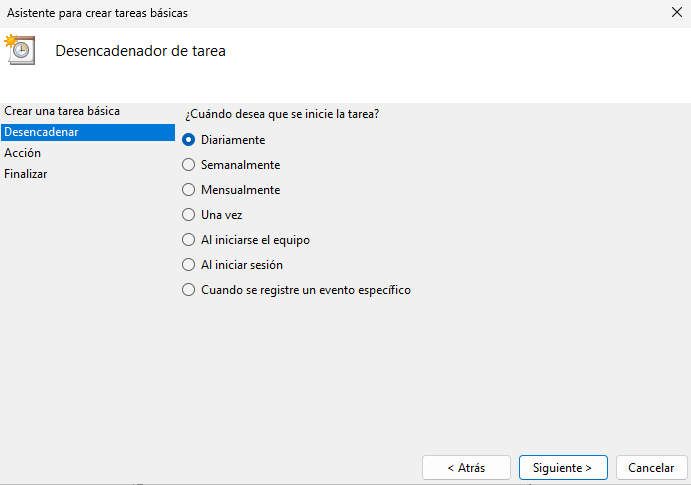{width=70%}
    <figcaption>Basic Task Creation Wizard - Trigger</figcaption>
</figure>

---

For the example, by selecting "Daily" as the trigger, the next step asks for the start date, the time it will run, and how many days we want the task to repeat.

<figure markdown="span">
    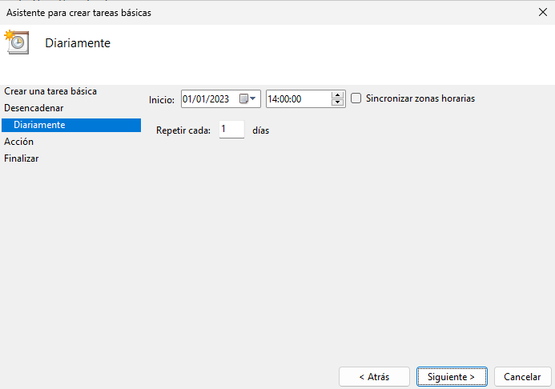{width=70%}
    <figcaption>Basic Task Creation Wizard - Daily</figcaption>
</figure>

---

In the next step, we are asked what type of action we want the task to perform. Generally, a program will be initialized.

<figure markdown="span">
    {width=70%}
    <figcaption>Basic Task Creation Wizard - Action</figcaption>
</figure>

---

In the last step, we will indicate which application or script will be started. In our case, we will call the command `shutdown /s /t 0`. As can be seen, the command must be indicated on one side and the arguments in another separate field.

<figure markdown="span">
    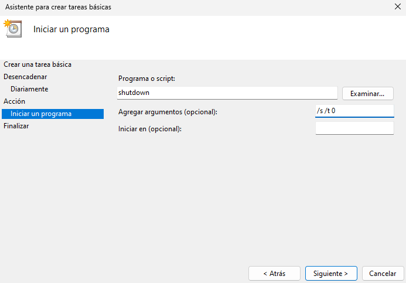{width=70%}
    <figcaption>Basic Task Creation Wizard - Start a program</figcaption>
</figure>

---

Finally, as is usual in *Windows*, the system shows a summary for us to review all the parameters we have configured.

<figure markdown="span">
    {width=60%}
    <figcaption>Basic Task Creation Wizard - Summary</figcaption>
</figure>

---

When we return to the main window of the "*Task Scheduler*", we will see that the new task has been created. If we open its properties, we can check and adjust the parameters.

<figure markdown="span">
    {width=65%}
    <figcaption>Task Scheduler - Properties</figcaption>
</figure>
