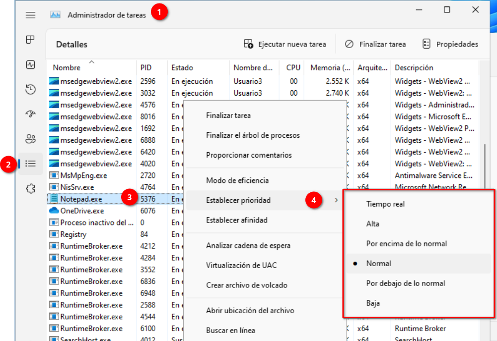
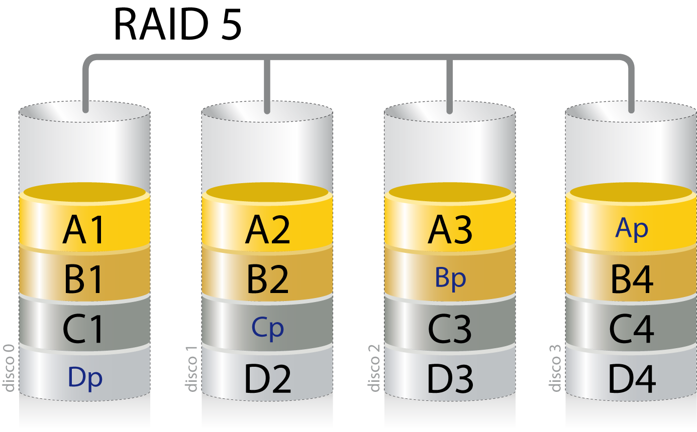

# 5.1 MS Windows Administration

In this section, we will focus on basic common administration tasks in the *Microsoft Windows* operating system.

- **User profiles** and local **groups**
- **File system** management
- **Processes** and priorities
- **Performance** and activity **monitoring**
- **Service** management
- **Storage devices** management
- **Network devices** configuration
- **Task automation**

---

## User Profiles and Local Groups Management

### User Accounts

For an operating system, a **user account** is identified as the **combination** of a **name** and certain **authentication information** by which the user demonstrates they are authorized to use it. This authentication information is usually a **password**, but it could be replaced by other methods, such as an electronic ID card or another type of smart card, or even more futuristic methods, such as fingerprint or iris recognition, etc.

!!!note "Two-Step Authentication"

    Recently, two-step authentication has become essential for many of the services we use on the Internet. The idea is very simple: create a mechanism that increases security by verifying the user's identity through two different means:

    1. _Something we **KNOW**_

        For example, a username and a password.

    2. _Something we **HAVE**_: For example, a mobile phone, where we will receive a text message with an access code.

    This way, even if an unauthorized person discovers our username and password, they will still need our phone to access the account, and it must be unlocked.

    As expected, the received access code will be for one-time use and will expire after a certain period, depending on the service provider.

Normally, a user account is associated with a person who authenticates to use the computer. However, in certain situations, it may be a program on a computer that needs to authenticate to a server to obtain a specific resource or service.

When authentication uses a *password*, it must have sufficient complexity because it serves a dual purpose:

- Prevents access by unauthorized individuals.
- Associates that access with an individual who will be responsible for it.

For this reason, the use of user accounts by multiple people indiscriminately should be avoided at all costs.

!!!warning "Password complexity"

    When necessary, a protocol will be established to ensure sufficient complexity in user passwords. For example, by using various types of characters (uppercase, lowercase, symbols, and/or digits) and setting a minimum length.

In general, operating systems usually have three different types of accounts, with which their respective users will have different levels of control over the system. These are:

- **Standard accounts**: Generally, they can **perform user tasks** that are **not** administrative in nature.

- **Administrator accounts**: They offer control over all aspects of the operating system, so they **should be used with caution** and only for the activities they are intended for.

- **Guest accounts**: They are usually used to allow **occasional users** to use the system. Their capabilities are very limited.

    !!!note "Guest User Accounts"

        Guest user accounts can be very useful when using the computer for demonstrations or when offering its use to different people over time (hotels, restaurants, etc).

        In other contexts, when they are not needed, it may be convenient to disable them for security reasons.


On the other hand, the concept of a **user account** is associated with the concept of a **session**. We understand **session** as **the consecutive time during which a user account is active** in the operating system. Therefore, it extends from the moment the user authenticates, which is known as **logging in**, until they leave the system, which is known as **logging out**.

Additionally, a **user account** is associated with a set of **permissions** and **privileges**.

- **Privileges** define _**what the user can do**_ in the system once the session is started, _for example, shutting down the system, making backups, change the system time, load a device driver, etc._.
- **Permissions** define _**where access is granted**_ and under what conditions. A permission is linked to an object, such as a file, folder, or printer. _For example, reading, writing, or executing a specific file or folder_

When a privilege conflicts with a permission, the **privilege always takes precedence**. _For example, a user with backup privileges can copy all files, even if they do not have read permissions for them._

Another aspect related to user accounts is **user profiles**. These define the **appearance** and **configuration** of each specific user, from the desktop background or the set of icons used to the documents they work with or the files they have downloaded.

Therefore, when a user logs into an account for the first time, they will encounter a work environment with all **default values**, even if the system has been used by other accounts for an extended period and those accounts have been previously customized.

In general, according to their **scope**, there are several **types of accounts**:

- **Local accounts**: Authentication is handled by the operating system of the computer where we authenticate, and it only provides access to its resources. To authenticate with the same credentials on different computers, identical accounts must be created on each of them. Even so, each account will only provide access to the resources of the computer where it is located.

- **Network user accounts**: Typically, authentication is handled by **a computer acting as a server** on the network, and when successful, it allows access to resources offered by different computers on that network. Therefore, we can use the same account to access from different computers belonging to the same network.

- **Microsoft user accounts**: This is a particular case for _MS Windows_ operating systems, which associate a user account with an email address and a password, so that all account information is stored on _Microsoft_'s servers, allowing all configurations and preferences to be shared automatically across all devices using the same authentication credentials. In reality, we could consider this a particular case of a network user account.

Logically, user administration becomes more important as the number of users with diverse characteristics increases. In any case, in this document, we will refer exclusively to local user accounts.

### Local User Accounts

We have indicated that most operating systems have three types of accounts: Administrator, User, and Guest. However, in the latest versions of the *Microsoft* operating system, there has been a reinterpretation of this concept, providing three types of accounts:

- Administrator accounts
- Standard accounts
- Child accounts

If you are the one who installed the operating system, *MS Windows* assumes that you will be one of its administrators. We will be able to make any changes to its configuration, add new user accounts, install or remove programs, view or modify the content of any file on the computer, install or configure any hardware device, etc.

As expected, any computer with *MS Windows* must have at least one administrative account, even if we do not plan to perform administrative tasks frequently.

Standard accounts are designed for users who do not need to make any of the aforementioned changes to the system. From these accounts, any daily work can be carried out, but administrative tasks cannot be performed.

These types of accounts are perfect for the daily use of any user, including the one who performs administrative tasks. Keep in mind that if you are an administrator user and run a program, it can use your privileges to alter the system. For example, a virus that has infected the program we are using will have a much harder time spreading to the rest of the system when we use a standard account than if we do so with an administrator account. Therefore, it is recommended that the user who performs administrative tasks has two user accounts: one to administer the computer and another for daily use.

On the other hand, in *MS Windows*, to perform administrative tasks from a standard user account, you only need to know the password of an administrator account.

Child accounts are simply standard user accounts with **parental controls** enabled. For this reason, these types of accounts do not appear individually in the *MS Windows* *Control Panel*.

---

### Creating a Standard User Account in Windows 11

We can easily add standard accounts from the "_**Settings panel**_".

<figure markdown="span">
    {width=70%}
    <figcaption>Open the Settings panel, select "Accounts" and go to "Other users"</figcaption>
</figure>

<figure markdown="span">
    {width=70%}
    <figcaption>Click on "Add account"</figcaption>
</figure>

<!-- {width=60%} -->

<figure markdown="span">
    {width=70%}
    <figcaption>Write the access credentials for the new user</figcaption>
</figure>

<!-- {width=50%} -->

<figure markdown="span">
    {width=70%}
    <figcaption>Once the process is finished, it will appear in the list</figcaption>
</figure>

<!-- {width=70%} -->

---

To manage users more comprehensively, we must use the "_**Local Users and Groups Manager**_". We can access the tool by running the command **`lusrmgr.msc`** or by right-clicking on the Start menu icon, opening "_**Computer Management**_" and selecting "_**Local Users and Groups**_"

<figure markdown="span">
    {width=80%}
    <figcaption>Computer Management > Local Users and Groups</figcaption>
</figure>

<!--  -->

Right-clicking on a user brings up a context menu from which we can perform various actions. Generally, we will open the "_**Properties**_".

By default, we will be on the "_**General**_" tab, which contains the same data we entered when we created it, although now there is an additional option that allows us to lock the account.

We also have two new tabs that will allow us to adjust the profile characteristics of the user account and check the groups to which it belongs.

<figure markdown="span">
    {width=85%}
    <figcaption>User properties</figcaption>
</figure>

<!--  -->

---

### Groups

In a business environment, even a medium or small one, we might find ourselves needing to create different user accounts with the same permissions and privileges. In such cases, we could end up configuring the same characteristics repeatedly for different accounts.

The solution in these situations is **user groups**. The idea is to create a group that holds the common permissions and privileges. Once the group is created, we only need to **make the user accounts _members_ of the group** to **inherit** all the **characteristics** we established for it.

When a new user needs to share the characteristics of the previous ones, it will be enough to make them a member of the group. Similarly, if a user should no longer have certain permissions, it will be enough to remove their account from the group members.

Additionally, **a user account can be a member of more than one group**, making it very easy to group resources with common characteristics into groups and control which users access them.

There are two types of group accounts according to their scope of influence:

- **Local group accounts**: Their scope will be the computer on which they were created, and their members will be local user accounts.

- **Network group accounts**: Their use is oriented towards network installations, where resources are offered to all client computers on that network. Therefore, they will have permissions and privileges related to the shared resources on the network, and their members will be network user accounts.

In our case, we will focus exclusively on local group accounts.

---

### Local Groups in Windows

When we install the system, a series of groups are automatically created with a default configuration that facilitates the assignment of privileges.

<figure markdown="span">
    {width=80%}
    <figcaption>Built-in groups into the MS Windows 11 operating system</figcaption>
</figure>

<!--  -->

Some of the groups that exist by default in Windows are:

- **Administrators**. Users in this group have full and unrestricted access to the computer.
- **Guests**. Users in this group have more restricted access to the system than a standard user.
- **Network Configuration Operators**. This group grants its members privileges to manage network settings.
- **Backup Operators**. This group includes users with permissions to back up or restore files.
- **Users**. All standard users belong to this group, which prevents users from making accidental changes that could affect the system.
- **Remote Desktop Users**. Users in this group can log in remotely.

---

To create a group account, we will use the **`lusrmgr.msc`** tool, or alternatively, the "_**Computer Management**_" panel.

Within the "_**Groups**_" section, right-clicking opens a dialog where we select "_**New Group...**_"

We can add users using the "_**Add...**_" button.

<figure markdown="span">
    {width=80%}
    <figcaption>Create a new group</figcaption>
</figure>

<!--  -->
To search for users, click the "_**Advanced options...**_" button.

<figure markdown="span">
    {width=80%}
    <figcaption>Dialog for selecting users</figcaption>
</figure>

<!--  -->

---

If we click the "_**Find Now**_" button, it will display the complete list of users and groups on the system.

<figure markdown="span">
    {width=70%}
    <figcaption>Advanced dialog for selecting users</figcaption>
</figure>

<!-- {width=50%} -->

Once added, it will appear in the list of members of the new group.

<figure markdown="span">
    {width=80%}
    <figcaption>Dialog for creating a new group with a member added</figcaption>
</figure>

<!-- {width=50%} -->

We can go to the user's properties and in the "Member of" section, it will show which groups the user belongs to.

<!-- {width=80%} -->

---

### Managing Local Password Policies and Account Lockout

We can manage the system's security level by modifying the password and account lockout policies.

Password policies allow us to adjust the parameters for complexity and validity.

<figure markdown="span">
    {width=80%}
    <figcaption>Local Computer Policy / Computer Configuration / Windows Settings / Security Settings / Account Policies / Password Policy</figcaption>
</figure>

<!--  -->

In the account lockout policies, we can define the number of incorrect attempts before the user account is locked, and for how long it will remain locked.

<figure markdown="span">
    {width=80%}
    <figcaption>Local Computer Policy / Computer Configuration / Windows Settings / Security Settings / Account Policies / Account Lockout Policy</figcaption>
</figure>

<!--  -->

---

<!-- 

## Gestión del sistema de archivos

El sistema operativo debe controlar los usuarios que pueden acceder a cada uno de los recursos que administra. Por ejemplo, directorios, impresoras, conexiones de red, etc.

Normalmente, para lograrlo, los sistemas utilizan **Listas de Control de Acceso** o *ACLs* (*Access Control Lists*), asociadas a los recursos. En ellas se relacionan los diferentes usuarios que pueden acceder y bajo qué condiciones (lectura, escritura, ejecución, etc.)

Además, cada archivo puede tener asociados diferentes atributos, que informan sobre ciertas características del archivo o del modo en el que el sistema operativo debe tratarlo. Así, un archivo puede tener atributos cómo: directorio, oculto, de sistema, cifrado, etc.

Ahora que ya conocemos diferentes aspectos de los usuarios y los grupos, estamos en disposición de aprender a modificar restricciones sobre el uso de los archivos y directorios.

### Permisos de directorios en Windows

Una de las primeras cosas que debemos saber sobre la estructura de directorios en *Windows* es que cada cuenta de usuario que inicia sesión en el sistema dispondrá de una carpeta donde se almacenará toda la configuración relativa al entorno de trabajo de dicho usuario, incluidos aspectos cómo la configuración de la pantalla, las conexiones de red, la configuración de impresoras, etc.

Esta información, que recibe el nombre de **perfil de usuario**, se organiza en diferentes archivos que se crean en el momento que el usuario inicia sesión por primera vez.

De esta forma, el sistema operativo consigue que varios usuarios puedan utilizar el mismo ordenador y que cada uno encuentre, al iniciar la sesión, el mismo entorno que dejó cuando cerró la sesión anterior. Además, los cambios efectuados por un usuario en la personalización de su espacio de trabajo no afectará a ningún otro usuario del equipo.

Estas carpetas se encuentran dentro del volumen donde se haya instalado el sistema operativo (normalmente la unidad `C:`), en una carpeta llamada `Usuarios`.

Cuando un usuario del grupo *Administradores* trata de acceder a la carpeta del perfil de otro usuario, recibe un aviso que le informa de que carece de permiso para hacerlo. Aún así, cómo se trata de un usuario con los privilegios suficientes, podrá hacer clic sobre el botón "Continuar" para acceder a su contenido.

{width=80%}

---

Sin embargo, el cambio de permisos sólo se completará si el usuario con privilegios administrativos la aprueba, ya que el sistema muestra una ventana pidiendo su contraseña.

{width=45%}

### Compartir el perfil con otro usuario

Según lo que hemos visto más arriba, un usuario que no pertenezca al grupo de administradores sólo podrá acceder a los datos de otro usuario cuando tenga la aprobación de un usuario administrador.

No obstante, siempre es posible que un usuario comparta voluntariamente su perfil con un usuario diferente. Algo que podemos hacer, de forma individual, con un usuario concreto, o con todos los miembros de un grupo.

Si hacemos clic derecho, sobre la carpeta que coincide con el nombre de nuestra cuenta. En el menú de contexto que aparece, elegiremos la entrada "*Conceder acceso a*".

Al hacerlo, veremos aparecer un nuevo menú con varias opciones, entre ellas, los nombre de los diferentes usuarios del sistema. Si queremos compartir la carpeta con un solo usuario y otorgándole sólo permiso de lectura sobre nuestros archivos, bastará con hacer clic sobre su nombre.

Además, disponemos de una opción titulada "*Usuarios específicos...*", que nos permitirá añadir varios usuarios de una sola vez, y cambiar sus permisos (las cosas que puede hacer) sobre nuestros archivos.


En el desplegable podemos seleccionar usuarios. Una vez añadido podemos modificar los permisos.

{width=70%}

Por último, si existen subdirectorios, nos solicita confirmación para cambiar la configuración.

{width=70%}

Por otra parte podemos especificar permisos concretos desde el apartado "Seguridad" de las propiedades de un directorio pulsando el botón "Editar..."

{width=100%}

Los permisos estándar de *NTFS* que se pueden asignar a una carpeta son:

- **Control total**: para leer, cambiar, crear y ejecutar bien sean programas o carpetas.
- **Lectura y ejecución**: para ver el contenido y ejecutar programas de una carpeta.
- **Modificar**: para poder cambiar los ficheros y las carpetas, pero sin crear y eliminar ficheros ni carpetas nuevas.
- **Lectura**: para poder ver y abrir el contenido.
- **Escritura**: para poder crear y cambiar los ficheros y carpetas existentes.
- **Mostrar el contenido de la carpeta**.

Cuando hablamos de los permisos en carpetas y archivos, debemos tener en cuenta el concepto de **herencia**. El concepto de herencia describe cómo se propagan los permisos que otorgamos a una carpeta a través de los archivos y carpetas que ésta contiene.

Por defecto, cuando se proporcionan unos permisos a una carpeta que es padre de otras (es decir, que contiene a otras), todos los archivos y carpetas contenidos dentro de esta carpeta heredarán los mismos permisos.

Los permisos **explícitos**, a diferencia de los permisos heredados, son aquellos que se configuran de propio en un recurso. Es decir, aquellos que se establecen ex profeso para ese particular.

No es necesario romper la herencia si queremos mantener esos permisos hacia abajo, sino que tenemos que declarar permisos explícitos para proporcionar nuevos permisos de denegación o concesión de nuevos privilegios. Teniendo todo esto en cuenta, solo deberemos modificar esa herencia cuando queramos modificar algo, dejando sin modificación cuando queramos mantener la misma configuración.

En ocasiones, puede ser necesario que estos permisos no sean heredados hacia el interior, sino que se desea que la concesión de permisos quede “reseteada” añadiendo a mano los permisos que se deseen desde este punto.

Para estos casos, se deberá tomar uno de los siguientes caminos que comentamos a continuación:

- Redefinir los permisos de manera explícita.
- Eliminar la herencia en el objeto hijo.
- Eliminar la herencia al nivel del padre, lo que hará que se interrumpa la extensión hacia abajo (hacia los hijos).

Para controlar la herencia, debemos acceder a "Opciones avanzadas" dentro del apartado "Seguridad"

{width=100%}

### Acceso a la carpeta común

Además de lo anterior, dentro de la carpeta Usuarios, existen una carpeta que puede ser utilizada por todos los usuarios del equipo para compartir información. Se trata de la carpeta "*Acceso público*" situada en `C:\Users\Public`.

---

## Procesos y prioridades

La memoria principal del ordenador puede albergar cientos de tareas que se turnan en el uso del procesador. Una forma que tiene el sistema operativo para mejorar el rendimiento consiste en asignar diferentes prioridades a dichas tareas.

Un buen planteamiento general consiste en que los procesos que realicen **tareas interactivas**, es decir, los que **se comunican directamente con el usuario**, dispongan de una prioridad mayor. Por el contrario, aquellos que no necesitan la intervención directa del usuario, pueden ejecutarse con una prioridad más baja. De esta forma se garantiza, en general, una mejor experiencia para los usuarios del sistema operativo.

Se dice que los **procesos interactivos** se ejecutan en **primer plano** (en inglés, *foreground*), mientras que aquellos que no lo son se **ejecutan en segundo** plano (en inglés, *background*).

Como cabe esperar, un proceso que se ejecuta con una prioridad baja, cederá el uso del procesador, siempre que un proceso con una prioridad mayor lo reclame.

Un ejemplo de esto puede ser la tarea encargada de imprimir un documento. Las impresoras son, probablemente, los dispositivos más lentos que utilizamos. De este modo, basta con que, la tarea que se encarga de imprimir, obtenga el uso del procesador de vez en cuando, para que pueda alimentar el proceso de impresión con un flujo suficiente de datos. Así pues, esta sería una tarea ideal para funcionar con una prioridad baja (en segundo plano) y, mientras lleva a cabo su labor, los procesos interactivos seguirán funcionando casi a la misma velocidad que si no estuviésemos imprimiendo.

---

### Prioridad de ejecución en Windows

De forma general, *Windows* solo nos permite elegir si deben ejecutarse con una mayor prioridad los programas interactivos o los que se ejecutan en segundo plano.

{width=80%}

No obstante, si quieres modificar la prioridad de una tarea particular, siempre puedes recurrir al Administrador de tareas.

{width=70%}

---

## Rendimiento del sistema.

En general, podemos definir el concepto de rendimiento como la rapidez con la que un equipo realiza las tareas que se le encomiendan (tanto las relacionadas con el propio sistema, como las relacionadas con las aplicaciones y servicios). En principio, el rendimiento del sistema estará limitado por diferentes aspectos:

- La velocidad del procesador.
- La cantidad y velocidad de la memoria principal.
- La velocidad de los dispositivos de almacenamiento externo (normalmente discos duros).
- La velocidad de las interfaces de red.

::: tip
En ocasiones, alguno de los programas que estamos ejecutando en *Windows* deja de funcionar y no tenemos forma de cerrarlo. Hay una solución sencilla: reiniciar el sistema.

No obstante, esto nos obliga a guardar los archivos con los que estemos trabajando en el resto de aplicaciones, esperar a que el sistema se apague y vuelva a arrancar, y, por último, volver a ejecutar las aplicaciones y abrir los archivos.
:::

En los sistemas operativos *Windows* disponemos del **Administrador de tareas**, una herramienta que nos permitirá examinar datos de rendimiento del sistema e identificar posibles cuellos de botella.

Para iniciar el **Administrador de tareas**, sólo tenemos que hacer clic, con el botón derecho del ratón, sobre el icono de inicio o presionar la combinación de teclas `Ctrl`+`Alt`+`Supr`.

{width=80%}

Para obtener información detallada qué recursos está consumiendo cada proceso existe una herramienta llamada **Monitor de recursos**.

{width=80%}

---

## Seguimiento de la actividad del sistema

En un sistema operativo moderno todas las acciones importantes son anotadas en un **registro de eventos** (también llamado ***log***). Dichas anotaciones incluyen mensajes de aviso y errores, y es importante supervisarlas periódicamente para asegurarnos de que no existen incidencias destacables. Y si las hay, tener la oportunidad de resolverlas antes de que tengan repercusiones graves.

El complemento de Windows que permite consultar y administrar los eventos anotados, tanto por los servicios del propio sistema, como por las diferentes aplicaciones, se llama **Visor de eventos**, y nos ofrece una forma potente y centralizada de conocer lo que está pasando en nuestro sistema operativo.

El **Visor de eventos** resulta imprescindible para supervisar el funcionamiento del servidor y resolver cualquier incidencia. Desde él podremos realizar las siguientes tareas:

- Consultar los eventos que se hayan producido.
- Crear filtros para los eventos que más nos interesen y almacenarlos como vistas personalizadas que podemos volver a utilizar en cualquier momento.
- Programar una tarea para que se ejecute en respuesta a una situación específica.
- Establecer suscripciones a determinados eventos.

Los eventos se clasifican en diferentes **categorías**:

1. *Vistas personalizadas*: Permiten restringir los eventos mostrados en función de nuestras preferencias.
2. *Registros de Windows*: Almacenan eventos relacionados con todo el sistema y los relativos a aplicaciones heredadas.
3. *Registros de aplicaciones y servicios*: Contienen eventos relacionados con aplicaciones o componentes particulares.
4. *Suscripciones*: Se utiliza para recopilar los eventos de otros equipos de la red y almacenarlos localmente.

La categoría *Registros de Windows* actúa como un contenedor de varias subcategorías que, en su mayoría, resultarán familiares para los usuarios avanzados de otros sistemas de escritorio de *Microsoft*. En concreto, encontramos las siguientes:

- *Aplicación*: Aquí anotan sus eventos las aplicaciones y los servicios que no forman parte del sistema.
- *Seguridad*: Incluye la información de los eventos relacionados con la seguridad del sistema.
- *Instalación*: Donde se anotan la información de los eventos relativos a la configuración de roles y características.
- *Sistema*: Contiene información relativa a los eventos del sistema y de sus componentes.
- *Eventos reenviados*: Contiene información reenviada por otros sistemas de la red.

{width=90%}

---

## Gestión de servicios

Los servicios son un tipo particular de procesos que suele ejecutarse en segundo plano, es decir, sin que el usuario tenga constancia directa de su presencia y, normalmente, esperan un tipo de suceso para ofrecer una determinada prestación al usuario.

Durante la carga del sistema operativo, se inician multitud de servicios que están ocupando memoria y tiempo de procesador. Algunos de ellos, nunca llegan a ser necesarios.

Si queremos aprovechar al máximo la capacidad de cálculo de nuestro equipo, podemos pensar en desactivar aquellos servicios que no son necesarios para el uso que hacemos del ordenador. Aún así, debemos tener en cuenta que, en la mayoría de los casos, su funcionamiento está muy optimizado (sobre todo los del propio sistema operativo) y que, si no se usan, pronto acaban paginados a disco. Además, debemos tener en cuenta dos inconvenientes fundamentales:

- Si deshabilitamos un servicio necesario para el sistema operativo, éste puede dejar de funcionar de forma correcta.
- Un servicio que no es necesario en este momento y lo deshabilitamos, deberemos recordar habilitarlo en el futuro si llegara a serlo.

En cualquier caso, a medida que aumenta la cantidad de programas que tenemos instalados, pueden existir servicios menos optimizados. Incluso, en sistemas como Windows, pueden quedar en funcionamiento servicios asociados a un determinado programa aún cuando éste haya sido desinstalado. Incluso pueden existir servicios actuando como spyware. Por todos estos motivos, resulta interesante saber cómo actuar sobre los servicios del sistema.

Si estás pensando en deshabilitar algunos servicios de tu sistema, en la siguiente tabla tienes algunas sugerencias:

{width=90%}

Un ejemplo típico sería el reinicio del servicio de "Cola de impresión" cuando hayan quedado trabajos en espera:

{width=90%}

---

## Gestión de dispositivos de almacenamiento

Cuando necesitamos más espacio de almacenamiento en disco, podemos recurrir a comprimir archivos, a moverlos a un dispositivo de almacenamiento externo o incluso a eliminar los que ya no necesitemos. Sin embargo, una buena alternativa consiste en añadir un nuevo disco duro a nuestro sistema. Los discos duros tienen una gran relación entre el precio y la capacidad de almacenamiento y son muy fáciles de instalar.

Además, en la mayoría de los casos, el ordenador los detectará de forma automática y sólo habrá que configurar el sistema operativo para utilizarlos.

De hecho, en este apartado supondremos que la parte hardware ya está resuelta. Es decir, que ya has abierto el ordenador y has conectado correctamente un nuevo disco duro en su interior. Aquí nos centraremos en los ajustes que deberemos realizar en el sistema operativo para sacarle todo el rendimiento.

En Windows, configurar un disco que ha sido añadido en el interior del ordenador, o que se conecta a través de un puerto USB es prácticamente idéntico, salvo que los discos externos ya suelen venir particionados y formateados de fábrica (aunque siempre podremos borrar la estructura previa y comenzar de cero).

::: note
Cuando se hace referencia a *volumen* o *partición*, estamos hablando de lo mismo, una división lógica en una unidad de almacenamiento.
:::

En cualquier caso, en Windows, podemos utilizar dos formas diferentes de configurar discos:

- **Básica**: Es la que utilizan la mayoría de los ordenadores personales, por ser los más sencillos de administrar. En la configuración básica, cada partición (o volumen) es una entidad independiente, de modo que no puede compartir datos con otras particiones.

- **Dinámica**: Fue una configuración incorporada en los sistemas operativos de *Micorsoft* a partir de *Windows 2000*, que puede compartir un gran número de volúmenes (unos 2000), que pueden ser de distintos tipos:

  - **Simples**: Los discos se comportarán del modo habitual. Este tipo de volumen puede ser reflejado, pero no es tolerante a fallos.

  - **Reflejados**: Se crean dos copias idénticas de un volumen, apareciendo como una sola entidad. Cada escritura se replica en los discos espejo y pueden hacerse lecturas simultáneas de diferentes datos, lo que aumenta el rendimiento. Los diferentes discos pueden actuar de forma independiente (con diferentes controladoras), de modo que, si un disco falla, el sistema puede seguir funcionando a partir del que sigue activo. Esto aumenta la tolerancia a fallos.
  
    Como es lógico, deben utilizarse discos de las mismas características. De lo contrario, se toma como referencia la capacidad del disco más pequeño.
  
    Esta configuración equivale a **RAID-1**.

  - **Distribuidos**: Utiliza varios discos para crear una sola unidad lógica, permitiendo usar el espacio disponible de una forma muy eficiente. Consigue una mejora de rendimiento, tanto en la lectura como en la escritura, debido a que las operaciones se llevan a cabo en discos diferentes de forma simultánea.
  
    En esta configuración, los volúmenes no pueden ser reflejados y no es tolerante a fallos.

  - **Seccionados**: Es una variante de la anterior. Aunque mejora su rendimiento, es más vulnerable a los errores de escritura.

    Deben utilizarse discos de las mismas características. De lo contrario, se toma como referencia la capacidad del disco más pequeño.

    Esta configuración equivale a **RAID-0**.
  
  - **RAID-5**: Distribuye los datos en tres o más discos, usando uno de ellos (que se va alternando) para almacenar información de paridad que permite la recuperación de datos cuando falla un disco. Por lo tanto, es tolerante a fallos. Mejora la eficiencia respecto a los anteriores, aunque el cálculo de la paridad penaliza ligeramente el rendimiento en la escritura.


### Niveles RAID básicos

Entre todos los dispositivos de almacenamiento presentes en el ordenador, los que ofrecen un menor rendimiento son los discos duros.

Como una forma de paliar este problema se desarrolló el estándar RAID (del inglés, *Redundant Array of Independent Disks*), que podríamos traducir al español como conjunto redundante de discos independientes. Se trata de un sistema que almacena los datos utilizando diferentes dispositivos de almacenamiento (discos duros o unidades SSD) para crear un único volumen lógico.

Con RAID, el rendimiento se mejora de dos modos:

- Si los datos buscados están **duplicados** en varios discos, podemos recurrir al que ofrezca mayor rendimiento.

- Si los datos buscados se encuentran **repartidos** entre varios discos, podemos realizar la lectura en paralelo.

Además, se puede incluir redundancia para **mejorar la fiabilidad** del soporte utilizado y compensar el aumento de la probabilidad de fallo, a medida que aumenta el número de dispositivos implicados.

El conjunto de discos podrá administrarse mediante un controlador hardware o mediante un software específico, pero de cualquier forma, el sistema lo verá como un solo volumen. Además, la capacidad del volumen podrá crecer de forma gradual, aumentando el número de dispositivos implicados.

La definición básica de RAID consta de siete niveles, numerados de 0 a 6, a los que más tarde se fueron añadiendo algunos complementarios.

#### RAID 0 (o disk striping)

Distribuye los datos sobre los discos del conjunto de forma que permite la lectura o escritura de bloques en paralelo, aumentando considerablemente el rendimiento.

Los datos se organizan en bandas (strips, en inglés), que pueden corresponder, por ejemplo con bloques físicos o sectores. De este modo, el sistema operativo los maneja como si se tratara de un solo disco.

Las bandas se asignan de forma rotativa entre los discos que forman el conjunto. De este modo, cuando una lectura comprende varias bandas consecutivas, podrán leerse de forma paralela, aumentando considerablemente el rendimiento.

{width=25%}

A diferencia de otros niveles RAID, en este caso no se ofrece redundancia. Esto implica que, si falla un disco, se perderían todos los datos y sólo nos quedaría recurrir a las copias de seguridad. A cambio, ofrece un rendimiento elevado, que aumenta al incrementar el número de discos, y el aprovechamiento de la capacidad de almacenamiento es máxima.

#### RAID 1 (o mirroring)

A diferencia del caso anterior, que no contemplaba la redundancia, aquí, ésta es completa, ya que se obtiene duplicando todo el contenido almacenado. Sería como RAID 0, pero asignando cada banda a dos discos diferentes. De este modo, dispondremos de parejas de discos gemelos.

Evidentemente, su principal inconveniente es el coste.

{width=25%}

Sin embargo, en RAID 1, se pueden realizar lecturas en paralelo de dos bandas diferentes u obtener una banda del disco que ofrezca la mayor velocidad en cada momento (menor tiempo de búsqueda y latencia). Sin embargo, las escrituras serán duplicadas y se realizarán a la velocidad del dispositivo más lento de la pareja.

Además, cuando falla un disco, los datos siguen disponibles y basta con sustituir el disco dañado para que los datos puedan volver a duplicarse y recuperar la funcionalidad del conjunto. Cuando accedemos a los datos con un disco averiado, decimos que funciona en modo reducido.

#### RAID 5

Un RAID 5 (también llamado distribuido con paridad) es una división de datos a nivel de bloques que distribuye la información de paridad entre todos los discos miembros del conjunto. El RAID 5 ha logrado popularidad gracias a su bajo coste de redundancia. Generalmente, el RAID 5 se implementa con soporte hardware para el cálculo de la paridad.

RAID 5 necesitará un mínimo de 3 discos para ser implementado y el máximo teórico es ilimitado.

Su principal ventaja es que se pueden recuperar los datos en caso del fallo de uno de los discos pero el fallo de un segundo disco provoca la pérdida completa de los datos.

{width=45%}

**Cálculo de paridad**

En el álgebra de Boole, existe una operación llamada “*or exclusivo*” (XOR), que significa “*o uno, o el otro pero no ambos*”, esto es:

```
0 XOR 0 = 0
0 XOR 1 = 1
1 XOR 0 = 1
1 XOR 1 = 0
```

El operador XOR es la pieza central que define como se crea la paridad y como se usa en el RAID. Se usa tanto para la protección de los datos, como para recuperar datos que se han perdido.

#### RAID 6

Su estructura es como la de RAID 5, pero añadiendo un control de paridad complementario, que se almacena en la banda correspondiente de un disco independiente. Esto significa que necesitaremos un disco más.

{width=45%}

Su gran ventaja es que se podrán recuperar los datos aunque fallen dos discos al mismo tiempo (es decir, durante el periodo que tardaría en regenerarse el conjunto tras un fallo).

Su mayor inconveniente es que cada escritura conlleva una mayor penalización, ya que deberán calcularse dos bloques de paridad.

#### RAID 5E y RAID 6E

Se trata de los niveles RAID 5 y RAID 6, donde se incluyen discos de reserva. cuando los discos se encuentran conectados y listos para usar se denominan *hot spare*. Si están en modo espera reciben el nombre de *standby spare*.

La única aportación que ofrecen estas configuraciones es la rapidez de respuesta en el caso de que se produzca un fallo.

#### RAID 0+1

Es una anidación de RAID 0 y RAID 1 donde se crea un conjunto de discos entre los que se divide la información y a continuación se crea un espejo del volumen obtenido.

También suele llamarse RAID 01, pero no debe confundirse con RAID 1.

{width=45%}

#### RAID 1+0

En este caso, la anidación se invierte, creando dos estructuras RAID 1 que, a continuación se unen entre sí creando un volumen RAID 0.

Muchas veces se encuentra como RAID 10.

{width=45%}

---

## Configuración de dispositivos de red

Actualmente ordenadores suelen obtener su *dirección IP* desde un servidor *DHCP*.

En redes locales de grandes proporciones, este servidor puede ser uno de los equipos conectados a la red, pero en redes más pequeñas (incluidas las domésticas), es fácil que la tarea la realice el propio router que nos proporciona el acceso a *Internet*.

::: note
DHCP son las siglas de Dynamic Host Configuration Protocol (en español, Protocolo de Configuración Dinámica de Host).
Es un protocolo de red de tipo cliente/servidor1​ mediante el cual un servidor DHCP asigna dinámicamente una dirección IP y otros parámetros de configuración de red a cada dispositivo en una red para que puedan comunicarse con otras redes IP.
:::

En cualquier caso, bien porque no disponemos de *servidor DHCP* en nuestra red o bien porque el ordenador en el que nos encontramos debe ser fácilmente localizable (por ejemplo, cuando comparta espacio de almacenamiento o una impresora), puede ser interesante asignar una *dirección IP fija*, también llamada estàtica, para el equipo. Así, el valor de la *dirección IP* no podrá cambiar con cada arranque.

Vamos a establecer valores fijos para la dirección IP, la máscara de subred, la puerta de enlace e incluso el servidor DNS principal al que debe recurrir el equipo para resolver las direcciones de Internet.

---

La forma más sencilla de resolver esta tarea consiste en hacer clic con el botón derecho del ratón sobre el icono que representa la conexión de red en la *Barra de tareas* y seleccionando "*Configuración de red e Internet*"


Al hacerlo, se abrirá la ventana de *Configuración* mostrando los ajustes de la categoría *Red e Internet*.


---

Para configurar los dispositivos de red, debemos elegir la primera opción "*Ethernet*"

{width=85%}

---

Para configurar el dispositivo, debemos pulsar el botón "Editar" del apartado "Asignación de IP"


Al cambiar a "Manual" nos permitirá introducir los parámetros de la IP fija.

{width=30%}

---

De manera alternativa, podemos la herramienta de "*Conexiones de red*" del "*Panel de control*"


---

Al abrir las Propiedades de un adaptador de red aparece un diálogo donde podremos configurar todos los elementos del adaptador. Para configurar la dirección IP seleccionaremos "*Protocolo de Internet versión 4(TCP/IPv4)*" y haremos clic en "Propiedades", lo que nos permitirá establecer la configuración de red de forma manual.


Para comprobar el estado del adaptador de red a través de la línea de comandos podemos utilizar el comando `ipconfig`


Para obtener información detallada podemos utilizar `ipconfig /all`


Otro comando muy utilizado es `ping` que comprueba la comunicación con un equipo remoto de la red.


---

## Automatización de tareas

Los sistemas operativos suelen incluir herramientas que nos permiten evitar la realización manual de tareas administrativas que se repiten de forma sistemática a lo largo del tiempo (como las copias de seguridad) o que se realizan a horas intempestivas para evitar comprometer el rendimiento del equipo en los momentos en los que más falta haga (como la descarga e instalación de actualizaciones).

La automatización de tareas del sistema nos permite programar la ejecución de programas o secuencias de comandos, para que se produzca a una hora determinada y, en su caso, con una frecuencia en particular.

En el caso de *Windows*, esta situación la cubre el *Programador de tareas*, que nos permite automatizar tareas en función de que se produzcan diferentes circunstancias:

- Cuando llegue un momento particular del futuro.
- Cuando se produzca un determinado evento.
- Con una frecuencia determinada, indicada por el usuario.

Por lo tanto, podemos utilizar las tareas programadas para automatizar ciertas acciones que se repiten a lo largo del tiempo, evitando así molestias y olvidos ocasionales. Por ejemplo, podríamos conseguir que el ordenador se apagara de forma automática, todos los días laborales, sin que tengamos que desplazarnos físicamente hasta donde se encuentra.

También podríamos, por ejemplo, conseguir que el antivirus que tengamos instalado realice un análisis completo del sistema todos los domingos a las 3 de la madrugada, aprovechando el momento de menor carga de trabajo del servidor.

Una de las ventajas del Programador de tareas de *Windows* es que incorpora una biblioteca de tareas programadas y las mantiene organizadas y accesibles, de modo que resulta fácil administrarlas (deshabilitarlas, modificarlas, eliminarlas o ejecutarlas).

En *Windows*, la frecuencia con la que se repita la acción puede ser:

- Diariamente
- Semanalmente
- Mensualmente
- Una vez
- Al iniciarse el equipo (antes de que un usuario inicie sesión)
- Al iniciar la sesión (sólo después de que el usuario actual inicie sesión)
- Cuando se registre un evento específico

Podemos acceder a la herramienta "Programador de tareas" mediante el panel de Administración de equipos.

Para crear una nueva tarea, podemos utilizar el asistente con la opción "Crear tarea básica..." o el modo avanzado con la opción "Crear tarea..."

{width=80%}

Al abrir seleccionar "Crear tarea básica..." aparece un diálogo con un asistente. El primer paso es indicar el nombre y una descripción:

{width=70%}

A continuación pregunta cuál será el evento que desencadenará la ejecución de la tarea.

{width=70%}

Para el ejemplo, al seleccionar "Diariamente" como desencadenante, en el siguiente paso solicita la fecha de inicio, la hora a la que se ejecutará y cada cuántos días queremos que se repita la tarea.

{width=70%}

En el siguiente paso solicita qué tipo de acción queremos que realice la tarea. Por lo general, se inicializará un programa.

{width=70%}

En el último paso, indicaremos qué aplicación o script se iniciará. En nuestro caso, llamaremos al comando `shutdown /s /t 0`. Como puede verse, hay que indicar el comando por un lado y los argumentos en otro campo separado.

{width=70%}

Finalmente, como suele acostumbrar *Windows*, el sistema muestra un resumen para que revisemos todos los parámetros que hemos configurado.

{width=60%}

Al volver a la ventana principal del *Programador de tareas* veremos que se ha creado la nueva tarea. Si abrimos sus propiedades podemos consultar y ajustar los parámetros.

{width=65%}
 -->
