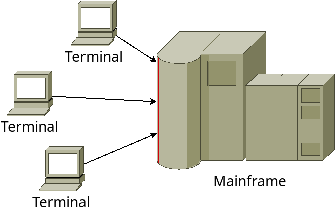
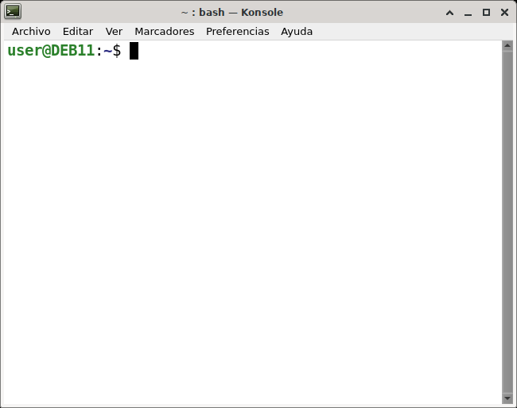
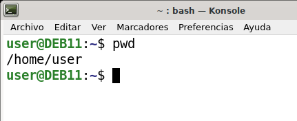
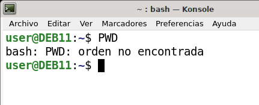

# 5.2 Linux command line

  <!-- – Características de los intérpretes de comandos. Caracteres especiales.
  – Utilización de órdenes para la gestión de archivos y directorios.
  – Operación con archivos: nombre y extensión, comodines, atributos y tipos.
  – Operación con directorios: nombre, atributos y permisos.
  – Otras operaciones comunes para la línea de comandos.
  – Redirección de la entrada y la salida.
  – Activación de opciones de los comandos.
  – Utilización de la ayuda en línea. -->


The _Linux_ command line interface (CLI) is a text-based interface. Often known as _**shell**_, **terminal**, **console**, _**prompt**_, **command line**, among other names, it may seem complex and confusing to use. However, the **power and flexibility** it offers means that its use can be essential when it comes to system administration.

This section explains the motivation for using the command line, teaches basic concepts and commands accompanied by some examples. It is assumed that the student has no prior knowledge.

## A bit of history

During the early years of computing, _UNIX_, one of the first operating systems, was designed to run as a **multi-user** system on mainframe computers, with users connecting to it **remotely** through individual **terminals**. These terminals were quite **basic** by modern standards: only **keyboard and screen**, with no capability to run programs. Instead, they would simply send keystrokes to the server and display the data they received on the screen. There was no mouse, no sophisticated graphics, not even color. Everything was sent and received as **text**. Therefore, any program running on the mainframe had to **produce text as output and accept text as input**.

<figure markdown="span">
  {width=80%}
  <figcaption>Terminals connected to an old mainframe computer</figcaption>
</figure>

Compared to graphics, text **consumes very few resources**. Even on machines from the 1970s, which ran hundreds of terminals over extremely slow network connections, users could interact with programs quickly and efficiently. Very concise commands were created to **reduce the number of keystrokes** needed. This **speed and efficiency** is one of the reasons why this text interface is still widely used today.

When logging into a _UNIX_ mainframe through a terminal, users had to perform **administrative** and **file management** tasks that are now done with a mouse and a couple of windows. Operations like creating, renaming, copying, or moving files on the disk were done with a text interface.

Each of these tasks required its own program or **command**: one to change directories (`cd`), another to list their contents (`ls`), a third to rename or move files (`mv`), etc. To coordinate the execution of each of these programs, the user would connect to a **master program** that could then be used to start any of the others. By wrapping the user's commands, this program, called a "_**shell**_", could provide common capabilities to any of them, such as the ability to _pass data from one command to another_, or use special _wildcard characters_ to work with many files with similar names at once. Users could even write _simple code_, called "_**scripts**_", that could be used to _automate_ long series of _shell_ commands to facilitate complex tasks. The original _**UNIX** shell_ program is "**sh**", but it has been expanded and replaced over the years, so on a modern _**Linux**_ system, the most widespread use is of a shell called "**bash**".

_Linux_ is a kind of descendant of _UNIX_. The core part of _Linux_ is designed to behave similarly to a _UNIX_ system, so most of the old shells and other text-based programs run smoothly. In theory, you could even connect one of those old terminals from the 1970s to a modern _Linux_ system. But today, it is much more common to use a **software terminal**: the same old _UNIX_-style text interface, but running in a window alongside graphical interface.

## Opening a terminal emulator

A **terminal emulator** is a computer program that simulates the operation of old physical terminals. In graphical interfaces, they are also known as *terminal windows*. From now on, we will refer to terminal emulators as _terminals_.

_Linux_ distributions generally have a terminal launcher located in the same place as their other application launchers. It might be hidden in a submenu, but it is likely there somewhere. You can find the terminal by searching in the application launcher or search bar by typing the first few letters of "*terminal*", "*console*", "*prompt*", or "*shell*". Developers often configure the launcher with all the most common synonyms.

If there is no launcher, or you want a quicker way to open the terminal, most systems use the same default keyboard shortcut to launch it: **`Ctrl`**+**`Alt`**+**`T`**.

Regardless of how you start the terminal, you should end up with a rather dull window with some strange text at the top, like the image below. Depending on the _Linux_ system, the colors might not be the same, and the text might say something different, but the general layout of a window with a large, mostly empty text area should be similar.

<figure markdown="span">
  {width=65%}
  <figcaption>Terminal (emulator) window</figcaption>
</figure>

The terminal waits for command input, for example, you can type the command `pwd` in lowercase, and then press the **`Enter`** key to execute it.

The path of a directory (**`/home/YOUR_USER`**) will appear, followed by another copy of the _**prompt**_.

<figure markdown="span">
  {width=80%}
  <figcaption>Execution of a command in the terminal window</figcaption>
</figure>

We need to understand a few basic concepts before we can comprehend exactly what the command does.

## The *Linux* Shell

*Shell* programs are command interpreters that facilitate control of the operating system. They are not the operating system itself but form a layer that communicates the kernel with the interactive user. Upon logging into the system, each user runs a particular *shell* independent of any other user simultaneously using the system. This is indicated by the appearance of a character such as **`$`**, **`#`**, or **`>`** (there are others, and this is usually configurable) that depends on the type of *shell* launched. *Shells* are useful for executing one or more programs, showcasing the real multitasking capability of the operating system. Among the most popular *shells* are:

- Bourne Shell: Written by *Stephen Bourne*, it is the most **basic and oldest**. It is invoked through the **`sh`** command, after which the system prompt `$` should appear.
- _**C Shell**_: Subsequent to the *Bourne Shell* and oriented towards *C* programmers. It is executed by typing the **`csh`** command, resulting in the `%` or `>` character. An improved version of this is `tcsh`, which allows file and directory name completion using the _`tab` key_ and command line editing. This latter version is usually available in all *Linux* distributions.
- ***Korn Shell***: An extension of the *Bourne Shell*. It is launched by executing the **`ksh`** command, resulting in the `$` prompt.
- _**GNU Bourne-Again SHell**_ (_**bash**_): As its name suggests, it is an extension of the *Bourne Shell* and adds features such as file name completion (similar to `tcsh`) and listing files that start with a specific sequence of characters by simply pressing the tab key. It is invoked using the **`bash`** command.

To check the list of interpreters available on the system, you can run **`cat /etc/shells`**.

```bash
$ cat /etc/shells 

# /etc/shells: valid login shells
/bin/sh
/bin/bash
/usr/bin/bash
/bin/rbash
/usr/bin/rbash
/bin/dash
/usr/bin/dash
```

To find out the **default _shell_** configured on the system, you can run **`echo $SHELL`**

```bash
$ echo $SHELL
/bin/bash
```

Although the `$SHELL` variable does not tell us which interpreter we are currently using, to find out **which _shell_ we are using**, we can use **`ps -p $$`**.

```sh title="Example of changing the shell" hl_lines="2 8 12 17 23" linenums="1"
user@DEB11:~$ echo $SHELL
/bin/bash

# Check that we are using bash

user@DEB11:~$ ps -p $$
    PID TTY          TIME CMD
   9502 pts/0    00:00:00 bash

# Change to sh (Bourne Shell)

user@DEB11:~$ sh

# $SHELL variable does not change

$ echo $SHELL
/bin/bash

# Check that we are using sh

$ ps -p $$
    PID TTY          TIME CMD
   9535 pts/0    00:00:00 sh
```

### Prompt

When opening the terminal emulator, a line of text appears in front of the **blinking cursor** (`user@host:~$ _`) known as the **prompt**, indicating that **the terminal is ready to accept commands**. The prompt is configurable, but many systems use the **default format** seen in the example:

  - **Username** (`user`). The user we are currently working with.
  - **Hostname** (`host`). The name of the computer to which the terminal is connected. This might seem obvious, but if we connect to another computer remotely, we might forget where we are working. This way, we can quickly see it.
  - **At** symbol (`@`). You might recognize the symbol from email addresses. For example, if we have "`admin@PC01`," it would be read as "_admin at PC01_," meaning that the user "_admin_" is connected to the computer "_PC01_"
  - **Colon** (`:`). Separates the hostname from the current working directory.
  - **Current working directory**. In the example, **`~`** is an abbreviation for the user's home directory.
  - **Dollar** sign (`$`) or **hash** (`#`). Depending on the user's permissions, the prompt will show a dollar sign for regular users and a hash for the superuser (_root_).
  - **Cursor**. Indicates where we can enter new text, which might be a blinking bar, a square block, or an underscore.

### Commands

A command is a **program with a specific functionality**. By typing a text entry at the prompt, we are requesting the terminal to execute a command. Whether it succeeds or not, once the command execution is complete, the terminal will display the prompt again and wait for a new command.

Commands can be accompanied by **options** and **arguments** that modify their behavior.

For example, in the command **`ls -a /usr`**

- **`ls`** is the **command** responsible for displaying the contents of a directory.
- **`-a`** is an **option** that specifies the output format
- **`/usr`** is an **argument** that indicates the directory we want to display.

Options and arguments are **separated** by **spaces**.

Options are usually preceded by a **hyphen** (`-`) and can be combined. For example, **`ls -la /usr`** is equivalent to **`ls -l -a /usr`**.

## Basic Navigation

### File System Organization

Like *MS Windows*, files on a *Linux* system are organized in what is called a hierarchical directory structure. This means they are organized in a tree-like pattern of directories, which can contain files and subdirectories. The first directory in the file system is called the **root directory**. The root directory contains files and subdirectories, which contain more files and subdirectories, and so on.

Most graphical environments include a file manager program used to view and manipulate the contents of the file system.

One important difference between *MS Windows* and *Linux* operating systems is that **_Linux_ does not use the concept of drive letters**. While *MS Windows* drive letters divide the file system into a series of different trees (one for each volume), **_Linux_ always has a single tree**. Different storage devices may be different branches of the tree, but there is always a single tree.

### '**pwd**' command

Since the command line interface cannot provide images of the file system structure, we need a different way to represent it. To do this, think of the file system tree as a maze and that we are inside it. At any given moment, we are located in a single directory. Within that directory, we can see its files, the path to its parent directory, and the paths to the subdirectories of the directory we are in.

The directory we are in is called the **working directory**. To **display the name of the current working directory**, we use the **`pwd`** command.

```sh
user@DEB11:~$ pwd
/home/user
```

When we first log into the system, the working directory is set to our home directory. This is where we put our files. On most systems, the home directory will be called `/home/username`, (although it could be changed by the administrator).

To list the files in the working directory, we use the **`ls`** command.

```sh
user@DEB11:~$ ls
Downloads  Desktop  Templates  Videos
Documents  Pictures  Music  Public
```

### '**cd**' command

To **change the current working directory**, we use the **`cd`** command. To do this, type `cd` followed by the **path of the desired working directory**. A path name is the route we take along the branches of the tree to reach the directory we want. Path names can be specified in two different ways: **absolute** paths or **relative** paths. Let's first look at absolute path names.

An **absolute path name** starts with the root directory and follows the tree branch by branch until the path to the desired directory or file is complete. For example, there is a directory on your system where most programs are installed. The path name of the directory is `/usr/bin`. This means that from the root directory (represented by the initial slash `/` in the path name) there is a directory called "`usr`" that contains a directory called "`bin`".

```sh title="Example of changing the working directory with an absolute path" hl_lines="2 4 7"
user@DEB11:~$ pwd
/home/user

user@DEB11:~$ cd /usr/bin

user@DEB11:/usr/bin$ pwd
/usr/bin

user@DEB11:/usr/bin$ ls
'['                                     mkisofs
 411toppm                               mk_modmap
 7z                                     mknod
 7za                                    mktemp
 7zr                                    mkzftree
 aa-enabled                             mm2gv
 aa-exec                                mmcli
 accountwizard                          moc
 aconnect                               moggsplit
 acyclic                                mogrify
 add-apt-repository                     mogrify-im6
 addpart                                mogrify-im6.q16
 addr2line                              monitor-sensor
 akonadi_agent_launcher                 montage
 akonadi_agent_server                   montage-im6
...
```

We can see that we have changed the current working directory to `/usr/bin` and it is full of files. Notice how the prompt has changed to `user@DEB11:/usr/bin$`.

Where an absolute path name starts from the root directory and leads to its destination, a relative path name starts from the current working directory. To do this, it uses a couple of special notations to represent relative positions in the file system tree. These special notations are "**`.`**" (colon) and "**`..`**" (two colons).

The "**`.`**" (colon) refers to the current working directory and the notation "**`..`**" (two colons) refers to the previous or parent directory. Here is how it works. Let's change the working directory to `/usr/bin` again:

```sh
user@DEB11:~$ cd /usr/bin
user@DEB11:/usr/bin$ pwd
/usr/bin
```

Alright, now let's say we want to change the working directory to the parent of `/usr/bin`, which is `/usr`. We could do this in two different ways. First, with an **absolute path**:

```sh
user@DEB11:/usr/bin$ cd /usr
user@DEB11:/usr$ pwd
/usr
```
Or with a **relative path** to the current working directory:

```sh
user@DEB11:/usr/bin$ cd ..
user@DEB11:/usr$ pwd
/usr
```

Two different methods with identical results. Which one should we use? The one we consider requires fewer keystrokes.

Likewise, we can change the working directory from `/usr` to `/usr/bin` in two different ways. First, using an **absolute path**:

```sh
user@DEB11:/usr$ cd /usr/bin
user@DEB11:/usr/bin$ pwd
/usr/bin
```

O con la **ruta relativa** al directorio de trabajo actual:

```sh
user@DEB11:/usr$ cd ./bin
user@DEB11:/usr/bin$ pwd
/usr/bin
```
In most cases, **we can omit the "`./`"**, it is implied:

```sh
user@DEB11:/usr$ cd bin
user@DEB11:/usr/bin$ pwd
/usr/bin
```

In general, if we do not specify a path name, the working directory will be assumed. However, there are exceptions that we will see later.

### Some shortcuts

If we type **`cd`** without arguments, `cd` will change to our user directory `/home/user_name`.

A related shortcut is to type `cd ~user_name`, in this case, `cd` will change the working directory to the specified user's home directory.

Typing **`cd -`** changes the working directory to the previous one.

### The importance of UPPERCASE and lowercase

Care must be taken with the use of uppercase and lowercase letters when typing a command. Typing `PWD` will produce an error, which if we do not pay attention, we might think it executed correctly, so it is important to read the command output.

<figure markdown="span">
  {width=80%}
</figure>

This also applies to file and directory names. For example, "`File1`", "`file1`" and "`FILE1`" would be three different files.

## Requesting help

### Built-in help **`--help`**

Most commands have a built-in help system that can be accessed by typing the command name followed by the **`--help`** option or **`-h`**. For example, to access the help system for the **`ls`** command, type **`ls --help`**.

```sh
user@DEB11:/usr/bin$ ls --help
```

### Bash built-in help **`help`**

The **`help`** command provides information about the built-in commands of the *Bash* shell. To access the help system for a built-in command, type **`help`** followed by the command name. For example, to access the help system for the **`cd`** command, type **`help cd`**.

```sh
user@DEB11:/usr/bin$ help cd
```

If you are not sure of the command name, you can use the **`help`** command to search for commands that contain a specific keyword.

```sh
user@DEB11:/usr/bin$ help
```

### Manual pages **`man`**

Most commands have a **manual page** that provides detailed information about the command, including its options and arguments. To access the manual page, type **`man`** followed by the command name. For example, to access the manual page for the **`ls`** command, type **`man ls`**.

```sh
user@DEB11:/usr/bin$ man ls
```

The manual page is displayed one page at a time. To move forward one page, press the **`space`** key. To move back one page, press the **`b`** key. To exit the manual page, press the **`q`** key.

If you are not sure of the command name, you can use the **`apropos`** command to search for commands that contain a specific keyword. For example, to search for commands related to the keyword **`password`**, type **`apropos password`**.

```sh
user@DEB11:/usr/bin$ apropos password
```

## Looking around the system

Now that we know how to move from one working directory to another, we can take a tour of the *Linux* system. Next, we need to know some tools that will be useful to understand the contents of directories.

- **`ls`** list files and directories
- **`cat`** display the contents of a text file
- **`less`** navigate through the contents of text files
- **`file`** determine the content of a file

### '**ls**' command

The **`ls`** command is used to **list the contents of a directory**. It is probably the most used *Linux* command. It can be used in several different ways. Here are some examples:

Examples of the `ls` command:

Command | Result
-|---
`ls` | Lists the files in the working directory
`ls /bin` | Lists the files in the /bin directory (or any other directory we want to specify)
`ls -l` | Lists the files in the working directory in long format
`ls -l /etc /bin` | Lists the files in the `/bin` and `/etc` directories in long format
`ls -la ..` | Lists all files, including hidden files, in the parent directory in long format

These examples also point out an important concept about commands. Most commands work like this:

```
command -options arguments
```

Where *command* is the name of the command, *-options* is one or more settings for the command's behavior, and *arguments* is one or more "things" the command operates on.

In the case of `ls`, we see that `ls` is the name of the command, and it can have one or more options, such as `-a` and `-l`, and it can operate on one or more files or directories.

If we use the `-l` option with `ls`, we will get a list of files that contains a lot of information about the files being displayed. Here is an example:

```sh
drwxr-xr-x  2  root     root       4096   feb  1 21:58 selinux
-rw-r--r--  1  root     root      10593   ene 30  2021 sensors3.conf
drwxr-xr-x  2  root     root       4096   feb  1 22:07 sensors.d
-rw-r--r--  1  root     root      12813   mar 27  2021 services
drwxr-xr-x  3  root     root       4096   feb 13 08:00 sgml
-rw-r-----  1  root     shadow     1268   feb 13 08:00 shadow
-rw-r--r--  1  root     root        116   feb  1 21:58 shells

----------     -------  -------  -------- ------------ -------------
    |             |        |         |         |             |
    |             |        |         |         |           Name
    |             |        |         |         |
    |             |        |         |         +---  Last modification
    |             |        |         |
    |             |        |         +------------- Size in bytes
    |             |        |
    |             |        +----------------------- Group
    |             |
    |             +-------------------------------- Owner
    |
    +---------------------------------------------- Permissions
```

- **Name**. The name of the file or directory.
- **Modification**. The last time the file was modified. If the last modification occurred more than six months ago, the date and year are shown. Otherwise, the time of day is displayed.
- **Size**. The size of the file in bytes.
- **Group**. The name of the group that has file permissions in addition to the file owner.
- **Owner**. The name of the user who owns the file.
- **Permissions**. A representation of the file's access permissions.
    - The first character is the file type.
        - "**`-`**" indicates a regular file.
        - "**`d`**" indicates a directory.
        - "**`l`**" indicates a symbolic link.
    - The second set of three characters represents the **read**, **write**, and **execute** permissions of the file **owner**.
    - The next three represent the **permissions** of the file's **group**
    - The final three represent the **permissions** granted to **everyone else**. We will study this in more detail later.

```sh title="File permissions representation"
d rwx r-x r-x  2  root     root       4096   feb  1 21:58 selinux
- rw- r-- r--  1  root     root      10593   ene 30  2021 sensors3.conf
d rwx r-x r-x  2  root     root       4096   feb  1 22:07 sensors.d
- rw- r-- r--  1  root     root      12813   mar 27  2021 services
d rwx r-x r-x  3  root     root       4096   feb 13 08:00 sgml
- rw- r-- ---  1  root     shadow     1268   feb 13 08:00 shadow
- rw- r-- r--  1  root     root        116   feb  1 21:58 shells

^ ^^^ ^^^ ^^^
|  |   |   | 
|  |   |   | 
|  |   |   | 
|  |   |   | 
|  |   |   |
|  |   |   +--------------- Others permissions
|  |   |
|  |   +--------------- Group permissions
|  |
|  +--------------- Owner permissions
| 
+--------------- File type
```

The **`ls`** command can also be used to list the contents of a directory other than the working directory. For example, to list the contents of the `/bin` directory, we would type:

```sh
ls /bin
```

This command will list the contents of the `/bin` directory, which contains many of the programs that are essential to the operation of the system.

The **`ls`** command can also be used to list the contents of multiple directories at once. For example, to list the contents of both the `/bin` and `/etc` directories, we would type:

```sh
ls /bin /etc
```

Useful options for the **`ls`** command:

Option | Description
-|-
**`-a`** | List all files, including hidden files
**`-l`** | List files in long format
**`-h`** | List file sizes in human-readable format
**`-r`** | List files in reverse order
**`-t`** | List files by modification time
**`-S`** | List files by size
**`-R`** | List files recursively

### '**cat**' command

Was created to _con**cat**enate_ files, but it also allows us to **view text files**. This is very useful since many of the files used to control and configure *Linux* are human-readable. For example, to display the contents of a file called `file.txt`, we would type:

```sh
cat file.txt
```

!!!note "What is a "text file"?"

    There are many ways to represent information on a computer. All methods involve defining a relationship between the information and some numbers that will be used to represent it. Computers, after all, only understand numbers, and all data is converted into numerical representation.

    Some of these representation systems are very complex (such as compressed multimedia files), while others are quite simple. One of the earliest and simplest is called **ASCII** text. ASCII stands for _American Standard Code for Information Interchange_. This is a simple encoding scheme that was first used in teletype machines to map keyboard characters to numbers.

    **Text is a simple one-to-one mapping of characters to numbers**. It is very compact. Fifty characters of text translate into fifty bytes of data. Throughout a *Linux* system, many files are stored in text format, and there are many *Linux* tools that work with text files. Even *MS Windows* systems recognize the importance of this format. The well-known program _`NOTEPAD.EXE`_ is a plain ASCII text file editor.

Fragment of the ASCII table represented compactly in **hexadecimal** and **decimal** format. More information with the command `man ASCII`:

```
       2 3 4 5 6 7       30 40 50 60 70 80 90 100 110 120
     -------------      ---------------------------------
    0:   0 @ P ` p     0:    (  2  <  F  P  Z  d   n   x
    1: ! 1 A Q a q     1:    )  3  =  G  Q  [  e   o   y
    2: " 2 B R b r     2:    *  4  >  H  R  \  f   p   z
    3: # 3 C S c s     3: !  +  5  ?  I  S  ]  g   q   {
    4: $ 4 D T d t     4: "  ,  6  @  J  T  ^  h   r   |
    5: % 5 E U e u     5: #  -  7  A  K  U  _  i   s   }
    6: & 6 F V f v     6: $  .  8  B  L  V  `  j   t   ~
    7: ' 7 G W g w     7: %  /  9  C  M  W  a  k   u  DEL
    8: ( 8 H X h x     8: &  0  :  D  N  X  b  l   v
    9: ) 9 I Y i y     9: '  1  ;  E  O  Y  c  m   w
    A: * : J Z j z
    B: + ; K [ k {
    C: , < L \ l |
    D: - = M ] m }
    E: . > N ^ n ~
    F: / ? O _ o DEL
```

### '**less**' command

**`less`** is used to **display the contents of text files**, similar to `cat`, but it **allows for interaction**.

Once started, `less` will display the text file in a paginated manner. You can use the `Page Down` and `Page Up` keys to navigate through the text file. To exit, type "`q`". Here are some commands that `less` will accept:

Keyboard commands for the `less` program:

Command | Action
-|---
`Page Up` or `b` | Scroll back one page
`Page Down` or `space` | Scroll forward one page
`G` | Go to the end of the text file
`g` | Go to the beginning of the text file
`/search_text` | Search for an occurrence of the specified characters in the file
`n` | Repeat the last search forward
`N` | Repeat the last search backward
`h` | Display a complete list of `less` commands and options
`q` | Exit `less`

### '**file**' command

While navigating through our *Linux* system, it is useful to **determine what type of data a file contains** before attempting to view it. This is where the `file` command comes into play; it will examine a file and tell us what type of file it is.

To use the `file` program, simply type:

The `file` program can recognize most file types, such as:

Various file types:

File Type | Description | Viewable as Text?
--|----|-
ASCII Text | ASCII text | yes
Bourne-Again shell script | A `bash` script | yes
ELF 64-bit LSB executable | A binary executable program | no
ELF 64-bit LSB shared object | A shared library | no
GNU tar archive | A tape archive file. A common way to store groups of files. | no
gzip compressed data | A file compressed with `gzip` | no
HTML document text | A web page | yes
JPEG image data | A compressed *JPEG* image | no
PostScript document text | A PostScript file | yes
Zip archive data | A file compressed with `zip` | no

While it may seem that most files cannot be viewed as text, a surprising number can be. This is the case with important configuration files. We will see that many operating system functions are controlled by text configuration files and *shell* scripts.

---

## Manipulating Files and Directories

To introduce basic file and directory manipulation, we will look at the following commands:

- **`cp`** - copy files and directories
- **`mv`** - move or rename files and directories
- **`rm`** - delete files and directories
- **`mkdir`** - create directories

These four commands are among the most used in *Linux*. They are the basic commands for manipulating both files and directories.

Some of the tasks performed by these commands are easier to do with a graphical file manager. With a file manager, you can drag and drop a file from one directory to another, cut and paste files, delete files, etc. So, why use these old command-line programs?

The answer is power and flexibility. While it is easy to perform simple file manipulations with a graphical file manager, complex tasks can be easier with command-line programs.

_For example, how do you copy all HTML files from one directory to another, but only copy files that do not exist in the destination directory or are newer than the versions in the destination directory?_ Quite difficult with a file manager. Quite easy with the command line:

```sh
$ cp -u *.html destination
```

### Wildcards

Before starting with the commands, let's first look at a feature of the *shell* that makes these commands so powerful. Since the *shell* uses filenames a lot, it provides special characters to help you quickly specify groups of filenames. These special characters are called wildcards. Wildcard characters allow you to select filenames based on character patterns. The following table lists the wildcard characters and what they select:

**Wildcard** | **Meaning**
-----:|:------
**`*`** | Matches any set of characters
**`?`** | Matches any single character
**`[chars]`** | Matches any character that is a member of the set characters. The set of characters can also be expressed as a *POSIX* character class, such as one of the following:
**`[:alnum:]`** | Alphanumeric characters, same as `[a-zA-Z0-9]`
**`[:alpha:]`** | Alphabetic characters, same as `[a-zA-Z]`
**`[:digit:]`** | Numeric characters, same as `[0-9]`
**`[:upper:]`** | Uppercase alphabetic characters, same as `[A-Z]`
**`[:lower:]`** | Lowercase alphabetic characters, same as `[a-z]`
**`[!chars]`** | Matches any character that is **not** a member of the set characters

Using wildcards, it is possible to construct very sophisticated selection criteria for filenames. Here are some examples of patterns and what they match:

- **`*`** All filenames
- **`g*`** All filenames that start with the character "`g`"
- **`b*.txt`** All filenames that start with the character "b" and end with the characters "`.txt`"
- **`Data???`** Any filename that starts with the characters "`Data`" followed by exactly 3 more characters
- **`[abc]*`** Any filename that starts with "`a`" or "`b`" or "`c`" followed by any other character
- **`[[:upper:]]*`** Any filename that starts with an uppercase letter. This is an example of a character class.
- **`BACKUP[[:digit:]][[:digit:]]`** Another example of character classes. This pattern matches any filename that starts with the characters "`BACKUP`" followed by exactly two numbers.
- **`*[![:lower:]]`** Any filename that does not end with a lowercase letter.

We can use wildcards with any command that accepts filename arguments.

### '**cp**' command

The `cp` program **copies files and directories**.

The most basic usage is to copy a file.

```sh
$ cp source_file destination_file
```

It can also be used to copy multiple files (and/or directories) to another directory:

```sh
$ cp file... destination_directory
```

!!!note "About notation (...)"
    In the documentation of a command, **`...`** means that an element can be repeated one or more times.

***Examples of using the `cp` command:***

- **`cp file1 file2`**
    - Copies the contents of `file1` to `file2`.
        - If `file2` does not exist, it is **created**.
        - Otherwise, `file2` is **overwritten** without warning.

- **`cp -i file1 file2`**
    - Like the previous example, but the **`-i`** (interactive) option.
    - Prompts the user for **confirmation before overwriting** `file2` if it exists.

- **`cp file1 dir1`**
    - Copies the contents of `file1` to a new file named `file1` inside the directory `dir1`.

- **`cp -R dir1 dir2`**
    - Uses **`-R`** option (recursive).
    - Copies the contents of the directory `dir1` to the directory `dir2`.
        - If `dir2` does not exist, it is created.
        - If `dir2` exists, a directory named `dir1` is created inside `dir2`.

### '**mv**' command

The `mv` command **moves** or **renames** files and directories depending on how it is used. It can also move one or more files to a different directory or rename a file or directory.

To **rename** a file, use:

```sh
$ mv original_name new_name
```

To **move** files (and/or directories) to a different directory:

```sh
$ mv file... destination_directory
```

***Examples of using the `mv` command:***

- **`mv file1 file2`**
    - If `file2` does not exist, then `file1` is renamed to `file2`.
    - If `file2` exists, its contents are replaced without warning.
- **`mv -i file1 file2`**
    - Like the previous example, but with the `-i` (interactive) option.ç
    - If `file2` exists, it asks for user confirmation before overwriting its contents.
- **`mv file1 file2 dir1`**
    - The files `file1` and `file2` are moved to the directory `dir1`.
- **`mv dir1 dir2`**
    - If `dir2` does not exist, `dir1` is renamed to `dir2`.
    - If `dir2` exists, the directory `dir1` is moved inside `dir2`.

### '**rm**' command

The `rm` (*remove*) command deletes files and directories.

```sh
$ rm file...
```

Using the **`-r`** option removes directories and their contents **recursively**.

```sh
$ rm -r directory...
```

***Examples of using the `rm` command:***

- **`rm file1`**
    - Deletes `file1`
- **`rm file1 file2`**
    - Deletes `file1` and `file2`
- **`rm -i file1 file2`**
    - Like the previous example, but the `-i` (interactive) option.
    - Prompts the user for confirmation before deleting each file.
- **`rm -r dir1 dir2`**
    - The directories `dir1` and `dir2` are deleted along with all their contents.

!!!warning "Be careful with `rm`"

    **Files deleted using the `rm` command cannot be recovered**, they do not go to the trash. If we are not careful, we can cause damage to the system, especially when using wildcards.

    **Before using `rm` with wildcards, it is advisable**: to construct the command using **`ls`** to see which files are selected with the wildcards. After verifying that the files are correct, we can replace `ls` with `rm`.

### '**mkdir**' command

The `mkdir` command is used to **create directories**:

```sh
$ mkdir directory...
```

***Examples of using the `mkdir` command:***

- **`mkdir dir1`**
    - Creates a directory called `dir1`
- **`mkdir dir1 dir2`**
    - Creates directories `dir1` and `dir2`
- **`mkdir -p dir1/dir2/dir3`**
    - Creates the directory `dir1` and inside it the directory `dir2` and inside it the directory `dir3`.
    - The `-p` option creates all the directories in the path that do not exist.

### Using commands with wildcards

The commands we have seen can use multiple files and directories as arguments, and we can use wildcards to specify them.

***Examples of using commands with wildcards:***

- **`cp *.txt Documents`**
    - Copies all files with the `.txt` extension from the current directory to an existing directory called `Documents`
- **`mv dir1 ../*.bak dir2`**
    - Moves the subdirectory `dir1` and all files with the `.bak` extension from the parent directory to a directory called `dir2`
- **`rm *.jpg`**
    - Deletes all files in the current directory that end with the `.jpg` extension.

## Identifying Commands

There are four types of commands:

1. **Executable programs** such as the files in `/usr/bin`. These programs can be *compiled binaries* or programs written in *interpreted scripting languages*.
2. **Shell built-in commands**. Bash includes a number of built-in commands, such as the `cd` command.
3. **Shell functions**. These are small scripts incorporated into an environment. They are studied in shell script programming.
4. **Aliases**. Commands that we can define, composed of other commands.

### `type` command

The `type` command is built into the shell and shows the type of a given command.

```sh
$ type command
```

Where '*command*' is the name of the command we want to examine.

***Some examples of using the `type` command:***

```sh
$ type ls
ls is aliased to 'ls --color=auto'

$ type cd
cd is a shell builtin

$ type mv
mv is /usr/bin/mv
```

Here we see the results for three different commands. We observe that the `ls` command is actually an ***alias*** of the `ls` command with the "`--color=auto`" option added, which allows the command's output to be colored without having to type the option each time.

### '**which**' command

Sometimes there is more than one version of an executable program installed on a system. Although this is not very common on desktop systems, it is not unusual on large servers. To determine the exact location of a particular executable, use the `which` command:

```sh
$ which ls
/usr/bin/ls
```

`which` only works for executable programs, not for builtins or aliases that are substitutes for real executable programs.

### '**help**' command

`bash` has built-in help for each of the `shell builtins`. To use it, type "`help`" followed by the name of the command. Optionally, you can add the `-m` option to change the output format. For example:

```sh
$ help -m cd
NAME
  cd - Change the shell working directory.

SYNOPSIS
  cd [-L|[-P [-e]]] [dir]

DESCRIPTION
  Change the current directory to DIR. The default DIR is the value of the HOME shell variable.
  
  The variable CDPATH defines the search path for the directory containing DIR. Alternative directory names in CDPATH are separated by a colon (:). A null directory name is the same as the current directory. If DIR begins with a slash (/), CDPATH is not used.
  
  If the directory is not found, and the shell option 'cdable_vars' is set, the word is assumed to be a variable name. If that variable has a value, its value is used for DIR.
  
  Options:
    -L        force symbolic links to be followed: resolve symbolic links in DIR after processing instances of '..'
    -P        use the physical directory structure without following symbolic links: resolve symbolic links in DIR before processing instances of '..'
    -e        if the -P option is supplied, and the current working directory cannot be determined successfully, exit with a non-zero status.
  
  The default is to follow symbolic links, as if '-L' were specified.
  '..' is processed by removing the immediately previous pathname component back to a slash or the beginning of DIR.
  
  Exit Status:
  Returns 0 if the directory is changed, and if $PWD is set successfully when -P is used; non-zero otherwise.

SEE ALSO
  bash(1)

IMPLEMENTATION
  GNU bash, version 5.1.16(1)-release (x86_64-pc-linux-gnu)
  Copyright (C) 2020 Free Software Foundation, Inc.
  License GPLv3+: GNU GPL version 3 or later <http://gnu.org/licenses/gpl.html>
```

!!!note "About notation"
    When brackets appear in the command syntax description, they indicate optional elements. A vertical bar character indicates mutually exclusive elements. In the case of the `cd` command above:

    ```txt
    cd [-L|[-P [-e]]] [dir]
    ```

    This notation indicates that the `cd` command may optionally be followed by `-L` or `-P` or `-Pe` and, additionally, optionally by the `dir` argument.

### `--help` option

Many executable programs support a "`--help`" option that displays a description of the command's syntax and options. For example:

```sh
$ mkdir --help
Usage: mkdir [OPTION]... DIRECTORY...
Create the DIRECTORY(ies), if they do not already exist.

Mandatory arguments to long options are mandatory for short options too.
  -m, --mode=MODE   set file mode (as in chmod), not a=rwx - umask
  -p, --parents     no error if existing, make parent directories as needed
  -v, --verbose     print a message for each created directory
  -Z                   set SELinux security context of each created directory to the default type
      --context[=CTX]  like -Z, or if CTX is specified then set the SELinux or SMACK security context to CTX
      --help     display this help and exit
      --version  output version information and exit

GNU coreutils online help: <https://www.gnu.org/software/coreutils/>
Report any translation bugs to <https://translationproject.org/team/>
Full documentation <https://www.gnu.org/software/coreutils/mkdir>
or available locally via: info '(coreutils) mkdir invocation'
```

Some programs do not support the "`--help`" option, but attempting to run them often results in an error message that will reveal similar usage information.

### '**man**' command

Most command-line executable programs include formal documentation called **manual** or **man page**. To view them, a special pagination program called `man` is used. It is used as follows:

```sh
$ man ls
```

It will display the following information:

```txt
LS(1)                        User Commands                       LS(1)

NAME
  ls - list directory contents

SYNOPSIS
  ls [OPTION]... [FILE]...

DESCRIPTION
  By default, lists information about the FILEs (the current directory
  by default). Sort entries alphabetically if none of -cftuvSUX nor
  --sort is specified.

  Mandatory arguments to long options are mandatory for short options too.

  -a, --all
    do not ignore entries starting with .

  -A, --almost-all
    do not list implied . and ..
...
```

- **NAME**: Displays the command followed by a brief description of its function.
- **SYNOPSIS**: An overview of the **syntax**, i.e., how the command should be executed.
- **DESCRIPTION**: A more detailed description of the command.
    
    Below the description, there will always be a list of all the **command-line options** available for the command.

On most *Linux* systems, `man` uses `less` to display the manual page, so all `less` keyboard shortcuts work in the manual page.

It is possible to search by keyword in the manual pages. This can be useful if you are sure of what you want to achieve but do not know the exact command. It is not uncommon to find that a specific word exists in many manual pages.

<!--

## Redirección de entradas y salidas

La redirección de entradas y salidas es una potente característica utilizada por los programas de línea de comandos. Muchos comandos como ls imprimen su salida en la pantalla. Sin embargo, esto no tiene por qué ser así. Utilizando notaciones especiales podemos redirigir la salida de muchos comandos a archivos, dispositivos e incluso a la entrada de otros comandos.

En todas las variantes de *Unix* tiene tres flujos estándar que, a modo de canales, conectan la entrada y salida (I/O) de un comando/aplicación con la terminal/consola cuando se ejecuta, son los siguientes:

- `**STDIN (0)**` - Entrada estándar, datos introducidos en el programa, por defecto mediante parámetros introducidos como parámetros.
- `**STDOUT (1)**` - Salida estándar, datos devueltos por el programa, por defecto en el terminal.
- `**STDERR (2)**` - Error estándar, para mensajes de error, también por defecto en el terminal.

A cada canal tiene asociado un número único para identificarlo. Es lo que se conoce como descriptor de fichero.

### Salida estándar '**>**', '**> >**'

Los programas de línea de comandos que muestran sus resultados a un dispositivo llamado **salida estándar** o **STDOUT** (*Standard Output*). Por defecto, la salida estándar dirige su contenido al mismo terminal. Para redirigir la salida estándar a un archivo, se utiliza el carácter "**`>`**" de la siguiente manera:

```sh
$ ls > listado_archivos.txt
```

En este ejemplo, se ejecuta el comando `ls` y los resultados se escriben en un archivo llamado `listado_archivos.txt`. Como la salida de ls se redirigió al archivo, no aparecerá ningún resultado en la pantalla.

Cada vez que se repite el comando anterior, `listado_archivos.txt` se sobrescribe desde el principio con la salida del comando `ls`. Para que los nuevos resultados se añadan al archivo, se utiliza "**`>>`**" de la siguiente manera:

```sh
$ ls >> listado_archivos.txt
```

Se añaden los resultado al final del fichero, con lo que el fichero se hace más largo cada vez que se repite el comando. Si el fichero no existe cuando intentamos anexar la salida redirigida, se creará el fichero.

### Entrada estándar '**<**'

Muchos comandos pueden aceptar la entrada de un dispositivo llamado **entrada estándar** o **STDIN** (*Standard Input*). Por defecto, la entrada estándar obtiene su contenido del **teclado**, pero al igual que la salida estándar, puede redirigirse. Para redirigir la entrada estándar desde un archivo en lugar de desde el teclado, se utiliza el carácter "**`<`**" de la siguiente manera:

```sh
$ sort < listado_archivos.txt
```

En el ejemplo anterior, hemos utilizado el comando `sort` para procesar el contenido de `listado_archivos.txt`. Los resultados se muestran en la pantalla ya que la salida estándar no fue redirigida. Podríamos redirigir la salida estándar a otro archivo de la siguiente manera:

```sh
$ sort < listado_archivos.txt > listado_archivos_ordenado.txt
```

Como podemos ver, un comando puede tener tanto su entrada como su salida redirigidas. Tenga en cuenta que el orden de la redirección no importa. El único requisito es que los operadores de redirección (los "`<`" y "`>`") deben aparecer después de las demás opciones y argumentos del comando.

### Tuberías '**|**'

La cosa más útil y poderosa que podemos hacer con la redirección de E/S es conectar múltiples comandos juntos para formar lo que se llama pipelines. Con los pipelines, la salida estándar de un comando se introduce en la entrada estándar de otro. He aquí un ejemplo muy útil:

```sh
$ ls -l | less
```

En este ejemplo, la salida del comando ls se introduce en `less`. Usando este truco "`| less`", podemos hacer que cualquier comando tenga salida interactiva donde podemos paginar y hacer búsquedas en la salida.

Conectando comandos entre sí, podemos sacar el máximo partido a la línea de comandos. Aquí tienes algunos ejemplos:

- `ls -lt | head` Muestra los 10 archivos más nuevos del directorio actual.
- `du | sort -nr` Muestra una lista de directorios y cuánto espacio consumen, ordenados del mayor al menor.
- `find . -type f -print | wc -l` Muestra el número total de ficheros en el directorio de trabajo actual incluyendo todos sus subdirectorios.

### Filtros

Un tipo de programa que se utiliza con frecuencia con las tuberías se llama filtro. Los filtros toman la entrada estándar, realizan una operación sobre ella y envían los resultados a la salida estándar. De este modo, pueden combinarse para procesar la información de formas muy potentes. Estos son algunos de los programas más comunes que pueden actuar como filtros:

- `sort` Ordena la entrada estándar y muestra el resultado ordenado en la salida estándar.
- `uniq` Dado un flujo de datos ordenado de la entrada estándar, elimina las líneas de datos duplicadas, es decir, se asegura de que cada línea sea única.
- `grep` Examina cada línea de datos que recibe de la entrada estándar y muestra todas las líneas que contienen un patrón específico de caracteres.
- `fmt` Lee texto de la entrada estándar y, a continuación, muestra texto formateado en la salida estándar.
- `pr` Toma el texto de la entrada estándar y divide los datos en páginas con saltos de página, encabezados y pies de página como preparación para la impresión.
- `head` Da salida a las primeras líneas de su entrada. Útil para obtener la cabecera de un fichero.
- `tail` Muestra las últimas líneas de la entrada. Útil para cosas como obtener las entradas más recientes de un archivo de registro.
- `tr` Traduce caracteres. Puede utilizarse para realizar tareas como conversiones mayúsculas/minúsculas o cambiar los caracteres de terminación de línea de un tipo a otro (por ejemplo, convertir archivos de texto DOS en archivos de texto estilo Unix).
- `sed` Editor de secuencias. Puede realizar traducciones de texto más sofisticadas que `tr`.
- `awk` Lenguaje de programación completo diseñado para construir filtros. Extremadamente potente.

**Realización de tareas con pipelines:**

  **Impresión desde la línea de comandos**. Linux proporciona un programa llamado `lpr` que acepta la entrada estándar y la envía a la impresora. Se utiliza a menudo con tuberías y filtros. He aquí un par de ejemplos:

  ```sh
  $ cat informe_mal_formateado.txt | fmt | pr | lpr
  ```

  El ejemplo sigue los siguientes pasos:

  - `cat` lee el archivo y lo envía a la salida estándar, que se canaliza a la entrada estándar de `fmt`.
  - `fmt` formatea el texto en párrafos ordenados y lo envía a la salida estándar, que se canaliza a la entrada estándar de `pr`.
  - `pr` divide el texto ordenadamente en páginas y lo envía a la salida estándar, que se canaliza a la entrada estándar de `lpr`.
  - `lpr` toma su entrada estándar y la envía a la impresora.

  ```sh
  $ cat lista_no_clasificada_con_duplicados.txt | sort | uniq | pr | lpr
  ```

  El ejemplo comienza con una lista de datos sin ordenar con entradas duplicadas. En primer lugar, `cat` envía la lista a `sort`, que la ordena y la envía a `uniq`, que elimina los duplicados. A continuación se utilizan `pr` y `lpr` para paginar e imprimir la lista.

  **Ver el contenido de los archivos `tar`**. A menudo se obtendrán `tar` comprimidos con `gzip`. Se puede utilizar el siguiente comando para ver el contenido de un archivo de este tipo en un sistema *Linux*:

  ```sh
  $ tar tzvf nombre_del_archivo.tar.gz | less
  ```

### Salida de error estándar '**2>**'

La salida estándar de error es hacia donde el comando envía datos de error al momento de realizar su tarea. Este flujo de datos también se imprime en el terminal pero no se envía a la entrada estándar (*STDIN*) de un comando que lo consuma.

```sh
$ ls -l valido.txt invalido.txt
ls: no se puede acceder a 'invalido.txt': No existe el archivo o el directorio
-rw-rw-r-- 1 user user 11 mar 30 12:42 valido.txt
```

En el ejemplo aparece un error en el terminal indicando que `invalido.txt` no existe y, a continuación, muestra los datos del segundo archivo `valido.txt` que sí se encuentra.

Si redirigiimos la salida estándar del comando a un archivo obtendremos lo siguiente:

```sh
$ ls -l valido.txt invalido.txt > salida.txt
ls: no se puede acceder a 'invalido.txt': No existe el archivo o el directorio

$ cat salida.txt
-rw-rw-r-- 1 user user 11 mar 30 12:42 valido.txt
```

Podemos observar que el error sigue apareciendo en el terminal y en el archivo se ha almacenado la salida del archivo que no ha producido un error.

Podríamos almacenar la salida de error estándar redirigiendo la salida con "`2>`":

```sh
$ ls -l valido.txt invalido.txt 2> error.txt
-rw-rw-r-- 1 user user 11 mar 30 12:42 valido.txt

$ cat error.txt
ls: no se puede acceder a 'invalido.txt': No existe el archivo o el directorio
```

A menudo se suele desechar la salida de error redirigiéndola al dispositivo `/dev/null`, simplemente no se muestra ni almacena en ningún sitio.

```sh
$ ls -l valido.txt invalido.txt 2> /dev/null
-rw-rw-r-- 1 user user 11 mar 30 12:42 valido.txt
```

Si queremos redirigir ambas salidas, cada una en un archivo, haremos lo siguiente:

```sh
$ ls -l valido.txt invalido.txt > salida.txt 2> error.txt

$ cat salida.txt
-rw-rw-r-- 1 user user 11 mar 30 12:42 valido.txt

$ cat error.txt
ls: no se puede acceder a 'invalido.txt': No existe el archivo o el directorio
```

Por último, si queremos redirigir la salida de error a la salida estándar para poder almacenar ambas salidas en un mismo archivo, haremos lo siguiente:

```sh
$ ls -l valido.txt invalido.txt > salida.txt 2>&1

$ cat salida.txt
-rw-rw-r-- 1 user user 11 mar 30 12:42 valido.txt
ls: no se puede acceder a 'invalido.txt': No existe el archivo o el directorio
```

## Permisos

Los permisos *Linux* indican tres cosas que puedes hacer con un archivo o directorio, **leer**, **escribir** y **ejecutar**. Cada permisos se representa con una letra.

- **r** leer (*read*) - puedes ver el contenido del archivo.
- **w** escribir (*write*) - puedes cambiar el contenido del archivo.
- **x** ejecutar (*execute*) - puede ejecutar si se trata de un programa o script.

La misma serie de permisos se puede utilizar para los directorios, pero tienen un comportamiento ligeramente diferente.

- **r** - tiene la capacidad de leer el contenido del **directorio**, es decir, hacer un `ls`
- **w** - puede escribir en el directorio, es decir, crear archivos y directorios
- **x** - tiene la capacidad de entrar en ese directorio, es decir, ejecutar `cd`

A su vez, los permisos se dividen en tres apartados:

- **propietario** - usuario único propietario del fichero. (normalmente la persona que creó el fichero, pero la propiedad puede ser transferida a otro usuario)
- **grupo** - cada archivo pertenece a un único grupo.
- **otros** - cualquier otro usuario que no pertenezca al grupo ni sea el propietario.

### Consultar los permisos

Con `ls -l` podemos ver los detalles de los archivos incluyendo sus permisos.

```sh
$ ls -l archivo.txt
-rwxr----x 1 alumno1 students 12 mar 29 09:23 archivo.txt
```

En el ejemplo anterior, los 10 primeros caracteres de la salida son los que miramos para identificar los permisos `-rwxrw---x`.

- El primer carácter identifica el tipo de archivo. Si es un guión (`-`), se trata de un archivo normal. Si es una `d`, se trata de un directorio.
- Los tres caracteres siguientes representan los permisos del propietario. Una letra representa la presencia de un permiso y un guión (`-`) representa la ausencia de un permiso. En este ejemplo, el propietario tiene todos los permisos (lectura, escritura y ejecución).
- Los siguientes 3 caracteres representan los permisos para el grupo. En este ejemplo el grupo tiene permiso de lectura pero no de escritura ni de ejecución. Se debe tener en cuenta que el orden de los permisos es siempre leer, luego escribir y luego ejecutar.
- Finalmente los últimos 3 caracteres representan los permisos para otros (o todos los demás). En este ejemplo tienen el permiso de ejecución y nada más.
- A parte, podemos observar que el archivo pertenece al usuario `alumno1` y al grupo `students`.

A continuación se muestra una tabla resumen con la representación simbólica de los permisos así como su equivalente en binario y decimal.

Simbólico | Binario | Decimal
:-:|:-:|:-:
`– – –` | 000 | **0**
`– – x`	| 001 | **1**
`– w –` | 010 | **2**
`– w x` | 011 | **3**
`r – –`	| 100 | **4**
`r – x` | 101 | **5**
`r w –` | 110 | **6**
`r w x` | 111 | **7**
Table: Relación entre representación simbólica y decimal de los permisos.

Simbólico | Decimal
-|:-:
`– – –` `– – –` `– – –` | 000
`r – –` `– – –` `– – –` | 400
`r – –` `r – –` `r – –` | 444
`r w –` `– – –` `– – –` | 600
`r w –` `r – –` `r – –` | 644
`r w –` `r w –` `r w –` | 666
`r w x` `– – –` `– – –` | 700
`r w x` `r – x` `– – –` | 750
`r w x` `r – x` `r – x` | 755
`r w x` `r w x` `r w x` | 777
Table: Configuración de permisos comúnmente utilizadas.

### Modificar permisos '**chmod**'

Para cambiar los permisos de un archivo o directorio se utiliza un comando llamado `chmod`.

```txt
chmod [permisos] [ruta]
```

El parámetro de los permisos podemos pasarlo de dos formas distinta, en notación numérica y en notación simbólica.

Ejemplo de cambio de permisos utilizando la notación numérica:

```sh
$ chmod 750 archivo.txt
$ ls -l archivo.txt
-rwxr-x--- 1 alumno1 students 12 mar 29 09:23 archivo.txt
```

Ejemplo de cambio de permisos utilizando la notación simbólica, en este caso eliminaría el permiso de ejecución:

```sh
$ chmod -x archivo.txt
$ ls -l archivo.txt
-rw-r----- 1 alumno1 students 12 mar 29 09:23 archivo.txt
```

La notación simbólica es más flexible, ya que permite añadir o quitar permisos sin modificar el resto.

Podemos indicar a dónde se aplica el permiso mediante los siguientes argumentos:

- `u` usuario propietario
- `g` grupo
- `o` otros
- `a` todos (*all*)

A parte podemos indicar la operación con los siguientes símbolos:

- `+` añade el permiso
- `-` quita el permiso
- `=` configura el permiso con los valores indicados

Algunos ejemplos serían:

- `+x` añade permisos de ejecución a todos, sería equivalente a utilizar `a+x`
- `u+x` añade permiso de ejecución al usuario propietario
- `g-x` elimina el permiso de ejecución para el grupo
- `o-rw` elimina los permisos de lectura y escritura a otros
- `go=rw` establece los permisos para el grupo y otros para que puedan leer y escribir pero no ejecutar
- `u+x,go=rx` añade permiso de ejecución al propietario y establece los permisos para el grupo y otros para que puedan leer y ejecutar pero no escribir

## Gestión de procesos

*Linux* en general es un sistema bastante estable. Sin embargo, de vez en cuando, se puede se pierda rendimiento o se necesite ajustar el funcionamiento del sistema para que se adapte mejor a nuestras necesidades. En esta sección echaremos un breve vistazo a cómo podemos gestionar programas, o procesos en un sistema *Linux*.

Un programa es una serie de instrucciones que indican al ordenador lo que debe hacer. Cuando ejecutamos un programa, esas instrucciones se copian en la memoria y se asigna espacio para variables y todo lo necesario para gestionar su ejecución. Esta instancia en ejecución de un programa se denomina **proceso** y podemos gestionarlo.

### Trabajos en primer y segundo plano.

Cuando ejecutamos un programa o comando, normalmente se ejecutan en primer plano. La mayoría de ellos se ejecutan en una fracción de segundo. Puede que queramos iniciar un proceso que tarde un largo período de tiempo y que se ejecute sin nuestra intervención (procesar un archivo de texto muy grande o compilar un programa, por ejemplo). Lo que podemos hacer es ejecutar el programa en segundo plano y seguir trabajando. Demostraremos esto con un programa llamado `sleep`. Todo lo que hace `sleep` es esperar un número determinado de segundos y luego salir. También podemos usar un comando llamado `jobs` que nos lista los trabajos en segundo plano que se están ejecutando.

```bash
$ sleep 60
```

Este comando bloquearía la línea de comandos durante 60 segundos.

Si queremos cancelar la ejecución podemos pulsar la combinación de teclas `Ctrl + C`
Si pulsamos `Ctrl + Z` el proceso se detiene y se envía a segundo plano.

Para ejecutar un comando en segundo plano, añadiremos un ampersand `&` al final del comando.

```bash
$ sleep 60 &
```

Para consultar los procesos que están en segundo plano se utiliza el comando `jobs`

```bash
$ sleep 60 &
[1] 16656
$ jobs
[1]+  Ejecutando              sleep 60 &
```

Para enviar un proceso a primer plano y continuar su ejecución utilizaremos el comando `fg` (*foreground*) y el número de trabajo.

```bash
$ fg 1
sleep 60

```

Si hemos enviado un proceso a segundo plano con `Ctrl + Z` aparecerá detenido en `jobs`

```bash
$ sleep 60
^Z
[1]+  Detenido                sleep 60
$ jobs
[1]+  Detenido                sleep 60
```

Para reanudar la ejecución del proceso, pero que continúe en segundo plano utilizamos el comando `bg` (*background*) acompañado del número de trabajo.

```bash
$ bg 1
[1]+ sleep 60 &
$ jobs
[1]+  Ejecutando              sleep 60 &
```

### Comando '**top**'

*Linux*, como la mayoría de los sistemas operativos modernos, es un sistema operativo **multitarea**. Esto significa que muchos procesos pueden estar ejecutándose al mismo tiempo. Además de los procesos que estamos ejecutando, puede haber otros usuarios en el sistema que también estén ejecutando sus procesos y el propio sistema operativo normalmente también ejecuta varios procesos que utiliza para gestionar el sistema en general. Si queremos obtener una instantánea de lo que está ocurriendo actualmente en el sistema, podemos utilizar un programa llamado `top`.

```sh
$ top
```

Abajo un ejemplo simplificado de la ejecución de top:

```txt
$ top
top -  9:40:00 up 4 days, 5:21,  2 users,  load average: 0,89, 0,38, 0,14
Tasks: 184 total,   1 running, 183 sleeping,   0 stopped,   0 zombie
%Cpu(s): 1,0 us, 1,4 sy, 0,0 ni, 96,3 id, 1,4 wa, 0,0 hi, 0,0 si, 0,0 st
MiB Mem :    976,7 total,    213,1 free,    565,8 used,    197,7 buff/cache
MiB Swap:    975,0 total,    650,6 free,    324,4 used.    264,0 avail Mem 

 PID USER    PR  NI    VIRT    RES    SHR S  %CPU  %MEM     TIME+ COMMAND  
 643 root    20   0  579800  37772  10288 S   1,0   3,8   0:03.13 Xorg     
 457 root    35  15   16560  12924   1904 S   0,7   1,3   0:00.26 preload  
  11 root    20   0       0      0      0 S   0,3   0,0   0:00.08 ksoftir+ 
1371 user    20   0  152744   1272   1144 S   0,3   0,1   0:00.13 VBoxCli+ 
1544 user    20   0  504452  10236   9248 S   0,3   1,0   0:00.12 panel-8+ 
```

Detalle de cada línea:

**Tiempo de actividad y carga del sistema**
  
```txt
top - 9:40:00 up 4 days, 5:21,  2 users,  load average: 0,89, 0,38, 0,14
```

- Hora actual.
- Tiempo que lleva encendido el sistema.
- Número de usuarios con sesión iniciada
- Carga media de CPU en intervalos de 5, 10 y 15 minutos.

**Tareas**. Los procesos también se les llama tareas (*tasks*)

```txt
Tasks: 184 total,   1 running, 183 sleeping,   0 stopped,   0 zombie
```

Muestra el total de procesos en sus diferentes estados:

- *Running*: en ejecución o preparados para ejecutarse.
- *Sleeping*: en espera hasta que ocurra un evento en particular.
- *Stopped*: ejecución detenida.
- *Zombie*: no está siendo ejecutado. Algunos procesos quedan en este estado si el proceso que los invocó termina.

**Estado de la CPU**

```txt
%Cpu(s): 1,0 us, 1,4 sy, 0,0 ni, 96,3 id, 1,4 wa, 0,0 hi, 0,0 si, 0,0 st
```

Muestra porcentajes de uso del procesador:

- **us** (*user*): Procesos de usuario.
- **sy** (*system*): Procesos de sistema.
- **ni** (*nice*): Procesos de usuario con prioridad cambiada.
- **id** (*iddle*): Procesos inactivos.
- **wa** (*waiting*): En espera a que termine un evento.
- **hi** (*hw int*): Interrupciones hardware.
- **si** (*sw int*): Interrupciones software.
- **st** (*steal*): En entornos virtualizados, tiempo que espera la máquina virtual para que el sistema anfitrión le de uso de procesador.

**Memoria física**

```txt
MiB Mem :    976,7 total,    213,1 free,    565,8 used,    197,7 buff/cache
```

- Memoria total
- Memoria en disponible
- Memoria en uso
- Memoria dedicada dedicada al buffers y cache. El sistema almacena los datos de uso frecuente para optimizar las lecturas de disco.

**Memoria virtual**

```txt
MiB Swap:    975,0 total,    650,6 free,    324,4 used.    264,0 avail Mem 
```

Cuando el sistema tiene más procesos en ejecución de los que la memoria principal puede almacenar, se hace uso de un dispositivo de almacenamiento secundario, normalmente el disco duro, para almacenar los procesos más antiguos que no se están ejecutando en este momento. Es una operación lenta y si el sistema está utilizando memoria *swap* se notará una bajada de rendimiento notable.

- **avail Mem** es una estimación de cuánta memoria se puede usar antes de comenzar a utilizar memoria virtual.

**Lista de procesos**

```txt
 PID USER    PR  NI    VIRT    RES    SHR S  %CPU  %MEM     TIME+ COMMAND  
 643 root    20   0  579800  37772  10288 S   1,0   3,8   0:03.13 Xorg    
```

- **PID**: es el identificador de proceso. Cada proceso tiene un identificador único.
- **USER**: usuario propietario del proceso.
- **PR**: prioridad del proceso. Si pone RT es que se está ejecutando en tiempo real.
- **NI**: asigna la prioridad. Si tiene un valor bajo (hasta -20) quiere decir que tiene más prioridad que otro con valor alto (hasta 19).
- **VIRT**: cantidad de memoria virtual utilizada por el proceso.
- **RES**: cantidad de memoria RAM física que utiliza el proceso.
- **SHR**: memoria compartida.
- **S** (*status*): estado del proceso.
  - **R** *running*
  - **S** *sleeping* 
  - **T** *stopped*
  - **Z** *zombie*
- **%CPU**: porcentaje de CPU utilizado desde la última actualización.
- **%MEM**: porcentaje de memoria física utilizada por el proceso desde la última actualización.
- **TIME+**: tiempo total de CPU que ha usado el proceso desde su inicio.
- **COMMAND**: comando utilizado para iniciar el proceso.

Algunos atajos de teclado más comunes:

- **`q`** salir de *top*
- **`M`** ordena por uso de memoria
- **`P`** ordena por uso de procesador
- **`N`** ordena por ID de proceso
- **`T`** ordena por tiempo de ejecución
- **`V`** vista de árbol de procesos
- **`k`** enviar señal de terminación de proceso

Una alternativa a `top` es **`htop`** aunque puede que no venga instalado con el sistema y necesitemos instalarlo manualmente (`sudo apt install htop`). Según su descripción en la página de manual (`man htop`):

```txt
Es similar a top, pero permite desplazarse vertical y horizontalmente, e
interactuar utilizando un dispositivo apuntador (ratón). Puede observar
todos los procesos que se ejecutan en el sistema, junto con sus
argumentos de línea de comandos, así como verlos en un formato de árbol,
seleccionar varios procesos y actuar sobre todos ellos a la vez.
```

### Comando '**ps**'

Otro programa para ver los procesos es `ps`. En su uso normal te mostrará sólo los procesos que se están ejecutando en el terminal actual (que no suelen ser muchos).

```sh
$ ps
    PID TTY          TIME CMD
  46141 pts/0    00:00:00 bash
  46221 pts/0    00:00:00 ps
```

Si añadimos el argumento `aux` entonces mostrará una vista completa de procesos del sistema.

```txt
$ ps aux
USER   PID %CPU %MEM    VSZ   RSS TTY      STAT START   TIME COMMAND
root     1  0.0  0.9  98464  9516 ?        Ss   12:18   0:00 /sbin/init
root     2  0.0  0.0      0     0 ?        S    12:18   0:00 [kthreadd]
root     3  0.0  0.0      0     0 ?        I<   12:18   0:00 [rcu_gp]
root     4  0.0  0.0      0     0 ?        I<   12:18   0:00 [rcu_par_gp]
...
```

Tiene una salida mucho más extensa, así que la se suele pasar la salida a `grep` para filtrar los resultados.

### Comando '**kill**'

El comando `kill` permite detener un proceso indicando su ID. En realidad, kill sirve para enviar una señal a un proceso, pero si no indicamos opciones envía la señal de terminación `-TERM`.

Con `kill -l` podemos ver un listado de las señales disponibles, las más importantes son las siguientes:

- `SIGTERM` (15) - Señal de terminación del software (envía kill por defecto).
- `SIGKILL` ( 9) - Si un proceso recibe esta señal, debe salir inmediatamente y no realizará ninguna operación de limpieza.
- `SIGSTOP` (19) - Se emite para detener un proceso.
- `SIGCONT` (18) - Continuar la ejecución de un proceso detenido.
- `SIGHUP`  ( 1) - Se emite al cerrar el terminal asociado.
- `SIGINT`  ( 2) - Se emite si el usuario envía una señal de interrupción (Ctrl + C).
- `SIGQUIT` ( 3) - Se emite si el usuario envía una señal de abandono (Ctrl + D).

Las señales tienen asociado un código numérico estándar para las diferentes arquitecturas de procesadores.

Ejemplo de uso de `kill`:

```bash
$ sleep 5000&
[1] 18456
$ ps -a
    PID TTY          TIME CMD
  18456 pts/2    00:00:00 sleep
  18457 pts/2    00:00:00 ps
$ kill 18456
$ ps -a
    PID TTY          TIME CMD
  18457 pts/2    00:00:00 ps
```

En el ejemplo se ejecuta `sleep` para que se ejecute durante 5000 segundos, pero se lanza en segundo plano con `&`.
Podemos observar que aparecen unos números, `[1] 18456`, entre corchetes indica el trabajo en segundo plano, y el otro número es el ID de proceso.
Con `ps -a` vemos los procesos activos en el terminal actual junto con su `PID` (*Process ID*)
Al ejecutar `kill` junto con el `PID` estamos enviando la señal `TERM` (15) donde se le pide al proceso que termine su ejecución de forma ordenada.

Si una aplicación o comando se ha quedado bloqueado y queremos terminar su ejecución de manera forzosa, utilizaremos la señal `KILL` (9).

```bash
$ kill -9 18456
```

también se puede indicar la señal como texto:

```bash
$ kill -KILL 18456
```

Tiene el mismo efecto que el ejemplo anterior, pero fuerza el cierre de la aplicación. Por ejemplo, si tenemos abierto un editor de texto con cambios pendientes de guardar, por lo general, el editor de texto, al solicitar el cierre ordenado, señal `TERM` (15), mostrará un mensaje interactivo o diálogo preguntando al usuario si quiere guardar los cambios. Si utilizamos la señal `KILL` (9) este mensaje no aparece y se perderán los cambios.

## Enlaces

En *Linux* todo se trata como un archivo. Pero hay un tipo especial de archivo, llamado enlace (*link*), y hay dos tipos de enlaces:

- **Enlaces simbólicos** También llamados **enlaces suaves**, apuntan a la **ruta** de otro archivo. Si se borra el archivo al que apunta el enlace (llamado target), el enlace seguirá existiendo, pero el enlace dejará de funcionar.

- **Enlaces duros** También llamado **enlace físico**, es como un segundo nombre para el archivo original. **No son duplicados**, sino que son una entrada adicional en el sistema de archivos que apunta al mismo lugar (`inodo`) en el disco.

Un **inodo** es una estructura de datos que almacena atributos para un objeto (como un archivo o directorio) en un sistema de archivos. Entre esos atributos están los permisos, la propiedad y en qué bloques del disco se almacenan los datos del objeto. Se puede entender como una entrada en un índice, de ahí el nombre, que proviene de "*index node*".

### Enlaces duros

El comando para crear un enlace físico se utiliza el comando `ln`. Su sintaxis básica es la siguiente:

```txt
ln OBJETIVO NOMBRE_DEL_ENLACE
```

El `OBJETIVO` debe existir, es el archivo al que apuntará el enlace, y si el objetivo no está en el directorio actual, o si se desea crear el enlace en otro lugar, se debe especificar la ruta completa. Por ejemplo:

```txt
$ ln documento.txt /home/user/Documentos/enlaceDuro.txt
```

Creará un archivo llamado `enlaceDuro.txt` en el directorio `/home/user/Documentos/` vinculado al archivo `documento.txt` situado en el directorio actual.

Si se omite el parámetro `NOMBRE_DEL_ENLACE`, se creará un vínculo con el mismo nombre que el objetivo en el directorio actual.

Los enlaces duros son entradas en el sistema de archivos que tienen diferentes nombres pero apuntan a los mismos datos en el disco. Todos estos nombres pueden usarse para hacer referencia a un solo archivo. Si se cambia el contenido de uno de los enlaces duros, el contenido de todos los demás enlaces que apuntan a ese archivo cambia, ya que todos estos enlaces apuntan a los mismos datos de disco. Si se elimina uno de los enlaces, los otros enlaces seguirán funcionando.

Esto sucede porque cuando se borra un archivo, los datos no se borran del disco. El sistema simplemente elimina la entrada en la tabla del sistema de archivos que apunta al *inodo* correspondiente a los datos en el disco. Pero si tiene una segunda entrada que apunta al mismo *inodo*, aún se puede acceder a los datos.

Se puede verificar esto usando el parámetro `-i` de `ls`. Como ejemplo, vamos a considerar los siguientes contenidos de un directorio:

```txt
$ ls -li
total 224
4513695 -rw-r--r-- 2 user student 113402 Mar 24 11:31 enlaceDuro
4513695 -rw-r--r-- 2 user student 113402 Mar 24 11:31 objetivo.pdf
```

El número que aparece antes de los permisos es el número de ***inodo***. Los archivos `enlaceDuro` y `objetivo.pdf` tienen el mismo número (*4513695*), esto se debe a que uno es un vínculo duro del otro.

Pero, ¿cuál es el original y cuál es el enlace? Realmente no se puede decir, ya que para en la práctica son el mismo archivo.

Se debe tener en cuenta que cada enlace físico que apunta a un archivo aumenta el contador de enlaces del archivo. Este es el número que aparece después de los permisos en la salida de `ls -l`. De forma predeterminada, cada archivo tiene un recuento de enlaces de `1` (los directorios tienen un recuento de `2`), y cada enlace físico aumenta el recuento en uno. Esta es la razón del recuento de enlaces de `2` en los archivos del ejemplo anterior.

A diferencia de los enlaces simbólicos, **solo puede crear enlaces físicos a archivos**, y tanto el enlace como el destino **deben residir en el mismo sistema de archivos**.

Dado que los enlaces duros se tratan como archivos normales, se pueden eliminar con `rm` y renombrarlos o moverlos por el sistema de archivos con `mv`. Y dado que un enlace fijo apunta al mismo *inodo* del objetivo, se puede mover libremente, sin miedo a romper el enlace.

### Enlaces simbólicos

El comando utilizado para crear un enlace simbólico también es `ln`, pero con el parámetro `-s` agregado. Su sintaxis básica es:

```txt
ln -s OBJETIVO NOMBRE_DEL_ENLACE_SIMBOLICO
```

Dado el siguiente ejemplo:

```txt
$ ln -s objetivo.txt /home/user/Documentos/enlaceSimbolico
```

Esto creará un archivo llamado `enlaceSimbolico` en el directorio `/home/user/Documentos/`, apuntando al archivo `objetivo.txt` en el directorio actual.

Al igual que con los enlaces físicos, se puede omitir el nombre del enlace para crear un enlace con el mismo nombre que el destino en el directorio actual.

Los enlaces simbólicos apuntan a una ruta en el sistema de archivos. Se pueden crear enlaces simbólicos a archivos y directorios, incluso en diferentes particiones. Es bastante fácil detectar un enlace simbólico con la salida del comando `ls`:

```txt
$ ls -lh
total 112K
-rw-r--r-- 1 user student 110K Jun  7 10:13 objetivo.txt
lrwxrwxrwx 1 user student   12 Jun  7 10:14 enlaceSimbolico -> objetivo.txt
```

En el ejemplo anterior, el primer carácter de los permisos para el archivo `enlaceSimbolico` es **`l`**, lo que indica un enlace simbólico. Además, justo después del nombre del archivo, aparece el nombre del destino al que apunta el enlace, el archivo `objetivo.txt`.

Se debe tener en cuenta que en los listados de archivos y directorios, los enlaces suaves siempre muestran los permisos `rwx` para el usuario, el grupo y otros, pero en la práctica los permisos de acceso para ellos son los mismos que los del objetivo.

Al igual que los enlaces físicos, los enlaces simbólicos pueden eliminarse usando `rm` y moverse o renombrarse usando `mv`. Sin embargo, se debe tener especial cuidado al crearlos, para evitar romper el enlace si se mueve de su ubicación original.

Al crear enlaces simbólicos, a menos que se especifique la ruta absoluta, la ubicación del objetivo se interpreta como relativa a la ubicación del enlace. Esto puede crear problemas si se mueve el vínculo o el archivo al que apunta.

Esto es más fácil de entender con un ejemplo. Supongamos un archivo llamado `original.txt` en el directorio actual y se quiere crear un enlace simbólico llamado `softlink`:

```txt
$ ln -s original.txt softlink
```

Aparentemente todo estaría bien. Comprobemos con `ls`:

```txt
$ ls -lh
total 112K
-r--r--r-- 1 user student 110K Jun  7 10:13 original.txt
lrwxrwxrwx 1 user student   12 Jun  7 19:23 softlink -> original.txt
```

Se puede ver que `softlink` apunta a (`->`) `original.txt`. Sin embargo, veamos qué sucede si mueve el enlace al directorio anterior y se intenta mostrar su contenido:

```txt
$ mv softlink ../
$ less ../softlink
../softlink: No such file or directory
```

Dado que no se especificó la ruta a `original.txt`, el sistema asume que está en el mismo directorio que el enlace. Cuando esto ya no es cierto, el enlace deja de funcionar.

La forma de evitar esto es especificar siempre la ruta absoluta al objetivo cuando se crea el enlace:

```txt
$ ln -s /home/user/Documentos/original.txt softlink
```

De esta manera, no importa dónde se mueva el enlace, seguirá funcionando, porque apunta a la **ruta absoluta** del objetivo. Se verifica con `ls`:

```txt
$ ls -lh
total 112K
lrwxrwxrwx 1 user student   40 Jun  7 19:34 softlink -> /home/user/Documentos/original.txt
```

## Archivado y compresión de archivos

### Comando '**tar**'

El comando `tar`, abreviatura de “*Tape ARchive*”, se utiliza para **crear** archivos `tar` que junta un grupo de archivos en un único archivo. La ventaja de crear un archivo único es que se pueden adjuntar, agrupar y mover fácilmente.

`tar` también tiene la capacidad de **extraer** archivos `tar`, **mostrar** una lista de los archivos incluidos en el archivo y **agregar** archivos adicionales a un archivo existente.

La sintaxis del comando `tar` es la siguiente:

```txt
tar [OPERACIÓN] [OPCIONES] -f ARCHIVO_TAR [ARCHIVOS...]
```

Las **operaciones** básicas que se pueden realizar son las siguientes:

- **Crear** `-c` o `--create`
- **Extraer** `-x` o `--extract`
- **Listar** `-t` o `--list`

Las **opciones** más utilizadas son:

- `-f ARCHIVO_TAR` o `--file=ARCHIVO_TAR` establece el nombre del archivo `tar`.
- `-z` o `--gzip` utiliza compresión gzip.
- `-j` o `--bzip2` utiliza compresión bzip2.
- `-J` o `--xz` utiliza compresión xz.
- `-v` o `--verbose` muestra los archivos mientras se procesan.

A continuación algunos ejemplos.

- **Crear** un archivo `tar` de un directorio:

  ```txt
  $ tar -cvf archivo.tar Escritorio/
  ```

  En este caso, se crea un `archivo.tar`, sin comprimir, con todo el contenido del directorio `Escritorio`

- **Extraer** un archivo `tar`

  ```txt
  $ tar -xvf archivo.tar
  ```

  Extraerá el contenido de `archivo.tar` en el directorio de trabajo actual.

- **Crear** un archivo `tar` **comprimido** en ***gzip*** (`tar.gz`)

  ```txt
  $ tar -czvf documentos.tar.gz Documentos/*.txt Documentos/*.odt
  ```

  En este ejemplo, se añade la opción `z` que comprime el resultado en *gzip*. Se puede observar que se ha pasado una lista de archivos indicando una ruta relativa y comodines.

- **Descomprimir** `tar` comprimido en ***gzip*** (`tar.gz`)

  ```txt
  $ tar -xzvf documentos.tar.gz -C som/ud9
  ```

  Se cambia la opción a `x` para extraer el contenido. Se añade como ejemplo la opción `-C` para especificar la ruta del directorio destino donde se descomprimirán los archivos. Si no se especificara `-C som/ud9` los archivos se descomprimirían en el directorio de trabajo actual.

- **Crear** un archivo `tar` **comprimido** en ***bzip2*** (`tar.bz2`)

  ```txt
  $ tar -cjvf fotos.tar.bz2 *.jpg
  ```

  La principal característica de *bzip2* es que se consigue un mayor ratio de compresión, aunque es algo más lento que *gzip*.

- **Listar** el contenido de un archivo `tar`.

  ```txt
  $ tar -tvf fotos.tar.bz2
  ```

  Mostraría un listado de los contenidos del archivo `tar` sin extraer ni alterar el contenido.

## Referencias bibliográficas -->
